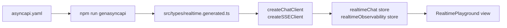

# AsyncAPI Workflow

## AsyncAPI is the async contract source of truth

Keep REST and async contracts separate:

- REST: `openapi.yaml`
- Async/event-driven: `asyncapi.yaml`

Current scope of `asyncapi.yaml` relevant to the FE:

- WebSocket chat channels (`realtime.chat.*`)
- SSE observability stream (`observability.*`)
- Ecommerce cart checkout event (`ecommerce.cart.checked_out`)

## Servers declared (FE perspective)

| Name | Protocol | Purpose | Env var |
| ---- | -------- | ------- | ------- |
| `websocketLocal` | `ws` | WebSocket chat | `VITE_API_WEBSOCKET` |
| `sseLocal` | `http` | SSE observability stream | `VITE_API_SSE` |

The AMQP and Redis pub/sub servers exist in `asyncapi.yaml` for backend use; the FE does not connect to them directly.

## Generated TypeScript types

Types are generated from `asyncapi.yaml` into `src/types/realtime.generated.ts`:

```bash
npm run genasyncapi
```

Import from `src/types/realtime.ts` (the thin app helper that re-exports from `realtime.generated.ts`):

```ts
import type { IChatMessagePayload } from '@/types/realtime';
import { CHAT_CHANNELS, OBSERVABILITY_CHANNELS } from '@/types/realtime';
```

**Never edit `realtime.generated.ts` by hand** — it is overwritten on every `genasyncapi` run.

## Tooling used here

| Tool | Job |
| ---- | --- |
| `@asyncapi/cli` | validates `asyncapi.yaml` (`npm run genasyncapi` internally) |
| `@asyncapi/modelina` | generates TypeScript types from AsyncAPI schemas |
| custom `scripts/gen-asyncapi-types.ts` | runs modelina + appends repo-specific channel constants |

## Commands

```bash
npm run genasyncapi   # validate asyncapi.yaml + regenerate src/types/realtime.generated.ts
```

## Realtime client workflow



After editing `asyncapi.yaml`:

1. `npm run genasyncapi` — regenerate types (commit the diff).
2. Update realtime clients/stores if channel names or payload shapes changed.
3. Validate in the `RealtimePlayground` view before broader integration.

## Naming convention

Channels use dot-separated topic-style naming (e.g. `realtime.chat.message`). These names become event identifiers at runtime. The constants in `CHAT_CHANNELS` and `OBSERVABILITY_CHANNELS` are the single source of truth — never hardcode strings.

## How this complements OpenAPI

- OpenAPI describes HTTP request/response APIs.
- AsyncAPI describes message/event contracts across async transports.
- Together they provide one contract layer for REST and one for realtime flows.

## Useful links

- [AsyncAPI specification](https://www.asyncapi.com/docs/reference/specification/latest)
- [@asyncapi/modelina](https://modelina.org/)
- [WebSocket API (MDN)](https://developer.mozilla.org/en-US/docs/Web/API/WebSocket)
- [EventSource / SSE (MDN)](https://developer.mozilla.org/en-US/docs/Web/API/EventSource)

## Related pages

- [OpenAPI Workflow](./openapi-workflow.md)
- [Realtime](../tools/websockets.md)
- [API overview](./index.md)
