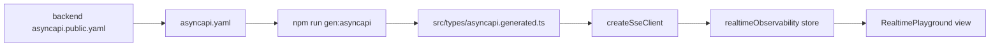

# AsyncAPI Workflow

## AsyncAPI is the async contract source of truth

Keep REST and async contracts separate:

- REST: `openapi.yaml`
- Async/event-driven: `asyncapi.yaml`

Current scope of `asyncapi.yaml`:

- SSE observability stream (`observability.metrics.snapshot`, `observability.metrics.updated`, `observability.heartbeat`)

That is the whole of it, and deliberately so — see below.

## This repo holds the SHARED HALF of the contract

`asyncapi.yaml` here is not the backend's `asyncapi.yaml`. The backend publishes its async contract
twice from one set of sources:

| Backend file           | Holds                                                  | Copied here                         |
| ---------------------- | ------------------------------------------------------ | ----------------------------------- |
| `asyncapi.yaml`        | every channel — SSE **and** the RabbitMQ worker queues | no                                  |
| `asyncapi.public.yaml` | the SSE channels only                                  | yes, as this repo's `asyncapi.yaml` |

A browser can neither publish to nor consume from a broker, so `worker.email.send` and
`worker.pdf.generate` are not this repo's business. Carrying their payload types would mean holding
the shape of a message this app cannot send, presented as a contract it is expected to honour.

`check:spec-identity` compares the backend's `asyncapi.public.yaml` against this file byte for byte
— a cross-path pair, like the demo dataset. It is an OUTPUT of the backend's fragments: never edit
it here, or the next `npm run sync:frontend` over there reverts you and the diff reads as if the
backend broke something.

## Servers declared

| Name       | Protocol | Purpose                  | Env var        |
| ---------- | -------- | ------------------------ | -------------- |
| `sseLocal` | `http`   | SSE observability stream | `VITE_API_SSE` |

One server, because a server travels with the channels bound to it and this document holds only the
SSE ones. The AMQP broker is declared beside the queues in the backend's own contract and never
reaches this file.

## Generated TypeScript types

Types are generated from `asyncapi.yaml` into `src/types/asyncapi.generated.ts`:

```bash
npm run gen:asyncapi
```

The file is named after the spec it comes from, which is also what the backend calls its own.

Import from `@types` — `src/types/index.ts` re-exports the generated file alongside
`src/types/realtime.ts`, the thin app helper holding the shapes the contract does not describe
(`RealtimeMetricsEntry`, `RealtimeConnectionStatus`):

```ts
import type { SseEventName, SseEventPayload, MetricsSnapshotEvent } from '@types';
import { REALTIME_SSE_EVENT_NAMES } from '@types';
```

**Never edit `asyncapi.generated.ts` by hand** — it is overwritten on every `gen:asyncapi` run.

## Tooling used here

| Tool                                                  | Job                                                                   |
| ----------------------------------------------------- | --------------------------------------------------------------------- |
| `@asyncapi/cli`                                       | validates `asyncapi.yaml` (`npm run lint:asyncapi`)                   |
| `@asyncapi/modelina`                                  | generates TypeScript types from AsyncAPI schemas                      |
| custom `scripts/contracts/generate-asyncapi-types.ts` | runs modelina + appends the channel constants and the SSE payload map |

## Commands

```bash
npm run lint:asyncapi         # validate asyncapi.yaml
npm run gen:asyncapi          # regenerate src/types/asyncapi.generated.ts
npm run check:asyncapi-types  # fail if the committed types are not what asyncapi.yaml generates
```

## Shared with the backend

`scripts/contracts/generate-asyncapi-types.ts` is **byte-identical** to the one in `boilerplate-node-backend`, and
both write the same path:

| Repo     | Command                                                                                  | Reads                                         |
| -------- | ---------------------------------------------------------------------------------------- | --------------------------------------------- |
| Frontend | `tsx scripts/contracts/generate-asyncapi-types.ts --out src/types/asyncapi.generated.ts` | this repo's `asyncapi.yaml` — the shared half |
| Backend  | `tsx scripts/contracts/generate-asyncapi-types.ts --out src/types/asyncapi.generated.ts` | its own `asyncapi.yaml` — every channel       |

The script is the same, the INPUT is not — so the two outputs differ, and are meant to: only the
backend's carries `EmailJobPayload`, `PdfJobPayload` and `WORKER_CHANNELS`. Everything this repo's
does carry, it carries identically, because the shared half of the spec is one document copied
across.

`asyncapi.yaml` and this script are in `SHARED_FILES` (`scripts/pairing/spec-identity.ts`), so
`check:spec-identity` fails on the commit that forks either. **The generated outputs are not**, and
deliberately: they legitimately differ now, and even where they overlap a cross-repo comparison
would only re-ask a question the two entries above already answer, at the price of carrying another
file between the repos on every contract change.

What that comparison _would_ have added — "did this repo regenerate after the last spec edit" —
`check:asyncapi-types` answers here, with no sibling checkout to find. The backend runs the same
gate over its own copy.

## Realtime client workflow


```mermaid
%%{init: {'flowchart': {'nodeSpacing': 50, 'rankSpacing': 65}}}%%
flowchart LR
    Backend[backend asyncapi.public.yaml] --> Spec[asyncapi.yaml]
    Spec --> Gen[npm run gen:asyncapi]
    Gen --> Types[src/types/asyncapi.generated.ts]
    Types --> Clients[createSseClient]
    Clients --> Stores[realtimeObservability store]
    Stores --> View[RealtimePlayground view]
```

The contract changes in the backend, not here. After it arrives (`npm run sync:frontend` over there,
or a hand copy):

1. `npm run gen:asyncapi` — regenerate types (commit the diff).
2. Update realtime clients/stores if channel names or payload shapes changed.
3. Validate in the `RealtimePlayground` view before broader integration.

## Naming convention

Channels use dot-separated topic-style naming (e.g. `observability.metrics.snapshot`). The generator
derives the FE types from them: `observability.*` (subscribe) feeds `REALTIME_SSE_EVENT_NAMES` and
`SseEventPayloadMap` — the single source of truth for SSE event names, never hardcode strings.

## How this complements OpenAPI

- OpenAPI describes HTTP request/response APIs.
- AsyncAPI describes message/event contracts across async transports.
- Together they provide one contract layer for REST and one for realtime flows.

## Useful links

- [AsyncAPI specification](https://www.asyncapi.com/docs/reference/specification/latest)
- [@asyncapi/modelina](https://modelina.org/)
- [EventSource / SSE (MDN)](https://developer.mozilla.org/en-US/docs/Web/API/EventSource)

## Related pages

- [OpenAPI Workflow](./openapi-workflow.md)
- [Realtime](../tools/realtime.md)
- [API overview](./index.md)
