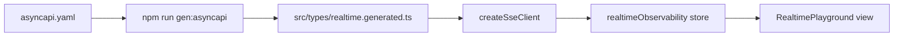

# AsyncAPI Workflow

## AsyncAPI is the async contract source of truth

Keep REST and async contracts separate:

- REST: `openapi.yaml`
- Async/event-driven: `asyncapi.yaml`

Current scope of `asyncapi.yaml` relevant to the FE:

- SSE observability stream (`observability.*`)
- Ecommerce cart checkout event (`ecommerce.cart.checked_out`)

## Servers declared (FE perspective)

| Name | Protocol | Purpose | Env var |
| ---- | -------- | ------- | ------- |
| `sseLocal` | `http` | SSE observability stream | `VITE_API_SSE` |

The AMQP and Redis pub/sub servers exist in `asyncapi.yaml` for backend use; the FE does not connect to them directly.

## Generated TypeScript types

Types are generated from `asyncapi.yaml` into `src/types/realtime.generated.ts`:

```bash
npm run gen:asyncapi
```

Import from `src/types/realtime.ts` (the thin app helper that re-exports from `realtime.generated.ts`):

```ts
import type { ISseEventName, ISseEventPayload } from '@types';
import { REALTIME_SSE_EVENT_NAMES } from '@types';
```

**Never edit `realtime.generated.ts` by hand** — it is overwritten on every `gen:asyncapi` run.

## Tooling used here

| Tool | Job |
| ---- | --- |
| `@asyncapi/cli` | validates `asyncapi.yaml` (`npm run gen:asyncapi` internally) |
| `@asyncapi/modelina` | generates TypeScript types from AsyncAPI schemas |
| custom `scripts/gen-asyncapi-types.ts` | runs modelina + appends the channel constants and the SSE payload map |

## Commands

```bash
npm run gen:asyncapi   # validate asyncapi.yaml + regenerate src/types/realtime.generated.ts
```

## Shared with the backend

`scripts/gen-asyncapi-types.ts` is **byte-identical** to the one in
`boilerplate-node-backend`. Only the output path differs, and it comes from `--out`:

| Repo | Command |
| --- | --- |
| Frontend | `tsx scripts/gen-asyncapi-types.ts --out src/types/realtime.generated.ts` |
| Backend | `tsx scripts/gen-asyncapi-types.ts --out src/types/asyncapi.ts` |

Because `asyncapi.yaml` is identical too, the two generated files are identical — `diff` proves
it. The script emits a superset: this repo uses `ISseEventPayloadMap` for per-event payload
typing, the backend uses `OBSERVABILITY_CHANNELS` / `TObservabilityChannel`. The exports this
repo does not use are tree-shaken out of the bundle.

**If you change this script, copy it to the other repo.** Nothing enforces it automatically.

## Realtime client workflow


```mermaid
%%{init: {'flowchart': {'nodeSpacing': 50, 'rankSpacing': 65}}}%%
flowchart LR
    Spec[asyncapi.yaml] --> Gen[npm run gen:asyncapi]
    Gen --> Types[src/types/realtime.generated.ts]
    Types --> Clients[createSseClient]
    Clients --> Stores[realtimeObservability store]
    Stores --> View[RealtimePlayground view]
```

After editing `asyncapi.yaml`:

1. `npm run gen:asyncapi` — regenerate types (commit the diff).
2. Update realtime clients/stores if channel names or payload shapes changed.
3. Validate in the `RealtimePlayground` view before broader integration.

## Naming convention

Channels use dot-separated topic-style naming (e.g. `observability.metrics.snapshot`). The generator derives the FE types from them: `observability.*` (subscribe) feeds `REALTIME_SSE_EVENT_NAMES` and `ISseEventPayloadMap` — the single source of truth for SSE event names, never hardcode strings.

## How this complements OpenAPI

- OpenAPI describes HTTP request/response APIs.
- AsyncAPI describes message/event contracts across async transports.
- Together they provide one contract layer for REST and one for realtime flows.

## Useful links

- [AsyncAPI specification](https://www.asyncapi.com/docs/reference/specification/latest)
- [@asyncapi/modelina](https://modelina.org/)
- [EventSource / SSE (MDN)](https://developer.mozilla.org/en-US/docs/Web/API/EventSource)

## Related pages

- [OpenAPI Workflow](./openapi-workflow.md)
- [Realtime](../tools/realtime.md)
- [API overview](./index.md)
