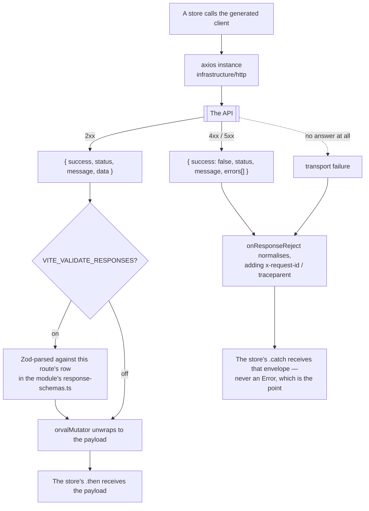
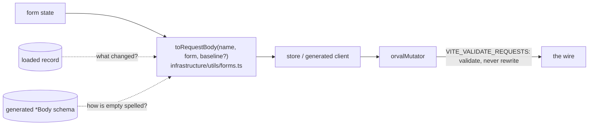

# Endpoints

All HTTP endpoints grouped by domain. These are what the generated client in `contracts/rest/index.ts` calls.
The **Auth** column shows what the backend requires: `none`, `user` (a signed-in visitor), or `permission` (a rule the caller's own `GET /account/abilities` must grant, e.g. `update Product` — there is no `admin` level). The tables list the common operations; `contracts/rest/routes.ts` is the complete, generated list.

> The backend-specific implementation details (Redis caching strategy, RabbitMQ events, PDF generation) are intentionally omitted here — they are transparent to the FE. What matters to the FE is the HTTP method, path, auth requirement, and response shape.

## The envelope every row below travels in

Every endpoint on this page answers in the same wrapper, and every rejection reaches a call site in
the same one. That normalisation is the http tier's job, not each store's:

Two consequences worth carrying into every row below. A rejection is always the envelope, so
`absentIs` and `rethrowUnlessAbsent` can read `status` off it to tell "nothing there" (a 404 on a
payment read) from a real failure. And `errors[]` is where a machine-readable `code` lives —
`REAUTH_REQUIRED`, `PAYMENT_DECLINED` — which is what the step-up interceptor and the checkout
error classifier match on, rather than on a status alone.

## What a write sends: the form-to-wire boundary

A text field the user empties gives `''`. The wire has three ways to say "empty", and only the
contract knows which one a field accepts: omitted (leave it alone), `null` (clear it), `''` (a real
blank, only where the schema allows). So a form never builds a body by hand:

- **The helper decides.** With a `baseline` (a PATCH) it omits every unchanged field; without one (a
  create, a PUT) it sends everything the form holds. Each emptied field is probed against the
  operation's own schema through `safeParse`, so a field with no clear spelling is left off.
- **The transport checks.** `orvalMutator` parses every outgoing JSON body against the schema its
  route maps to. Dev, unit and e2e throw and name the field; production reports to Faro and sends
  anyway, since the backend answers with a real 422. A multipart body is not checked.
- **An upload cannot carry a clear.** A multipart part is a string or a file, never `null`, so the
  `*RequestMultipart` types have no `null` in them. A store that uploads and clears in one save goes
  through `uploadThenClear`: the multipart first, then a JSON PATCH with only the clears.

## System (public)

| Method | Endpoint | Auth | Description |
| ------ | -------- | ---- | ----------- |
| GET    | `/`      | none | Public ping |

## Observability

Used by the Admin Dashboard. See [Observability Endpoints](./observability.md) for response shapes and the composable that fetches them.

| Method | Endpoint                          | Auth       | Description                                 |
| ------ | --------------------------------- | ---------- | ------------------------------------------- |
| GET    | `/observability/events`           | none       | SSE stream: live metrics snapshot every 5 s |
| GET    | `/observability/health`           | permission | Full health snapshot                        |
| GET    | `/observability/metrics/overview` | permission | Curated KPI JSON                            |
| GET    | `/observability/audit`            | permission | Recent audit events                         |

## Account & Auth

JWT-based authentication. Login returns an `accessToken` in the body and sets a `refreshToken` in an HttpOnly cookie. See [Security](../tools/security.md) for how the FE handles these.

| Method | Endpoint                 | Auth | Description                                 |
| ------ | ------------------------ | ---- | ------------------------------------------- |
| POST   | `/account/login`         | none | Authenticate and get JWT                    |
| POST   | `/account/signup`        | none | Register a new user                         |
| GET    | `/account`               | user | Get current user profile                    |
| GET    | `/account/refresh`       | none | Refresh access token (uses HttpOnly cookie) |
| POST   | `/account/reset`         | none | Request password reset email                |
| POST   | `/account/reset-confirm` | none | Confirm password reset                      |
| POST   | `/account/logout-all`    | user | Revoke all refresh tokens                   |
| DELETE | `/account`               | user | Delete own account                          |

## Products

Read endpoints are public. Write endpoints require a permission. `PUT` replaces a record whole; `PATCH` merges the fields it sends.

| Method | Endpoint                | Auth       | Description                                    |
| ------ | ----------------------- | ---------- | ---------------------------------------------- |
| GET    | `/products`             | none       | List products                                  |
| POST   | `/products/search`      | none       | Search with filters, or read a batch of ids    |
| GET    | `/products/categories`  | none       | Catalogue facets: categories and tags, counted |
| GET    | `/products/:id`         | none       | Single product detail                          |
| GET    | `/products/:id/admin`   | permission | Every language a product has a row for         |
| POST   | `/products`             | permission | Create product                                 |
| PUT    | `/products/:id`         | permission | Replace a product                              |
| PATCH  | `/products/:id`         | permission | Update the fields sent                         |
| DELETE | `/products/:id`         | permission | Soft-delete a product                          |
| POST   | `/products/:id/restore` | permission | Undo a soft delete                             |
| DELETE | `/products/:id/hard`    | permission | Delete for good                                |

## Cart

Per-user. Items are scoped to the authenticated user.

| Method | Endpoint                 | Auth | Description                                   |
| ------ | ------------------------ | ---- | --------------------------------------------- |
| GET    | `/cart`                  | user | Get current cart, with its shipping options   |
| GET    | `/cart/summary`          | user | Cart totals only                              |
| POST   | `/cart`                  | user | Add item to cart (grows a line already there) |
| PUT    | `/cart/:productId`       | user | Set an item's exact quantity                  |
| DELETE | `/cart/:productId`       | user | Remove item from cart                         |
| DELETE | `/cart/all`              | user | Clear the entire cart                         |
| PUT    | `/cart/shipping-method`  | user | Choose (or clear) the shipping method         |
| POST   | `/cart/checkout`         | user | Checkout → create order                       |
| POST   | `/cart/reorder/:orderId` | user | Copy a past order back into the cart          |

## Orders

Regular users see only their own orders. A permission is needed to write to any order.

| Method | Endpoint                      | Auth       | Description                                 |
| ------ | ----------------------------- | ---------- | ------------------------------------------- |
| GET    | `/orders`                     | user       | List own orders                             |
| POST   | `/orders/search`              | user       | Search own orders                           |
| GET    | `/orders/:id`                 | user       | Single order detail                         |
| GET    | `/orders/:id/invoice`         | user       | Download invoice PDF                        |
| POST   | `/orders`                     | permission | Create order manually                       |
| PUT    | `/orders/:id`                 | permission | Replace an order                            |
| PATCH  | `/orders/:id`                 | permission | Update the fields sent                      |
| POST   | `/orders/:id/cancel`          | user       | Cancel an order that may still be cancelled |
| POST   | `/orders/:id/status-override` | permission | Move an order to a status by hand           |
| DELETE | `/orders/:id`                 | permission | Soft-delete an order                        |

## Users (admin)

Full user management. Self-service actions (`GET /account`, `DELETE /account`) live under `/account`.

| Method | Endpoint             | Auth       | Description            |
| ------ | -------------------- | ---------- | ---------------------- |
| GET    | `/users`             | permission | List all users         |
| POST   | `/users/search`      | permission | Search users           |
| GET    | `/users/:id`         | permission | Single user detail     |
| POST   | `/users`             | permission | Create user            |
| PUT    | `/users/:id`         | permission | Replace a user         |
| PATCH  | `/users/:id`         | permission | Update the fields sent |
| DELETE | `/users/:id`         | permission | Soft-delete a user     |
| POST   | `/users/:id/restore` | permission | Undo a soft delete     |

## Feedback

Contact form submissions from any visitor.

| Method | Endpoint            | Auth       | Description                  |
| ------ | ------------------- | ---------- | ---------------------------- |
| POST   | `/feedback/contact` | none       | Submit a contact form        |
| GET    | `/feedback`         | permission | List all feedback            |
| POST   | `/feedback/search`  | permission | Search feedback              |
| PATCH  | `/feedback/:id`     | permission | Update the feedback's status |
| DELETE | `/feedback/:id`     | permission | Delete a feedback request    |

## SSE

Observability metrics stream. The FE connects via the `createSseClient` utility. See [Realtime](../tools/realtime.md) for the full event contract.

**Connection:** `http://<host>/observability/events` (or value of `VITE_API_SSE`)

**Server → Client**

| Event                            | Payload                       | When                              |
| -------------------------------- | ----------------------------- | --------------------------------- |
| `observability.metrics.snapshot` | `ObservabilityMetricsPayload` | Initial snapshot, sent on connect |
| `observability.metrics.updated`  | `ObservabilityMetricsPayload` | Periodic metrics update           |
| `observability.heartbeat`        | `ObservabilityMetricsPayload` | Keep-alive heartbeat              |

The stream is server → client only; there is no client → server channel.

## Related pages

- [Observability Endpoints](./observability.md)
- [API overview](./index.md)
- [OpenAPI Workflow](./openapi-workflow.md)
- [Realtime](../tools/realtime.md)
