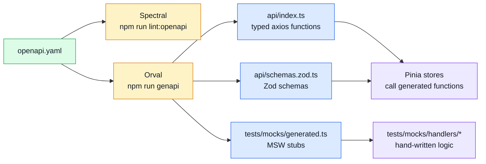

# API

This section explains the API contracts and how the FE consumes them.

## API in one view



## What matters most here

- [`openapi.yaml`](./openapi-workflow.md) is the source of truth for REST — never hand-write what can be generated.
- [`asyncapi.yaml`](./asyncapi-workflow.md) is the source of truth for SSE/WebSocket contracts.
- The generated `api/` folder is **read-only** — `npm run genapi` overwrites it entirely.
- Coordinate contract changes with the backend team before merging.

## Read by task

| Need | Go to |
| ---- | ----- |
| Change the contract or regenerate the client | [OpenAPI Workflow](./openapi-workflow.md) |
| Change SSE/WebSocket event contracts | [AsyncAPI Workflow](./asyncapi-workflow.md) |
| Browse all available endpoints | [Endpoints](./endpoints.md) |
| Understand the Admin Dashboard's backend data | [Observability Endpoints](./observability.md) |
| Understand how the FE handles HTTP errors | [Request Flow](../theory/request-flow.md) |
| Understand the layer behind stores | [Theory / Layers](../theory/layers.md) |

## Consuming the generated client

Always import from the `@api` alias:

```ts
// Functions
import { getProducts, createProduct } from '@api';

// Types
import type { Product, CreateProductRequest } from '@api';

// Zod schemas
import { ProductSchema } from '@api/schemas';
```

Call generated functions from inside Pinia stores, not from view templates:

```ts
// src/stores/products.ts
import { defineStore } from 'pinia';
import { getProducts } from '@api';

export const useProductsStore = defineStore('products', () => {
    const products = ref<Product[]>([]);

    const fetchProducts = () =>
        getProducts().then(({ data }) => {
            products.value = data;
        });

    return { products, fetchProducts };
});
```

## API style used in this repo

- Resource-oriented URLs (`/products`, `/products/:id`, `/orders/search`).
- Consistent envelope: `{ data: T }` for success; `IResponseReject` for errors (shaped by `utils/http.ts`).
- Auth levels: `none` → `user` → `admin`.
- Treat sample entities (`users`, `products`, `orders`, `cart`, `admin`) as pattern examples, not product law.
