# OpenAPI Workflow

## OpenAPI is the source of truth

For this boilerplate, the safest order is:

```mermaid
%%{init: {'flowchart': {'nodeSpacing': 50, 'rankSpacing': 65}}}%%
flowchart LR
    Idea[Need a new endpoint\nor payload change] --> Spec[Edit openapi.yaml]
    Spec --> Lint[npm run lint:openapi]
    Lint --> Generate[npm run genapi]
    Generate --> Update[Update stores / views\nif signatures changed]
    Update --> Test[npm run test]

    classDef change fill:#dbeafe,stroke:#2563eb,color:#111827;
    classDef contract fill:#dcfce7,stroke:#16a34a,color:#111827;
    classDef tooling fill:#fef3c7,stroke:#d97706,color:#111827;
    classDef app fill:#ede9fe,stroke:#7c3aed,color:#111827;
    class Idea change;
    class Spec contract;
    class Lint,Generate tooling;
    class Update,Test app;
```



If the contract changes, always start with the contract. Coordinate with the backend team — both repos share `openapi.yaml` as the contract.

## OpenAPI vs AsyncAPI in this repository

- Use **OpenAPI** for REST endpoint contracts (`openapi.yaml`).
- Use **AsyncAPI** for WebSocket/SSE/event-driven contracts (`asyncapi.yaml`).

## Tools around the contract

| Tool | Job |
| ---- | --- |
| [`openapi.yaml`](https://spec.openapis.org/oas/latest.html) | single contract file (OpenAPI 3.x) |
| [Spectral](https://stoplight.io/open-source/spectral) | lint the spec against `spectral.yaml` rules |
| [orval](https://orval.dev) | generate `contracts/rest/` — axios client, Zod schemas, MSW stubs |

## Generated output (`contracts/rest/`)

Running `npm run genapi` regenerates the entire `contracts/rest/` directory. **Never edit files inside `contracts/rest/` manually** — they are overwritten.

```
contracts/rest/
├── index.ts          ← typed axios functions (one per operation)
└── schemas.zod.ts    ← Zod schemas for every request/response shape
```

MSW stubs land separately:

```
tests/mocks/
└── generated.ts      ← orval-generated MSW handler stubs + faker factories
```

## Importing generated types and functions

```ts
// Axios functions + TS types — always via @api alias
import { getProducts, createProduct } from '@api';
import type { Product, CreateProductRequest } from '@api';

// Zod schemas — always via @api/schemas alias
import { ProductSchema, CreateProductRequestSchema } from '@api/schemas';
```

Never import from the file path directly (`../../contracts/rest/index.ts`) — always use the alias.

## Enum const objects

Orval generates enums as `as const` objects (not TypeScript `enum` declarations). Use them with `z.nativeEnum()` or for runtime checks:

```ts
import { UpdateFeedbackRequestStatusRequestStatus } from '@api';

const schema = z.nativeEnum(UpdateFeedbackRequestStatusRequestStatus);
```

Naming convention: schema name + property name, PascalCase. Example: `UpdateFeedbackRequestStatusRequest.status` → `UpdateFeedbackRequestStatusRequestStatus`.

## Orval configuration

`orval.config.ts` at the project root controls code generation:

| Config key | Value | Effect |
| ---------- | ----- | ------ |
| `input.target` | `./openapi.yaml` | source spec |
| `output.target` | `./contracts/rest/index.ts` | generated axios client |
| `output.schemas` | `./contracts/rest/schemas.zod.ts` | generated Zod schemas |
| `output.mock` | `./tests/mocks/generated.ts` | generated MSW stubs |

## Commands

```bash
npm run lint:openapi   # lint openapi.yaml with Spectral
npm run genapi         # regenerate contracts/rest/ from openapi.yaml
```

## MSW stub workflow

Orval generates a stub for every operation into `tests/mocks/generated.ts`. Each stub returns random faker data.

For stateful or auth-aware behavior, copy the stub to `tests/mocks/handlers/` and extend it.
See [Mocking (MSW)](../tools/mocking.md) for the full handler workflow.

## Useful links

- [OpenAPI 3.1 specification](https://spec.openapis.org/oas/v3.1.0)
- [Spectral rulesets](https://docs.stoplight.io/docs/spectral/01baf06bdd05a-rulesets)
- [orval documentation](https://orval.dev/guides/overview)
- [orval configuration reference](https://orval.dev/reference/configuration/overview)

## Related pages

- [AsyncAPI Workflow](./asyncapi-workflow.md)
- [Mocking (MSW)](../tools/mocking.md)
- [Layers](../theory/layers.md)
- [API overview](./index.md)
