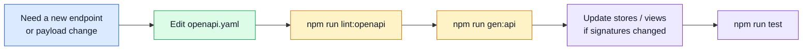

# OpenAPI Workflow

## OpenAPI is the source of truth

For this boilerplate, the safest order is:


```mermaid
%%{init: {'flowchart': {'nodeSpacing': 50, 'rankSpacing': 65}}}%%
flowchart LR
    Idea[Need a new endpoint\nor payload change] --> Spec[Edit openapi.yaml]
    Spec --> Lint[npm run lint:openapi]
    Lint --> Generate[npm run gen:api]
    Generate --> Update[Update stores / views\nif signatures changed]
    Update --> Test[npm run test]

    classDef change fill:#dbeafe,stroke:#2563eb,color:#111827;
    classDef contract fill:#dcfce7,stroke:#16a34a,color:#111827;
    classDef tooling fill:#fef3c7,stroke:#d97706,color:#111827;
    classDef app fill:#ede9fe,stroke:#7c3aed,color:#111827;
    class Idea change;
    class Spec contract;
    class Lint,Generate tooling;
    class Update,Test app;
```

If the contract changes, always start with the contract. Coordinate with the backend team — both repos share `openapi.yaml` as the contract.

## Keeping the two copies in sync

`openapi.yaml` and `asyncapi.yaml` are **duplicated by hand** in the frontend and backend repos. There is deliberately no shared package, submodule or cross-repo CI check: the two repos are published as a matched pair but must stay independently clonable.

The cost of that decision is that nothing detects cross-repo drift — and it has happened: the backend added an endpoint and the frontend's copy sat 39 lines behind for days, so the generated client described an API the backend no longer had.

**Whenever the backend's spec changes**, copy both specs over and regenerate, by hand:

```bash
cp ../boilerplate-node-api-mongodb-mongoose/openapi.yaml .
cp ../boilerplate-node-api-mongodb-mongoose/asyncapi.yaml .
npm run gen:api
npm run gen:asyncapi
npm run prettier:fix   # orval emits 2-space indent; this repo commits 4
```

There is deliberately **no script** for this. Syncing is a judgement call, not a chore to automate: the copy is followed by reading the diff and deciding which stores and views have to change with it.

Then review the diff — a spec change may require store or view updates. To confirm parity by hand, `diff openapi.yaml ../boilerplate-node-api-mongodb-mongoose/openapi.yaml` should print nothing.

CI cannot catch a stale *copy*; it can only catch a spec edited **within this repo** without regenerating (see below). Cross-repo parity remains a human step.

## Freshness enforcement in CI

The `api-freshness` job regenerates the client and fails if the committed output differs. Two details matter when editing it:

- **The pathspec must list every orval output.** It previously read `api/` — a directory this repo has never had — so `git diff` matched nothing, exited 0, and the job passed without checking anything from the day it was written. If you add or retarget an output block in `orval.config.ts`, update the pathspec in the same commit.
- **Formatting must be normalised before diffing.** Orval emits 2-space indentation while this repo's Prettier config uses 4, and the committed output is formatted. Without `npx prettier --write` before the diff, the job reports thousands of lines of pure indentation churn on every run.

The AsyncAPI side has the matching pair of jobs, `lint-asyncapi` and `asyncapi-types-freshness`.

If you change this job, verify it can actually fail: edit `openapi.yaml` without regenerating and confirm the job goes red. A freshness guard nobody has seen fail is indistinguishable from one that does nothing.

## OpenAPI vs AsyncAPI in this repository

- Use **OpenAPI** for REST endpoint contracts (`openapi.yaml`).
- Use **AsyncAPI** for SSE/event-driven contracts (`asyncapi.yaml`).

## Tools around the contract

| Tool | Job |
| ---- | --- |
| [`openapi.yaml`](https://spec.openapis.org/oas/latest.html) | single contract file (OpenAPI 3.x) |
| [Spectral](https://stoplight.io/open-source/spectral) | lint the spec against `spectral.yaml` rules |
| [orval](https://orval.dev) | generate `contracts/rest/` — axios client, Zod schemas, MSW stubs |

## Generated output (`contracts/rest/`)

Running `npm run gen:api` regenerates the entire `contracts/rest/` directory. **Never edit files inside `contracts/rest/` manually** — they are overwritten.

```
contracts/rest/
├── index.ts          ← typed axios functions (one per operation)
└── schemas.zod.ts    ← Zod schemas for every request/response shape
```

MSW stubs land separately:

```
tests/support/mocks/
└── generated.ts      ← orval-generated MSW handler stubs + faker factories
```

## Importing generated types and functions

```ts
// Axios functions + TS types — always via @api alias
import { getProducts, createProduct } from '@api';
import type { Product, CreateProductRequest } from '@api';

// Zod schemas — always via @api/schemas alias
import { ProductSchema, CreateProductRequestSchema } from '@api/schemas';
```

Never import from the file path directly (`../../contracts/rest/index.ts`) — always use the alias.

## Enum const objects

Orval generates enums as `as const` objects (not TypeScript `enum` declarations). Use them with `z.nativeEnum()` or for runtime checks:

```ts
import { UpdateFeedbackRequestStatusRequestStatus } from '@api';

const schema = z.nativeEnum(UpdateFeedbackRequestStatusRequestStatus);
```

Naming convention: schema name + property name, PascalCase. Example: `UpdateFeedbackRequestStatusRequest.status` → `UpdateFeedbackRequestStatusRequestStatus`.

## Orval configuration

`orval.config.ts` at the project root controls code generation. It defines **three independent output blocks**, each reading the same spec:

| Block | Target | Effect |
| ----- | ------ | ------ |
| `api` | `./contracts/rest/index.ts` | typed axios functions, routed through `orvalMutator` |
| `zodSchemas` | `./contracts/rest/schemas.zod.ts` | Zod schema per request/response shape |
| `mocks` | `./tests/support/mocks/generated.ts` | MSW stubs + faker factories |

Every target listed here must also appear in the `api-freshness` CI job's pathspec, or changes to it go unguarded.

### Multipart operations generate two functions

Seven operations accept the same payload as either JSON or `multipart/form-data` — everything
with an optional image: `signup`, create/update user, create/update product. Orval only emits
`FormData` encoding for operations with a **single** request content type; given two, it passes
the body straight to the mutator and generates no encoding at all.

`splitByContentType` therefore generates one function per content type, and an inline
`transformer` in `orval.config.ts` names them:

| Call | Sends |
| ---- | ----- |
| `createProduct(body)` | `application/json` |
| `createProductWithMultipart(body)` | `multipart/form-data`, encoded by the generated client |

The JSON function keeps the plain operation name, so JSON call sites are unaffected by the split.
Pick the `WithMultipart` variant only when there is a file to send — see `modules/products/store.ts`,
which branches on `imageUpload` and is the reference for this pattern.

Do not hand-roll `FormData` in a store. The generated encoder already omits unset optional fields
(rather than sending the string `"undefined"`) and writes arrays as repeated fields
(`categories`, not `categories[0]`), which is what the API expects.

### Per-call axios options

`orvalMutator` declares a second `options` parameter, so every generated function takes an
optional third argument forwarded to axios — this is how `ProductEdit.vue` passes
`onUploadProgress` through `updateProduct` without bypassing the generated client:

```ts
updateProductByIdWithMultipart(id, body, { onUploadProgress });
```

`options` cannot override the url, method or body: the codegen-built config is merged last.

Note that generated routes do **not** URL-encode path parameters — `@orval/axios` ignores the
`urlEncodeParameters` option that the fetch and query clients honour. Ids are server-issued, so
this has never mattered in practice; do not add encoding at one call site only, which would make
that call inconsistent with the other two dozen.

## Commands

```bash
npm run lint:openapi   # lint openapi.yaml with Spectral
npm run gen:api         # regenerate contracts/rest/ from openapi.yaml
```

## MSW stub workflow

Orval generates a stub for every operation into `tests/support/mocks/generated.ts`. Each stub returns random faker data.

**Nothing imports that file.** The mocks that actually run are the hand-written handlers in `src/modules/<name>/mocks/`, assembled in `tests/support/mocks/apiMock.ts`. Treat `generated.ts` as a skeleton to copy from, and as the raw material for the planned random-data test profile — not as live code.

For stateful or auth-aware behavior, copy the stub to `src/modules/<name>/mocks/` and extend it. A handler must also mirror the filtering and role-scoping rules of the backend service behind the endpoint — see [Mocking (MSW)](../tools/mocking.md) for the parity invariants and the full handler workflow.

## Useful links

- [OpenAPI 3.1 specification](https://spec.openapis.org/oas/v3.1.0)
- [Spectral rulesets](https://docs.stoplight.io/docs/spectral/01baf06bdd05a-rulesets)
- [orval documentation](https://orval.dev/guides/overview)
- [orval configuration reference](https://orval.dev/reference/configuration/overview)

## Related pages

- [AsyncAPI Workflow](./asyncapi-workflow.md)
- [Mocking (MSW)](../tools/mocking.md)
- [Layers](../theory/layers.md)
- [API overview](./index.md)
