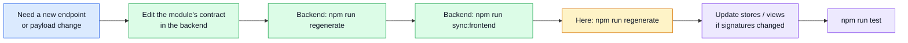

# OpenAPI Workflow

## The backend owns the contract

`openapi.yaml` and `asyncapi.yaml` are **owned by the backend**, which builds them from per-module
fragments. This repo never edits them: they arrive here through the backend's `npm run
sync:frontend`, and everything else in `contracts/` is generated from them.


```mermaid
%%{init: {'flowchart': {'nodeSpacing': 50, 'rankSpacing': 65}}}%%
flowchart LR
    Idea[Need a new endpoint\nor payload change] --> Spec[Edit the module's contract\nin the backend]
    Spec --> Regen[Backend: npm run regenerate]
    Regen --> Sync[Backend: npm run sync:frontend]
    Sync --> Generate[Here: npm run regenerate]
    Generate --> Update[Update stores / views\nif signatures changed]
    Update --> Test[npm run test]

    classDef change fill:#dbeafe,stroke:#2563eb,color:#111827;
    classDef contract fill:#dcfce7,stroke:#16a34a,color:#111827;
    classDef tooling fill:#fef3c7,stroke:#d97706,color:#111827;
    classDef app fill:#ede9fe,stroke:#7c3aed,color:#111827;
    class Idea change;
    class Spec,Regen,Sync contract;
    class Generate tooling;
    class Update,Test app;
```

If the contract changes, always start with the contract, in the backend.

## Keeping the two copies in sync

The two repos stay independently clonable, so each carries its own copy of the contract. What
keeps the copies identical is `npm run check:spec-identity`: it compares this repo's `openapi.yaml`
and `asyncapi.yaml` with the backend's `boilerplate-node-backend/openapi.yaml` and `boilerplate-node-backend/asyncapi.public.yaml` (the async contract
minus the internal queues no API client can reach), skips when the backend is not on disk, and is
fatal under CI (the `spec-identity` job).

**Whenever the backend's spec changes**, the backend copies both files over with `npm run
sync:frontend`; here you regenerate and read the diff:

```bash
npm run regenerate     # gen:api + gen:asyncapi, then Prettier over contracts/rest
npm run check:spec-identity
```

Reading the diff is the human step: a spec change may require store or view updates. To confirm parity by hand,
`diff openapi.yaml ../boilerplate-node-backend/openapi.yaml` should print nothing.

CI catches both kinds of drift: a spec edited **within this repo** without regenerating (see
below) and a copy that has fallen behind the backend (`spec-identity`).

## Freshness enforcement in CI

The `api-freshness` job regenerates the client and fails if the committed output differs. Two details matter when editing it:

- **The pathspec must list every orval output.** It previously read `api/` — a directory this repo has never had — so `git diff` matched nothing, exited 0, and the job passed without checking anything from the day it was written. If you add or retarget an output block in `orval.config.ts`, update the pathspec in the same commit.
- **Formatting must be normalised before diffing.** Orval emits 2-space indentation while this repo's Prettier config uses 4, and the committed output is formatted. Without `npx prettier --write` before the diff, the job reports thousands of lines of pure indentation churn on every run.

The AsyncAPI side has the matching pair of jobs, `lint-asyncapi` and `asyncapi-types-freshness`.

If you change this job, verify it can actually fail: edit `openapi.yaml` without regenerating and confirm the job goes red. A freshness guard nobody has seen fail is indistinguishable from one that does nothing.

## OpenAPI vs AsyncAPI in this repository

- Use **OpenAPI** for REST endpoint contracts (`openapi.yaml`).
- Use **AsyncAPI** for SSE/event-driven contracts (`asyncapi.yaml`).

## Tools around the contract

| Tool                                                        | Job                                                    |
| ----------------------------------------------------------- | ------------------------------------------------------ |
| [`openapi.yaml`](https://spec.openapis.org/oas/latest.html) | single contract file (OpenAPI 3.x)                     |
| [Spectral](https://stoplight.io/open-source/spectral)       | lint the spec against `spectral.yaml` rules            |
| [orval](https://orval.dev)                                  | generate `contracts/rest/` — axios client, Zod schemas |

## Generated output (`contracts/rest/`)

Running `npm run gen:api` regenerates the entire `contracts/rest/` directory. **Never edit files inside `contracts/rest/` manually** — they are overwritten.

```
contracts/rest/
├── index.ts          ← typed axios functions (one per operation)
└── schemas.zod.ts    ← Zod schemas for every request/response shape
```

## Importing generated types and functions

```ts
// Axios functions + TS types — always via @api alias
import { listProducts, createProduct } from '@api';
import type { Product, CreateProductRequest } from '@api';

// Zod schemas — always via @api/schemas alias
import { CreateProductBody, ListProductsResponse } from '@api/schemas';
```

Never import from the file path directly (`../../contracts/rest/index.ts`) — always use the alias.

## Enum const objects

Orval generates enums as `as const` objects (not TypeScript `enum` declarations). Use them with `z.nativeEnum()` or for runtime checks:

```ts
import { RecordOfflinePaymentRequestMethod } from '@api';

const schema = z.nativeEnum(RecordOfflinePaymentRequestMethod);
```

Naming convention: schema name + property name, PascalCase. Example: `RecordOfflinePaymentRequest.method` → `RecordOfflinePaymentRequestMethod`.

## Orval configuration

`orval.config.ts` at the project root controls code generation. It defines **three independent output blocks**, each reading the same spec:

| Block        | Target                            | Effect                                               |
| ------------ | --------------------------------- | ---------------------------------------------------- |
| `api`        | `./contracts/rest/index.ts`       | typed axios functions, routed through `orvalMutator` |
| `zodSchemas` | `./contracts/rest/schemas.zod.ts` | Zod schema per request/response shape                |

Every target listed here must also appear in the `api-freshness` CI job's pathspec, or changes to it go unguarded.

### Multipart operations generate two functions

Eight operations accept the same payload as either JSON or `multipart/form-data` — everything
with an optional image: replace/update the account, create and replace/update a user, create and
replace/update a product. Orval only emits
`FormData` encoding for operations with a **single** request content type; given two, it passes
the body straight to the mutator and generates no encoding at all.

`splitByContentType` therefore generates one function per content type, and an inline
`transformer` in `orval.config.ts` names them:

| Call                               | Sends                                                  |
| ---------------------------------- | ------------------------------------------------------ |
| `createProduct(body)`              | `application/json`                                     |
| `createProductWithMultipart(body)` | `multipart/form-data`, encoded by the generated client |

The JSON function keeps the plain operation name, so JSON call sites are unaffected by the split.
Pick the `WithMultipart` variant only when there is a file to send — see `modules/products/store.ts`,
which branches on `imageUpload` and is the reference for this pattern.

Do not hand-roll `FormData` in a store. The generated encoder already omits unset optional fields
(rather than sending the string `"undefined"`) and writes arrays as repeated fields
(`categories`, not `categories[0]`), which is what the API expects.

### Per-call axios options

`orvalMutator` declares a second `options` parameter, so every generated function takes an
optional third argument forwarded to axios — this is how `ProductEdit.vue` passes
`onUploadProgress` through `updateProduct` without bypassing the generated client:

```ts
updateProductByIdWithMultipart(id, body, { onUploadProgress });
```

`options` cannot override the url, method or body: the codegen-built config is merged last.

Note that generated routes do **not** URL-encode path parameters — `@orval/axios` ignores the
`urlEncodeParameters` option that the fetch and query clients honour. Ids are server-issued, so
this has never mattered in practice; do not add encoding at one call site only, which would make
that call inconsistent with the other two dozen.

## Commands

```bash
npm run lint:openapi   # lint openapi.yaml with Spectral
npm run gen:api         # regenerate contracts/rest/ from openapi.yaml
```

## Mocks

Orval can emit an MSW stub per operation, and `orval.config.ts` deliberately declares no `mocks` block: the stubs are stateless — no cart persistence, no login, no filtering — so they could never answer a journey spec.

There is no hand-written mock of the new endpoint to update: dev and e2e run against the paired backend's **demo profile** (`npm --prefix ../boilerplate-node-backend run demo`) — the real API against an in-memory, seeded database — so the new endpoint exists the moment the backend implements it. See [The demo profile](../tools/demo-profile.md).

## Useful links

- [OpenAPI 3.1 specification](https://spec.openapis.org/oas/v3.1.0)
- [Spectral rulesets](https://docs.stoplight.io/docs/spectral/01baf06bdd05a-rulesets)
- [orval documentation](https://orval.dev/guides/overview)
- [orval configuration reference](https://orval.dev/reference/configuration/overview)

## Related pages

- [AsyncAPI Workflow](./asyncapi-workflow.md)
- [The demo profile](../tools/demo-profile.md)
- [Layers](../theory/layers.md)
- [API overview](./index.md)
