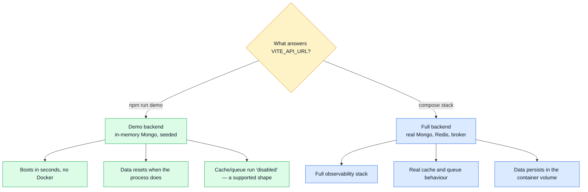

# Getting Started

From a fresh clone to a running storefront: two repos, three commands, no Docker.

The app talks to the paired backend. The lightest way to have one is its **demo profile** — the
real API booted against an in-memory, seeded database — so the catalogue, the cart and the order
history all work with nothing installed beyond Node.

## Which mode am I in?

This is the first thing to understand, because almost every "it does not work" is really "the app
is pointed at the wrong backend".



## First run — with the demo backend

> Requires **[Node.js 22+](https://nodejs.org/)** and `npm`, and the paired
> `boilerplate-node-backend` checkout beside this one.

```bash
npm ci                                             # install exactly the lockfile
cp .env-example .env                               # create the local env file
npm --prefix ../boilerplate-node-backend run demo  # the real API, in-memory, seeded — :3000
npm run dev                                        # Vite dev server on :8080
```

Open `http://localhost:8080`. You get a browsable storefront with demo products, a working cart
and a working login (`gino@pino.it` / `password`), served by the real API against a database that
lives and dies with the demo process.

::: tip `cp .env-example .env` is not optional
It is required for the container path too. The compose file bind-mounts the repo at `/app`, so
Vite reads that same `.env` from inside the container. Without it you get compose's built-in
fallbacks and nothing else — no Faro, no Umami, no locale settings.
:::

## Running against the full stack

```bash
# start the backend stack instead — it owns the API, Alloy and Umami
cd ../boilerplate-node-backend && npm run compose:restart
npm run dev
```

Then check the backend's `NODE_CORS_ORIGIN` contains `http://localhost:8080`.

The two stacks stay **independent** — separate compose projects, separate networks, no shared
network needed. The only thing crossing the boundary is your browser, which runs on the host: it
is the browser, not the container, that resolves `VITE_API_URL` and `VITE_API_SSE`, so those must
always be **host** ports (`http://localhost:3000`), never compose service names.

## Host port map

This repo owns the **`8080–8099`** block; the paired backend owns **`3000–3099`**. Keeping the two
disjoint is what lets both stacks be up at once.

| Service                  | Host port | Where it is set                                     |
| ------------------------ | --------- | --------------------------------------------------- |
| Vite dev server          | `8080`    | `VITE_APP_PORT` — host and compose alike            |
| e2e vite server          | `8085`    | `test:e2e*` scripts + `cypress.config.ts` `baseUrl` |
| Docs (VitePress + Nginx) | `8090`    | `VITE_DOCS_PORT`                                    |

New services belong inside `8080–8099`.

`VITE_APP_PORT` is read in `vite.config.ts` via `loadEnv`, so the dev server and the compose
publish always agree — moving the port is a one-line change. `strictPort` is on: a busy port fails
instead of quietly hopping to the next free one, which in a container would leave the published
port pointing at nothing.

## Check it worked

| What you should see             | Where                                              |
| ------------------------------- | -------------------------------------------------- |
| A product grid with demo items  | `http://localhost:8080`                             |
| The locale prefix in the URL    | `/en/products` — routing is locale-first            |
| A language switch that persists | top bar; the choice survives a reload               |
| Docs (this site)                | `npm run docs:dev`, or `:8090` in compose           |

## The one command before you commit

```bash
npm run complete    # lint + spec lint + contract identity + format check + build + unit + e2e
```

This is exactly what the pre-commit hook runs, so running it by hand only ever saves you a
rejected commit. Its mutating twin, `npm run complete:fix`, fixes lint and formatting instead of
reporting them.

::: warning It is slow — around ten minutes
Most of that is the two Cypress runs. Start it and do something else; do not sit and watch it.
:::

`check:spec-identity` inside it compares the shared contract files against the paired backend. It
**skips** when that checkout is not on disk, so a half-cloned pair can still commit — set
`BACKEND_PATH` in `.env` to point at it, or clone it beside this repo. Under CI a missing sibling
is fatal instead, because there it means the workflow is misconfigured.

Deliberately outside that gate:

```bash
npm run complete:manual       # the two below, in one go
npm run test:e2e:visual       # pixel diffing — answers to the machine that took the snapshots
npm run test:e2e:live         # the suite against a real backend

npm run test:unit             # fast — the jsdom suite alone
npm run test:mutation         # Stryker; nightly in CI, by hand when you want it
```

[Test timings](./tools/testing-and-docs.md#test-timings) has what each of these costs.

## Where to go next

| You want to                                | Read                                                            |
| ------------------------------------------ | --------------------------------------------------------------- |
| Understand the folder layout               | [Modules](./theory/modules.md), [Layers](./theory/layers.md)     |
| Add or remove a domain                     | [Adding & Removing a Module](./theory/module-lifecycle.md)       |
| Change an endpoint or a payload            | [OpenAPI Workflow](./api/openapi-workflow.md)                    |
| Know what dev and e2e run against          | [The demo profile](./tools/demo-profile.md)                           |
| Understand routes, guards and access       | [Sitemap & Access Control](./theory/sitemap.md)                  |
| Find out what a dependency is doing here   | [Tools Explained](./tools/tools-explained.md)                    |
| Look up a script                           | [Package Scripts](./tools/package-scripts.md)                    |
| Know what is planned but unbuilt           | [Roadmap](./theory/roadmap.md)                                   |
