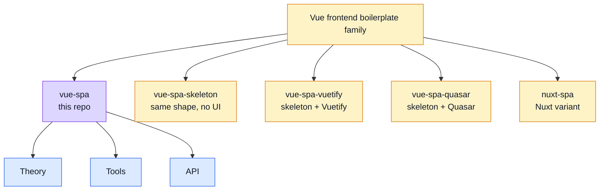
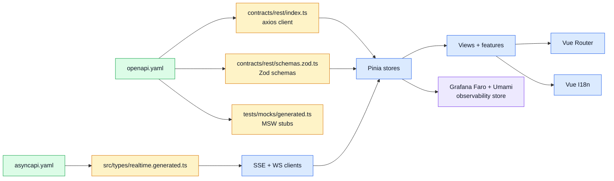

## What this docs site is for

This docs site stays short, visual, and practical.
Use it to understand **what this boilerplate is**, **how the app layers fit together**, and **which tools already exist in the repo**.

> Think of the repo as **an example frontend blueprint**, not a finished product with product-specific business rules.

## Family map

## Read this repo as

- **SPA**: Vue 3 + Pinia + Vue Router, compiled by Vite.
- **API client**: [OpenAPI-generated axios client](./api/openapi-workflow.md) — types and functions come from `openapi.yaml`, never written by hand.
- **Realtime**: [SSE + WebSocket clients](./tools/websockets.md) driven by [`asyncapi.yaml`](./api/asyncapi-workflow.md).
- **State**: [Pinia stores](./tools/state-and-routing.md) own data; views stay thin.
- **Observability**: [Grafana Faro + Umami](./tools/observability.md) wired into a single store.
- **Dev mocking**: [MSW](./tools/mocking.md) lets the app run without a backend.
- **Contracts**: [`openapi.yaml`](./api/openapi-workflow.md) + [`asyncapi.yaml`](./api/asyncapi-workflow.md).
- **Shape**: layered code explained in [Theory](./theory/) and the dedicated [Layers](./theory/layers.md) page.

## Three sections, three jobs

### [Theory](./theory/)

Big picture: architecture, layers, request flow, and sitemap.

### [Tools](./tools/)

Dependency-focused pages: runtime, state, routing, security, mocking, observability, and testing.
New to the stack? Start at [Tools Explained](./tools/tools-explained.md) for a plain-English "what is X and why is it here" summary of every tool.

### [API](./api/)

Contract-first workflow: OpenAPI + AsyncAPI, codegen, generated client usage, and mocks.

## Quick visual of the current repo

## Good starting points

- Want the app shape? Start at [Theory Overview](./theory/) and [Layers](./theory/layers.md).
- Want a specific dependency? Start at [Tools](./tools/) and jump to the tool page you need.
- Want the `package.json` map? Read [Package Dependencies](./tools/package-dependencies.md) and [Package Scripts](./tools/package-scripts.md).
- Want to understand the sitemap and route guards? Read [Sitemap & Access Control](./theory/sitemap.md).
- Want to change payloads or add endpoints? Start in [API Overview](./api/) and keep [`openapi.yaml`](./api/openapi-workflow.md) first.
