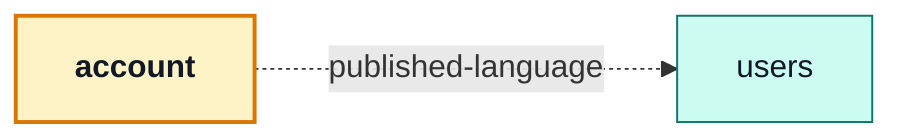
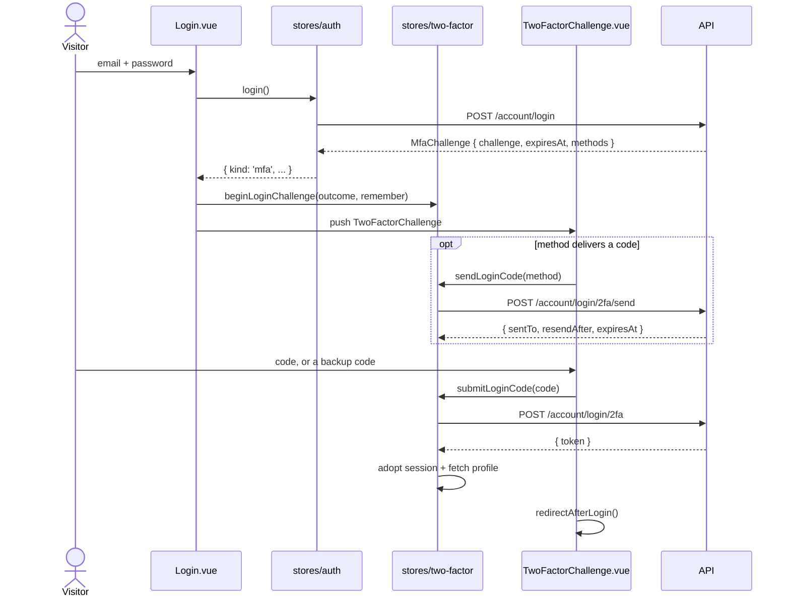
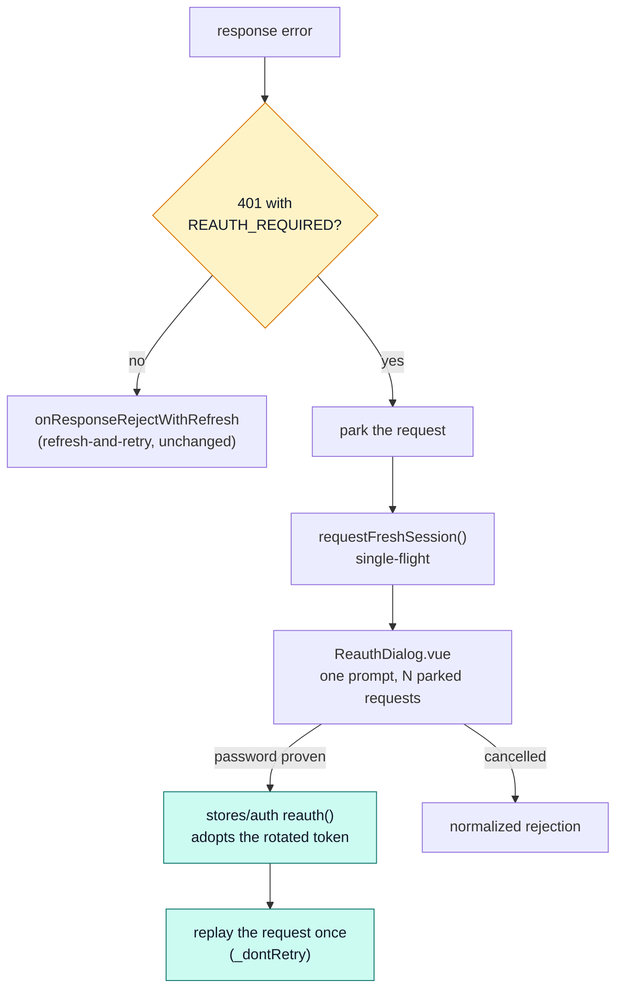

# account

::: tip At a glance
**Owns** — the visitor's own account: login (password, social, second factor), signup, profile,
password reset, deletion.
**Depends on** — [`users`](./users.md), and only for its field rules.
**Breaks if you change** — nothing outside this folder, with one exception: the step-up prompt.
`infrastructure/http/step-up.ts` parks a `REAUTH_REQUIRED` 401 and waits for
`app/components/ReauthDialog.vue`, which calls this module's `reauth()`. Every flow behind the
backend's freshness gate — email change, account delete, session revoke, checkout, payments, 2FA
management — is answered through that one prompt.
:::

| Fact                    | This module                                                                                                                                                                               |
| ----------------------- | ----------------------------------------------------------------------------------------------------------------------------------------------------------------------------------------- |
| **Subdomain**           | `generic` — A solved problem. Modelling effort here would be waste.                                                                                                                       |
| **Screens**             | 11 — `Login` · `Signup` · `TwoFactorChallenge` · `PasswordResetRequest` · `PasswordResetConfirm` · `AccountDeleteConfirm` · `VerifyEmailConfirm` · `OAuthCallback` · `Profile` · `Logout` |
| **Stores**              | `accountAuth` · `accountProfile` · `accountSessions` · `accountAddresses` · `accountOAuthProviders` · `accountTwoFactor`                                                                  |
| **Menu entries**        | `Profile`                                                                                                                                                                                 |
| **API calls**           | 31                                                                                                                                                                                        |
| **Depends on**          | [`users`](./users.md)                                                                                                                                                                     |
| **Depended on by**      | _nothing_                                                                                                                                                                                 |
| **Languages**           | `en` · `it`                                                                                                                                                                               |
| **Publishes**           | _nothing_ — no barrel, so no sibling may import it                                                                                                                                        |
| **Backend counterpart** | `account` in `boilerplate-node-backend`                                                                                                                                                   |

## The map



- → `users` **published-language** — Validates every form against `usersSchema`/`usersPasswordSchema` — shared field rules, not a shared store.

## The story

Eleven screens, six stores, and the widest API surface of any module here — which makes it a
misleadingly ordinary-looking domain. Three things about it are worth knowing before you edit it.

**The session is not in here.** The token lives in `infrastructure/session`, because
`infrastructure/http` has to read it on every request and the router guards read `isAuth`/`isAdmin`
before any domain code runs. A module cannot sit below the layer that needs it. This module owns the
_editable record_, not the credential.

**One domain, six stores.** They split by lifecycle, not by screen: `accountAuth` establishes and
ends a session, `accountProfile` owns the editable record once one exists, and `accountSessions`,
`accountAddresses`, `accountOAuthProviders` and `accountTwoFactor` each own a panel's own slice.
A store that outlives its panel would be a cache nobody invalidates.

**The one dependency is validation, not screens.** Every form here validates against
`usersSchema`/`usersPasswordSchema` from the [`users`](./users.md) barrel, so _what makes a valid
username_ is answered once — for the person editing their own record and for the admin editing
someone else's. A build with `account` but not `users` would validate nothing.

::: tip That edge is `published-language`, and the backend's equivalent is not
On the server, `account → users` is `shared-kernel`: both modules write the same User record. Here
the same pair shares only the validation vocabulary, and the server remains the single writer.

**The divergence is the finding.** Two context maps over one product, disagreeing about an edge
because the two sides genuinely have different relationships to the same data.
:::

There is no `index.ts` next to the manifest, and that is an answer rather than an omission: no other
domain has ever needed anything from this one. A barrel exists when a module exports something; an
empty one is a promise nobody asked for.

## State

Six stores, listed by what each one's setup function returns — an internal ref is not part of the surface.

| Store                   | File                   | Surface                                                                                                                                                                                                                                                                                                    |
| ----------------------- | ---------------------- | ---------------------------------------------------------------------------------------------------------------------------------------------------------------------------------------------------------------------------------------------------------------------------------------------------------- |
| `accountAuth`           | `stores/auth.ts`       | `login` · `reauth` · `signup` · `requestPasswordReset` · `confirmPasswordReset` · `logout` · `logoutEverywhere`                                                                                                                                                                                            |
| `accountProfile`        | `stores/profile.ts`    | `profile` · `loading` · `resetAll` · `fetchProfile` · `updateProfile` · `updateOwnRole` · `changePassword` · `requestEmailVerification` · `confirmEmailVerification` · `requestAccountDelete` · `confirmAccountDelete`                                                                                     |
| `accountSessions`       | `stores/sessions.ts`   | `sessions` · `loading` · `fetchSessions` · `revokeSession`                                                                                                                                                                                                                                                 |
| `accountAddresses`      | `stores/addresses.ts`  | `addresses` · `loading` · `fetchAddresses` · `addAddress` · `updateAddress` · `removeAddress`                                                                                                                                                                                                              |
| `accountOAuthProviders` | `stores/oauth.ts`      | `providers` · `loading` · `fetchProviders`                                                                                                                                                                                                                                                                 |
| `accountTwoFactor`      | `stores/two-factor.ts` | `status` · `setup` · `confirmed` · `challenge` · `delivery` · `secondsUntilResend` · `loading` · `fetchStatus` · `setupMethod` · `confirmMethod` · `removeMethod` · `disableAll` · `regenerateBackupCodes` · `clearSetup` · `beginLoginChallenge` · `clearChallenge` · `sendLoginCode` · `submitLoginCode` |

## Screens

| Path                     | Route name             | Access   | View                             |
| ------------------------ | ---------------------- | -------- | -------------------------------- |
| `login`                  | `Login`                | `guest`  | `views/Login.vue`                |
| `signup`                 | `Signup`               | `guest`  | `views/Signup.vue`               |
| `login/2fa`              | `TwoFactorChallenge`   | `guest`  | `views/TwoFactorChallenge.vue`   |
| `password-reset`         | `PasswordResetRequest` | `guest`  | `views/PasswordResetRequest.vue` |
| `password-reset/confirm` | `PasswordResetConfirm` | `guest`  | `views/PasswordResetConfirm.vue` |
| `account-delete/confirm` | `AccountDeleteConfirm` | `public` | `views/AccountDeleteConfirm.vue` |
| `verify-email/confirm`   | `VerifyEmailConfirm`   | `public` | `views/VerifyEmailConfirm.vue`   |
| `oauth/callback`         | `OAuthCallback`        | `public` | `views/OAuthCallback.vue`        |
| `profile`                | `Profile`              | `auth`   | `views/Profile.vue`              |
| `logout`                 | `Logout`               | `public` | `—`                              |

Paths are relative to the localised root, so `cart` is served at `/:locale/cart`. **Access** is the route’s own `meta.access` — a menu entry never restates it, which is what keeps the menu and the router from disagreeing.

## Wiring

#### Endpoints called

| Call                                         | Response envelope                  |
| -------------------------------------------- | ---------------------------------- |
| `DELETE /account`                            | `RequestAccountDeleteResponse`     |
| `PUT /account`                               | `UpdateAccountResponse`            |
| `GET /account/2fa`                           | `GetTwoFactorStatusResponse`       |
| `DELETE /account/2fa`                        | `DisableTwoFactorResponse`         |
| `POST /account/2fa/backup-codes`             | `RegenerateBackupCodesResponse`    |
| `POST /account/2fa/methods/{method}/setup`   | `SetupTwoFactorMethodResponse`     |
| `POST /account/2fa/methods/{method}/confirm` | `ConfirmTwoFactorMethodResponse`   |
| `DELETE /account/2fa/methods/{method}`       | `RemoveTwoFactorMethodResponse`    |
| `GET /account/addresses`                     | `GetAddressesResponse`             |
| `POST /account/addresses`                    | `AddAddressResponse`               |
| `DELETE /account/addresses/{id}`             | `RemoveAddressResponse`            |
| `PUT /account/addresses/{id}`                | `UpdateAddressResponse`            |
| `DELETE /account/delete-confirm`             | `ConfirmAccountDeleteResponse`     |
| `POST /account/export`                       | `ExportAccountDataResponse`        |
| `POST /account/login`                        | `LoginResponse`                    |
| `POST /account/login/2fa`                    | `LoginTwoFactorResponse`           |
| `POST /account/login/2fa/send`               | `SendTwoFactorCodeResponse`        |
| `POST /account/logout`                       | `LogoutResponse`                   |
| `GET /account/oauth/providers`               | `ListOAuthProvidersResponse`       |
| `GET /account/oauth/{provider}`              | `StartOAuthLoginResponse`          |
| `GET /account/oauth/{provider}/callback`     | `CompleteOAuthLoginResponse`       |
| `POST /account/password`                     | `ChangePasswordResponse`           |
| `POST /account/reauth`                       | `ReauthResponse`                   |
| `POST /account/reset`                        | `RequestPasswordResetResponse`     |
| `POST /account/reset-confirm`                | `ConfirmPasswordResetResponse`     |
| `GET /account/sessions`                      | `GetSessionsResponse`              |
| `DELETE /account/sessions/{id}`              | `RevokeSessionResponse`            |
| `POST /account/signup`                       | `SignupResponse`                   |
| `DELETE /account/tokens/expired`             | `DeleteExpiredTokensResponse`      |
| `POST /account/verify-confirm`               | `ConfirmEmailVerificationResponse` |
| `POST /account/verify-request`               | `RequestEmailVerificationResponse` |

Each row registers one Zod envelope through the manifest, so enabling the domain turns its contract validation on and deleting the folder turns it off.

#### Navigation entries

| Route     | Label key                  | Section   | Order | Icon | Badge |
| --------- | -------------------------- | --------- | ----- | ---- | ----- |
| `Profile` | `navigation.label-profile` | `account` | 70    | yes  | —     |

#### Analytics events

None. Both logout routes are real requests the API answers, so `user_logged_out` is emitted there —
counting the logout that succeeded rather than the one that was attempted. See
[Observability](../tools/observability.md#event-taxonomy).

## Files

| File                                       | What it is                                                                                                                                                  | Explained in                          |
| ------------------------------------------ | ----------------------------------------------------------------------------------------------------------------------------------------------------------- | ------------------------------------- |
| `components/ProfileAddresses.vue`          | A component this domain owns. Published through the barrel when a sibling mounts it, internal otherwise.                                                    | [read](../theory/layers.md)           |
| `components/ProfileAvatar.vue`             | A component this domain owns. Published through the barrel when a sibling mounts it, internal otherwise.                                                    | [read](../theory/layers.md)           |
| `components/ProfileDeleteAccount.vue`      | A component this domain owns. Published through the barrel when a sibling mounts it, internal otherwise.                                                    | [read](../theory/layers.md)           |
| `components/ProfilePasswordChange.vue`     | A component this domain owns. Published through the barrel when a sibling mounts it, internal otherwise.                                                    | [read](../theory/layers.md)           |
| `components/ProfileRole.vue`               | A component this domain owns. Published through the barrel when a sibling mounts it, internal otherwise.                                                    | [read](../theory/layers.md)           |
| `components/ProfileSessions.vue`           | A component this domain owns. Published through the barrel when a sibling mounts it, internal otherwise.                                                    | [read](../theory/layers.md)           |
| `components/ProfileTwoFactor.vue`          | A component this domain owns. Published through the barrel when a sibling mounts it, internal otherwise.                                                    | [read](../theory/layers.md)           |
| `components/ProfileVerificationBanner.vue` | A component this domain owns. Published through the barrel when a sibling mounts it, internal otherwise.                                                    | [read](../theory/layers.md)           |
| `components/TwoFactorBackupCodes.vue`      | A component this domain owns. Published through the barrel when a sibling mounts it, internal otherwise.                                                    | [read](../theory/layers.md)           |
| `components/TwoFactorEnroll.vue`           | A component this domain owns. Published through the barrel when a sibling mounts it, internal otherwise.                                                    | [read](../theory/layers.md)           |
| `composables/use-countdown.ts`             | The one ticking “seconds left” primitive: a server-sent deadline, counted down. Every 2FA expiry and the resend cooldown share it.                          | [read](../theory/layers.md)           |
| `composables/use-method-label.ts`          | Renders a 2FA method’s wire name as copy, falling back to the wire string for a method this build has no word for.                                          | [read](../tools/i18n.md)              |
| `composables/use-post-login-redirect.ts`   | Where a visitor lands once a session exists — shared by the password step and the 2FA step so both end the same way.                                        | [read](../theory/sitemap.md)          |
| `locales/en.json`                          | This domain’s translation dictionary for one language, loaded as its own chunk.                                                                             | [read](../tools/i18n.md)              |
| `locales/it.json`                          | This domain’s translation dictionary for one language, loaded as its own chunk.                                                                             | [read](../tools/i18n.md)              |
| `module.ts`                                | The manifest — the only file the application loads directly. Declares the name, routes, navigation entries, response schemas, dependency edges and locales. | [read](../theory/modules.md)          |
| `response-schemas.ts`                      | One row per endpoint this domain calls, pairing a method and path pattern with the Zod envelope its response is validated against.                          | [read](../api/openapi-workflow.md)    |
| `routes.ts`                                | The domain’s route records, spliced into the localised route tree. Each carries its own `meta.access`.                                                      | [read](../theory/sitemap.md)          |
| `stores/addresses.ts`                      | One Pinia store: one slice of this domain’s state, and the calls it makes to the generated client.                                                          | [read](../tools/state-and-routing.md) |
| `stores/auth.ts`                           | One Pinia store: one slice of this domain’s state, and the calls it makes to the generated client.                                                          | [read](../tools/state-and-routing.md) |
| `stores/oauth.ts`                          | One Pinia store: one slice of this domain’s state, and the calls it makes to the generated client.                                                          | [read](../tools/state-and-routing.md) |
| `stores/profile.ts`                        | One Pinia store: one slice of this domain’s state, and the calls it makes to the generated client.                                                          | [read](../tools/state-and-routing.md) |
| `stores/sessions.ts`                       | One Pinia store: one slice of this domain’s state, and the calls it makes to the generated client.                                                          | [read](../tools/state-and-routing.md) |
| `stores/two-factor.ts`                     | One Pinia store: one slice of this domain’s state, and the calls it makes to the generated client.                                                          | [read](../tools/state-and-routing.md) |
| `tests/e2e/__snapshots__/login.png`        | A committed visual-regression baseline.                                                                                                                     | [read](../tools/visual-regression.md) |
| `tests/e2e/a11y.cy.ts`                     | Cypress suite — the screens, in a browser.                                                                                                                  | [read](../tools/component-testing.md) |
| `tests/e2e/account.visual.cy.ts`           | Cypress suite — the screens, in a browser.                                                                                                                  | [read](../tools/component-testing.md) |
| `tests/e2e/auth.cy.ts`                     | Cypress suite — the screens, in a browser.                                                                                                                  | [read](../tools/component-testing.md) |
| `tests/e2e/oauth.cy.ts`                    | Cypress suite — the screens, in a browser.                                                                                                                  | [read](../tools/component-testing.md) |
| `tests/e2e/password-reset.cy.ts`           | Cypress suite — the screens, in a browser.                                                                                                                  | [read](../tools/component-testing.md) |
| `tests/e2e/profile.cy.ts`                  | Cypress suite — the screens, in a browser.                                                                                                                  | [read](../tools/component-testing.md) |
| `tests/e2e/registration.cy.ts`             | Cypress suite — the screens, in a browser.                                                                                                                  | [read](../tools/component-testing.md) |
| `tests/e2e/two-factor.cy.ts`               | Cypress suite — the screens, in a browser.                                                                                                                  | [read](../tools/component-testing.md) |
| `tests/addresses.spec.ts`                  | Vitest suite — the store, the routes and the rules, in isolation.                                                                                           | [read](../tools/unit-testing.md)      |
| `tests/auth-login-mfa.spec.ts`             | Vitest suite — the store, the routes and the rules, in isolation.                                                                                           | [read](../tools/unit-testing.md)      |
| `tests/auth-session.spec.ts`               | Vitest suite — the store, the routes and the rules, in isolation.                                                                                           | [read](../tools/unit-testing.md)      |
| `tests/auth-signup.spec.ts`                | Vitest suite — the store, the routes and the rules, in isolation.                                                                                           | [read](../tools/unit-testing.md)      |
| `tests/login-view-i18n.spec.ts`            | Vitest suite — the store, the routes and the rules, in isolation.                                                                                           | [read](../tools/unit-testing.md)      |
| `tests/oauth.spec.ts`                      | Vitest suite — the store, the routes and the rules, in isolation.                                                                                           | [read](../tools/unit-testing.md)      |
| `tests/profile-avatar.spec.ts`             | Vitest suite — the store, the routes and the rules, in isolation.                                                                                           | [read](../tools/unit-testing.md)      |
| `tests/profile.spec.ts`                    | Vitest suite — the store, the routes and the rules, in isolation.                                                                                           | [read](../tools/unit-testing.md)      |
| `tests/routes.spec.ts`                     | Vitest suite — the store, the routes and the rules, in isolation.                                                                                           | [read](../tools/unit-testing.md)      |
| `tests/sessions.spec.ts`                   | Vitest suite — the store, the routes and the rules, in isolation.                                                                                           | [read](../tools/unit-testing.md)      |
| `tests/two-factor-store.spec.ts`           | Vitest suite — the store, the routes and the rules, in isolation.                                                                                           | [read](../tools/unit-testing.md)      |
| `views/AccountDeleteConfirm.vue`           | A routed screen. Reads its store, renders, and holds no fetching logic of its own.                                                                          | [read](../theory/layers.md)           |
| `views/Login.vue`                          | A routed screen. Reads its store, renders, and holds no fetching logic of its own.                                                                          | [read](../theory/layers.md)           |
| `views/OAuthCallback.vue`                  | A routed screen. Reads its store, renders, and holds no fetching logic of its own.                                                                          | [read](../theory/layers.md)           |
| `views/PasswordResetConfirm.vue`           | A routed screen. Reads its store, renders, and holds no fetching logic of its own.                                                                          | [read](../theory/layers.md)           |
| `views/PasswordResetRequest.vue`           | A routed screen. Reads its store, renders, and holds no fetching logic of its own.                                                                          | [read](../theory/layers.md)           |
| `views/Profile.vue`                        | A routed screen. Reads its store, renders, and holds no fetching logic of its own.                                                                          | [read](../theory/layers.md)           |
| `views/Signup.vue`                         | A routed screen. Reads its store, renders, and holds no fetching logic of its own.                                                                          | [read](../theory/layers.md)           |
| `views/TwoFactorChallenge.vue`             | A routed screen. Reads its store, renders, and holds no fetching logic of its own.                                                                          | [read](../theory/layers.md)           |
| `views/VerifyEmailConfirm.vue`             | A routed screen. Reads its store, renders, and holds no fetching logic of its own.                                                                          | [read](../theory/layers.md)           |

## Working on it

| Suite            | Files | Where                                          |
| ---------------- | ----- | ---------------------------------------------- |
| Vitest           | 11    | `src/modules/account/tests/`                   |
| Cypress          | 8     | `src/modules/account/tests/e2e/`               |
| Visual baselines | 1     | `src/modules/account/tests/e2e/__snapshots__/` |

```bash
# this module's vitest suites
npm run test:unit -- account

# this module's cypress suites
npm run test:e2e -- --spec 'src/modules/account/tests/e2e/*.cy.ts'

# after the backend changes an endpoint this module calls
npm run regenerate
```

## Deeper in

Two flows here are not readable from any one file, because both are split across the http tier and
this module on purpose.

### The login challenge

An account with a second factor armed does not get a session from `POST /account/login`. It gets a
**challenge**: a short-lived signed claim check meaning _"someone passed the password step for
account X, moments ago"_. It is not a code and nothing is mailed to obtain it — the _code_ is the
separate secret, and where it comes from is what a **method** decides. `totp` derives it from a
shared secret and the clock, so there is nothing to deliver; `email` mints six digits and mails
them.

`login()` therefore resolves with a discriminated `LoginOutcome` (`session` | `mfa`) rather than
leaving the caller to infer which happened from whichever fields are present.



Three rules fall out of that shape and are easy to break:

- **`remember` has to be carried by hand.** An `MfaChallenge` response has nowhere to hold the
  login form's "remember me" choice, so `beginLoginChallenge` takes it as a second argument and
  `submitLoginCode` applies it. Nothing else remembers it across the two steps.
- **`/account/login/2fa` and `/account/login/2fa/send` are excluded from refresh-and-retry.** A
  wrong or expired code answers 401 like any other business outcome. Without the exclusion, a
  visitor still holding a valid refresh cookie from an earlier session gets a silent
  refresh-and-replay instead of "wrong code".
- **Every countdown comes from the server.** The challenge's `expiresAt`, a delivered code's own,
  and the resend cooldown's `resendAfter` all tick through `composables/use-countdown.ts`. A
  client-invented duration can disagree with the rate limiter; a server-sent one cannot.

Nothing in the UI branches on a method by name. `delivers` says which half of the enrollment
dialog to render, `enrollable` says whether to offer an "Add" button, and an unrecognised method
string falls back to itself as its own label — so a method a deployment adds later needs no code
change here.

### Step-up re-authentication

The backend gates its most dangerous routes behind **freshness**, not just authentication: a valid
token that was issued too long ago answers `401 REAUTH_REQUIRED`. That is a 401 the refresh flow
must not touch — the refresh cookie is perfectly valid, so refreshing succeeds, the request
replays, and answers `REAUTH_REQUIRED` again with nothing left to try.

So the step-up interceptor is layered _outside_ the refresh one and reads the error **code** before
the refresh branch can ever run.



Both this and the token refresh de-duplicate through the same `infrastructure/http/single-flight.ts`
helper: several requests failing in the same tick must join one attempt, never start one each. For
the dialog that is the difference between one prompt and five stacked on top of each other.

`ReauthDialog.vue` lives in `app/`, and the store holding its open/closed state lives in
`infrastructure/http/` rather than `ui/` — the interceptor reads it directly, and the
infrastructure tier may not import `ui`. See [Layers](../theory/layers.md) for the rule.

## Related pages

- [`users`](./users.md) — where the field rules come from, and the admin-assisted 2FA recovery button
- [Security](../tools/security.md) — the token, the guards, and what the client never stores
- [Sitemap & Access Control](../theory/sitemap.md) — the guest-only and auth-only routes
- [Domain Layer](../theory/domain-layer.md) — why `shared-kernel` does not appear on this map
- [State & Routing](../tools/state-and-routing.md) — how a guard reads the session
