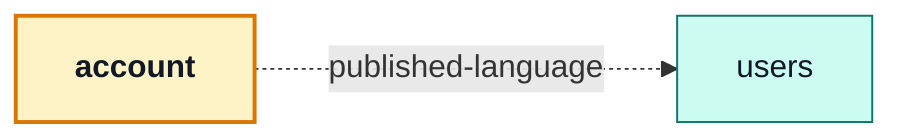

# account

::: tip At a glance
**Owns** — the visitor's own account: login, signup, profile, password reset, deletion.
**Depends on** — [`users`](./users.md), and only for its field rules.
**Breaks if you change** — nothing outside this folder. It is a consumer, not a provider.
:::

<!-- gen:identity:start -->

| Fact                    | This module                                                                                                                                     |
| ----------------------- | ----------------------------------------------------------------------------------------------------------------------------------------------- |
| **Subdomain**           | `generic` — A solved problem. Modelling effort here would be waste.                                                                             |
| **Screens**             | 8 — `Login` · `Signup` · `PasswordResetRequest` · `PasswordResetConfirm` · `AccountDeleteConfirm` · `VerifyEmailConfirm` · `Profile` · `Logout` |
| **Store**               | `account`                                                                                                                                       |
| **Menu entries**        | `Profile`                                                                                                                                       |
| **API calls**           | 18                                                                                                                                              |
| **Depends on**          | [`users`](./users.md)                                                                                                                           |
| **Depended on by**      | _nothing_                                                                                                                                       |
| **Languages**           | `en` · `it`                                                                                                                                     |
| **Publishes**           | _nothing_ — no barrel, so no sibling may import it                                                                                              |
| **Backend counterpart** | `account` in `boilerplate-node-backend`                                                                                                         |

<!-- gen:identity:end -->

## The map

<!-- gen:map:start -->



- → `users` **published-language** — Validates every form against `usersSchema`/`usersPasswordSchema` — shared field rules, not a shared store.

<!-- gen:map:end -->

## The story

Eight screens, one store, and the widest API surface of any module here — which makes it a
misleadingly ordinary-looking domain. Two things about it are worth knowing before you edit it.

**The session is not in here.** The token lives in `infrastructure/session`, because
`infrastructure/http` has to read it on every request and the router guards read `isAuth`/`isAdmin`
before any domain code runs. A module cannot sit below the layer that needs it. This module owns the
_editable record_, not the credential.

**The one dependency is validation, not screens.** Every form here validates against
`usersSchema`/`usersPasswordSchema` from the [`users`](./users.md) barrel, so _what makes a valid
username_ is answered once — for the person editing their own record and for the admin editing
someone else's. A build with `account` but not `users` would validate nothing.

::: tip That edge is `published-language`, and the backend's equivalent is not
On the server, `account → users` is `shared-kernel`: both modules write the same User record. Here
the same pair shares only the validation vocabulary, and the server remains the single writer.

**The divergence is the finding.** Two context maps over one product, disagreeing about an edge
because the two sides genuinely have different relationships to the same data.
:::

There is no `index.ts` next to the manifest, and that is an answer rather than an omission: no other
domain has ever needed anything from this one. A barrel exists when a module exports something; an
empty one is a promise nobody asked for.

## State

<!-- gen:state:start -->

Store `account`, from `store.ts`. Only what the setup function returns is listed — an internal ref is not part of the surface.

| Kind        | Members                                                                                                                                                                                                                                                                                                                                                                                            | What it is                                                       |
| ----------- | -------------------------------------------------------------------------------------------------------------------------------------------------------------------------------------------------------------------------------------------------------------------------------------------------------------------------------------------------------------------------------------------------- | ---------------------------------------------------------------- |
| **State**   | `sessions` · `addresses`                                                                                                                                                                                                                                                                                                                                                                           | The refs the setup function returns — the only writable surface. |
| **Getters** | `profile` · `loading`                                                                                                                                                                                                                                                                                                                                                                              | Computed, derived from state. Read-only by construction.         |
| **Actions** | `publishViewer` · `login` · `signup` · `requestPasswordReset` · `confirmPasswordReset` · `requestAccountDelete` · `confirmAccountDelete` · `fetchProfile` · `updateProfile` · `changePassword` · `fetchSessions` · `revokeSession` · `requestEmailVerification` · `confirmEmailVerification` · `fetchAddresses` · `addAddress` · `updateAddress` · `removeAddress` · `logout` · `logoutEverywhere` | Everything that changes state or calls the API.                  |

<!-- gen:state:end -->

## Screens

<!-- gen:screens:start -->

| Path                     | Route name             | Access   | View                             |
| ------------------------ | ---------------------- | -------- | -------------------------------- |
| `login`                  | `Login`                | `guest`  | `views/Login.vue`                |
| `signup`                 | `Signup`               | `guest`  | `views/Signup.vue`               |
| `password-reset`         | `PasswordResetRequest` | `guest`  | `views/PasswordResetRequest.vue` |
| `password-reset/confirm` | `PasswordResetConfirm` | `guest`  | `views/PasswordResetConfirm.vue` |
| `account-delete/confirm` | `AccountDeleteConfirm` | `public` | `views/AccountDeleteConfirm.vue` |
| `verify-email/confirm`   | `VerifyEmailConfirm`   | `public` | `views/VerifyEmailConfirm.vue`   |
| `profile`                | `Profile`              | `auth`   | `views/Profile.vue`              |
| `logout`                 | `Logout`               | `public` | `—`                              |

Paths are relative to the localised root, so `cart` is served at `/:locale/cart`. **Access** is the route’s own `meta.access` — a menu entry never restates it, which is what keeps the menu and the router from disagreeing.

<!-- gen:screens:end -->

## Wiring

<!-- gen:wiring:start -->

#### Endpoints called

| Call                             | Response envelope                  |
| -------------------------------- | ---------------------------------- |
| `DELETE /account`                | `RequestAccountDeleteResponse`     |
| `PUT /account`                   | `UpdateAccountResponse`            |
| `GET /account/addresses`         | `GetAddressesResponse`             |
| `POST /account/addresses`        | `AddAddressResponse`               |
| `DELETE /account/addresses/{id}` | `RemoveAddressResponse`            |
| `PUT /account/addresses/{id}`    | `UpdateAddressResponse`            |
| `DELETE /account/delete-confirm` | `ConfirmAccountDeleteResponse`     |
| `POST /account/login`            | `LoginResponse`                    |
| `POST /account/logout`           | `LogoutResponse`                   |
| `POST /account/password`         | `ChangePasswordResponse`           |
| `POST /account/reset`            | `RequestPasswordResetResponse`     |
| `POST /account/reset-confirm`    | `ConfirmPasswordResetResponse`     |
| `GET /account/sessions`          | `GetSessionsResponse`              |
| `DELETE /account/sessions/{id}`  | `RevokeSessionResponse`            |
| `POST /account/signup`           | `SignupResponse`                   |
| `DELETE /account/tokens/expired` | `DeleteExpiredTokensResponse`      |
| `POST /account/verify-confirm`   | `ConfirmEmailVerificationResponse` |
| `POST /account/verify-request`   | `RequestEmailVerificationResponse` |

Each row registers one Zod envelope through the manifest, so enabling the domain turns its contract validation on and deleting the folder turns it off.

#### Navigation entries

| Route     | Label key                  | Section   | Order | Icon | Badge |
| --------- | -------------------------- | --------- | ----- | ---- | ----- |
| `Profile` | `navigation.label-profile` | `account` | 70    | yes  | —     |

#### Analytics events

| Constant                          | Emitted from |
| --------------------------------- | ------------ |
| `analyticsEvents.USER_LOGGED_OUT` | this module  |

The names themselves are declared in the backend, because both repositories write into one event namespace.

<!-- gen:wiring:end -->

## Files

<!-- gen:files:start -->

| File                                | What it is                                                                                                                                                  | Explained in                          |
| ----------------------------------- | ----------------------------------------------------------------------------------------------------------------------------------------------------------- | ------------------------------------- |
| `components/ProfileAddresses.vue`   | A component this domain owns. Published through the barrel when a sibling mounts it, internal otherwise.                                                    | [read](../theory/layers.md)           |
| `components/ProfileSessions.vue`    | A component this domain owns. Published through the barrel when a sibling mounts it, internal otherwise.                                                    | [read](../theory/layers.md)           |
| `locales/en.json`                   | This domain’s translation dictionary for one language, loaded as its own chunk.                                                                             | [read](../tools/i18n.md)              |
| `locales/it.json`                   | This domain’s translation dictionary for one language, loaded as its own chunk.                                                                             | [read](../tools/i18n.md)              |
| `module.ts`                         | The manifest — the only file the application loads directly. Declares the name, routes, navigation entries, response schemas, dependency edges and locales. | [read](../theory/modules.md)          |
| `response-schemas.ts`               | One row per endpoint this domain calls, pairing a method and path pattern with the Zod envelope its response is validated against.                          | [read](../api/openapi-workflow.md)    |
| `routes.ts`                         | The domain’s route records, spliced into the localised route tree. Each carries its own `meta.access`.                                                      | [read](../theory/sitemap.md)          |
| `store.ts`                          | The Pinia store: this domain’s state, and every call it makes to the generated client.                                                                      | [read](../tools/state-and-routing.md) |
| `tests/e2e/__snapshots__/login.png` | A committed visual-regression baseline.                                                                                                                     | [read](../tools/visual-regression.md) |
| `tests/e2e/a11y.cy.ts`              | Cypress suite — the screens, in a browser.                                                                                                                  | [read](../tools/component-testing.md) |
| `tests/e2e/account.visual.cy.ts`    | Cypress suite — the screens, in a browser.                                                                                                                  | [read](../tools/component-testing.md) |
| `tests/e2e/auth.cy.ts`              | Cypress suite — the screens, in a browser.                                                                                                                  | [read](../tools/component-testing.md) |
| `tests/e2e/password-reset.cy.ts`    | Cypress suite — the screens, in a browser.                                                                                                                  | [read](../tools/component-testing.md) |
| `tests/e2e/profile.cy.ts`           | Cypress suite — the screens, in a browser.                                                                                                                  | [read](../tools/component-testing.md) |
| `tests/e2e/registration.cy.ts`      | Cypress suite — the screens, in a browser.                                                                                                                  | [read](../tools/component-testing.md) |
| `tests/login-view-i18n.spec.ts`     | Vitest suite — the store, the routes and the rules, in isolation.                                                                                           | [read](../tools/unit-testing.md)      |
| `tests/routes.spec.ts`              | Vitest suite — the store, the routes and the rules, in isolation.                                                                                           | [read](../tools/unit-testing.md)      |
| `tests/store-flows.spec.ts`         | Vitest suite — the store, the routes and the rules, in isolation.                                                                                           | [read](../tools/unit-testing.md)      |
| `tests/store.spec.ts`               | Vitest suite — the store, the routes and the rules, in isolation.                                                                                           | [read](../tools/unit-testing.md)      |
| `views/AccountDeleteConfirm.vue`    | A routed screen. Reads its store, renders, and holds no fetching logic of its own.                                                                          | [read](../theory/layers.md)           |
| `views/Login.vue`                   | A routed screen. Reads its store, renders, and holds no fetching logic of its own.                                                                          | [read](../theory/layers.md)           |
| `views/PasswordResetConfirm.vue`    | A routed screen. Reads its store, renders, and holds no fetching logic of its own.                                                                          | [read](../theory/layers.md)           |
| `views/PasswordResetRequest.vue`    | A routed screen. Reads its store, renders, and holds no fetching logic of its own.                                                                          | [read](../theory/layers.md)           |
| `views/Profile.vue`                 | A routed screen. Reads its store, renders, and holds no fetching logic of its own.                                                                          | [read](../theory/layers.md)           |
| `views/Signup.vue`                  | A routed screen. Reads its store, renders, and holds no fetching logic of its own.                                                                          | [read](../theory/layers.md)           |
| `views/VerifyEmailConfirm.vue`      | A routed screen. Reads its store, renders, and holds no fetching logic of its own.                                                                          | [read](../theory/layers.md)           |

<!-- gen:files:end -->

## Working on it

<!-- gen:working:start -->

| Suite            | Files | Where                                          |
| ---------------- | ----- | ---------------------------------------------- |
| Vitest           | 4     | `src/modules/account/tests/`                   |
| Cypress          | 6     | `src/modules/account/tests/e2e/`               |
| Visual baselines | 1     | `src/modules/account/tests/e2e/__snapshots__/` |

```bash
# this module's vitest suites
npm run test:unit -- account

# this module's cypress suites
npm run test:e2e -- --spec 'src/modules/account/tests/e2e/*.cy.ts'

# after the backend changes an endpoint this module calls
npm run regenerate
```

<!-- gen:working:end -->

## Deeper in

<!-- gen:subpages:start -->

Nothing in this domain needs a page of its own — the story above is the whole of it.

<!-- gen:subpages:end -->

## Related pages

- [`users`](./users.md) — where the field rules come from
- [Security](../tools/security.md) — the token, the guards, and what the client never stores
- [Sitemap & Access Control](../theory/sitemap.md) — the guest-only and auth-only routes
- [Domain Layer](../theory/domain-layer.md) — why `shared-kernel` does not appear on this map
- [State & Routing](../tools/state-and-routing.md) — how a guard reads the session
