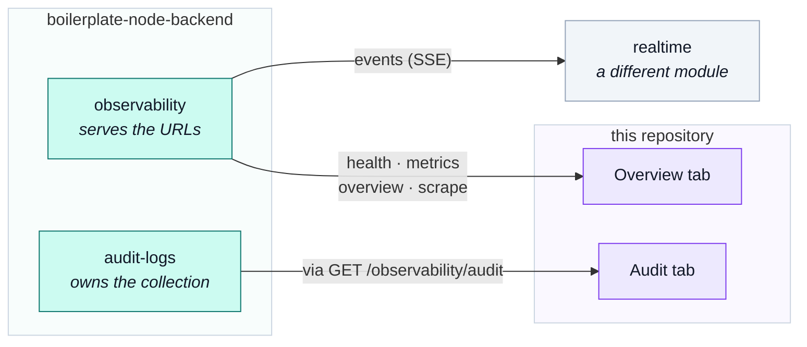

# The dashboard

One screen assembled from five reads across two backend modules — and the shapes it builds that no
endpoint answers with.

::: tip At a glance
**Two tabs** — Overview (health and KPIs) and Audit (the trail).
**Five reads** — four from `observability`, one from `audit-logs`.
**Breaks if you change** — `types.ts`. It is the only place the assembled shapes are declared.
:::

## Two backend modules, one screen

This is the pairing asymmetry, made concrete:

`audit-logs` owns the collection but serves no URL — the route that reads it belongs to
`observability`, the dashboard that renders it. So this module talks to one base path and pairs with
two domains, and the fifth read on that base path goes somewhere else entirely: the SSE stream is
[`realtime`](./realtime.md)'s.

## The five reads

| Call | Feeds |
| --- | --- |
| `GET /observability/health` | the Overview tab's status panel |
| `GET /observability/metrics/overview` | the KPI tiles |
| `GET /observability/metrics` | the raw Prometheus exposition, shown as text |
| `GET /observability/events` | registered here, consumed by [`realtime`](./realtime.md)'s screen |
| `GET /observability/audit` | the Audit tab's table |

All five are registered through this module's manifest, so enabling the domain turns their contract
validation on and deleting the folder turns it off. There is no shared table to remember to edit.

## Why `types.ts` exists here and nowhere else

::: warning A KPI tile is not a response shape
The generated types describe exactly what each endpoint returns. A tile showing *requests per second,
trending, against yesterday* is assembled from a metrics payload by
`composables/use-admin-observability.ts` — and that assembled shape has no generated type, because no
endpoint answers with it.

Declaring it in `types.ts` beside the composable that builds it keeps it honest: a reader can tell at
a glance which shapes came from the contract and which this client invented. Putting them in
`src/types/` would blur exactly that line.
:::

This is the only module in either repository with a `types.ts`, and the file-shape catalogue
(`tests/cross-cutting/module-file-shapes.spec.ts`) says so.

## The audit table reads somebody else's writes

Every row it shows was written server-side by a module that had no idea a dashboard existed. The
~53 `emitAuditEvent` call sites across the backend talk to an infrastructure port; the `audit-logs`
module installs the sink behind it.

This client never writes to that trail. There is no endpoint for it, deliberately — an audit entry a
client could author is not evidence of anything.

## Built to be deleted

::: tip This is the first thing a downstream project without an ops dashboard removes
So it depends on nothing, reads the observability endpoints directly rather than through any other
domain's store, and keeps its assembled shapes in its own folder.

`rm -rf src/modules/admin`, one line of `src/modules.ts`, one sidebar entry, one pairing entry in
`tests/cross-cutting/backend-pairing.spec.ts` — and that spec names the pairing if you miss it. The
sidebar and this page are yours to remove.
:::

## Related pages

- [`admin`](./admin.md) — the module this belongs to
- [`realtime`](./realtime.md) — the fifth read's real consumer
- [Admin Dashboard](../tools/admin-dashboard.md) — the panels and how they refresh
- [Observability](../tools/observability.md) — what is measured, and by whom
- [Observability Endpoints](../api/observability.md) — the contract for all five reads
