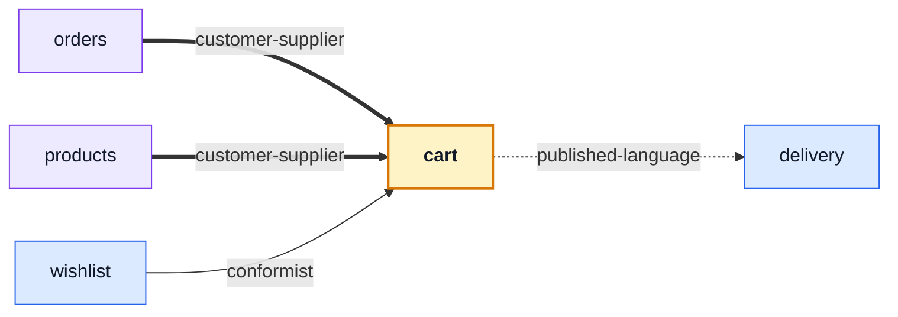

# cart

::: tip At a glance
**Owns** — the cart screen, the cart store, and the checkout flow that ends both.
**Depends on** — [`delivery`](./delivery.md), and only for a component it mounts.
**Breaks if you change** — `badgeQuantity`. The shell's header reads it through the manifest.
:::

<!-- gen:identity:start -->

| Fact                    | This module                                                                         |
| ----------------------- | ----------------------------------------------------------------------------------- |
| **Subdomain**           | `core` — The reason the product exists. Worth its own client-side rules.            |
| **Screens**             | 1 — `Cart`                                                                          |
| **Store**               | `cart`                                                                              |
| **Menu entries**        | `Cart` (with badge)                                                                 |
| **API calls**           | 8                                                                                   |
| **Depends on**          | [`delivery`](./delivery.md)                                                         |
| **Depended on by**      | [`orders`](./orders.md) · [`products`](./products.md) · [`wishlist`](./wishlist.md) |
| **Languages**           | `en` · `it`                                                                         |
| **Publishes**           | `useCartStore`                                                                      |
| **Backend counterpart** | `cart` in `boilerplate-node-backend`                                                |

<!-- gen:identity:end -->

## The map

<!-- gen:map:start -->



- `orders` → **customer-supplier** — The reorder button asks the cart store to refill itself from a past order.
- `products` → **customer-supplier** — Add-to-cart asks the cart store to write a line.
- `wishlist` → **conformist** — Move-to-cart calls a wishlist endpoint and then asks the cart store to refetch itself; the cart is never asked to write.
- → `delivery` **published-language** — Mounts `ShippingSelector`, a self-contained component that renders shipping without this module learning what a rate is.

<!-- gen:map:end -->

## The story

**Nearly every arrow on this client points at this module.** [`orders`](./orders.md) reaches the
barrel for the reorder button, [`products`](./products.md) for add-to-cart, and
[`wishlist`](./wishlist.md) for its move-to-cart exit. The first two are `customer-supplier` — they
ask this store to write a line — and `wishlist` is `conformist`: the move itself is a wishlist
endpoint, and this store is only asked to refetch. Either way the cart is the one publishing a
store, while the module it depends on publishes a component.

The one arrow going out is [`delivery`](./delivery.md), and it is `published-language`: the checkout
mounts `ShippingSelector` and never learns what a shipping rate is.

::: tip The badge is the only reactive thing this module lends the shell
`badgeQuantity` is handed to the main navigation as an **accessor**, not a number. The shell calls it
once inside its own setup and renders whatever the ref holds, without ever learning whose store it is
reading.

It seeds from `GET /cart/summary` whenever a session appears — the whole point of that endpoint is a
count that does not cost the cart — and every later mutation keeps it fresh through the store, since
each action replaces the local cart with the authoritative payload the API answered.
:::

Checkout lives in this store and not in the orders store, even though it answers with an order. It is
`POST /cart/checkout`, the contract files it under `Cart`, and it is the one call that empties the
cart this store is responsible for. Owned from anywhere else, the local cart survives a completed
order and the header keeps showing items the server has already turned into one.

## State

<!-- gen:state:start -->

Store `cart`, from `store.ts`. Only what the setup function returns is listed — an internal ref is not part of the surface.

| Kind        | Members                                                                                                                                                    | What it is                                                       |
| ----------- | ---------------------------------------------------------------------------------------------------------------------------------------------------------- | ---------------------------------------------------------------- |
| **State**   | `cart` · `productTitles`                                                                                                                                   | The refs the setup function returns — the only writable surface. |
| **Getters** | `cartItems` · `cartSummary` · `cartCount` · `badgeQuantity` · `loading`                                                                                    | Computed, derived from state. Read-only by construction.         |
| **Actions** | `fetchSummary` · `fetchCart` · `titleOf` · `resolveTitles` · `checkout` · `reorder` · `upsertCartItem` · `updateCartItem` · `removeCartItem` · `clearCart` | Everything that changes state or calls the API.                  |

<!-- gen:state:end -->

## Screens

<!-- gen:screens:start -->

| Path   | Route name | Access | View             |
| ------ | ---------- | ------ | ---------------- |
| `cart` | `Cart`     | `auth` | `views/Cart.vue` |

Paths are relative to the localised root, so `cart` is served at `/:locale/cart`. **Access** is the route’s own `meta.access` — a menu entry never restates it, which is what keeps the menu and the router from disagreeing.

<!-- gen:screens:end -->

## Wiring

<!-- gen:wiring:start -->

#### Endpoints called

| Call                      | Response envelope            |
| ------------------------- | ---------------------------- |
| `DELETE /cart`            | `ClearCartResponse`          |
| `GET /cart`               | `GetCartResponse`            |
| `POST /cart`              | `UpsertCartItemResponse`     |
| `DELETE /cart/{id}`       | `RemoveCartItemResponse`     |
| `PUT /cart/{id}`          | `UpdateCartItemByIdResponse` |
| `POST /cart/checkout`     | `CheckoutResponse`           |
| `POST /cart/reorder/{id}` | `ReorderResponse`            |
| `GET /cart/summary`       | `GetCartSummaryResponse`     |

Each row registers one Zod envelope through the manifest, so enabling the domain turns its contract validation on and deleting the folder turns it off.

#### Navigation entries

| Route  | Label key               | Section   | Order | Icon | Badge |
| ------ | ----------------------- | --------- | ----- | ---- | ----- |
| `Cart` | `navigation.label-cart` | `account` | 80    | yes  | yes   |

#### Analytics events

| Constant                                  | Emitted from |
| ----------------------------------------- | ------------ |
| `analyticsEvents.CHECKOUT_REQUEST_FAILED` | this module  |

The names themselves are declared in the backend, because both repositories write into one event namespace.

<!-- gen:wiring:end -->

## Files

<!-- gen:files:start -->

| File                               | What it is                                                                                                                                                  | Explained in                          |
| ---------------------------------- | ----------------------------------------------------------------------------------------------------------------------------------------------------------- | ------------------------------------- |
| `domain/index.ts`                  | The domain barrel.                                                                                                                                          | [read](../theory/domain-layer.md)     |
| `domain/quantity.ts`               | Pure client-side rules over plain data — no store, no component, no axios.                                                                                  | [read](../theory/domain-layer.md)     |
| `index.ts`                         | The public barrel: the only surface a sibling module may import.                                                                                            | [read](../theory/strategic-ddd.md)    |
| `locales/en.json`                  | This domain’s translation dictionary for one language, loaded as its own chunk.                                                                             | [read](../tools/i18n.md)              |
| `locales/it.json`                  | This domain’s translation dictionary for one language, loaded as its own chunk.                                                                             | [read](../tools/i18n.md)              |
| `module.ts`                        | The manifest — the only file the application loads directly. Declares the name, routes, navigation entries, response schemas, dependency edges and locales. | [read](../theory/modules.md)          |
| `response-schemas.ts`              | One row per endpoint this domain calls, pairing a method and path pattern with the Zod envelope its response is validated against.                          | [read](../api/openapi-workflow.md)    |
| `routes.ts`                        | The domain’s route records, spliced into the localised route tree. Each carries its own `meta.access`.                                                      | [read](../theory/sitemap.md)          |
| `store.ts`                         | The Pinia store: this domain’s state, and every call it makes to the generated client.                                                                      | [read](../tools/state-and-routing.md) |
| `tests/e2e/__snapshots__/cart.png` | A committed visual-regression baseline.                                                                                                                     | [read](../tools/visual-regression.md) |
| `tests/e2e/a11y.cy.ts`             | Cypress suite — the screens, in a browser.                                                                                                                  | [read](../tools/component-testing.md) |
| `tests/e2e/analytics.cy.ts`        | Cypress suite — the screens, in a browser.                                                                                                                  | [read](../tools/component-testing.md) |
| `tests/e2e/cart.cy.ts`             | Cypress suite — the screens, in a browser.                                                                                                                  | [read](../tools/component-testing.md) |
| `tests/e2e/cart.visual.cy.ts`      | Cypress suite — the screens, in a browser.                                                                                                                  | [read](../tools/component-testing.md) |
| `tests/product-titles.spec.ts`     | Vitest suite — the store, the routes and the rules, in isolation.                                                                                           | [read](../tools/unit-testing.md)      |
| `tests/quantity.spec.ts`           | Vitest suite — the store, the routes and the rules, in isolation.                                                                                           | [read](../tools/unit-testing.md)      |
| `tests/routes.spec.ts`             | Vitest suite — the store, the routes and the rules, in isolation.                                                                                           | [read](../tools/unit-testing.md)      |
| `tests/store.spec.ts`              | Vitest suite — the store, the routes and the rules, in isolation.                                                                                           | [read](../tools/unit-testing.md)      |
| `views/Cart.vue`                   | A routed screen. Reads its store, renders, and holds no fetching logic of its own.                                                                          | [read](../theory/layers.md)           |

<!-- gen:files:end -->

## Working on it

<!-- gen:working:start -->

| Suite            | Files | Where                                       |
| ---------------- | ----- | ------------------------------------------- |
| Vitest           | 4     | `src/modules/cart/tests/`                   |
| Cypress          | 4     | `src/modules/cart/tests/e2e/`               |
| Visual baselines | 1     | `src/modules/cart/tests/e2e/__snapshots__/` |

```bash
# this module's vitest suites
npm run test:unit -- cart

# this module's cypress suites
npm run test:e2e -- --spec 'src/modules/cart/tests/e2e/*.cy.ts'

# after the backend changes an endpoint this module calls
npm run regenerate
```

<!-- gen:working:end -->

## Deeper in

<!-- gen:subpages:start -->

- [The checkout flow](./cart-checkout.md)

<!-- gen:subpages:end -->

## Related pages

- [The checkout flow](./cart-checkout.md) — the screen, the errors, and what the server decides
- [`products`](./products.md) · [`wishlist`](./wishlist.md) · [`orders`](./orders.md) — the three modules that write here
- [State & Routing](../tools/state-and-routing.md) — stores, and where the header reads this one
- [Layers](../theory/layers.md) — why a view holds no fetching logic
- [Product Analytics](../tools/umami.md) — the one event this module reports itself
