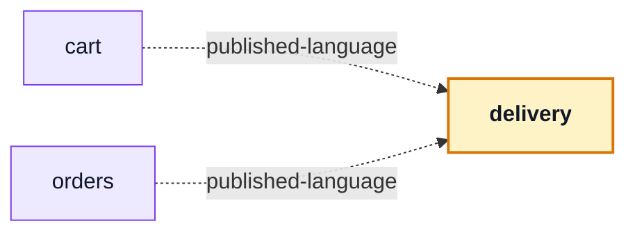

# delivery

::: tip At a glance
**Owns** — `ShippingSelector` and `ShipmentPanel`: shipping as components, not pages.
**Depends on** — nothing. Two modules mount it; it mounts nothing.
**Breaks if you change** — either component's props. [`cart`](./cart.md) and [`orders`](./orders.md) mount them.
:::

<!-- gen:identity:start -->

| Fact                    | This module                                                                    |
| ----------------------- | ------------------------------------------------------------------------------ |
| **Subdomain**           | `supporting` — Specific to this business but not a differentiator. Kept plain. |
| **Screens**             | _none_ — this module routes to nothing                                         |
| **Store**               | `delivery`                                                                     |
| **Menu entries**        | _none_                                                                         |
| **API calls**           | 3                                                                              |
| **Depends on**          | _nothing_                                                                      |
| **Depended on by**      | [`cart`](./cart.md) · [`orders`](./orders.md)                                  |
| **Languages**           | `en` · `it`                                                                    |
| **Publishes**           | `ShipmentPanel` · `ShippingSelector`                                           |
| **Backend counterpart** | `delivery` in `boilerplate-node-backend`                                       |

<!-- gen:identity:end -->

## The map

<!-- gen:map:start -->



- `cart` → **published-language** — Mounts `ShippingSelector`, a self-contained component that renders shipping without this module learning what a rate is.
- `orders` → **published-language** — Mounts `ShipmentPanel`; the parcel renders itself and this module never touches a shipment.

<!-- gen:map:end -->

## The story

**No routes and no navigation entries**, and two modules pointing at it — the only module here with
that shape.

| Component          | Mounted by              | On               |
| ------------------ | ----------------------- | ---------------- |
| `ShippingSelector` | [`cart`](./cart.md)     | the checkout     |
| `ShipmentPanel`    | [`orders`](./orders.md) | the order detail |

Both edges are `published-language`, and both are declared by the mounting module rather than here.
Neither learns what a shipping rate or a tracking code is: the components render their own concern
and fetch their own data.

::: tip What deleting this module costs, precisely
The selector, the panels and the mock courier go. **Checkouts simply stop carrying shipping** — the
state the shop was in before this module existed.

That is the test [Adding & Removing a Module](../theory/module-lifecycle.md) describes, and this is
one of the two modules where it is cleanest, because nothing here is anyone else's state.
:::

Read this page and [`payments`](./payments.md) together. They are the same architectural move — a
domain whose entire published surface is a self-contained component — applied to two different
concerns, and between them they cover four of the client's nine context edges.

## State

<!-- gen:state:start -->

Store `delivery`, from `store.ts`. Only what the setup function returns is listed — an internal ref is not part of the surface.

| Kind        | Members                                                                 | What it is                                                       |
| ----------- | ----------------------------------------------------------------------- | ---------------------------------------------------------------- |
| **State**   | `methods` · `shipment`                                                  | The refs the setup function returns — the only writable surface. |
| **Getters** | `loading`                                                               | Computed, derived from state. Read-only by construction.         |
| **Actions** | `fetchMethods` · `effectivePrice` · `fetchShipmentForOrder` · `advance` | Everything that changes state or calls the API.                  |

<!-- gen:state:end -->

## Screens

<!-- gen:screens:start -->

This module routes to nothing. It contributes components, schemas or a store to the modules that depend on it.

<!-- gen:screens:end -->

## Wiring

<!-- gen:wiring:start -->

#### Endpoints called

| Call                       | Response envelope             |
| -------------------------- | ----------------------------- |
| `POST /delivery/advance`   | `AdvanceCourierResponse`      |
| `GET /delivery/methods`    | `ListShippingMethodsResponse` |
| `GET /delivery/order/{id}` | `GetShipmentByOrderResponse`  |

Each row registers one Zod envelope through the manifest, so enabling the domain turns its contract validation on and deleting the folder turns it off.

<!-- gen:wiring:end -->

## Files

<!-- gen:files:start -->

| File                              | What it is                                                                                                                                                  | Explained in                          |
| --------------------------------- | ----------------------------------------------------------------------------------------------------------------------------------------------------------- | ------------------------------------- |
| `components/ShipmentPanel.vue`    | A component this domain owns. Published through the barrel when a sibling mounts it, internal otherwise.                                                    | [read](../theory/layers.md)           |
| `components/ShippingSelector.vue` | A component this domain owns. Published through the barrel when a sibling mounts it, internal otherwise.                                                    | [read](../theory/layers.md)           |
| `index.ts`                        | The public barrel: the only surface a sibling module may import.                                                                                            | [read](../theory/strategic-ddd.md)    |
| `locales/en.json`                 | This domain’s translation dictionary for one language, loaded as its own chunk.                                                                             | [read](../tools/i18n.md)              |
| `locales/it.json`                 | This domain’s translation dictionary for one language, loaded as its own chunk.                                                                             | [read](../tools/i18n.md)              |
| `module.ts`                       | The manifest — the only file the application loads directly. Declares the name, routes, navigation entries, response schemas, dependency edges and locales. | [read](../theory/modules.md)          |
| `response-schemas.ts`             | One row per endpoint this domain calls, pairing a method and path pattern with the Zod envelope its response is validated against.                          | [read](../api/openapi-workflow.md)    |
| `store.ts`                        | The Pinia store: this domain’s state, and every call it makes to the generated client.                                                                      | [read](../tools/state-and-routing.md) |
| `tests/store.spec.ts`             | Vitest suite — the store, the routes and the rules, in isolation.                                                                                           | [read](../tools/unit-testing.md)      |

<!-- gen:files:end -->

## Working on it

<!-- gen:working:start -->

| Suite  | Files | Where                         |
| ------ | ----- | ----------------------------- |
| Vitest | 1     | `src/modules/delivery/tests/` |

```bash
# this module's vitest suites
npm run test:unit -- delivery

# after the backend changes an endpoint this module calls
npm run regenerate
```

<!-- gen:working:end -->

## Deeper in

<!-- gen:subpages:start -->

Nothing in this domain needs a page of its own — the story above is the whole of it.

<!-- gen:subpages:end -->

## Related pages

- [`cart`](./cart.md) · [`orders`](./orders.md) — the two modules that mount these components
- [`payments`](./payments.md) — the other component-only module
- [Strategic DDD](../theory/strategic-ddd.md) — reading a `published-language` edge
- [Adding & Removing a Module](../theory/module-lifecycle.md) — the deletability procedure
