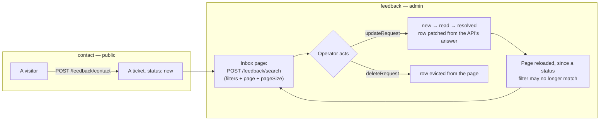

# feedback

::: tip At a glance
**Owns** — the public contact form and the admin inbox behind it.
**Depends on** — nothing, and nothing depends on it. A leaf in both directions.
**Breaks if you change** — nothing outside this folder.
:::

| Fact                    | This module                                                         |
| ----------------------- | ------------------------------------------------------------------- |
| **Subdomain**           | `generic` — A solved problem. Modelling effort here would be waste. |
| **Screens**             | 2 — `Contact` · `FeedbackInbox`                                     |
| **Store**               | `feedback`                                                          |
| **Menu entries**        | `Contact` · `FeedbackInbox`                                         |
| **API calls**           | 5                                                                   |
| **Depends on**          | _nothing_                                                           |
| **Depended on by**      | _nothing_                                                           |
| **Languages**           | `en` · `it`                                                         |
| **Publishes**           | _nothing_ — no barrel, so no sibling may import it                  |
| **Backend counterpart** | `feedback` in `boilerplate-node-backend`                            |

::: info Stands alone
No module depends on this one and it depends on none. Deleting the folder and its line in `src/modules.ts` costs nothing else.
:::

## The map

`feedback` sits on no edge of the context map — nothing imports it and it imports nothing.

## The story

A ticket references no other domain's records, and both screens talk only to this module's own
endpoints — so it depends on nothing and nothing depends on it.

The two screens are opposite ends of one workflow and share nothing but a store: `contact` is
public, `feedback` needs `['read', 'Feedback']`. That split is a property of the routes' own
declarations, not of anything in this folder, which is why the menu entry can be contributed
without restating a permission.

::: tip A leaf in both directions
Together with [`demo`](./demo.md) and [`realtime`](./realtime.md), this is a module to read when you
want the module system with none of the interesting coupling in the way. Zero edges, one store, two
screens.
:::

The backend module has answered these endpoints all along. This is the frontend claiming its half —
which is worth noticing, because it is the shape a new domain arrives in: the server exists first,
and a client module is one folder and one registry line away from using it.

**The inbox is a paginated admin list like users, products and orders.** The store is built on
`useStructureCrudApi`, so paging, the page-size select and the pager behave the same as on every
other admin list. `pageTotal` comes from the server's own `meta.totalPages` (`useServerPageTotal`),
never from the rows already cached.

Every page is read through `POST /feedback/search`, never `GET /feedback`: the GET answers
`Cache-Control: private, max-age=30`, so a reload right after a delete could be a browser cache hit
handing the deleted row back. A POST body is never browser-cached.



## State

Store `feedback`, from `store.ts`. Only what the setup function returns is listed — an internal ref
is not part of the surface.

| Kind        | Members                                                                                                 | What it is                                                       |
| ----------- | ------------------------------------------------------------------------------------------------------- | ---------------------------------------------------------------- |
| **State**   | `requests` · `filters` · `pageCurrent` · `pageSize` · `pageTotal`                                       | The refs the setup function returns — the only writable surface. |
| **Getters** | `requestsList` · `pageItemList` · `loading`                                                             | Computed, derived from state. Read-only by construction.         |
| **Actions** | `submitContact` · `fetchPaginationRequests` · `watchSearchRequests` · `updateRequest` · `deleteRequest` | Everything that changes state or calls the API.                  |

## Screens

| Path       | Route name      | Access   | Permission      | View                      |
| ---------- | --------------- | -------- | --------------- | ------------------------- |
| `contact`  | `Contact`       | `public` | —               | `views/Contact.vue`       |
| `feedback` | `FeedbackInbox` | `auth`   | `read Feedback` | `views/FeedbackInbox.vue` |

Paths are relative to the localised root, so `cart` is served at `/:locale/cart`. **Access** is the route’s own `meta.access` (the standing it needs) and **Permission** its `meta.can` — the `[action, subject]` rule checked against the caller's own rules from `GET /account/abilities`. A menu entry restates neither, which is what keeps the menu and the router from disagreeing. See [Security](../tools/security.md#route-guards).

## Wiring

#### Endpoints called

| Call                     | Response envelope                     |
| ------------------------ | ------------------------------------- |
| `GET /feedback`          | `ListFeedbackRequestsResponse`        |
| `POST /feedback/search`  | `SearchFeedbackRequestsResponse`      |
| `PUT /feedback/{id}`     | `UpdateFeedbackRequestStatusResponse` |
| `DELETE /feedback/{id}`  | `DeleteFeedbackRequestResponse`       |
| `POST /feedback/contact` | `CreateFeedbackRequestResponse`       |

Each row registers one Zod envelope through the manifest, so enabling the domain turns its contract
validation on and deleting the folder turns it off.

#### Navigation entries

| Route | Label key | Section | Order | Icon | Badge |
| --------------- | --------------------------- | --- | --- | --- | --- | --- |
| `Contact` | `navigation.label-contact` | `main` | 95 | yes | — |
| `FeedbackInbox` | `navigation.label-feedback` | `admin` | 45 | yes | — |

#### Analytics events

None.

## Files

| File                                  | What it is                                                                                                                                                  | Explained in                          |
| ------------------------------------- | ----------------------------------------------------------------------------------------------------------------------------------------------------------- | ------------------------------------- |
| `locales/en.json`                     | This domain’s translation dictionary for one language, loaded as its own chunk.                                                                             | [read](../tools/i18n.md)              |
| `locales/it.json`                     | This domain’s translation dictionary for one language, loaded as its own chunk.                                                                             | [read](../tools/i18n.md)              |
| `module.ts`                           | The manifest — the only file the application loads directly. Declares the name, routes, navigation entries, response schemas, dependency edges and locales. | [read](../theory/modules.md)          |
| `response-schemas.ts`                 | One row per endpoint this domain calls, pairing a method and path pattern with the Zod envelope its response is validated against.                          | [read](../api/openapi-workflow.md)    |
| `routes.ts`                           | The domain’s route records, spliced into the localised route tree. Each carries its own `meta.access`.                                                      | [read](../theory/sitemap.md)          |
| `store.ts`                            | The Pinia store: this domain’s state, and every call it makes to the generated client.                                                                      | [read](../tools/state-and-routing.md) |
| `tests/e2e/__snapshots__/contact.png` | A committed visual-regression baseline.                                                                                                                     | [read](../tools/visual-regression.md) |
| `tests/e2e/a11y.cy.ts`                | Cypress accessibility sweep — an axe run over this domain's routes, at each authentication level.                                                           | [read](../tools/component-testing.md) |
| `tests/e2e/feedback.cy.ts`            | Cypress suite — the `feedback` screens, in a browser.                                                                                                       | [read](../tools/component-testing.md) |
| `tests/e2e/feedback.visual.cy.ts`     | Cypress visual suite — pixel diffs against the committed baselines.                                                                                         | [read](../tools/component-testing.md) |
| `tests/routes.spec.ts`                | Vitest suite — the route records and the `meta.access` each one declares.                                                                                   | [read](../tools/unit-testing.md)      |
| `tests/store.spec.ts`                 | Vitest suite — this domain's store, with the transport mocked.                                                                                              | [read](../tools/unit-testing.md)      |
| `views/Contact.vue`                   | A routed screen. Reads its store, renders, and holds no fetching logic of its own.                                                                          | [read](../theory/layers.md)           |
| `views/FeedbackInbox.vue`             | A routed screen. Reads its store, renders, and holds no fetching logic of its own.                                                                          | [read](../theory/layers.md)           |

## Working on it

| Suite            | Files | Where                                           |
| ---------------- | ----- | ----------------------------------------------- |
| Vitest           | 2     | `src/modules/feedback/tests/`                   |
| Cypress          | 3     | `src/modules/feedback/tests/e2e/`               |
| Visual baselines | 1     | `src/modules/feedback/tests/e2e/__snapshots__/` |

```bash
# this module's vitest suites
npm run test:unit -- feedback

# this module's cypress suites
npm run test:e2e -- --spec 'src/modules/feedback/tests/e2e/*.cy.ts'

# after the backend changes an endpoint this module calls
npm run regenerate
```

## Related pages

- [Modules overview](./index.md) — the whole context map
- [Sitemap & Access Control](../theory/sitemap.md) — the public/admin split on these two routes
- [Adding & Removing a Module](../theory/module-lifecycle.md) — what adding a domain costs
- [State & Routing](../tools/state-and-routing.md) — the store behind both screens
