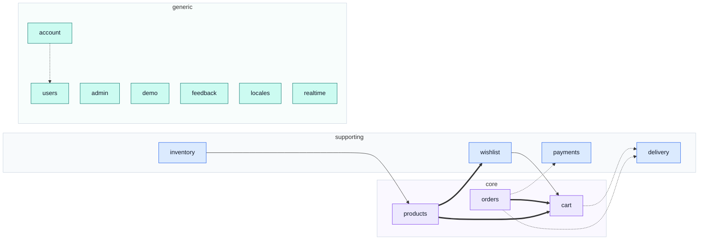

# Modules

One page per domain, top to bottom. This is the **vertical** cut through the codebase; the rest of
this site is the horizontal one.

::: tip Which section answers which question

| You want                                          | Read                   |
| ------------------------------------------------- | ---------------------- |
| What a module _is_, and the rules every one obeys | [Theory](../theory/)   |
| What **this** domain does, end to end             | a page in this section |
| How a mechanism works, in general                 | [Tools](../tools/)     |
| The contract-first workflow                       | [API](../api/)         |
| "I landed on a filename"                          | [Files](../reference/) |
| :::                                               |

The division is one rule: **a horizontal page owns a mechanism, a module page owns a decision.**
[State & Routing](../tools/state-and-routing.md) explains what a Pinia store is; the
[`cart`](./cart.md) page lists what its store holds and links back. Neither says the other's half.

The test that keeps it honest is the one this architecture is already built on — delete
`src/modules/cart/` and exactly one page in this site dies with it. Every other page loses a link and
nothing else.

::: warning Read every page with one caveat
**This application owns almost none of the domain it displays.** Totals, eligibility, availability
and permissions are all decided server-side. A page here describes the screens, the state and the
client-side rules of a domain — the reasoning behind the rules lives in the
[paired backend's module pages](../theory/domain-layer.md).
:::

## The whole map

<!-- gen:overview-map:start -->

<!-- gen:overview-map:end -->

## Reading the diagrams

Every diagram in this section encodes two things and only two, so a map is readable without a key
beside it.

<!-- gen:legend:start -->

**Node fill — where the domain sits in the business.**

| Fill      | Subdomain    | What it means                                                                                                                              |
| --------- | ------------ | ------------------------------------------------------------------------------------------------------------------------------------------ |
| 🟪 violet | `core`       | The reason the product exists. Worth its own client-side rules.                                                                            |
| 🟦 blue   | `supporting` | Specific to this business but not a differentiator. Kept plain.                                                                            |
| 🟩 teal   | `generic`    | A solved problem. Modelling effort here is waste — a `domain/` folder inside one fails `tests/cross-cutting/subdomain-discipline.spec.ts`. |

::: warning Read `core` with one caveat, on a client
This application owns almost none of the domain it displays. Prices, totals, eligibility and
permissions are all decided server-side, so `core` here marks **where the screens and the
client-side rules are load-bearing**, not where the business logic lives.
:::

**Arrow style — what kind of relationship the edge is.**

| Arrow         | Relationship         | What crosses the edge                                                                                                     |
| ------------- | -------------------- | ------------------------------------------------------------------------------------------------------------------------- |
| `-->` thin    | `conformist`         | Reads another module’s store as it is, with no translation and no say in its shape.                                       |
| `==>` thick   | `customer-supplier`  | Calls a sibling’s store to make something happen, and that sibling’s surface is shaped by the demand.                     |
| `-.->` dashed | `published-language` | Receives vocabulary rather than state — a Zod schema, a pure function, or a self-contained component. The strongest edge. |

::: info `shared-kernel` is absent, and that is a finding
The backend has one: `account → users`, because both write the same User record. Here the same
pair is `published-language`, because this client shares only the validation vocabulary and the
server remains the single writer. That divergence is what
[Domain layer](../theory/domain-layer.md) means by the domain living behind the API.
:::

Every diagram under `/modules/` uses this and only this. Since the diagrams are generated, obedience is free.

<!-- gen:legend:end -->

## Every module

The shape of the client in one row, then one row per domain. Both are generated from the manifests,
so a module that gains a screen or a store gains it here on the next `npm run docs:modules`.

Three rows are worth noticing before you read any page: [`delivery`](./delivery.md) and
[`payments`](./payments.md) have **no screens at all** — their published surface is a component
another module mounts — and [`admin`](./admin.md) has **no store**, because every screen it
assembles reads a state that belongs to the domain it came from.

<!-- gen:tally:start -->

| Modules | core | supporting | generic | Screens | Stores | Context edges |
| ------- | ---- | ---------- | ------- | ------- | ------ | ------------- |
| 14      | 3    | 4          | 7       | 30      | 13     | 9             |

<!-- gen:tally:end -->

<!-- gen:matrix:start -->

| Module                        | Subdomain    | Screens | Store                    | API calls | Depends on | Depended on by |
| ----------------------------- | ------------ | ------- | ------------------------ | --------- | ---------- | -------------- |
| [`account`](./account.md)     | `generic`    | 8       | `account`                | 18        | 1          | 0              |
| [`admin`](./admin.md)         | `generic`    | 1       | —                        | 5         | 0          | 0              |
| [`cart`](./cart.md)           | `core`       | 1       | `cart`                   | 8         | 1          | 3              |
| [`delivery`](./delivery.md)   | `supporting` | 0       | `delivery`               | 3         | 0          | 2              |
| [`demo`](./demo.md)           | `generic`    | 1       | `counter`                | 0         | 0          | 0              |
| [`feedback`](./feedback.md)   | `generic`    | 2       | `feedback`               | 3         | 0          | 0              |
| [`inventory`](./inventory.md) | `supporting` | 1       | `inventory`              | 5         | 1          | 0              |
| [`locales`](./locales.md)     | `generic`    | 3       | `locales`                | 9         | 0          | 0              |
| [`orders`](./orders.md)       | `core`       | 3       | `orders`                 | 11        | 3          | 0              |
| [`payments`](./payments.md)   | `supporting` | 0       | `payments`               | 4         | 0          | 1              |
| [`products`](./products.md)   | `core`       | 4       | `products`               | 10        | 2          | 1              |
| [`realtime`](./realtime.md)   | `generic`    | 1       | `realtime-observability` | 0         | 0          | 0              |
| [`users`](./users.md)         | `generic`    | 4       | `users`                  | 9         | 0          | 1              |
| [`wishlist`](./wishlist.md)   | `supporting` | 1       | `wishlist`               | 4         | 1          | 1              |

<!-- gen:matrix:end -->

## The two repositories

Eleven of fourteen domains exist on both sides under the same name. **The other three are the
interesting ones**, and until this table the asymmetry was written down nowhere in either repository:
[`admin`](./admin.md) renders two backend modules, [`realtime`](./realtime.md) consumes a stream one
of them serves, and [`demo`](./demo.md) has no backend domain at all.

`npm run check:module-docs` fails when an enabled module has no entry here, or when an entry pairs
with something other than its own name and gives no reason. The gap cannot widen quietly.

<!-- gen:pairing:start -->

| This repository               | boilerplate-node-backend       | Note                                                                                                                                                                            |
| ----------------------------- | ------------------------------ | ------------------------------------------------------------------------------------------------------------------------------------------------------------------------------- |
| [`account`](./account.md)     | `account`                      | —                                                                                                                                                                               |
| [`admin`](./admin.md)         | `observability` + `audit-logs` | The dashboard is one screen over two backend domains: `observability` serves health and the metrics overview, `audit-logs` owns the trail behind its audit table.               |
| [`cart`](./cart.md)           | `cart`                         | —                                                                                                                                                                               |
| [`delivery`](./delivery.md)   | `delivery`                     | —                                                                                                                                                                               |
| [`demo`](./demo.md)           | _none_                         | A client-side showcase of the shared UI kit. It pairs with the demo profile and the seeded dataset rather than with any backend domain.                                         |
| [`feedback`](./feedback.md)   | `feedback`                     | —                                                                                                                                                                               |
| [`inventory`](./inventory.md) | `inventory`                    | —                                                                                                                                                                               |
| [`locales`](./locales.md)     | `locales`                      | —                                                                                                                                                                               |
| [`orders`](./orders.md)       | `orders`                       | —                                                                                                                                                                               |
| [`payments`](./payments.md)   | `payments`                     | —                                                                                                                                                                               |
| [`products`](./products.md)   | `products`                     | —                                                                                                                                                                               |
| [`realtime`](./realtime.md)   | `observability`                | It consumes `GET /observability/events`, the SSE stream that module serves. There is no backend `realtime` module because the stream is one route on a dashboard, not a domain. |
| [`users`](./users.md)         | `users`                        | —                                                                                                                                                                               |
| [`wishlist`](./wishlist.md)   | `wishlist`                     | —                                                                                                                                                                               |

<!-- gen:pairing:end -->
