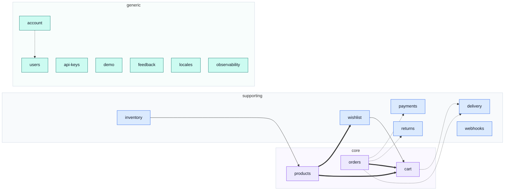

# Modules

One page per domain, top to bottom. This is the **vertical** cut through the codebase; the rest of
this site is the horizontal one.

::: tip Which section answers which question

| You want                                          | Read                   |
| ------------------------------------------------- | ---------------------- |
| What a module _is_, and the rules every one obeys | [Theory](../theory/)   |
| What **this** domain does, end to end             | a page in this section |
| How a mechanism works, in general                 | [Tools](../tools/)     |
| The contract-first workflow                       | [API](../api/)         |
| "I landed on a filename"                          | [Files](../reference/) |
| :::                                               |

The division is one rule: **a horizontal page owns a mechanism, a module page owns a decision.**
[State & Routing](../tools/state-and-routing.md) explains what a Pinia store is; the
[`cart`](./cart.md) page lists what its store holds and links back. Neither says the other's half.

The test that keeps it honest is the one this architecture is already built on — delete
`src/modules/cart/` and exactly one page in this site dies with it. Every other page loses a link and
nothing else.

::: warning Read every page with one caveat
**This application owns almost none of the domain it displays.** Totals, eligibility, availability
and permissions are all decided server-side. A page here describes the screens, the state and the
client-side rules of a domain — the reasoning behind the rules lives in the
[paired backend's module pages](../theory/domain-layer.md).
:::

## The whole map

```mermaid
%%{init: {'flowchart': {'nodeSpacing': 30, 'rankSpacing': 80}}}%%
flowchart LR
    subgraph CORE["core"]
        direction TB
        cart["cart"]
        orders["orders"]
        products["products"]
    end
    subgraph SUPPORTING["supporting"]
        direction TB
        delivery["delivery"]
        inventory["inventory"]
        payments["payments"]
        returns["returns"]
        webhooks["webhooks"]
        wishlist["wishlist"]
    end
    subgraph GENERIC["generic"]
        direction TB
        account["account"]
        apiKeys["api-keys"]
        demo["demo"]
        feedback["feedback"]
        locales["locales"]
        observability["observability"]
        users["users"]
    end
    account -.-> users
    cart -.-> delivery
    inventory --> products
    orders ==> cart
    orders -.-> delivery
    orders -.-> payments
    orders -.-> returns
    products ==> cart
    products ==> wishlist
    wishlist --> cart

    classDef core fill:#ede9fe,stroke:#7c3aed,color:#111827;
    classDef supporting fill:#dbeafe,stroke:#2563eb,color:#111827;
    classDef generic fill:#ccfbf1,stroke:#0f766e,color:#111827;
    class cart,orders,products core;
    class delivery,inventory,payments,returns,webhooks,wishlist supporting;
    class account,apiKeys,demo,feedback,locales,observability,users generic;
    style CORE fill:#faf8ff,stroke:#cbd5e1
    style SUPPORTING fill:#f8fafc,stroke:#cbd5e1
    style GENERIC fill:#f8fdfc,stroke:#cbd5e1
```

## Reading the diagrams

Every diagram in this section encodes two things and only two, so a map is readable without a key
beside it.

**Node fill — where the domain sits in the business.**

| Fill      | Subdomain    | What it means                                                                                                                                           |
| --------- | ------------ | ------------------------------------------------------------------------------------------------------------------------------------------------------- |
| 🟪 violet | `core`       | The reason the product exists. Worth its own client-side rules.                                                                                         |
| 🟦 blue   | `supporting` | Specific to this business but not a differentiator. Kept plain.                                                                                         |
| 🟩 teal   | `generic`    | A solved problem. Modelling effort here is waste — a `domain/` folder inside one is a rule of thumb this codebase asks a reviewer to catch, not a spec. |

::: warning Read `core` with one caveat, on a client
This application owns almost none of the domain it displays. Prices, totals, eligibility and
permissions are all decided server-side, so `core` here marks **where the screens and the
client-side rules are load-bearing**, not where the business logic lives.
:::

**Arrow style — what kind of relationship the edge is.**

| Arrow         | Relationship         | What crosses the edge                                                                                                     |
| ------------- | -------------------- | ------------------------------------------------------------------------------------------------------------------------- |
| `-->` thin    | `conformist`         | Reads another module’s store as it is, with no translation and no say in its shape.                                       |
| `==>` thick   | `customer-supplier`  | Calls a sibling’s store to make something happen, and that sibling’s surface is shaped by the demand.                     |
| `-.->` dashed | `published-language` | Receives vocabulary rather than state — a Zod schema, a pure function, or a self-contained component. The strongest edge. |

::: info `shared-kernel` is absent, and that is a finding
The backend has one: `account → users`, because both write the same User record. Here the same
pair is `published-language`, because this client shares only the validation vocabulary and the
server remains the single writer. That divergence is what
[Domain layer](../theory/domain-layer.md) means by the domain living behind the API.
:::

Every diagram under `/modules/` uses this and only this.

## Every module

The shape of the client in one row, then one row per domain. Both are maintained by hand, so a module
that gains a screen or a store gains it here when someone adds it.

Two rows are worth noticing before you read any page: [`delivery`](./delivery.md) and
[`payments`](./payments.md) have **no screens at all** — their published surface is a component
another module mounts.

**Group** is a second, independent axis from Subdomain: `foundation` ships with every deployment,
`shop` is the removable pet-supply demo domain (`npm run demo:remove`). It mirrors the paired
backend's own per-module `group` field. `scripts/module-groups.ts` holds the same map in code, and
`eslint.config.ts` refuses a `foundation` module importing a `shop` one.

| Modules | core | supporting | generic | Screens | Stores | Context edges |
| ------- | ---- | ---------- | ------- | ------- | ------ | ------------- |
| 16      | 3    | 6          | 7       | 40      | 16     | 10            |

| Module                                | Subdomain    | Group        | Screens | Store                    | API calls | Depends on | Depended on by |
| ------------------------------------- | ------------ | ------------ | ------- | ------------------------ | --------- | ---------- | -------------- |
| [`account`](./account.md)             | `generic`    | `foundation` | 8       | `account`                | 18        | 1          | 0              |
| [`api-keys`](./api-keys.md)           | `generic`    | `foundation` | 2       | `api-keys`               | 3         | 0          | 0              |
| [`cart`](./cart.md)                   | `core`       | `shop`       | 1       | `cart`                   | 8         | 1          | 3              |
| [`delivery`](./delivery.md)           | `supporting` | `shop`       | 0       | `delivery`               | 3         | 0          | 2              |
| [`demo`](./demo.md)                   | `generic`    | `foundation` | 1       | `counter`                | 0         | 0          | 0              |
| [`feedback`](./feedback.md)           | `generic`    | `foundation` | 2       | `feedback`               | 3         | 0          | 0              |
| [`inventory`](./inventory.md)         | `supporting` | `shop`       | 1       | `inventory`              | 5         | 1          | 0              |
| [`locales`](./locales.md)             | `generic`    | `foundation` | 3       | `locales`                | 9         | 0          | 0              |
| [`observability`](./observability.md) | `generic`    | `foundation` | 3       | `realtime-observability` | 5         | 0          | 0              |
| [`orders`](./orders.md)               | `core`       | `shop`       | 3       | `orders`                 | 11        | 4          | 0              |
| [`payments`](./payments.md)           | `supporting` | `shop`       | 0       | `payments`               | 4         | 0          | 1              |
| [`products`](./products.md)           | `core`       | `shop`       | 4       | `products`               | 10        | 2          | 1              |
| [`returns`](./returns.md)             | `supporting` | `shop`       | 2       | `returns`                | 6         | 0          | 1              |
| [`users`](./users.md)                 | `generic`    | `foundation` | 4       | `users`                  | 9         | 0          | 1              |
| [`webhooks`](./webhooks.md)           | `supporting` | `foundation` | 5       | `webhooks`               | 7         | 0          | 0              |
| [`wishlist`](./wishlist.md)           | `supporting` | `shop`       | 1       | `wishlist`               | 4         | 1          | 1              |

## The two repositories

Most domains exist on both sides under the same name. **The three that do not are the
interesting ones**, and until this table the asymmetry was written down nowhere in either repository:
[`account`](./account.md) folds the address book and the account of record into one module,
[`observability`](./observability.md) renders three backend domains over one console and playground,
and [`demo`](./demo.md) has no backend domain at all.

`tests/cross-cutting/backend-pairing.spec.ts` holds the same table in code and fails when an enabled
module has no entry, or when an entry pairs with something other than its own name and gives no
reason. The gap cannot widen quietly — though keeping the table below in step with it is a review
job, not a checked one.

| This repository                       | boilerplate-node-backend                   | Note                                                                                                                                                                                                                     |
| ------------------------------------- | ------------------------------------------ | ------------------------------------------------------------------------------------------------------------------------------------------------------------------------------------------------------------------------ |
| [`account`](./account.md)             | `account` + `addresses` + `users`          | The address book lives inside this module as `AddressPicker`, and it reads `users` for the account of record — the backend keeps both a separate domain.                                                                 |
| [`api-keys`](./api-keys.md)           | `api-keys`                                 | —                                                                                                                                                                                                                        |
| [`cart`](./cart.md)                   | `cart`                                     | —                                                                                                                                                                                                                        |
| [`delivery`](./delivery.md)           | `delivery`                                 | —                                                                                                                                                                                                                        |
| [`demo`](./demo.md)                   | _none_                                     | A client-side showcase of the shared UI kit. It pairs with the demo profile and the seeded dataset rather than with any backend domain.                                                                                  |
| [`feedback`](./feedback.md)           | `feedback`                                 | —                                                                                                                                                                                                                        |
| [`inventory`](./inventory.md)         | `inventory`                                | —                                                                                                                                                                                                                        |
| [`locales`](./locales.md)             | `locales`                                  | —                                                                                                                                                                                                                        |
| [`observability`](./observability.md) | `observability` + `audit-logs` + `account` | One set of screens over three backend domains: `observability` serves health, the metrics overview and the SSE stream, `audit-logs` owns the trail behind the audit table, and the token-purge action reaches `account`. |
| [`orders`](./orders.md)               | `orders`                                   | —                                                                                                                                                                                                                        |
| [`payments`](./payments.md)           | `payments`                                 | —                                                                                                                                                                                                                        |
| [`products`](./products.md)           | `products`                                 | —                                                                                                                                                                                                                        |
| [`returns`](./returns.md)             | `returns`                                  | —                                                                                                                                                                                                                        |
| [`users`](./users.md)                 | `users`                                    | —                                                                                                                                                                                                                        |
| [`webhooks`](./webhooks.md)           | `webhooks`                                 | —                                                                                                                                                                                                                        |
| [`wishlist`](./wishlist.md)           | `wishlist`                                 | —                                                                                                                                                                                                                        |
