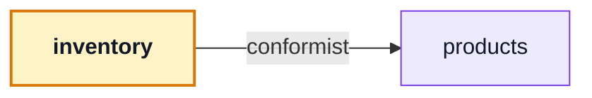

# inventory

::: tip At a glance
**Owns** — the admin stock board and the ledger behind it.
**Depends on** — [`products`](./products.md), read as-is, to put names on rows.
**Breaks if you change** — nothing outside this folder. No module depends on it.
:::

| Fact                    | This module                                                                    |
| ----------------------- | ------------------------------------------------------------------------------ |
| **Subdomain**           | `supporting` — Specific to this business but not a differentiator. Kept plain. |
| **Screens**             | 1 — `InventoryLedger`                                                          |
| **Store**               | `inventory`                                                                    |
| **Menu entries**        | `InventoryLedger`                                                              |
| **API calls**           | 5                                                                              |
| **Depends on**          | [`products`](./products.md)                                                    |
| **Depended on by**      | _nothing_                                                                      |
| **Languages**           | `en` · `it`                                                                    |
| **Publishes**           | _nothing_ — no barrel, so no sibling may import it                             |
| **Backend counterpart** | `inventory` in `boilerplate-node-backend`                                      |

## The map



- → `products` **conformist** — Reads `useProductsStore` as it is, to name products in the receipt select and the ledger titles.

## The story

One admin screen over two backend collections: the board that shows both counters and their derived
availability, and the ledger that explains every move.

The dependency is as thin as a dependency gets. The page names products — the receipt select, the
title lookup — by reading `useProductsStore` **as it is**, with no translation and no say in its
shape. That is `conformist`, and it is the same one-way arrow the backend's `inventory` module
declares against its own `products`.

::: tip What deleting this module costs, precisely
The board and the ledger view go. **Every shelf count stays correct** — the counters and the
movements live server-side and keep being written — but every _why_ goes unrecorded as far as anyone
in this app can see.

That is a clean removal: the data is not this module's, only the window onto it.
:::

Both reads page, and neither is bounded client-side. The ledger is the record an audit works
through, so a view showing only the newest rows would misreport history as complete. The board sorts
on availability, which is derived rather than stored, so the server does that sort in an aggregation
rather than this client loading the catalogue to sort in memory.

## State

Store `inventory`, from `store.ts`. Only what the setup function returns is listed — an internal ref is not part of the surface.

| Kind        | Members                                                           | What it is                                                       |
| ----------- | ----------------------------------------------------------------- | ---------------------------------------------------------------- |
| **State**   | `movements` · `movementsTotal` · `levels` · `levelsTotal`         | The refs the setup function returns — the only writable surface. |
| **Getters** | `loading`                                                         | Computed, derived from state. Read-only by construction.         |
| **Actions** | `fetchMovements` · `fetchLevels` · `receive` · `adjust` · `sweep` | Everything that changes state or calls the API.                  |

## Screens

| Path        | Route name        | Access  | View                        |
| ----------- | ----------------- | ------- | --------------------------- |
| `inventory` | `InventoryLedger` | `admin` | `views/InventoryLedger.vue` |

Paths are relative to the localised root, so `cart` is served at `/:locale/cart`. **Access** is the route’s own `meta.access` — a menu entry never restates it, which is what keeps the menu and the router from disagreeing.

## Wiring

#### Endpoints called

| Call                                 | Response envelope             |
| ------------------------------------ | ----------------------------- |
| `POST /inventory/adjustments`        | `AdjustStockResponse`         |
| `GET /inventory/levels(\?.*)?`       | `ListInventoryLevelsResponse` |
| `GET /inventory/movements(\?.*)?`    | `ListStockMovementsResponse`  |
| `POST /inventory/receipts`           | `ReceiveStockResponse`        |
| `POST /inventory/reservations/sweep` | `SweepReservationsResponse`   |

Each row registers one Zod envelope through the manifest, so enabling the domain turns its contract validation on and deleting the folder turns it off.

#### Navigation entries

| Route             | Label key                    | Section | Order | Icon | Badge |
| ----------------- | ---------------------------- | ------- | ----- | ---- | ----- |
| `InventoryLedger` | `navigation.label-inventory` | `admin` | 47    | yes  | —     |

## Files

| File                                           | What it is                                                                                                                                                  | Explained in                          |
| ---------------------------------------------- | ----------------------------------------------------------------------------------------------------------------------------------------------------------- | ------------------------------------- |
| `locales/en.json`                              | This domain’s translation dictionary for one language, loaded as its own chunk.                                                                             | [read](../tools/i18n.md)              |
| `locales/it.json`                              | This domain’s translation dictionary for one language, loaded as its own chunk.                                                                             | [read](../tools/i18n.md)              |
| `module.ts`                                    | The manifest — the only file the application loads directly. Declares the name, routes, navigation entries, response schemas, dependency edges and locales. | [read](../theory/modules.md)          |
| `response-schemas.ts`                          | One row per endpoint this domain calls, pairing a method and path pattern with the Zod envelope its response is validated against.                          | [read](../api/openapi-workflow.md)    |
| `routes.ts`                                    | The domain’s route records, spliced into the localised route tree. Each carries its own `meta.access`.                                                      | [read](../theory/sitemap.md)          |
| `store.ts`                                     | The Pinia store: this domain’s state, and every call it makes to the generated client.                                                                      | [read](../tools/state-and-routing.md) |
| `tests/e2e/__snapshots__/inventory-ledger.png` | A committed visual-regression baseline.                                                                                                                     | [read](../tools/visual-regression.md) |
| `tests/e2e/a11y.cy.ts`                         | Cypress suite — the screens, in a browser.                                                                                                                  | [read](../tools/component-testing.md) |
| `tests/e2e/inventory.visual.cy.ts`             | Cypress suite — the screens, in a browser.                                                                                                                  | [read](../tools/component-testing.md) |
| `tests/store.spec.ts`                          | Vitest suite — the store, the routes and the rules, in isolation.                                                                                           | [read](../tools/unit-testing.md)      |
| `views/InventoryLedger.vue`                    | A routed screen. Reads its store, renders, and holds no fetching logic of its own.                                                                          | [read](../theory/layers.md)           |

## Working on it

| Suite            | Files | Where                                            |
| ---------------- | ----- | ------------------------------------------------ |
| Vitest           | 1     | `src/modules/inventory/tests/`                   |
| Cypress          | 2     | `src/modules/inventory/tests/e2e/`               |
| Visual baselines | 1     | `src/modules/inventory/tests/e2e/__snapshots__/` |

```bash
# this module's vitest suites
npm run test:unit -- inventory

# this module's cypress suites
npm run test:e2e -- --spec 'src/modules/inventory/tests/e2e/*.cy.ts'

# after the backend changes an endpoint this module calls
npm run regenerate
```

## Deeper in

Nothing in this domain needs a page of its own — the story above is the whole of it.

## Related pages

- [`products`](./products.md) — the store this module reads
- [Sitemap & Access Control](../theory/sitemap.md) — the `admin` gate
- [State & Routing](../tools/state-and-routing.md) — paging through a store
- [Modules overview](./index.md) — the whole context map
