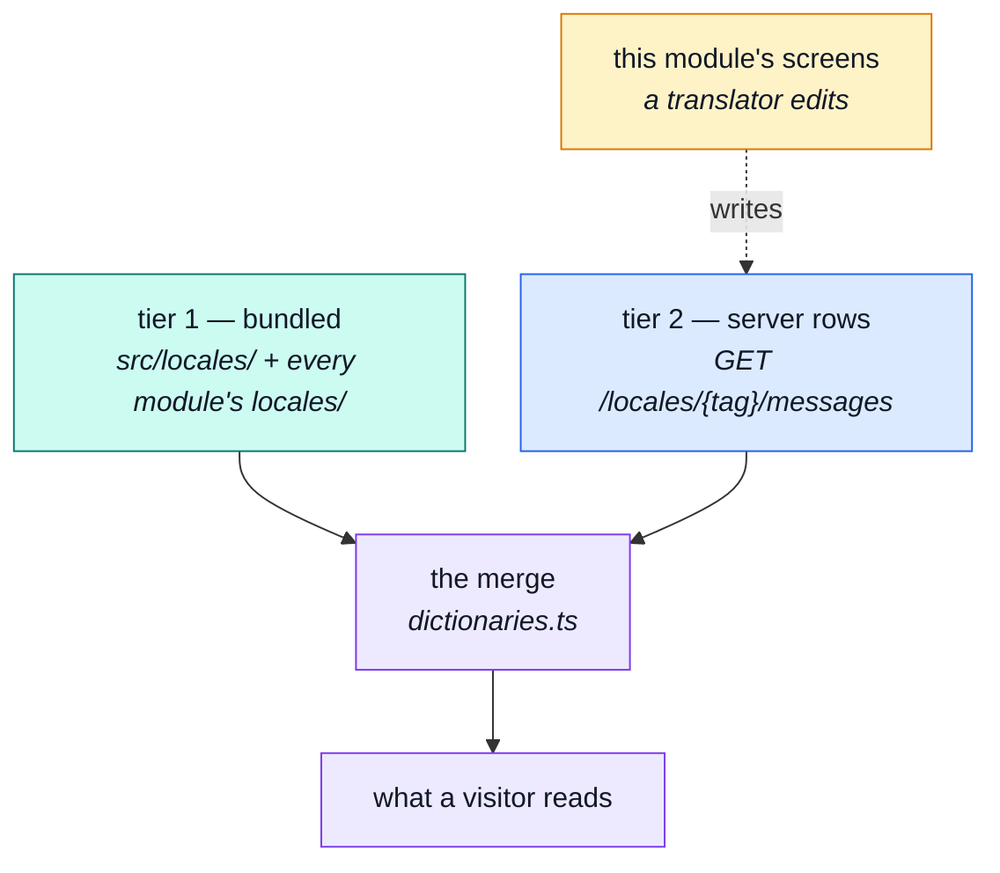

# Runtime overrides

Two tiers of translation, and the rule that keeps them from merging into one.

::: tip At a glance
**Tier 1** — what the app bundles. Always present, never editable at runtime.
**Tier 2** — what a translator edited. Optional, per key, layered on top.
**Breaks if you change** — the merge direction. Overrides patch keys; they never introduce them.
:::

## The split

**Tier 1 ships with the build.** Every module contributes a `locales/<code>.json`, loaded as its own
chunk so a visitor downloads one language for the enabled domains only. It is what renders when
nothing else is available — including when the API is unreachable, which is the outage a fallback
exists for.

**Tier 2 is edited at runtime** by people who do not open a code editor. It arrives from
`GET /locales/{tag}/messages` and is merged over tier 1 **key by key**.

::: warning An override patches a key; it never introduces one
Neither tier may add a key the bundled files do not already define and expect it to render. **The
files decide what exists; the rows decide what it says.**

Drop that rule and a translator can create a key the code never reads, which renders nowhere and
looks like a bug in the app rather than a misunderstanding of the tool.
:::

Key-by-key merging is what makes a half-translated language useful: an unedited key keeps its bundled
text, and a language the client does not ship at all falls back per key for whatever nobody has
translated yet.

## Author and consumer are different halves

| Half | Where | Needed by |
| --- | --- | --- |
| **Consumer** | `infrastructure/i18n/locale-overrides.ts` | every visitor, on every page |
| **Author** | this module's two screens | an admin, occasionally |

::: tip Which is why deleting this module costs so little
The two admin screens go. **Every language already translated keeps rendering**, because rendering
runs through the consumer half, which sits in `infrastructure` and knows nothing about this folder.

The two reads this module shares with the boot path — `GET /locales` and
`GET /locales/{tag}/messages` — stay registered down there for exactly that reason.
:::

## The trap: existing is not the same as answerable

A language row in the database does **not** mean the API can answer in that language. Server copy
comes from files on the server, and a language with no file behind it has no API-side dictionary.

`GET /locales` therefore reports **scopes** per language rather than a bare list of tags, so two
questions stay separate:

| Question | Answered by |
| --- | --- |
| May I request this language from the API? | the `api` scope |
| May I download an app dictionary for it? | the `app` scope |

The seeded dataset registers `es` with no server-side file behind it precisely so both answers are
reachable in the demo — *no* to the first, *yes* to the second.

## The screens

`LocalesList` manages the languages themselves; `LocaleEntries` manages the rows inside one. Three
dialogs sit behind them, including an import that merges a batch of entries in one call
(`PATCH /locales/{id}/entries`) rather than one request per key.

Both routes are `admin`. Editing what an application says to everyone is not a self-service action.

## Related pages

- [`locales`](./locales.md) — the module this belongs to
- [Internationalisation](../tools/i18n.md) — the mechanism both tiers run on
- [Layers](../theory/layers.md) — why the consumer half sits below modules
- [Demo profile](../tools/demo-profile.md) — the seeded languages and what each demonstrates
