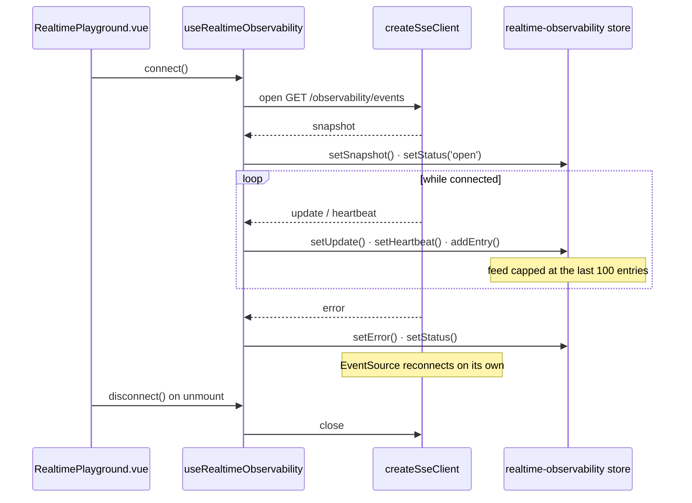

# observability

::: tip At a glance
**Owns** — the observability console (service health, KPIs, the platform's own audit log), the
shop's own audit trail, and the realtime SSE playground over the same metrics stream.
**Depends on** — nothing. It reads the observability endpoints directly.
**Breaks if you change** — nothing outside this folder. It is designed to be deleted.
:::

| Fact                    | This module                                                                                                                                                                                                                                                                                         |
| ----------------------- | --------------------------------------------------------------------------------------------------------------------------------------------------------------------------------------------------------------------------------------------------------------------------------------------------- |
| **Subdomain**           | `generic` — A solved problem. Modelling effort here would be waste.                                                                                                                                                                                                                                 |
| **Screens**             | 3 — `Admin`, `AuditLog`, `RealtimePlayground`                                                                                                                                                                                                                                                       |
| **Store**               | `realtime-observability` — the playground's SSE state. The console and the audit trail hold none of their own.                                                                                                                                                                                      |
| **Menu entries**        | `RealtimePlayground` · `Admin` · `AuditLog`                                                                                                                                                                                                                                                         |
| **API calls**           | 5                                                                                                                                                                                                                                                                                                   |
| **Depends on**          | _nothing_                                                                                                                                                                                                                                                                                           |
| **Depended on by**      | _nothing_                                                                                                                                                                                                                                                                                           |
| **Languages**           | `en` · `it`                                                                                                                                                                                                                                                                                         |
| **Publishes**           | _nothing_ — no barrel, so no sibling may import it                                                                                                                                                                                                                                                  |
| **Backend counterpart** | `observability` + `audit-logs` + `account` in `boilerplate-node-backend` — one set of screens over three backend domains: `observability` serves health, the metrics overview and the SSE stream, `audit-logs` owns the trail behind its audit table, and the token-purge action reaches `account`. |

::: info Stands alone
No module depends on this one and it depends on none. Deleting the folder and its line in `src/modules.ts` costs nothing else.
:::

## The map

`observability` sits on no edge of the context map — nothing imports it and it imports nothing.

## The story

Three screens over **three backend modules**, which is the clearest asymmetry in the pairing
table: `observability` serves health, the metrics overview and the SSE stream, `audit-logs` owns
the trail behind the audit table, and the token-purge action reaches `account`. None of the three
has a frontend module of its own beyond this one, and this one has no backend module of its own.

It depends on nothing, and reads the observability endpoints directly rather than through any
other domain's store.

::: tip That is deliberate, and the reason is blunt
**This is the first thing a downstream project without an ops dashboard deletes.** So it was built to
cost nothing on the way out: `rm -rf` the folder, drop one line of `src/modules.ts`, and nothing else
in the client notices.

A console that reached into three domains' stores to render its KPIs would not have that property.
:::

`types.ts` exists here and in no other module: the dashboard and the playground assemble shapes
that no single endpoint answers with, and those live beside the composable/store that build them
rather than in the generated types, which only describe what the API actually returns.

The audit table is a read of somebody else's collection, and this client never writes to it. Every
row it shows was written server-side by a module that had no idea a dashboard existed.

**Two of the five registered endpoints are never called through the response-schema map.**
`GET /observability/events` is validated at the SSE layer instead — it feeds the realtime
playground below, not a JSON-envelope read. `GET /observability/metrics` is different in kind: its
own contract description says to use `.../metrics/overview` for a JSON summary, and it answers in
Prometheus text format — it is Prometheus's own scrape target
(`boilerplate-node-backend/docker/observability/prometheus.config.yaml`), not an endpoint any
browser client should ever call. Both stay registered in `response-schemas.ts` regardless: the row
costs nothing sitting unused.

### The realtime playground

One screen, one composable and one store — `RealtimePlayground.vue`,
`use-realtime-observability.ts` and `store.ts`. The screen renders the feed itself; there is no
dedicated `components/` entry for it.

The split between the composable and the store is the thing worth understanding. The **composable
owns the connection** — a module-level `activeClient` singleton, so re-mounting the screen never
opens a second stream — and it owns the routing: each typed event is dispatched to one store
action. The **store owns the state** and nothing else: status, the two latest payload shapes kept
apart, the last heartbeat, the last error, and a feed capped at the last 100 entries so a
long-lived stream cannot grow without bound. Pure refs plus setters, with no fetching of its own.



**The transport is not part of this module.** `createSseClient` is a typed wrapper over
`EventSource` that knows no domain, so it lives in `infrastructure`. What is here is the screen,
the typed subscription and the feed.

::: tip The types come from a contract, not from a hand-written interface
`asyncapi.yaml` describes the event names and payload shapes, and
`contracts/asyncapi.generated.ts` is generated from it. A payload this module misreads is a build
error rather than an empty panel.
:::

The playground route needs `['read', 'ObservabilitySnapshot']` — a PLATFORM key, so a shop's own
unrestricted role cannot reach it and a platform operator can. A live metrics feed is an
operator's tool, and the route's `meta.can` is the only place that is declared.

## State

Store `realtime-observability`, from `store.ts` — the playground's only. The console and the
audit trail hold no store of their own; whatever else these screens read belongs to a module they
depend on, or to the app-wide stores in `src/infrastructure/`.

| Kind        | Members                                                                                      | What it is                                                       |
| ----------- | -------------------------------------------------------------------------------------------- | ---------------------------------------------------------------- |
| **State**   | `status` · `latestSnapshot` · `latestUpdate` · `latestHeartbeatAt` · `entries` · `lastError` | The refs the setup function returns — the only writable surface. |
| **Getters** | —                                                                                            | Computed, derived from state. Read-only by construction.         |
| **Actions** | `setStatus` · `setSnapshot` · `setUpdate` · `setHeartbeat` · `addEntry` · `setError`         | Everything that changes state or calls the API.                  |

## Screens

| Path                  | Route name           | Access | Permission                   | View                           |
| --------------------- | -------------------- | ------ | ---------------------------- | ------------------------------ |
| `admin`               | `Admin`              | `auth` | `read ObservabilitySnapshot` | `views/Admin.vue`              |
| `audit`               | `AuditLog`           | `auth` | `read AuditLog`              | `views/AuditLog.vue`           |
| `playground/realtime` | `RealtimePlayground` | `auth` | `read ObservabilitySnapshot` | `views/RealtimePlayground.vue` |

Paths are relative to the localised root, so `cart` is served at `/:locale/cart`. **Access** is the route’s own `meta.access` (the standing it needs) and **Permission** its `meta.can` — the `[action, subject]` rule checked against the caller's own rules from `GET /account/abilities`. A menu entry restates neither, which is what keeps the menu and the router from disagreeing. See [Security](../tools/security.md#route-guards).

## Wiring

#### Endpoints called

| Call                                  | Response envelope                         |
| ------------------------------------- | ----------------------------------------- |
| `GET /observability/audit`            | `GetObservabilityAuditLogsResponse`       |
| `GET /observability/events`           | `GetObservabilityEventsResponse`          |
| `GET /observability/health`           | `GetObservabilityHealthResponse`          |
| `GET /observability/metrics`          | `GetObservabilityMetricsResponse`         |
| `GET /observability/metrics/overview` | `GetObservabilityMetricsOverviewResponse` |

Each row registers one Zod envelope through the manifest, so enabling the domain turns its contract validation on and deleting the folder turns it off.

#### Navigation entries

| Route                | Label key                    | Section | Order | Icon | Badge |
| -------------------- | ---------------------------- | ------- | ----- | ---- | ----- |
| `RealtimePlayground` | `navigation.label-realtime`  | `admin` | 30    | yes  | —     |
| `Admin`              | `navigation.label-admin`     | `admin` | 40    | yes  | —     |
| `AuditLog`           | `navigation.label-audit-log` | `admin` | 41    | yes  | —     |

## Files

| File                                              | What it is                                                                                                                                                                                        | Explained in                          |
| ------------------------------------------------- | ------------------------------------------------------------------------------------------------------------------------------------------------------------------------------------------------- | ------------------------------------- |
| `components/AdminAuditTab.vue`                    | A component this domain owns. Published through the barrel when a sibling mounts it, internal otherwise.                                                                                          | [read](../theory/layers.md)           |
| `components/AdminOverviewTab.vue`                 | A component this domain owns. Published through the barrel when a sibling mounts it, internal otherwise.                                                                                          | [read](../theory/layers.md)           |
| `composables/use-admin-observability.ts`          | Reusable reactive logic for this domain — the tier between a store and a component.                                                                                                               | [read](../theory/layers.md)           |
| `composables/use-audit-trail.ts`                  | Reusable reactive logic for this domain — the tier between a store and a component.                                                                                                               | [read](../theory/layers.md)           |
| `locales/en.json`                                 | This domain’s translation dictionary for one language, loaded as its own chunk.                                                                                                                   | [read](../tools/i18n.md)              |
| `locales/it.json`                                 | This domain’s translation dictionary for one language, loaded as its own chunk.                                                                                                                   | [read](../tools/i18n.md)              |
| `module.ts`                                       | The manifest — the only file the application loads directly. Declares the name, routes, navigation entries, response schemas and locales, plus the optional loading keys, slots and locale reset. | [read](../theory/modules.md)          |
| `response-schemas.ts`                             | One row per endpoint this domain calls, pairing a method and path pattern with the Zod envelope its response is validated against.                                                                | [read](../api/openapi-workflow.md)    |
| `routes.ts`                                       | The domain’s route records, spliced into the localised route tree. Each carries its own `meta.access`.                                                                                            | [read](../theory/sitemap.md)          |
| `store.ts`                                        | The Pinia store: this domain’s state, and every call it makes to the generated client.                                                                                                            | [read](../tools/state-and-routing.md) |
| `tests/e2e/__snapshots__/admin-dashboard.png`     | A committed visual-regression baseline.                                                                                                                                                           | [read](../tools/visual-regression.md) |
| `tests/e2e/__snapshots__/realtime-playground.png` | A committed visual-regression baseline.                                                                                                                                                           | [read](../tools/visual-regression.md) |
| `tests/e2e/a11y.cy.ts`                            | Cypress accessibility sweep — an axe run over this domain's routes, at each authentication level.                                                                                                 | [read](../tools/component-testing.md) |
| `tests/e2e/admin.visual.cy.ts`                    | Cypress visual suite — pixel diffs against the committed baselines.                                                                                                                               | [read](../tools/component-testing.md) |
| `tests/e2e/realtime.cy.ts`                        | Cypress suite — the screens, in a browser.                                                                                                                                                        | [read](../tools/component-testing.md) |
| `tests/e2e/realtime.visual.cy.ts`                 | Cypress visual suite — pixel diffs against the committed baselines.                                                                                                                               | [read](../tools/component-testing.md) |
| `tests/routes.spec.ts`                            | Vitest suite — the route records and the `meta.access` each one declares.                                                                                                                         | [read](../tools/unit-testing.md)      |
| `tests/store.spec.ts`                             | Vitest suite — this domain's store, with the transport mocked.                                                                                                                                    | [read](../tools/unit-testing.md)      |
| `tests/use-admin-observability.spec.ts`           | Vitest suite — the `useAdminObservability` composable, in isolation.                                                                                                                              | [read](../tools/unit-testing.md)      |
| `tests/use-audit-trail.spec.ts`                   | Vitest suite — the `useAuditTrail` composable, in isolation.                                                                                                                                      | [read](../tools/unit-testing.md)      |
| `tests/use-realtime-observability.spec.ts`        | Vitest suite — the `useRealtimeObservability` composable, in isolation.                                                                                                                           | [read](../tools/unit-testing.md)      |
| `types.ts`                                        | `observability` only. The shapes the dashboard and the playground assemble that no endpoint answers with.                                                                                         | [read](../tools/admin-dashboard.md)   |
| `use-realtime-observability.ts`                   | `observability` only. The composable a screen uses to subscribe to that stream and unsubscribe on unmount.                                                                                        | [read](../tools/realtime.md)          |
| `views/Admin.vue`                                 | A routed screen. Reads its store, renders, and holds no fetching logic of its own.                                                                                                                | [read](../theory/layers.md)           |
| `views/AuditLog.vue`                              | A routed screen. Reads its store, renders, and holds no fetching logic of its own.                                                                                                                | [read](../theory/layers.md)           |
| `views/RealtimePlayground.vue`                    | A routed screen. Reads its store, renders, and holds no fetching logic of its own.                                                                                                                | [read](../theory/layers.md)           |

## Working on it

| Suite            | Files | Where                                                |
| ---------------- | ----- | ---------------------------------------------------- |
| Vitest           | 5     | `src/modules/observability/tests/`                   |
| Cypress          | 4     | `src/modules/observability/tests/e2e/`               |
| Visual baselines | 2     | `src/modules/observability/tests/e2e/__snapshots__/` |

```bash
# this module's vitest suites
npm run test:unit -- observability

# this module's cypress suites
npm run test:e2e -- --spec 'src/modules/observability/tests/e2e/*.cy.ts'

# after the backend changes an endpoint this module calls
npm run regenerate
```

## Deeper in

- [The dashboard](./observability-dashboard.md)

## Related pages

- [The dashboard](./observability-dashboard.md) — what the console assembles, and from where
- [Admin Dashboard](../tools/admin-dashboard.md) — the mechanism behind the panels
- [Realtime](../tools/realtime.md) — the SSE client and its reconnection behaviour
- [Observability](../tools/observability.md) — what is measured, and by whom
- [Observability Endpoints](../api/observability.md) — the contract for the reads
- [AsyncAPI Workflow](../api/asyncapi-workflow.md) — where the event types come from
- [Sitemap & Access Control](../theory/sitemap.md) — the `admin` gate on these screens
