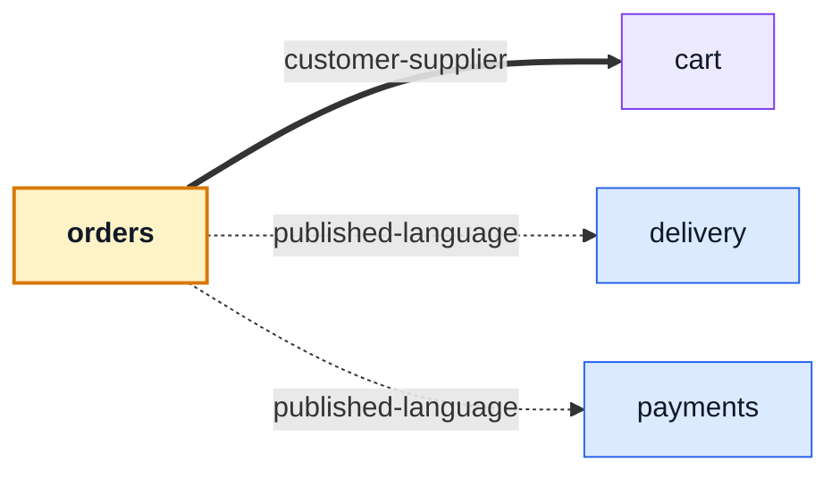

# orders

::: tip At a glance
**Owns** — a customer's order history, the detail screen, and the admin status edit.
**Depends on** — three modules, and two of those are components it mounts rather than state it reads.
**Breaks if you change** — nothing outside this folder. No module depends on it.
:::

| Fact                    | This module                                                                     |
| ----------------------- | ------------------------------------------------------------------------------- |
| **Subdomain**           | `core` — The reason the product exists. Worth its own client-side rules.        |
| **Screens**             | 3 — `OrdersList` · `OrderTarget` · `OrderEdit`                                  |
| **Store**               | `orders`                                                                        |
| **Menu entries**        | `OrdersList`                                                                    |
| **API calls**           | 11                                                                              |
| **Depends on**          | [`cart`](./cart.md) · [`delivery`](./delivery.md) · [`payments`](./payments.md) |
| **Depended on by**      | _nothing_                                                                       |
| **Languages**           | `en` · `it`                                                                     |
| **Publishes**           | _nothing_ — no barrel, so no sibling may import it                              |
| **Backend counterpart** | `orders` in `boilerplate-node-backend`                                          |

## The map



- → `cart` **customer-supplier** — The reorder button asks the cart store to refill itself from a past order.
- → `delivery` **published-language** — Mounts `ShipmentPanel`; the parcel renders itself and this module never touches a shipment.
- → `payments` **published-language** — Mounts `PaymentPanel`; paying happens on the order page without this module knowing a provider exists.

## The story

The order page is the most composed screen in the application, and it is composed out of other
people's components. Two of its three edges are `published-language`:

| Mounted         | From                        | What this module learns                                  |
| --------------- | --------------------------- | -------------------------------------------------------- |
| `PaymentPanel`  | [`payments`](./payments.md) | nothing — not that a provider exists, not what a card is |
| `ShipmentPanel` | [`delivery`](./delivery.md) | nothing — not what a tracking code is                    |

That is the strongest kind of edge on the map: neither side touches the other's store. The panels
render their own concern, fetch their own data, and this module holds the layout around them.

::: tip The third edge runs against the server's arrow, deliberately
Reaching into `cart` is the **reorder button** — the order page refills the visitor's cart through
the cart barrel. On the server the arrow points the other way, because a checkout creates an order.

Both are correct. A module's imports are what it depends on, and the import here is
order-page → cart store.
:::

Reads are scoped: a customer sees only their own orders, an admin reaches all of them through the
write screens. That scoping is enforced server-side — this client renders whatever the endpoint
answers, which is what [Domain layer](../theory/domain-layer.md) means by the domain living behind
the API.

## State

Store `orders`, from `store.ts`. Only what the setup function returns is listed — an internal ref is not part of the surface.

| Kind        | Members                                                                                                                                                                                                          | What it is                                                       |
| ----------- | ---------------------------------------------------------------------------------------------------------------------------------------------------------------------------------------------------------------- | ---------------------------------------------------------------- |
| **State**   | `orders` · `selectedOrderId` · `filters` · `pageCurrent` · `pageSize`                                                                                                                                            | The refs the setup function returns — the only writable surface. |
| **Getters** | `ordersList` · `currentOrder` · `loading` · `pageTotal` · `pageItemList`                                                                                                                                         | Computed, derived from state. Read-only by construction.         |
| **Actions** | `addOrder` · `fetchOrders` · `fetchPaginationOrders` · `watchSearchOrders` · `fetchOrder` · `watchOrder` · `createOrder` · `updateOrder` · `deleteOrder` · `cancelOrder` · `hardDeleteOrder` · `downloadInvoice` | Everything that changes state or calls the API.                  |

## Screens

| Path              | Route name    | Access  | View                   |
| ----------------- | ------------- | ------- | ---------------------- |
| `orders`          | `OrdersList`  | `auth`  | `views/OrdersList.vue` |
| `orders/:id`      | `OrderTarget` | `auth`  | `views/Order.vue`      |
| `orders/:id/edit` | `OrderEdit`   | `admin` | `views/OrderEdit.vue`  |

Paths are relative to the localised root, so `cart` is served at `/:locale/cart`. **Access** is the route’s own `meta.access` — a menu entry never restates it, which is what keeps the menu and the router from disagreeing.

## Wiring

#### Endpoints called

| Call                       | Response envelope             |
| -------------------------- | ----------------------------- |
| `DELETE /orders`           | `DeleteOrderResponse`         |
| `GET /orders`              | `ListOrdersResponse`          |
| `POST /orders`             | `CreateOrderResponse`         |
| `PUT /orders`              | `UpdateOrderResponse`         |
| `DELETE /orders/{id}`      | `DeleteOrderByIdResponse`     |
| `GET /orders/{id}`         | `GetOrderByIdResponse`        |
| `PUT /orders/{id}`         | `UpdateOrderByIdResponse`     |
| `POST /orders/{id}/cancel` | `CancelOrderByIdResponse`     |
| `DELETE /orders/{id}/hard` | `HardDeleteOrderByIdResponse` |
| `GET /orders/{id}/invoice` | `GetOrderInvoiceResponse`     |
| `POST /orders/search`      | `SearchOrdersResponse`        |

Each row registers one Zod envelope through the manifest, so enabling the domain turns its contract validation on and deleting the folder turns it off.

#### Navigation entries

| Route        | Label key                 | Section   | Order | Icon | Badge |
| ------------ | ------------------------- | --------- | ----- | ---- | ----- |
| `OrdersList` | `navigation.label-orders` | `account` | 90    | yes  | —     |

## Files

| File                                      | What it is                                                                                                                                                  | Explained in                          |
| ----------------------------------------- | ----------------------------------------------------------------------------------------------------------------------------------------------------------- | ------------------------------------- |
| `locales/en.json`                         | This domain’s translation dictionary for one language, loaded as its own chunk.                                                                             | [read](../tools/i18n.md)              |
| `locales/it.json`                         | This domain’s translation dictionary for one language, loaded as its own chunk.                                                                             | [read](../tools/i18n.md)              |
| `module.ts`                               | The manifest — the only file the application loads directly. Declares the name, routes, navigation entries, response schemas, dependency edges and locales. | [read](../theory/modules.md)          |
| `response-schemas.ts`                     | One row per endpoint this domain calls, pairing a method and path pattern with the Zod envelope its response is validated against.                          | [read](../api/openapi-workflow.md)    |
| `routes.ts`                               | The domain’s route records, spliced into the localised route tree. Each carries its own `meta.access`.                                                      | [read](../theory/sitemap.md)          |
| `schemas.ts`                              | Form schemas for this domain, built on the generated request schemas rather than hand-written beside them.                                                  | [read](../api/openapi-workflow.md)    |
| `store.ts`                                | The Pinia store: this domain’s state, and every call it makes to the generated client.                                                                      | [read](../tools/state-and-routing.md) |
| `tests/cancel.spec.ts`                    | Vitest suite — the store, the routes and the rules, in isolation.                                                                                           | [read](../tools/unit-testing.md)      |
| `tests/e2e/__snapshots__/orders-list.png` | A committed visual-regression baseline.                                                                                                                     | [read](../tools/visual-regression.md) |
| `tests/e2e/a11y.cy.ts`                    | Cypress suite — the screens, in a browser.                                                                                                                  | [read](../tools/component-testing.md) |
| `tests/e2e/orders.cy.ts`                  | Cypress suite — the screens, in a browser.                                                                                                                  | [read](../tools/component-testing.md) |
| `tests/e2e/orders.visual.cy.ts`           | Cypress suite — the screens, in a browser.                                                                                                                  | [read](../tools/component-testing.md) |
| `tests/routes.spec.ts`                    | Vitest suite — the store, the routes and the rules, in isolation.                                                                                           | [read](../tools/unit-testing.md)      |
| `tests/schemas-i18n.spec.ts`              | Vitest suite — the store, the routes and the rules, in isolation.                                                                                           | [read](../tools/unit-testing.md)      |
| `tests/store.spec.ts`                     | Vitest suite — the store, the routes and the rules, in isolation.                                                                                           | [read](../tools/unit-testing.md)      |
| `views/Order.vue`                         | A routed screen. Reads its store, renders, and holds no fetching logic of its own.                                                                          | [read](../theory/layers.md)           |
| `views/OrderEdit.vue`                     | A routed screen. Reads its store, renders, and holds no fetching logic of its own.                                                                          | [read](../theory/layers.md)           |
| `views/OrdersList.vue`                    | A routed screen. Reads its store, renders, and holds no fetching logic of its own.                                                                          | [read](../theory/layers.md)           |

## Working on it

| Suite            | Files | Where                                         |
| ---------------- | ----- | --------------------------------------------- |
| Vitest           | 4     | `src/modules/orders/tests/`                   |
| Cypress          | 3     | `src/modules/orders/tests/e2e/`               |
| Visual baselines | 1     | `src/modules/orders/tests/e2e/__snapshots__/` |

```bash
# this module's vitest suites
npm run test:unit -- orders

# this module's cypress suites
npm run test:e2e -- --spec 'src/modules/orders/tests/e2e/*.cy.ts'

# after the backend changes an endpoint this module calls
npm run regenerate
```

## Deeper in

Nothing in this domain needs a page of its own — the story above is the whole of it.

## Related pages

- [`payments`](./payments.md) · [`delivery`](./delivery.md) — the two panels this page mounts
- [`cart`](./cart.md) — where the reorder button writes
- [Domain Layer](../theory/domain-layer.md) — why the rules are not in this repository
- [Strategic DDD](../theory/strategic-ddd.md) — what `published-language` buys
- [Sitemap & Access Control](../theory/sitemap.md) — the admin/customer split on these routes
