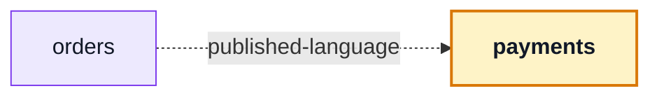

# payments

::: tip At a glance
**Owns** — `PaymentPanel`: the payment behind an order, as a component rather than a page.
**Depends on** — nothing. It is mounted, it does not mount.
**Breaks if you change** — `PaymentPanel`'s props. [`orders`](./orders.md) mounts it.
:::

<!-- gen:identity:start -->

| Fact                    | This module                                                                    |
| ----------------------- | ------------------------------------------------------------------------------ |
| **Subdomain**           | `supporting` — Specific to this business but not a differentiator. Kept plain. |
| **Screens**             | _none_ — this module routes to nothing                                         |
| **Store**               | `payments`                                                                     |
| **Menu entries**        | _none_                                                                         |
| **API calls**           | 4                                                                              |
| **Depends on**          | _nothing_                                                                      |
| **Depended on by**      | [`orders`](./orders.md)                                                        |
| **Languages**           | `en` · `it`                                                                    |
| **Publishes**           | `PaymentPanel` · `useOrderRefund`                                              |
| **Backend counterpart** | `payments` in `boilerplate-node-backend`                                       |

<!-- gen:identity:end -->

## The map

<!-- gen:map:start -->



- `orders` → **published-language** — Mounts `PaymentPanel`; paying happens on the order page without this module knowing a provider exists.

<!-- gen:map:end -->

## The story

**No routes and no navigation entries.** Paying happens _on_ the order, so this module contributes a
component through its barrel and [`orders`](./orders.md) mounts it. That arrow is declared over
there, as `published-language`, because the order page learns nothing about payments by rendering
one.

A module with no screens is not an incomplete module. It is a module whose surface is a component,
and the pattern is worth recognising — [`delivery`](./delivery.md) is the other one.

::: tip What deleting this module costs, precisely
The panel, the pay flow and the mock provider go in one `rm -rf` plus one registry line. Orders go
back to being paid nowhere — the state the shop was in before this module existed.

Nothing else in the client notices, because nothing else imports it.
:::

The store is here rather than in the panel because a component that owns its own fetching cannot be
mounted twice on one page without duplicating the request. The panel is a view; the store is the
domain's state, exactly as everywhere else.

The provider is a fake on the server side, and this client never learns that. It sends a card number
and reads an outcome — `succeeded` or `declined`. A decline is an answer with its own message, not
an error toast.

## State

<!-- gen:state:start -->

Store `payments`, from `store.ts`. Only what the setup function returns is listed — an internal ref is not part of the surface.

| Kind        | Members                                                   | What it is                                                       |
| ----------- | --------------------------------------------------------- | ---------------------------------------------------------------- |
| **State**   | `payment`                                                 | The refs the setup function returns — the only writable surface. |
| **Getters** | `loading`                                                 | Computed, derived from state. Read-only by construction.         |
| **Actions** | `fetchPaymentForOrder` · `payForOrder` · `refundForOrder` | Everything that changes state or calls the API.                  |

<!-- gen:state:end -->

## Screens

<!-- gen:screens:start -->

This module routes to nothing. It contributes components, schemas or a store to the modules that depend on it.

<!-- gen:screens:end -->

## Wiring

<!-- gen:wiring:start -->

#### Endpoints called

| Call                               | Response envelope              |
| ---------------------------------- | ------------------------------ |
| `POST /payments/{id}/confirm`      | `ConfirmPaymentResponse`       |
| `POST /payments/intent`            | `CreatePaymentIntentResponse`  |
| `GET /payments/order/{id}`         | `GetPaymentByOrderResponse`    |
| `POST /payments/order/{id}/refund` | `RefundPaymentByOrderResponse` |

Each row registers one Zod envelope through the manifest, so enabling the domain turns its contract validation on and deleting the folder turns it off.

<!-- gen:wiring:end -->

## Files

<!-- gen:files:start -->

| File                              | What it is                                                                                                                                                  | Explained in                          |
| --------------------------------- | ----------------------------------------------------------------------------------------------------------------------------------------------------------- | ------------------------------------- |
| `components/PaymentPanel.vue`     | A component this domain owns. Published through the barrel when a sibling mounts it, internal otherwise.                                                    | [read](../theory/layers.md)           |
| `composables/use-order-refund.ts` | Reusable reactive logic for this domain — the tier between a store and a component.                                                                         | [read](../theory/layers.md)           |
| `index.ts`                        | The public barrel: the only surface a sibling module may import.                                                                                            | [read](../theory/strategic-ddd.md)    |
| `locales/en.json`                 | This domain’s translation dictionary for one language, loaded as its own chunk.                                                                             | [read](../tools/i18n.md)              |
| `locales/it.json`                 | This domain’s translation dictionary for one language, loaded as its own chunk.                                                                             | [read](../tools/i18n.md)              |
| `module.ts`                       | The manifest — the only file the application loads directly. Declares the name, routes, navigation entries, response schemas, dependency edges and locales. | [read](../theory/modules.md)          |
| `response-schemas.ts`             | One row per endpoint this domain calls, pairing a method and path pattern with the Zod envelope its response is validated against.                          | [read](../api/openapi-workflow.md)    |
| `store.ts`                        | The Pinia store: this domain’s state, and every call it makes to the generated client.                                                                      | [read](../tools/state-and-routing.md) |
| `tests/store.spec.ts`             | Vitest suite — the store, the routes and the rules, in isolation.                                                                                           | [read](../tools/unit-testing.md)      |
| `tests/use-order-refund.spec.ts`  | Vitest suite — the store, the routes and the rules, in isolation.                                                                                           | [read](../tools/unit-testing.md)      |

<!-- gen:files:end -->

## Working on it

<!-- gen:working:start -->

| Suite  | Files | Where                         |
| ------ | ----- | ----------------------------- |
| Vitest | 2     | `src/modules/payments/tests/` |

```bash
# this module's vitest suites
npm run test:unit -- payments

# after the backend changes an endpoint this module calls
npm run regenerate
```

<!-- gen:working:end -->

## Deeper in

<!-- gen:subpages:start -->

Nothing in this domain needs a page of its own — the story above is the whole of it.

<!-- gen:subpages:end -->

## Related pages

- [`orders`](./orders.md) — the page that mounts the panel
- [`delivery`](./delivery.md) — the other component-only module
- [Strategic DDD](../theory/strategic-ddd.md) — what `published-language` buys
- [Layers](../theory/layers.md) — why the store is not inside the component
