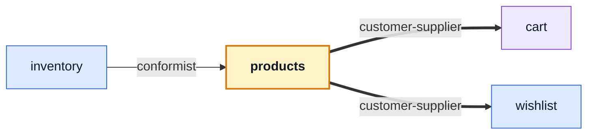

# products

::: tip At a glance
**Owns** — the catalogue screens: public list and detail, admin create and edit.
**Depends on** — [`cart`](./cart.md) and [`wishlist`](./wishlist.md), because the buttons on a product card write into them.
**Breaks if you change** — `useProductsStore`'s shape. [`inventory`](./inventory.md) reads it as-is.
:::

<!-- gen:identity:start -->

| Fact                    | This module                                                              |
| ----------------------- | ------------------------------------------------------------------------ |
| **Subdomain**           | `core` — The reason the product exists. Worth its own client-side rules. |
| **Screens**             | 4 — `ProductsList` · `ProductCreate` · `ProductTarget` · `ProductEdit`   |
| **Store**               | `products`                                                               |
| **Menu entries**        | `ProductsList`                                                           |
| **API calls**           | 10                                                                       |
| **Depends on**          | [`cart`](./cart.md) · [`wishlist`](./wishlist.md)                        |
| **Depended on by**      | [`inventory`](./inventory.md)                                            |
| **Languages**           | `en` · `it`                                                              |
| **Publishes**           | `useProductsStore`                                                       |
| **Backend counterpart** | `products` in `boilerplate-node-backend`                                 |

<!-- gen:identity:end -->

## The map

<!-- gen:map:start -->



- `inventory` → **conformist** — Reads `useProductsStore` as it is, to name products in the receipt select and the ledger titles.
- → `cart` **customer-supplier** — Add-to-cart asks the cart store to write a line.
- → `wishlist` **customer-supplier** — The heart asks the wishlist store to save the product.

<!-- gen:map:end -->

## The story

The catalogue is where the arrows start. Four screens, one store, and two of the three edges on
this page exist because of two buttons on a product card: **add to cart** and **the heart**.

Both are `customer-supplier` rather than something looser, and the distinction is the useful part:
this module does not render a cart or a wishlist, it _asks_ those stores to write a line. Their
surfaces are shaped by that demand — which is why both publish a store through their barrel while
this module publishes one too, for a different reason.

::: tip The one arrow pointing in
[`inventory`](./inventory.md) reads `useProductsStore` as it is, to name products in its receipt
select and its ledger titles. That is `conformist`: no translation, no say in the shape. It is also
the same one-way arrow the backend's `inventory → products` edge has, which is a small piece of
evidence that both context maps are describing the same system.
:::

`products/create` is declared before `products/:id` in `routes.ts`. vue-router ranks a static
segment above a dynamic one regardless of order, so `create` could never be swallowed as an id —
but the users routes read the same way, and a reader should not have to know the ranking rules to
be sure.

Stock is read-only here. `onHand`, `reserved` and `available` arrive serialized on every product,
and no form on these screens writes them: changing stock is an [`inventory`](./inventory.md)
operation.

## State

<!-- gen:state:start -->

Store `products`, from `store.ts`. Only what the setup function returns is listed — an internal ref is not part of the surface.

| Kind        | Members                                                                                                                                                                                                          | What it is                                                       |
| ----------- | ---------------------------------------------------------------------------------------------------------------------------------------------------------------------------------------------------------------- | ---------------------------------------------------------------- |
| **State**   | `facets` · `products` · `selectedProductId` · `filters` · `pageCurrent` · `pageSize`                                                                                                                             | The refs the setup function returns — the only writable surface. |
| **Getters** | `productsList` · `currentProduct` · `loading` · `pageTotal` · `pageItemList`                                                                                                                                     | Computed, derived from state. Read-only by construction.         |
| **Actions** | `fetchFacets` · `addProduct` · `fetchProducts` · `fetchPaginationProducts` · `watchSearchProducts` · `fetchProduct` · `watchProduct` · `createProduct` · `updateProduct` · `deleteProduct` · `hardDeleteProduct` | Everything that changes state or calls the API.                  |

<!-- gen:state:end -->

## Screens

<!-- gen:screens:start -->

| Path                | Route name      | Access   | View                      |
| ------------------- | --------------- | -------- | ------------------------- |
| `products`          | `ProductsList`  | `public` | `views/ProductsList.vue`  |
| `products/create`   | `ProductCreate` | `admin`  | `views/ProductCreate.vue` |
| `products/:id`      | `ProductTarget` | `public` | `views/Product.vue`       |
| `products/:id/edit` | `ProductEdit`   | `admin`  | `views/ProductEdit.vue`   |

Paths are relative to the localised root, so `cart` is served at `/:locale/cart`. **Access** is the route’s own `meta.access` — a menu entry never restates it, which is what keeps the menu and the router from disagreeing.

<!-- gen:screens:end -->

## Wiring

<!-- gen:wiring:start -->

#### Endpoints called

| Call                         | Response envelope               |
| ---------------------------- | ------------------------------- |
| `DELETE /products`           | `DeleteProductResponse`         |
| `GET /products`              | `ListProductsResponse`          |
| `POST /products`             | `CreateProductResponse`         |
| `PUT /products`              | `UpdateProductResponse`         |
| `DELETE /products/{id}`      | `DeleteProductByIdResponse`     |
| `GET /products/{id}`         | `GetProductByIdResponse`        |
| `PUT /products/{id}`         | `UpdateProductByIdResponse`     |
| `DELETE /products/{id}/hard` | `HardDeleteProductByIdResponse` |
| `GET /products/categories`   | `GetCatalogueFacetsResponse`    |
| `POST /products/search`      | `SearchProductsResponse`        |

Each row registers one Zod envelope through the manifest, so enabling the domain turns its contract validation on and deleting the folder turns it off.

#### Navigation entries

| Route          | Label key                        | Section | Order | Icon | Badge |
| -------------- | -------------------------------- | ------- | ----- | ---- | ----- |
| `ProductsList` | `navigation.label-products-list` | `main`  | 60    | yes  | —     |

<!-- gen:wiring:end -->

## Files

<!-- gen:files:start -->

| File                                        | What it is                                                                                                                                                  | Explained in                          |
| ------------------------------------------- | ----------------------------------------------------------------------------------------------------------------------------------------------------------- | ------------------------------------- |
| `index.ts`                                  | The public barrel: the only surface a sibling module may import.                                                                                            | [read](../theory/strategic-ddd.md)    |
| `locales/en.json`                           | This domain’s translation dictionary for one language, loaded as its own chunk.                                                                             | [read](../tools/i18n.md)              |
| `locales/it.json`                           | This domain’s translation dictionary for one language, loaded as its own chunk.                                                                             | [read](../tools/i18n.md)              |
| `module.ts`                                 | The manifest — the only file the application loads directly. Declares the name, routes, navigation entries, response schemas, dependency edges and locales. | [read](../theory/modules.md)          |
| `response-schemas.ts`                       | One row per endpoint this domain calls, pairing a method and path pattern with the Zod envelope its response is validated against.                          | [read](../api/openapi-workflow.md)    |
| `routes.ts`                                 | The domain’s route records, spliced into the localised route tree. Each carries its own `meta.access`.                                                      | [read](../theory/sitemap.md)          |
| `schemas.ts`                                | Form schemas for this domain, built on the generated request schemas rather than hand-written beside them.                                                  | [read](../api/openapi-workflow.md)    |
| `store.ts`                                  | The Pinia store: this domain’s state, and every call it makes to the generated client.                                                                      | [read](../tools/state-and-routing.md) |
| `tests/e2e/__snapshots__/products-list.png` | A committed visual-regression baseline.                                                                                                                     | [read](../tools/visual-regression.md) |
| `tests/e2e/a11y.cy.ts`                      | Cypress suite — the screens, in a browser.                                                                                                                  | [read](../tools/component-testing.md) |
| `tests/e2e/products.cy.ts`                  | Cypress suite — the screens, in a browser.                                                                                                                  | [read](../tools/component-testing.md) |
| `tests/e2e/products.visual.cy.ts`           | Cypress suite — the screens, in a browser.                                                                                                                  | [read](../tools/component-testing.md) |
| `tests/routes.spec.ts`                      | Vitest suite — the store, the routes and the rules, in isolation.                                                                                           | [read](../tools/unit-testing.md)      |
| `tests/schemas-i18n.spec.ts`                | Vitest suite — the store, the routes and the rules, in isolation.                                                                                           | [read](../tools/unit-testing.md)      |
| `tests/store.spec.ts`                       | Vitest suite — the store, the routes and the rules, in isolation.                                                                                           | [read](../tools/unit-testing.md)      |
| `views/Product.vue`                         | A routed screen. Reads its store, renders, and holds no fetching logic of its own.                                                                          | [read](../theory/layers.md)           |
| `views/ProductCreate.vue`                   | A routed screen. Reads its store, renders, and holds no fetching logic of its own.                                                                          | [read](../theory/layers.md)           |
| `views/ProductEdit.vue`                     | A routed screen. Reads its store, renders, and holds no fetching logic of its own.                                                                          | [read](../theory/layers.md)           |
| `views/ProductsList.vue`                    | A routed screen. Reads its store, renders, and holds no fetching logic of its own.                                                                          | [read](../theory/layers.md)           |

<!-- gen:files:end -->

## Working on it

<!-- gen:working:start -->

| Suite            | Files | Where                                           |
| ---------------- | ----- | ----------------------------------------------- |
| Vitest           | 3     | `src/modules/products/tests/`                   |
| Cypress          | 3     | `src/modules/products/tests/e2e/`               |
| Visual baselines | 1     | `src/modules/products/tests/e2e/__snapshots__/` |

```bash
# this module's vitest suites
npm run test:unit -- products

# this module's cypress suites
npm run test:e2e -- --spec 'src/modules/products/tests/e2e/*.cy.ts'

# after the backend changes an endpoint this module calls
npm run regenerate
```

<!-- gen:working:end -->

## Deeper in

<!-- gen:subpages:start -->

Nothing in this domain needs a page of its own — the story above is the whole of it.

<!-- gen:subpages:end -->

## Related pages

- [Modules overview](./index.md) — the whole context map
- [`cart`](./cart.md) · [`wishlist`](./wishlist.md) — where the two buttons write
- [State & Routing](../tools/state-and-routing.md) — what a store is and how a view reads one
- [Sitemap & Access Control](../theory/sitemap.md) — every screen in the app, and who may reach it
- [OpenAPI Workflow](../api/openapi-workflow.md) — where the generated client and Zod schemas come from
