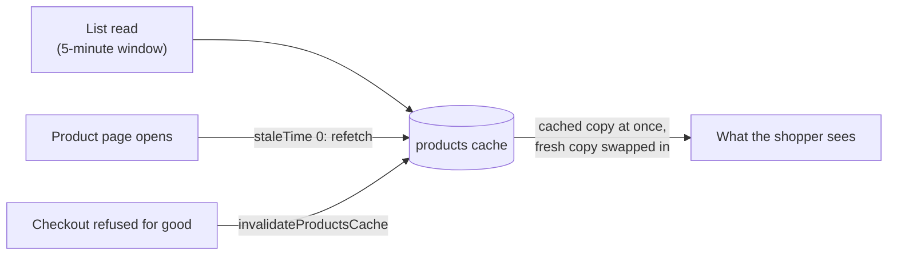
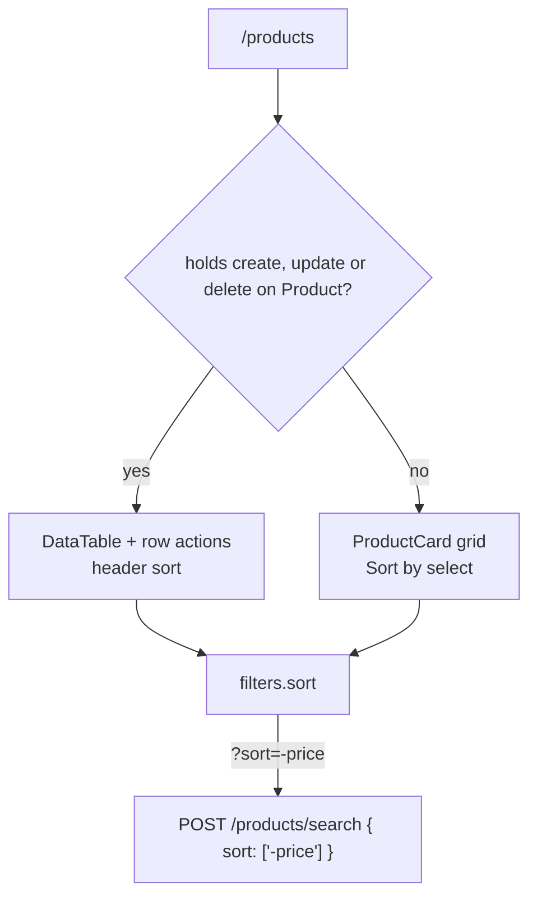
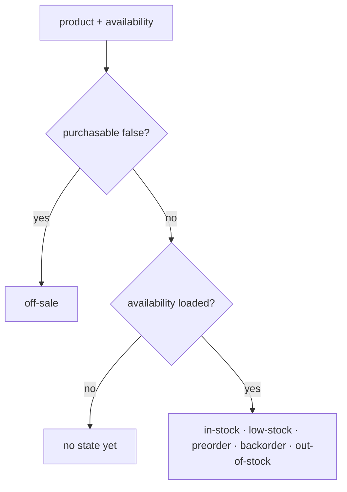
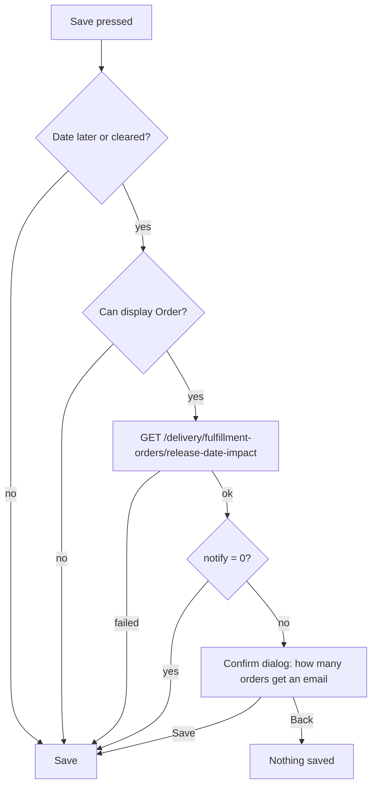

# products

::: tip At a glance
**Owns** — the catalogue screens: the list (storefront grid for shoppers, table for staff) and detail, admin create and edit.
**Depends on** — the backend modules whose API it calls: [`locales`](./locales.md), [`delivery`](./delivery.md) and [`shop`](./shop.md) (`module.yaml` `dependsOn`). [`cart`](./cart.md) and [`wishlist`](./wishlist.md) depend on it, and put their buttons on the product page through the `product-actions` slot.
**Breaks if you change** — the shape of `useProductLines`, `shelfStateOf` or `invalidateProductsCache`. [`cart`](./cart.md), [`wishlist`](./wishlist.md), [`inventory`](./inventory.md) and [`stock-alerts`](./stock-alerts.md) call them.
:::

| Fact          | This module                                                              |
| ------------- | ------------------------------------------------------------------------ |
| **Subdomain** | `core` — The reason the product exists. Worth its own client-side rules. |
| **Publishes** | `useProductLines` · `shelfStateOf` · `invalidateProductsCache`           |

## Its neighbourhood

The context map is drawn once, in [the whole map](./start.md#the-whole-map).

- `inventory` → **customer-supplier** — Asks the products store to drop its cached catalogue after a recorded movement (`invalidateProductsCache`), and reads the ledger's titles through `useProductLines`.
- `cart` → **customer-supplier** — Reads its lines' products through `useProductLines` and asks the cache to drop after a checkout (`invalidateProductsCache`).
- `wishlist` → **conformist** — Joins its saved lines to their product records through `useProductLines`, read as they are.
- `stock-alerts` → **conformist** — Reads the shelf state (`shelfStateOf`), the availability (`@/kernel/availability`) and the titles (`useProductLines`) as they are.
- `cart` also reads the availability (`@/kernel/availability`, `shelfStateOf`) for its add-to-cart button.

## The story

The catalogue is the supplier the shop's other screens read. Four screens, one store, and no
arrows out: the two buttons on a product page — **add to cart** and **the heart** — are not
imported here. The page renders a `product-actions` slot (`src/kernel/slots.ts`) and
[`cart`](./cart.md) and [`wishlist`](./wishlist.md) each contribute their button from their own
manifest, so this module never learns either exists.

What it publishes for them is `fetchProductsByIds`, behind `useProductLines`: one batched
`POST /products/search` for a set of id-only lines, landing in the same dictionary the product
page reads.

::: tip What it publishes
The barrel exports the whole module; the narrow handles on the store are the ones siblings use: `useProductLines` joins id-only
lines to their records, `shelfStateOf` ranks the flags the API sent into one badge, and
`invalidateProductsCache` drops the cached catalogue after a stock-moving write. Specs seed the
dictionary through `src/modules/products/tests/products-store.ts`, so no production sibling holds the store.
:::

## How fresh the numbers are

This page is about the details. Availability has its own lifetime, [below](#availability).

Products are cached for **five minutes** (`staleTime` in `store.ts`), and an expired entry keeps
rendering while the refetch runs. That window is the lists': a price or title a few minutes old on a
grid is fine, because the server re-checks the product at add-to-cart and at checkout. Stock is not
in this answer at all: it is the availability read below, with its own lifetime.

The **product page** does not wait for it. `ProductTarget.vue` watches its record with `staleTime: 0`, so
every open renders the cached copy at once and swaps the fresh one in (stale-while-revalidate, the
default behaviour of the query library the toolkit sits on). A checkout the server refuses for good
also ends the window early, through `invalidateProductsCache` — the one handle `cart` reaches
through the barrel. A cart write does not: stock is the availability read.


```mermaid
flowchart LR
    L["List read<br/>(5-minute window)"] --> C[("products cache")]
    P["Product page opens"] -->|"staleTime 0: refetch"| C
    W["Checkout refused for good"] -->|"invalidateProductsCache"| C
    C -->|"cached copy at once,<br/>fresh copy swapped in"| V["What the shopper sees"]
```

## Availability {#availability}

What a shopper is told about stock is its own read, apart from the product record. The product
answers `GET /products/{id}` and the lists carry the details; `availability` (`in_stock`,
`out_of_stock`, `preorder`, `backorder`) and its `availabilityDate` come from
`GET /products/{id}/availability` and `GET /products/availability?id=…`, which the backend caches
for a minute and clears on every sale.

They are held in `@/kernel/availability`, keyed by product id, and are never merged into the product
record: the toolkit's `addRecord` replaces a whole record, so the next details fetch would wipe the
availability and the two lifetimes would tangle. A reader joins the two:
`shelfStateOf(product, availabilityOf(product.id))`.

**Why the kernel.** The product views (card, page, edit form) need the answer as a value: a badge, a
stock label, a hint. A slot hands a host a component, never a value back. The read is
[`inventory`](./inventory.md)'s, and `inventory` already depends on `products`, so `products`
importing it would be a cycle. So the state sits in the kernel, the pattern of `@/kernel/work-counts`:
one writer (`inventory`), many readers (`products`, `cart`, `stock-alerts`).

**Who asks, and how fresh.** A host view renders the `availability-watch` slot, which `inventory`
fills with a renderless `AvailabilityWatcher`; it reads, a card or button only reads the port:

| Host                       | `staleTime` | Also re-reads when                       |
| -------------------------- | ----------- | ---------------------------------------- |
| product page, product edit | 0           | the tab regains focus or becomes visible |
| list (the cards' grid)     | 30 s        | the tab regains focus or becomes visible |

The watcher reads when the ids change and when the shopper comes back, the way the cart does. A batch
is at most 100 ids; a product the server leaves out (unknown, or hidden from this viewer) is recorded
as left out, which is not the same as "not asked yet". A card shows no badge, and the add-to-cart
button stays disabled, until the answer lands. The port is emptied, and read again, when another
person signs in: staff see hidden products a guest does not. A stock reader also gets the shelf count
beside the signal on the product page (`with-stock-count`), read from `GET /inventory/levels/{id}`;
nobody else makes that call.

## The list is two presentations

The catalogue is public, but what a viewer may do decides how it is shown: staff (anyone holding
`create`, `update` or `delete` on `Product`) get the `DataTable` with its row actions and the
by-id filter; everyone else, guests included, gets a **storefront grid** of `ProductCard`s. A card
is an `<article>`: picture, the title as its one link, price, availability, and whatever the
`product-actions` slot carries — the same slot the product page hosts, so the grid learns nothing
about the cart. Each row button, and the product page's Edit button, reads the server's `actions`
flag on the product (`update`, `delete`, `restore`, `hardDelete`) rather than the caller's keys.


```mermaid
flowchart TD
    V["/products"] --> S{"holds create, update or delete on Product?"}
    S -->|yes| T["DataTable + row actions<br/>header sort"]
    S -->|no| G["ProductCard grid<br/>Sort by select"]
    T --> F["filters.sort"]
    G --> F
    F -->|"?sort=-price"| A["POST /products/search { sort: ['-price'] }"]
```

Both write the same `filters.sort` (the API's CSV, so it lives in the URL) through
`useServerSort`, and both re-search from page 1: the server sorts the whole catalogue, never the
page the browser holds. See [`sorting`](https://github.com/Guebbit/boilerplate-node-backend/blob/main/docs/reference/sorting.md)
in the backend for the grammar and the per-resource whitelist.

`products/create` is declared before `products/:id` in `routes.ts`. vue-router ranks a static
segment above a dynamic one regardless of order, so `create` could never be swallowed as an id —
but the users routes read the same way, and a reader should not have to know the ranking rules to
be sure.

The product carries no stock. No form on these screens writes it, and none reads it from the
product: a shopper's signal is the availability read, and a stock reader's counters come from
`GET /inventory/levels/{id}`. Changing stock is an [`inventory`](./inventory.md) operation.

## Product states on screen

The backend keeps two independent flags, `active` (can a shopper see it) and `purchasable` (can it
be bought, stock aside), and tells shoppers what stock allows through `availability` (see
[Availability](#availability)). The screens rank them in one place,
`src/modules/products/domain/shelf-state.ts`, so the card, the product page and the add-to-cart
button never disagree: **off sale outranks the availability**.

| `purchasable` | `availability` | Shelf state    | Card badge                | Add to cart                                                          |
| ------------- | -------------- | -------------- | ------------------------- | -------------------------------------------------------------------- |
| `false`       | any            | `off-sale`     | "Not available right now" | disabled, "Not available right now"                                  |
| `true`        | `preorder`     | `preorder`     | "Preorder · ships {date}" | enabled, "Preorder"                                                  |
| `true`        | `backorder`    | `backorder`    | "Backorder · ships by …"  | enabled, "Backorder"                                                 |
| `true`        | `out_of_stock` | `out-of-stock` | "Out of stock"            | disabled, "Out of stock"                                             |
| `true`        | `in_stock`     | `low-stock`    | "Only {n} left"           | enabled (`quantityAvailable` below the frontend's threshold, 5)      |
| `true`        | `in_stock`     | `in-stock`     | "In stock"                | enabled                                                              |
| any           | not loaded yet | none           | no badge                  | disabled (an off-sale product still reads "Not available right now") |


```mermaid
flowchart TD
    A[product + availability] --> B{purchasable false?}
    B -- yes --> C[off-sale]
    B -- no --> D{availability loaded?}
    D -- no --> N[no state yet]
    D -- yes --> E[in-stock · low-stock · preorder · backorder · out-of-stock]
```

"Low stock" is a frontend constant (`LOW_STOCK_THRESHOLD`): the server serves the number
(`quantityAvailable`, see [inventory](./inventory.md)) and no field says what is low. A preorder's shelf may be empty: its units are claimed against the preorder allowance
(`backorderLimit`, set on the [stock board](./inventory.md)), not the shelf, which the server folds
into `availability`: a full allowance reads `out_of_stock`. The shopper never sees the allowance. A
backorder names its day from `availabilityDate`, except when the product sets no `restockDate`:
then the badge says "within {days} days", since the server's date only counts those days from today.

Staff set the date with the "Release date" field on the create and edit forms
(`<input type="date">`, sent as the plain `YYYY-MM-DD` day; at most one year ahead, which the
server enforces). The day is the shop's: the server stores the UTC instant of its midnight in the
shop's zone and sends the same day back, so the form fills the field from the response as it is and
no screen does zone maths. Every place that prints a promise date (`releaseDate`, `restockDate`,
`agreedAt`, `expectedAt`, `firstAgreedAt`, an order line's `promisedAt` and the timeline's moved-date rows) uses `formatDay`, which prints the day with no
time and no shift in any browser zone. An edit sends it only when it changed: moving it later notifies the buyers who
already paid, so an untouched date must not travel. Clearing the field sends `null` and ends the
preorder.

A hidden product is a 404 for a shopper, so there is nothing to rank: a cart or wishlist line that
points at one reads "No longer available" (see [cart](./cart.md#a-product-that-is-gone)). Staff
edit the flag with the "On sale" switch on the create and edit forms; the admin list has a column
and a "Sale status" filter beside `active`.

## State

State, getters and actions are exactly what the setup function of each store returns: `src/modules/products/store.ts`.

## Screens

Paths, route names, access and permission per screen: `src/modules/products/routes.ts`; every module's together are in the generated [sitemap](../understand/sitemap.md).

### Saving a later or cleared release date

A moved release date notifies the buyers who already paid (see the backend's
`delivery` page, "Preorders and a moved date"). So the edit form asks first, through
`src/modules/products/composables/use-release-date-confirm.ts`:


```mermaid
flowchart TD
    A[Save pressed] --> B{Date later or cleared?}
    B -- no --> S[Save]
    B -- yes --> C{Can display Order?}
    C -- no --> S
    C -- yes --> D[GET /delivery/fulfillment-orders/release-date-impact]
    D -- failed --> S
    D -- ok --> E{notify = 0?}
    E -- yes --> S
    E -- no --> F[Confirm dialog: how many orders get an email]
    F -- Save --> S
    F -- Back --> X[Nothing saved]
```

The dialog informs and never refuses. A cleared date sends no `releaseDate`, which the backend reads
as cleared. The ability is checked before the call, since a call the visitor may not make is logged
on the server as a forbidden one.

## Wiring

#### Endpoints called

Method, path pattern, response schema and owning module of every operation: `contracts/rest.generated/routes.ts` (rows with `module: "products"`). Auth is in the backend contract.

#### Navigation entries

Entries are declared in `src/modules/products/module.ts`.

## Files

The folder is `src/modules/products/`; each file's own `@module` header says what it is.

## Working on it

```bash
# this module's vitest suites
npm run test:unit -- products

# this module's cypress suites
npm run test:e2e -- --spec 'src/modules/products/tests/e2e/*.cy.ts'

# after the backend changes an endpoint this module calls
npm run regenerate
```

## Deeper in

Nothing in this domain needs a page of its own — the story above is the whole of it.

## Related pages

- [Modules overview](./start.md) — the whole context map
- [`cart`](./cart.md) · [`wishlist`](./wishlist.md) — the modules that contribute the product page's buttons
- [State & Routing](../understand/state-and-routing.md) — what a store is and how a view reads one
- [Sitemap & Access Control](../understand/sitemap.md) — every screen in the app, and who may reach it
- [OpenAPI Workflow](../build/openapi-workflow.md) — where the generated client and Zod schemas come from
