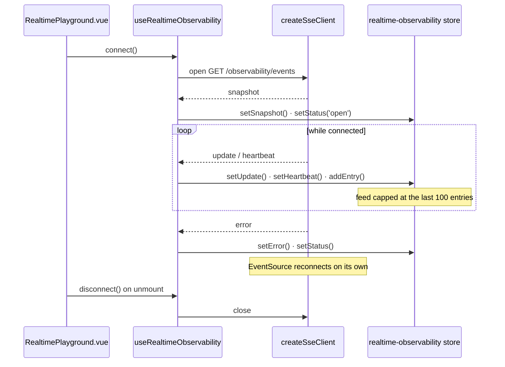

# realtime

::: tip At a glance
**Owns** — the realtime playground: a live view of the observability metrics stream.
**Depends on** — nothing. The SSE transport is infrastructure, not this module.
**Breaks if you change** — nothing outside this folder.
:::

| Fact                    | This module                                                                                                                                                                                                                     |
| ----------------------- | ------------------------------------------------------------------------------------------------------------------------------------------------------------------------------------------------------------------------------- |
| **Subdomain**           | `generic` — A solved problem. Modelling effort here would be waste.                                                                                                                                                             |
| **Screens**             | 1 — `RealtimePlayground`                                                                                                                                                                                                        |
| **Store**               | `realtime-observability`                                                                                                                                                                                                        |
| **Menu entries**        | `RealtimePlayground`                                                                                                                                                                                                            |
| **API calls**           | _none_                                                                                                                                                                                                                          |
| **Depends on**          | _nothing_                                                                                                                                                                                                                       |
| **Depended on by**      | _nothing_                                                                                                                                                                                                                       |
| **Languages**           | `en` · `it`                                                                                                                                                                                                                     |
| **Publishes**           | _nothing_ — no barrel, so no sibling may import it                                                                                                                                                                              |
| **Backend counterpart** | `observability` in `boilerplate-node-backend` — It consumes `GET /observability/events`, the SSE stream that module serves. There is no backend `realtime` module because the stream is one route on a dashboard, not a domain. |

::: info Stands alone
No module depends on this one and it depends on none. Deleting the folder and its line in `src/modules.ts` costs nothing else.
:::

## The map

`realtime` sits on no edge of the context map — nothing imports it and it imports nothing.

## The story

One screen, one composable and one store — `RealtimePlayground.vue`,
`use-realtime-observability.ts` and `store.ts`. There is no `components/` directory: the screen
renders the feed itself.

The split between the composable and the store is the thing worth understanding. The **composable
owns the connection** — a module-level `activeClient` singleton, so re-mounting the screen never
opens a second stream — and it owns the routing: each typed event is dispatched to one store
action. The **store owns the state** and nothing else: status, the two latest payload shapes kept
apart, the last heartbeat, the last error, and a feed capped at the last 100 entries so a
long-lived stream cannot grow without bound. Pure refs plus setters, with no fetching of its own.



**The transport is not part of this module.** `createSseClient` is a typed wrapper over `EventSource`
that knows no domain, so it lives in `infrastructure`. What is here is the screen, the typed
subscription and the feed.

::: tip The types come from a contract, not from a hand-written interface
`asyncapi.yaml` describes the event names and payload shapes, and
`src/types/asyncapi.generated.ts` is generated from it. A payload this module misreads is a build
error rather than an empty panel.
:::

It pairs with the backend's `observability` module, because it consumes
`GET /observability/events` — the SSE stream that module serves. There is no backend `realtime`
module, and there should not be: the stream is one route on a dashboard, not a domain.

The playground route needs `['read', 'ObservabilitySnapshot']` — a PLATFORM key, so a shop's own
unrestricted role cannot reach it and a platform operator can. A live metrics feed is an
operator's tool, and the route's `meta.can` is the only place that is declared.

## State

Store `realtime-observability`, from `store.ts`. Only what the setup function returns is listed — an internal ref is not part of the surface.

| Kind        | Members                                                                                      | What it is                                                       |
| ----------- | -------------------------------------------------------------------------------------------- | ---------------------------------------------------------------- |
| **State**   | `status` · `latestSnapshot` · `latestUpdate` · `latestHeartbeatAt` · `entries` · `lastError` | The refs the setup function returns — the only writable surface. |
| **Getters** | —                                                                                            | Computed, derived from state. Read-only by construction.         |
| **Actions** | `setStatus` · `setSnapshot` · `setUpdate` · `setHeartbeat` · `addEntry` · `setError`         | Everything that changes state or calls the API.                  |

## Screens

| Path                  | Route name           | Access | Permission                   | View                           |
| --------------------- | -------------------- | ------ | ---------------------------- | ------------------------------ |
| `playground/realtime` | `RealtimePlayground` | `auth` | `read ObservabilitySnapshot` | `views/RealtimePlayground.vue` |

Paths are relative to the localised root, so `cart` is served at `/:locale/cart`. **Access** is the route’s own `meta.access` (the standing it needs) and **Permission** its `meta.can` — the `[action, subject]` rule checked against the caller's own rules from `GET /account/abilities`. A menu entry restates neither, which is what keeps the menu and the router from disagreeing. See [Security](../tools/security.md#route-guards).

## Wiring

#### Navigation entries

| Route | Label key | Section | Order | Icon | Badge |
| -------------------- | --------------------------- | --- | --- | --- | --- | --- |
| `RealtimePlayground` | `navigation.label-realtime` | `admin` | 30 | yes | — |

## Files

| File                                              | What it is                                                                                                                                                  | Explained in                          |
| ------------------------------------------------- | ----------------------------------------------------------------------------------------------------------------------------------------------------------- | ------------------------------------- |
| `locales/en.json`                                 | This domain’s translation dictionary for one language, loaded as its own chunk.                                                                             | [read](../tools/i18n.md)              |
| `locales/it.json`                                 | This domain’s translation dictionary for one language, loaded as its own chunk.                                                                             | [read](../tools/i18n.md)              |
| `module.ts`                                       | The manifest — the only file the application loads directly. Declares the name, routes, navigation entries, response schemas, dependency edges and locales. | [read](../theory/modules.md)          |
| `routes.ts`                                       | The domain’s route records, spliced into the localised route tree. Each carries its own `meta.access`.                                                      | [read](../theory/sitemap.md)          |
| `store.ts`                                        | The Pinia store: this domain’s state, and every call it makes to the generated client.                                                                      | [read](../tools/state-and-routing.md) |
| `tests/e2e/__snapshots__/realtime-playground.png` | A committed visual-regression baseline.                                                                                                                     | [read](../tools/visual-regression.md) |
| `tests/e2e/a11y.cy.ts`                            | Cypress accessibility sweep — an axe run over this domain's routes, at each authentication level.                                                           | [read](../tools/component-testing.md) |
| `tests/e2e/realtime.visual.cy.ts`                 | Cypress visual suite — pixel diffs against the committed baselines.                                                                                         | [read](../tools/component-testing.md) |
| `tests/routes.spec.ts`                            | Vitest suite — the route records and the `meta.access` each one declares.                                                                                   | [read](../tools/unit-testing.md)      |
| `tests/store.spec.ts`                             | Vitest suite — this domain's store, with the transport mocked.                                                                                              | [read](../tools/unit-testing.md)      |
| `tests/use-realtime-observability.spec.ts`        | Vitest suite — the `useRealtimeObservability` composable, in isolation.                                                                                     | [read](../tools/unit-testing.md)      |
| `use-realtime-observability.ts`                   | `realtime` only. The composable a screen uses to subscribe to that stream and unsubscribe on unmount.                                                       | [read](../tools/realtime.md)          |
| `views/RealtimePlayground.vue`                    | A routed screen. Reads its store, renders, and holds no fetching logic of its own.                                                                          | [read](../theory/layers.md)           |

## Working on it

| Suite            | Files | Where                                           |
| ---------------- | ----- | ----------------------------------------------- |
| Vitest           | 3     | `src/modules/realtime/tests/`                   |
| Cypress          | 2     | `src/modules/realtime/tests/e2e/`               |
| Visual baselines | 1     | `src/modules/realtime/tests/e2e/__snapshots__/` |

```bash
# this module's vitest suites
npm run test:unit -- realtime

# this module's cypress suites
npm run test:e2e -- --spec 'src/modules/realtime/tests/e2e/*.cy.ts'
```

## Deeper in

Nothing in this domain needs a page of its own — the story above is the whole of it.

## Related pages

- [`admin`](./admin.md) — the other consumer of the same backend module
- [Realtime](../tools/realtime.md) — the SSE client and its reconnection behaviour
- [AsyncAPI Workflow](../api/asyncapi-workflow.md) — where the event types come from
- [Sitemap & Access Control](../theory/sitemap.md) — the `admin` gate on the playground
