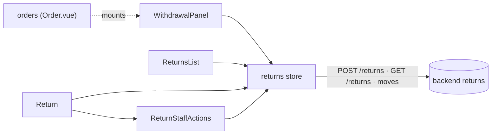
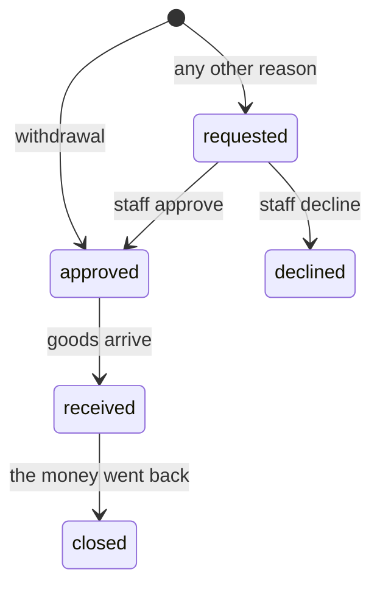

# returns

::: tip At a glance
**Owns** — the customer's own returns, the staff queue that approves and receives them, and the EU
"withdraw from contract here" button.
**Depends on** — nothing. [`orders`](./orders.md) mounts its `WithdrawalPanel`.
**Breaks if you change** — the order page's withdrawal control.
:::

| Fact                    | This module                             |
| ----------------------- | --------------------------------------- |
| **Subdomain**           | `supporting`                            |
| **Screens**             | 2 — `ReturnsList` · `ReturnTarget`      |
| **Store**               | `returns`                               |
| **Menu entries**        | `ReturnsList`                           |
| **API calls**           | 6                                       |
| **Depends on**          | _nothing_                               |
| **Depended on by**      | [`orders`](./orders.md)                 |
| **Languages**           | `en` · `it`                             |
| **Publishes**           | `WithdrawalPanel`                       |
| **Backend counterpart** | `returns` in `boilerplate-node-backend` |

## The map

`orders` reaches this module through one `published-language` edge: its page mounts
`WithdrawalPanel`, so the order never calls a returns operation itself. A return links back to its
order by route name, guarded by `linkIfRouted`, so no edge points the other way.

## The story

A withdrawal is a return whose reason is `withdrawal`, so there is no separate endpoint: the button
is `POST /returns`. What comes back depends on where the goods are, and the store reports which:

| Server answers | Meaning                                                             | `openReturn` resolves with     |
| -------------- | ------------------------------------------------------------------- | ------------------------------ |
| 201 + Location | the goods had shipped — a `Return` was written                      | `{ kind: 'return', created }`  |
| 200            | before dispatch — the order was cancelled and refunded, no `Return` | `{ kind: 'cancelled', order }` |

**The button is server-driven.** `WithdrawalPanel` shows it when `Order.actions.withdraw` is true and
prints `Order.actions.withdrawUntil`; it never counts the fourteen days. Clicking asks once more —
the directive wants a confirmation step — and the backend mails the acknowledgement with the date and
time. The panel also lists the returns already opened on that order, so a customer sees what became
of a withdrawal.

**Staff moves come from `Return.actions`.** `ReturnStaffActions` renders approve, decline (with the
reason the customer is told) and receive (with an optional handling deduction) from the three
booleans, and re-implements none of the lifecycle. Receiving is step-up gated: the http layer prompts
for the password when the server answers `REAUTH_REQUIRED`.

**Goods with no right of withdrawal** (EU Art. 16) carry `noWithdrawal` on their order line; the order
page says so on the line, and the product form has the switch. The refusal itself is the backend's.

## Not built here

The return address the shop asks goods to be sent to is read from `GET /delivery/methods` and named in
the acknowledgement email; this module does not show it on the return page.
