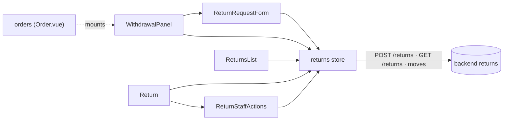
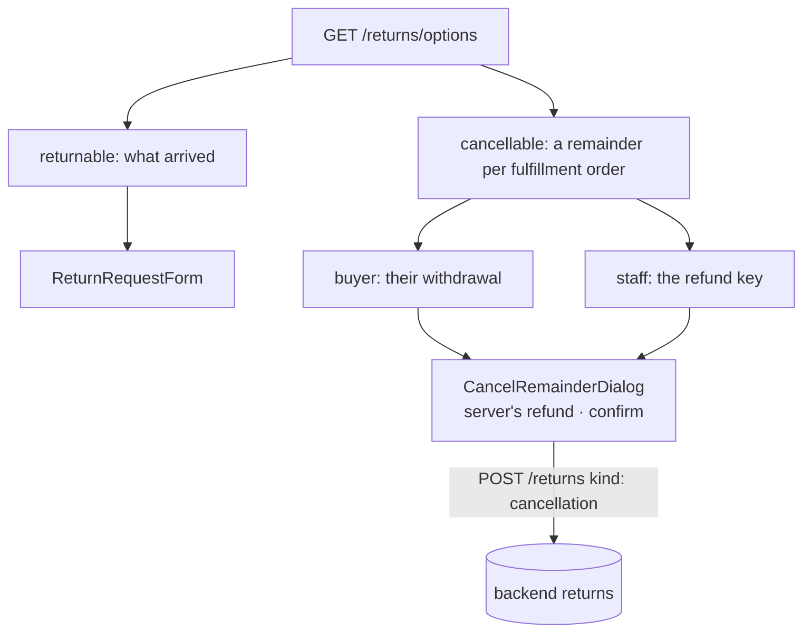
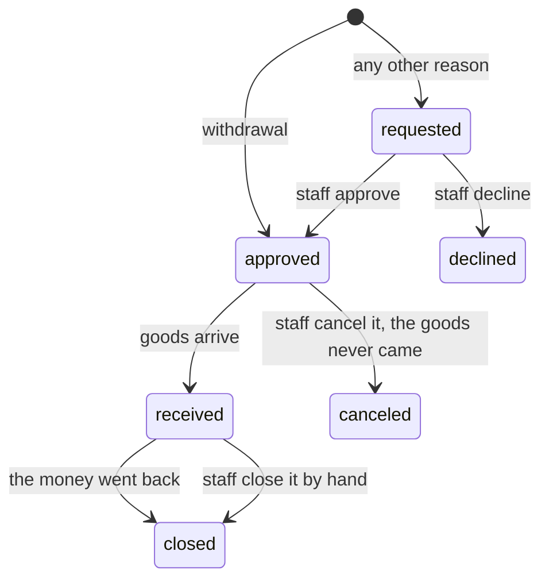

# returns

::: tip At a glance
**Owns** — the customer's own returns (a returns form for faulty or wrong goods and part-orders),
the staff queue that approves and receives them, cancelling what has not shipped, and the EU
"withdraw from contract here" button.
**Depends on** — nothing. [`orders`](./orders.md) mounts its `WithdrawalPanel`.
**Breaks if you change** — the order page's withdrawal control and returns form.
:::

| Fact                    | This module                                         |
| ----------------------- | --------------------------------------------------- |
| **Subdomain**           | `supporting`                                        |
| **Screens**             | 3 — `ReturnsList` · `SalesReturns` · `ReturnTarget` |
| **Store**               | `returns`                                           |
| **Menu entries**        | `ReturnsList` (account) · `SalesReturns` (admin)    |
| **API calls**           | 7                                                   |
| **Depends on**          | _nothing_                                           |
| **Depended on by**      | [`orders`](./orders.md)                             |
| **Languages**           | `en` · `it`                                         |
| **Publishes**           | `WithdrawalPanel`                                   |
| **Backend counterpart** | `returns` in `boilerplate-node-backend`             |

## The map

`orders` reaches this module through one `published-language` edge: its page mounts
`WithdrawalPanel`, so the order never calls a returns operation itself. A return links back to its
order by route name, guarded by `linkIfRouted`, so no edge points the other way.

The context map is drawn once, in [the whole map](./index.md#the-whole-map).

- `orders` → **published-language** — Mounts `WithdrawalPanel`; the withdrawal and the order's returns list are the component's own business.

Inside the module, the pieces connect like this:

```mermaid
flowchart LR
    orders["orders (Order.vue)"] -.->|mounts| panel["WithdrawalPanel"]
    panel --> form["ReturnRequestForm"]
    form --> store["returns store"]
    panel --> store
    list["ReturnsList"] --> store
    detail["Return"] --> store
    detail --> staff["ReturnStaffActions"]
    staff --> store
    store -->|"POST /returns · GET /returns · moves"| api[("backend returns")]
```

## The story

A withdrawal is a return whose reason is `withdrawal`, so there is no separate endpoint: the button
is `POST /returns`, which always answers 201 and a `Return` (one endpoint, one resource, so the
route table's one-schema-per-route rule holds). `openReturn` resolves with that `Return`; where the
goods are only changes what it looks like:

| Order was       | The `Return`                                                                          |
| --------------- | ------------------------------------------------------------------------------------- |
| shipped         | `approved`, with the lines coming back                                                |
| before dispatch | `closed` at birth, no `lines`: the backend cancelled and refunded the order meanwhile |

After a withdrawal the panel emits `opened`, the order page re-reads the order (now cancelled), and
the panel lists the new `Return` like any other. The return page says "no goods are expected back"
where its lines would be.

**The button is server-driven.** `WithdrawalPanel` shows it when `Order.actions.withdraw` is true and
prints `Order.actions.withdrawUntil` as a UTC date only ("until the end of 5 December", no time of day; the shop accepts one more day, which the client never shows); it never counts the withdrawal period. Clicking asks once more —
the directive wants a confirmation step — and the backend mails the acknowledgement with the date and
time. A withdrawal takes no reason and covers the whole order. The panel also lists the returns
already opened on that order, so a customer sees what became of a withdrawal.

**What can still be done comes from `GET /returns/options`.** The panel reads it once per order and
counts nothing itself: `returnable` is what has shipped and not yet come back, `cancellable` is each
fulfillment order that still has a remainder, with the refund cancelling it would owe (the delivery
included when it takes the last unit). Both doors below are fed by it, and it is re-read after
each move.

```mermaid
flowchart TD
    options["GET /returns/options"] --> returnable["returnable: what arrived"]
    options --> cancellable["cancellable: a remainder per fulfillment order"]
    returnable --> form["ReturnRequestForm"]
    cancellable --> buyer["buyer: their withdrawal"]
    cancellable --> staff["staff: the refund key"]
    buyer --> dialog["CancelRemainderDialog<br/>server's refund · confirm"]
    staff --> dialog
    dialog -->|"POST /returns kind: cancellation"| api[("backend returns")]
```

**Cancelling what has not shipped** is its own door once part of an order has left. Each remainder
shows the server's refund and opens `CancelRemainderDialog`, which sends `POST /returns` with
`kind: cancellation` and the fulfillment order's id. The buyer's cancellation is part of their
withdrawal (`reason: withdrawal`, no note); a staff member holding the refund key
(`create:Refund`) cancels with reason `other` and an optional note, and the http layer prompts
for the password first — the key is step-up gated. The record is born `closed`, its lines are the
remainder, and the panel lists it like any other return. Rank, window and who may refuse are the
server's.

**The returns form is for everything else.** Once something has shipped, `ReturnRequestForm` lets the
customer tick the lines that come back, set a quantity for each (up to the server's `returnable`
quantity), pick a reason (defective, wrong item or other — `withdrawal` is the button, not a choice
here) and add a note. The reasons on offer are the server's `reasons`: after the withdrawal period
only the two guarantee reasons are left (two years from delivery), and a made-to-order line
(`withdrawable: false`) is shut for `other`. It sends only the ticked lines, so part of an order can go back; the same
product can be returned again until nothing is left. The server re-checks all of it (too many, an
excluded line, a closed window) and its message shows in the form. Staff then approve or decline the
return like any other.

**Staff moves come from `Return.actions`.** `ReturnStaffActions` renders approve, decline (a reason picked from a list, plus a message to the buyer that "Other" requires), receive (with a restock count per line and an optional handling deduction), close and cancel (each with an
optional note) from the five booleans, and re-implements none of the lifecycle. Receiving and
closing are step-up gated: the http layer prompts for the password when the server answers
`REAUTH_REQUIRED`. Close is for a received return whose refund was canceled or paid outside the app:
it moves no money and no stock, and the customer is not told their money is back. The receive form lists every
returned line with a number field prefilled with its quantity: lower it for a broken unit (0 keeps
it off the shelf, so it is never handed to a waiting backorder buyer; the refund does not change).
Only a lowered line is sent, and after receipt the staff part shows "restocked n of m", never the
buyer. Cancel is for an
approved return whose goods never came: it is not a close, moves nothing, mails nobody, and frees the
same items to be returned again.

```mermaid
stateDiagram-v2
    [*] --> approved: withdrawal
    [*] --> requested: any other reason
    requested --> approved: staff approve
    requested --> declined: staff decline
    approved --> received: goods arrive
    approved --> canceled: staff cancel it, the goods never came
    received --> closed: the money went back
    received --> closed: staff close it by hand
```

**Staff acting for the buyer.** A caller holding `update:Return` who is not the buyer gets, on the
order page, **Open a return for the buyer** (the same `ReturnRequestForm`, plus an optional "day the
buyer asked", and a reason already past its deadline is labelled as an exception the return will
record; made-to-order lines stay open for them) and **Record a withdrawal**
(`RecordWithdrawalDialog`: the day the buyer sent it, never in the future, and the channel; both
required). A partly shipped order's "cancel what has not shipped" dialog gets the same two fields
behind a tick for staff. The shop asks for the password first (the server fails closed whenever the
body carries `statedVia`), and judges the window on the day given. The return page shows when the
buyer asked or stated it, and to staff what was waived. `StatedAtFields` is the one pair of fields
the three forms share; the server owns every rule.

**Goods with no right of withdrawal** (EU Art. 16) carry `noWithdrawal` on their order line; the order
page says so on the line, and the product form has the switch. The refusal itself is the backend's.

## Not built here

The return address the shop asks goods to be sent to is read from `GET /delivery/methods` and named in
the acknowledgement email; this module does not show it on the return page.
