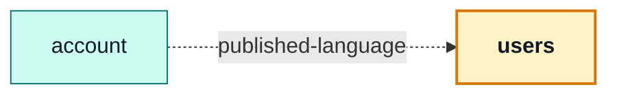

# users

::: tip At a glance
**Owns** — user administration: the admin-only list, detail, create and edit screens.
**Depends on** — nothing. A user record exists whether or not anyone is signed in.
**Breaks if you change** — `schemas.ts`. [`account`](./account.md) validates every one of its forms against it.
:::

<!-- gen:identity:start -->

| Fact                    | This module                                                         |
| ----------------------- | ------------------------------------------------------------------- |
| **Subdomain**           | `generic` — A solved problem. Modelling effort here would be waste. |
| **Screens**             | 4 — `UsersList` · `UserCreate` · `UserTarget` · `UserEdit`          |
| **Store**               | `users`                                                             |
| **Menu entries**        | `UsersList`                                                         |
| **API calls**           | 9                                                                   |
| **Depends on**          | _nothing_                                                           |
| **Depended on by**      | [`account`](./account.md)                                           |
| **Languages**           | `en` · `it`                                                         |
| **Publishes**           | `usersPasswordSchema` · `usersSchema`                               |
| **Backend counterpart** | `users` in `boilerplate-node-backend`                               |

<!-- gen:identity:end -->

## The map

<!-- gen:map:start -->



- `account` → **published-language** — Validates every form against `usersSchema`/`usersPasswordSchema` — shared field rules, not a shared store.

<!-- gen:map:end -->

## The story

Four admin screens over one collection, and a barrel that exists for one reason: the field rules.

`usersSchema` and `usersPasswordSchema` are built on the **generated** request schemas rather than
hand-written beside them, so _what makes a valid username_ comes from `openapi.yaml` and cannot
drift from what the server will accept. [`account`](./account.md) imports both, which is why the
arrow points `account → users` and not the reverse.

::: tip The direction is the point
It is the account module that reads this one, not the other way round. A user record exists whether
or not anyone is signed in, so this module depends on nothing — and deleting
[`account`](./account.md) leaves these screens working, while deleting this one leaves that module
validating nothing.
:::

Everything here is `admin` in `meta.access`, and the equivalent self-service actions — profile read,
account deletion — live under [`account`](./account.md). The two never share a screen.

`users/create` is declared before `users/:id` for the same reason the products routes are: vue-router
would rank it correctly either way, and a reader should not have to know that.

## State

<!-- gen:state:start -->

Store `users`, from `store.ts`. Only what the setup function returns is listed — an internal ref is not part of the surface.

| Kind        | Members                                                                                                                                                            | What it is                                                       |
| ----------- | ------------------------------------------------------------------------------------------------------------------------------------------------------------------ | ---------------------------------------------------------------- |
| **State**   | `users` · `selectedUserId` · `filters` · `pageCurrent` · `pageSize`                                                                                                | The refs the setup function returns — the only writable surface. |
| **Getters** | `usersList` · `currentUser` · `loading` · `pageTotal` · `pageItemList`                                                                                             | Computed, derived from state. Read-only by construction.         |
| **Actions** | `addUser` · `fetchUsers` · `fetchPaginationUsers` · `watchSearchUsers` · `fetchUser` · `watchUser` · `createUser` · `updateUser` · `deleteUser` · `hardDeleteUser` | Everything that changes state or calls the API.                  |

<!-- gen:state:end -->

## Screens

<!-- gen:screens:start -->

| Path             | Route name   | Access  | View                   |
| ---------------- | ------------ | ------- | ---------------------- |
| `users`          | `UsersList`  | `admin` | `views/UsersList.vue`  |
| `users/create`   | `UserCreate` | `admin` | `views/UserCreate.vue` |
| `users/:id`      | `UserTarget` | `admin` | `views/User.vue`       |
| `users/:id/edit` | `UserEdit`   | `admin` | `views/UserEdit.vue`   |

Paths are relative to the localised root, so `cart` is served at `/:locale/cart`. **Access** is the route’s own `meta.access` — a menu entry never restates it, which is what keeps the menu and the router from disagreeing.

<!-- gen:screens:end -->

## Wiring

<!-- gen:wiring:start -->

#### Endpoints called

| Call                      | Response envelope            |
| ------------------------- | ---------------------------- |
| `DELETE /users`           | `DeleteUserResponse`         |
| `GET /users`              | `ListUsersResponse`          |
| `POST /users`             | `CreateUserResponse`         |
| `PUT /users`              | `UpdateUserResponse`         |
| `DELETE /users/{id}`      | `DeleteUserByIdResponse`     |
| `GET /users/{id}`         | `GetUserByIdResponse`        |
| `PUT /users/{id}`         | `UpdateUserByIdResponse`     |
| `DELETE /users/{id}/hard` | `HardDeleteUserByIdResponse` |
| `POST /users/search`      | `SearchUsersResponse`        |

Each row registers one Zod envelope through the manifest, so enabling the domain turns its contract validation on and deleting the folder turns it off.

#### Navigation entries

| Route       | Label key                     | Order | Badge |
| ----------- | ----------------------------- | ----- | ----- |
| `UsersList` | `navigation.label-users-list` | 50    | —     |

<!-- gen:wiring:end -->

## Files

<!-- gen:files:start -->

| File                                     | What it is                                                                                                                                                  | Explained in                          |
| ---------------------------------------- | ----------------------------------------------------------------------------------------------------------------------------------------------------------- | ------------------------------------- |
| `index.ts`                               | The public barrel: the only surface a sibling module may import.                                                                                            | [read](../theory/strategic-ddd.md)    |
| `locales/en.json`                        | This domain’s translation dictionary for one language, loaded as its own chunk.                                                                             | [read](../tools/i18n.md)              |
| `locales/it.json`                        | This domain’s translation dictionary for one language, loaded as its own chunk.                                                                             | [read](../tools/i18n.md)              |
| `module.ts`                              | The manifest — the only file the application loads directly. Declares the name, routes, navigation entries, response schemas, dependency edges and locales. | [read](../theory/modules.md)          |
| `response-schemas.ts`                    | One row per endpoint this domain calls, pairing a method and path pattern with the Zod envelope its response is validated against.                          | [read](../api/openapi-workflow.md)    |
| `routes.ts`                              | The domain’s route records, spliced into the localised route tree. Each carries its own `meta.access`.                                                      | [read](../theory/sitemap.md)          |
| `schemas.ts`                             | Form schemas for this domain, built on the generated request schemas rather than hand-written beside them.                                                  | [read](../api/openapi-workflow.md)    |
| `store.ts`                               | The Pinia store: this domain’s state, and every call it makes to the generated client.                                                                      | [read](../tools/state-and-routing.md) |
| `tests/e2e/__snapshots__/users-list.png` | A committed visual-regression baseline.                                                                                                                     | [read](../tools/visual-regression.md) |
| `tests/e2e/a11y.cy.ts`                   | Cypress suite — the screens, in a browser.                                                                                                                  | [read](../tools/component-testing.md) |
| `tests/e2e/users.visual.cy.ts`           | Cypress suite — the screens, in a browser.                                                                                                                  | [read](../tools/component-testing.md) |
| `tests/routes.spec.ts`                   | Vitest suite — the store, the routes and the rules, in isolation.                                                                                           | [read](../tools/unit-testing.md)      |
| `tests/schemas-i18n.spec.ts`             | Vitest suite — the store, the routes and the rules, in isolation.                                                                                           | [read](../tools/unit-testing.md)      |
| `tests/store.spec.ts`                    | Vitest suite — the store, the routes and the rules, in isolation.                                                                                           | [read](../tools/unit-testing.md)      |
| `views/User.vue`                         | A routed screen. Reads its store, renders, and holds no fetching logic of its own.                                                                          | [read](../theory/layers.md)           |
| `views/UserCreate.vue`                   | A routed screen. Reads its store, renders, and holds no fetching logic of its own.                                                                          | [read](../theory/layers.md)           |
| `views/UserEdit.vue`                     | A routed screen. Reads its store, renders, and holds no fetching logic of its own.                                                                          | [read](../theory/layers.md)           |
| `views/UsersList.vue`                    | A routed screen. Reads its store, renders, and holds no fetching logic of its own.                                                                          | [read](../theory/layers.md)           |

<!-- gen:files:end -->

## Working on it

<!-- gen:working:start -->

| Suite            | Files | Where                                        |
| ---------------- | ----- | -------------------------------------------- |
| Vitest           | 3     | `src/modules/users/tests/`                   |
| Cypress          | 2     | `src/modules/users/tests/e2e/`               |
| Visual baselines | 1     | `src/modules/users/tests/e2e/__snapshots__/` |

```bash
# this module's vitest suites
npm run test:unit -- users

# this module's cypress suites
npm run test:e2e -- --spec 'src/modules/users/tests/e2e/*.cy.ts'

# after the backend changes an endpoint this module calls
npm run regenerate
```

<!-- gen:working:end -->

## Deeper in

<!-- gen:subpages:start -->

Nothing in this domain needs a page of its own — the story above is the whole of it.

<!-- gen:subpages:end -->

## Related pages

- [`account`](./account.md) — the module that imports the field rules
- [OpenAPI Workflow](../api/openapi-workflow.md) — where the generated request schemas come from
- [Sitemap & Access Control](../theory/sitemap.md) — the `admin` gate on every route here
- [State & Routing](../tools/state-and-routing.md) — the store behind the four screens
