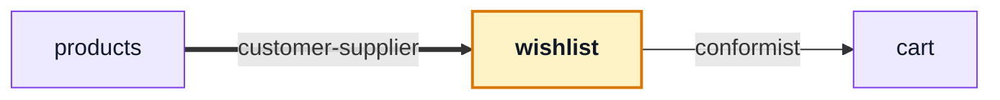

# wishlist

::: tip At a glance
**Owns** — the visitor's saved products, and the move-to-cart exit.
**Depends on** — [`cart`](./cart.md), so the header badge cannot lag a write this module started.
**Breaks if you change** — the refresh after move-to-cart. It is the only reason the edge exists.
:::

| Fact                    | This module                                                                    |
| ----------------------- | ------------------------------------------------------------------------------ |
| **Subdomain**           | `supporting` — Specific to this business but not a differentiator. Kept plain. |
| **Screens**             | 1 — `Wishlist`                                                                 |
| **Store**               | `wishlist`                                                                     |
| **Menu entries**        | `Wishlist`                                                                     |
| **API calls**           | 4                                                                              |
| **Depends on**          | [`cart`](./cart.md)                                                            |
| **Depended on by**      | [`products`](./products.md)                                                    |
| **Languages**           | `en` · `it`                                                                    |
| **Publishes**           | `useWishlistStore`                                                             |
| **Backend counterpart** | `wishlist` in `boilerplate-node-backend`                                       |

## The map



- `products` → **customer-supplier** — The heart asks the wishlist store to save the product.
- → `cart` **conformist** — Move-to-cart calls a wishlist endpoint and then asks the cart store to refetch itself; the cart is never asked to write.

## The story

One screen, one store, product references and nothing else. Read it next to
[`cart`](./cart.md): the same shape, without the checkout.

The interesting line is a single call. Move-to-cart is a **wishlist** endpoint; once it answers,
this store asks the cart to **refetch itself** through the cart barrel, so the header's badge cannot
lag a write this module initiated. That one call is the whole of the `wishlist → cart` edge, and it
is why the edge is `conformist` rather than `customer-supplier` — the cart is never asked to write.

::: tip Why this is a line and not a loop
The reverse arrow does not exist. The cart never reads the wishlist. That is what keeps
`products → wishlist → cart → orders` a chain rather than a cycle — and a cycle would show up as a
`no-restricted-imports` failure on `npm run lint` at whichever import closed the loop, rather than
on the first navigation with a blank screen.
:::

The heart on a product card is [`products`](./products.md) asking this store to save — the arrow
pointing in, and `customer-supplier` for the same reason add-to-cart is: it asks this store to
write.

## State

Store `wishlist`, from `store.ts`. Only what the setup function returns is listed — an internal ref is not part of the surface.

| Kind        | Members                                                                             | What it is                                                       |
| ----------- | ----------------------------------------------------------------------------------- | ---------------------------------------------------------------- |
| **State**   | `items`                                                                             | The refs the setup function returns — the only writable surface. |
| **Getters** | `savedProductIds` · `loading`                                                       | Computed, derived from state. Read-only by construction.         |
| **Actions** | `isSaved` · `fetchWishlist` · `addToWishlist` · `removeFromWishlist` · `moveToCart` | Everything that changes state or calls the API.                  |

## Screens

| Path       | Route name | Access | View                 |
| ---------- | ---------- | ------ | -------------------- |
| `wishlist` | `Wishlist` | `auth` | `views/Wishlist.vue` |

Paths are relative to the localised root, so `cart` is served at `/:locale/cart`. **Access** is the route’s own `meta.access` — a menu entry never restates it, which is what keeps the menu and the router from disagreeing.

## Wiring

#### Endpoints called

| Call                               | Response envelope                |
| ---------------------------------- | -------------------------------- |
| `GET /wishlist`                    | `GetWishlistResponse`            |
| `POST /wishlist`                   | `AddWishlistItemResponse`        |
| `DELETE /wishlist/{id}`            | `RemoveWishlistItemResponse`     |
| `POST /wishlist/{id}/move-to-cart` | `MoveWishlistItemToCartResponse` |

Each row registers one Zod envelope through the manifest, so enabling the domain turns its contract validation on and deleting the folder turns it off.

#### Navigation entries

| Route      | Label key                   | Section   | Order | Icon | Badge |
| ---------- | --------------------------- | --------- | ----- | ---- | ----- |
| `Wishlist` | `navigation.label-wishlist` | `account` | 75    | yes  | —     |

## Files

| File                                   | What it is                                                                                                                                                  | Explained in                          |
| -------------------------------------- | ----------------------------------------------------------------------------------------------------------------------------------------------------------- | ------------------------------------- |
| `index.ts`                             | The public barrel: the only surface a sibling module may import.                                                                                            | [read](../theory/strategic-ddd.md)    |
| `locales/en.json`                      | This domain’s translation dictionary for one language, loaded as its own chunk.                                                                             | [read](../tools/i18n.md)              |
| `locales/it.json`                      | This domain’s translation dictionary for one language, loaded as its own chunk.                                                                             | [read](../tools/i18n.md)              |
| `module.ts`                            | The manifest — the only file the application loads directly. Declares the name, routes, navigation entries, response schemas, dependency edges and locales. | [read](../theory/modules.md)          |
| `response-schemas.ts`                  | One row per endpoint this domain calls, pairing a method and path pattern with the Zod envelope its response is validated against.                          | [read](../api/openapi-workflow.md)    |
| `routes.ts`                            | The domain’s route records, spliced into the localised route tree. Each carries its own `meta.access`.                                                      | [read](../theory/sitemap.md)          |
| `store.ts`                             | The Pinia store: this domain’s state, and every call it makes to the generated client.                                                                      | [read](../tools/state-and-routing.md) |
| `tests/e2e/__snapshots__/wishlist.png` | A committed visual-regression baseline.                                                                                                                     | [read](../tools/visual-regression.md) |
| `tests/e2e/a11y.cy.ts`                 | Cypress suite — the screens, in a browser.                                                                                                                  | [read](../tools/component-testing.md) |
| `tests/e2e/wishlist.cy.ts`             | Cypress suite — the screens, in a browser.                                                                                                                  | [read](../tools/component-testing.md) |
| `tests/e2e/wishlist.visual.cy.ts`      | Cypress suite — the screens, in a browser.                                                                                                                  | [read](../tools/component-testing.md) |
| `tests/routes.spec.ts`                 | Vitest suite — the store, the routes and the rules, in isolation.                                                                                           | [read](../tools/unit-testing.md)      |
| `tests/store.spec.ts`                  | Vitest suite — the store, the routes and the rules, in isolation.                                                                                           | [read](../tools/unit-testing.md)      |
| `tests/wishlist-view.spec.ts`          | Vitest suite — the store, the routes and the rules, in isolation.                                                                                           | [read](../tools/unit-testing.md)      |
| `views/Wishlist.vue`                   | A routed screen. Reads its store, renders, and holds no fetching logic of its own.                                                                          | [read](../theory/layers.md)           |

## Working on it

| Suite            | Files | Where                                           |
| ---------------- | ----- | ----------------------------------------------- |
| Vitest           | 3     | `src/modules/wishlist/tests/`                   |
| Cypress          | 3     | `src/modules/wishlist/tests/e2e/`               |
| Visual baselines | 1     | `src/modules/wishlist/tests/e2e/__snapshots__/` |

```bash
# this module's vitest suites
npm run test:unit -- wishlist

# this module's cypress suites
npm run test:e2e -- --spec 'src/modules/wishlist/tests/e2e/*.cy.ts'

# after the backend changes an endpoint this module calls
npm run regenerate
```

## Deeper in

Nothing in this domain needs a page of its own — the story above is the whole of it.

## Related pages

- [`cart`](./cart.md) — the same shape, with the hard part attached
- [`products`](./products.md) — where the heart lives
- [Modules](../theory/modules.md) — the DAG rule and what enforces it
- [State & Routing](../tools/state-and-routing.md) — the store behind the screen
