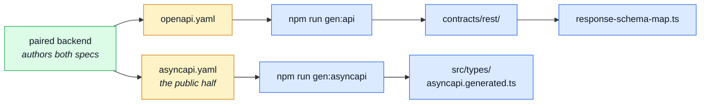

# Contracts

The contract is the source of truth, and **this repo does not author it.** `openapi.yaml` and
`asyncapi.yaml` are produced in the paired backend from its per-module fragments and copied here
byte-for-byte; everything under `contracts/` is generated from them.

That is the whole shape: the backend decides what the API is, this repo generates a client from
the answer, and `npm run check:spec-identity` fails the build on the commit that forks the two
copies.

---

## What is generated from what

::: warning None of this is hand-edited
Not the specs — they are the backend's output. Not `contracts/` — Orval rewrites the directory.
Not the generated realtime types. Editing any of them survives exactly until the next
regeneration, and the diff will look like the backend broke something.
:::

## The specs

| File            | What it is                                                                                                                                                                                                                                   | Read next                                        |
| --------------- | -------------------------------------------------------------------------------------------------------------------------------------------------------------------------------------------------------------------------------------------- | ------------------------------------------------ |
| `openapi.yaml`  | The REST contract, byte-identical with the backend's. Every generated client, every response schema and every mock example comes from it.                                                                                                    | [OpenAPI Workflow](../api/openapi-workflow.md)   |
| `asyncapi.yaml` | The realtime contract — and only the **public half** of the backend's. The channels a browser can legitimately observe; the internal queues stay over there, which is why this file is shorter than its counterpart and is not a copy of it. | [AsyncAPI Workflow](../api/asyncapi-workflow.md) |
| `spectral.yaml` | The lint ruleset for `openapi.yaml`. Shared with the backend on purpose: if the two repos linted the same document under different rules, one of them would pass a spec the other would reject.                                              | [OpenAPI Workflow](../api/openapi-workflow.md)   |

## The generated client

| File                            | What it is                                                                                                                                                                                                                                                    | Read next                                                                                  |
| ------------------------------- | ------------------------------------------------------------------------------------------------------------------------------------------------------------------------------------------------------------------------------------------------------------- | ------------------------------------------------------------------------------------------ |
| `contracts/rest/index.ts`       | **Generated** by `npm run gen:api`. One typed function per operation, each routed through the shared axios instance rather than calling the network itself.                                                                                                   | [OpenAPI Workflow](../api/openapi-workflow.md) · [Infrastructure](./src-infrastructure.md) |
| `contracts/rest/schemas.zod.ts` | **Generated.** A Zod schema per contract shape — what `response-schema-map.ts` points every call site at, so a response that does not match the contract is caught here rather than three components later.                                                   | [Infrastructure](./src-infrastructure.md)                                                  |
| `orval.config.ts`               | Tells Orval what to generate and how to route it. Its non-obvious job: seven operations accept the same payload as either JSON or multipart — anything with an optional image — and this is where that duality is resolved so a caller does not have to pick. | [Regenerating](../api/openapi-workflow.md)                                                 |

## Keeping the pair in step

`scripts/pairing/spec-identity.ts` holds the files that must be byte-identical in both checkouts, and
`npm run check:spec-identity` is what enforces it. The membership test is not "are these the same
today" but **"does a fork cause a silent bug?"** — everything on the list fails quietly, with both
sides building and passing their own suites.

Both entries are produced in the backend and arrive here as outputs, so a fork has one correct
resolution: the backend's copy is right, and `npm run sync:frontend` **over there** applies it.
Editing this side's copy is the failure the list is worst at describing and best at catching.

A third entry used to sit there: the analytics event names this app emitted. It emits none any more
— pageviews are automatic and everything with a request behind it is reported by the backend — so
there is no catalogue to publish and nothing to keep in step. See
[Observability](../tools/observability.md#event-taxonomy).

**Which backend `check:spec-identity` compares against is `.env`'s `BACKEND_PATH`, not whichever
one synced last.** This repo pairs with one backend at a time (`boilerplate-node-backend` or
`boilerplate-php-laravel-backend`), and `BACKEND_PATH` says which — unset, it defaults to the Node
one. Switching which backend you mean to work against means flipping that variable, not just
running its `sync:frontend`: the check reads it fresh every time, so a sync from the "wrong" side
of `BACKEND_PATH` still reports a fork even though the files really did just get copied.

The two backends' bundles are function-identical (same routes, same event/action names) but not
byte-identical — different bundlers, and the PHP one is not byte-stable run to run. `spec-identity`
compares `.yaml` files parsed and normalised rather than as raw bytes for exactly that reason
(mirrors the PHP backend's own `SharedContract::normalise()`), so reformatting alone never reports
as a fork; a real content difference still does.

See [Scripts & Hooks](./scripts.md) for the tooling, and the backend's own Contracts page for how
the specs are assembled in the first place.
