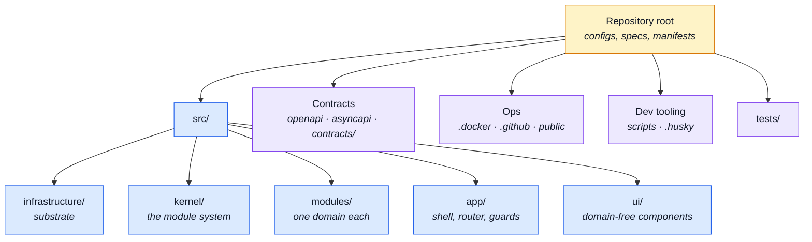

# File Glossary

**You found a filename and you do not know what it is.** This section answers that in one hop:
what the file is, what breaks without it, and which page explains the concept behind it.

It is a **map, not a theory page**. Nothing here re-explains what
[Theory](../theory/), [Tools](../tools/) or [API](../api/) already explain — every entry points
at them instead.

::: tip Looking for something else?
Reading the codebase for the first time? [Reading Path](../theory/reading-path.md) names the files
in order. This section is the opposite tool: it assumes you already hit a file and want out of it
fast.
:::

---

## The map



| Page | Covers |
|---|---|
| [Repository Root](./root.md) | Everything with no directory above it — build, test, lint and TypeScript configs |
| [App, Kernel & Types](./src-app.md) | `src/app/`, `src/kernel/`, `src/types/`, `src/locales/`, `src/styles/`, and the three files at the top of `src/` |
| [Infrastructure](./src-infrastructure.md) | `src/infrastructure/` — http, i18n, stores, composables, observability, utils |
| [Modules](./src-modules.md) | The file shapes a module is built from, and which module has which |
| [UI Kit](./src-ui.md) | `src/ui/` — the components that know no domain |
| [Contracts](./contracts.md) | `openapi.yaml`, `asyncapi.yaml`, the generated `contracts/`, Orval and Spectral config |
| [Scripts & Hooks](./scripts.md) | `scripts/`, `.husky/` |
| [Tests](./tests.md) | `tests/` and the co-located module suites |
| [Ops & Assets](./ops.md) | `.docker/`, `.github/`, compose files, `public/`, the docs site |

---

## How to read an entry

Every page is a table. Three columns, and the third is the point:

| File | What it is | Read next |
|---|---|---|
| `src/modules.ts` | The list of domains this build serves: one import and one array entry each. Enabling or disabling a domain is one line here — there is no filesystem discovery. | [Modules](../theory/modules.md) |

- **What it is** — one or two sentences, present tense, saying what the file *is* and what breaks
  without it. If an entry needs three sentences, the concept belongs in a linked page and the
  entry links to it.
- **Read next** — where the explanation lives. `—` means no page covers it yet, and that is a
  documentation gap on the record rather than a missing link.

## Three tiers, so the whole repository fits in ten pages

Most of the repository is repetition. A row per file would be neither writable nor readable, so
every tracked file lands in exactly one of three tiers.

**Named.** The file is one of a kind — `vite.config.ts`, `src/kernel/registry.ts`,
`tests/cross-cutting/published-language.spec.ts`. It gets its own row.

**Pattern.** The file is one instance of a shape that repeats. The shape gets the row and the
explanation; an inventory table says which modules have it. This is where the leverage is:
`src/modules/` collapses to about a dozen entries.

**Excluded.** Generated or vendored, stated once per directory so a reader knows it was a decision
and not an oversight. `contracts/rest/` is the one — Orval writes it from `openapi.yaml`.

Anything git does not track is out by definition: `dist/`, `coverage/`, `node_modules/`,
`.stryker-tmp/`, `docs/.vitepress/cache/`.

## Why there are no file counts here

A number in prose goes stale without anyone editing the line, and nothing distinguishes a stale
count from a current one. So the glossary states **shapes** — "one per module", "one per language"
— and leaves the counting to `git ls-files`, which is always right and always to hand:

```bash
git ls-files | awk -F/ '{if (NF==1) print "ROOT"; else print $1}' | sort | uniq -c | sort -rn
```

## Keeping this page true

Nothing enforces it. These pages are prose, and prose about a filesystem goes stale the first time
somebody adds a file without opening this section.

So the habit is the mechanism: **a commit that adds, moves or deletes a file updates the page that
names it.** The table in [the map](#the-map) says which page that is. To check a directory by hand,
compare what the glossary names against what git tracks:

```bash
git ls-files src/infrastructure | while read -r f; do
    grep -qF "\`$f\`" docs/reference/*.md || echo "undocumented: $f"
done
```

::: warning If you are writing an entry
The glossary describes what exists. If writing a row reveals a file that should not exist, raise
it — do not document a mistake into permanence.
:::

## The mirror

This repository and the paired backend are laid out on the same axis on purpose: `infrastructure`
→ `kernel` → `modules` → `app`, with the same module manifest idea underneath. Section names here
match the backend's, so moving between the two finds the same page in the same place.

Two things are genuinely this repo's own, and have no backend counterpart: [UI Kit](./src-ui.md),
and the browser-side halves of i18n and session state on
[Infrastructure](./src-infrastructure.md).
