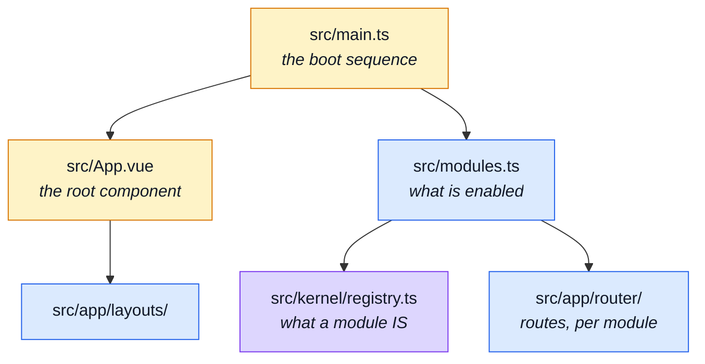

# App, Kernel & Types

The three files at the top of `src/`, the shell under `src/app/`, the module system under
`src/kernel/`, and the supporting directories.

Read [Architecture](../theory/architecture.md) first if the tiers are new: dependencies run one
way — `infrastructure` → `kernel` → `modules` → `app` — the same axis the paired backend uses, and
`eslint.config.ts` enforces it.

---

## Where these sit

## The top of `src/`

| File             | What it is                                                                                                                                                                                        | Read next                                                                                     |
| ---------------- | ------------------------------------------------------------------------------------------------------------------------------------------------------------------------------------------------- | --------------------------------------------------------------------------------------------- |
| `src/main.ts`    | The boot sequence: creates the Vue app, installs Pinia, the router, vue-i18n, Vuetify and the observability plugins, then mounts. The only file that knows the order.                             | [Runtime](../tools/runtime.md) · [Reading Path](../theory/reading-path.md)                    |
| `src/App.vue`    | The root component, and deliberately almost empty: a `<RouterView />` and a docblock. Anything a single module needs lives in that module, so deleting a domain cannot leave state stranded here. | [Modules](../theory/modules.md)                                                               |
| `src/modules.ts` | The list of domains this build serves: one import and one array entry each. Enabling or disabling a domain is one line here — there is no filesystem discovery.                                   | [Modules](../theory/modules.md) · [Adding & Removing a Module](../theory/module-lifecycle.md) |

## `src/kernel/`

| File                     | What it is                                                                                                                                                                                                                    | Read next                                                                     |
| ------------------------ | ----------------------------------------------------------------------------------------------------------------------------------------------------------------------------------------------------------------------------- | ----------------------------------------------------------------------------- |
| `src/kernel/registry.ts` | The thesis of the repository, and the mirror of the backend's: a module is a typed value, not a folder convention. Defines what a module declares — name, routes, store, locales, navigation — and validates the set at boot. | [Modules](../theory/modules.md) · [Strategic DDD](../theory/strategic-ddd.md) |

## `src/app/` — the shell

Everything that belongs to the application rather than to a domain. It knows every module exists;
nothing below it does.

| File                                         | What it is                                                                                                                                                                                                           | Read next                                                                                           |
| -------------------------------------------- | -------------------------------------------------------------------------------------------------------------------------------------------------------------------------------------------------------------------- | --------------------------------------------------------------------------------------------------- |
| `src/app/router/index.ts`                    | Builds the router from the registry. Every domain route arrives through one call, and this file names no domain — a module contributes its own routes.                                                               | [State & Routing](../tools/state-and-routing.md) · [Sitemap & Access Control](../theory/sitemap.md) |
| `src/app/router/navigation.ts`               | The navigation model: where an unauthenticated visitor is sent, and the entries the shell renders.                                                                                                                   | [Sitemap & Access Control](../theory/sitemap.md)                                                    |
| `src/app/guards/authentications.ts`          | What a visitor must be to enter a route. Absent means public, which is why access is stated per route rather than inferred.                                                                                          | [Sitemap & Access Control](../theory/sitemap.md) · [Security](../tools/security.md)                 |
| `src/app/guards/locale-choice.ts`            | Resolves the locale a route is entered under, and assembles that language's dictionary: what the build bundled, with the edited overrides on top.                                                                    | [Infrastructure](./src-infrastructure.md)                                                           |
| `src/app/layouts/LayoutDefault.vue`          | The default page chrome — header, hero, navigation, footer — that a view renders inside.                                                                                                                             | [State & Routing](../tools/state-and-routing.md)                                                    |
| `src/app/components/AppNavigation.vue`       | The app shell's navigation: the icon-only bar, the account and administration menus and the phone drawer, all built from the registry's navigation entries — grouped by `section` — rather than a hand-written list. | [Sitemap & Access Control](../theory/sitemap.md#navigation-sections)                                |
| `src/app/components/AppNavMenu.vue`          | One dropdown of navigation entries behind an icon button — the account menu and the administration menu are two instances. Adds `role="menu"` / `menuitem` on top of Vuetify's keyboard handling.                    | [Sitemap & Access Control](../theory/sitemap.md#navigation-sections)                                |
| `src/app/components/AppNavIconButton.vue`    | An icon-only button or link that still has a name: `aria-label` and a focus-openable, Escape-dismissable tooltip carry the same text.                                                                                | [Accessibility testing](../tools/accessibility-testing.md)                                          |
| `src/app/components/AppLanguageSwitcher.vue` | Switches the app language and re-enters the current route under the new locale — the URL carries the locale, so changing it is a navigation.                                                                         | [Infrastructure](./src-infrastructure.md)                                                           |
| `src/app/components/AppHealthBanner.vue`     | A banner that appears when the API cannot be reached, and only then.                                                                                                                                                 | [Observability](../tools/observability.md)                                                          |
| `src/app/views/Home.vue`                     | The landing page. Renders what the enabled modules offer, so a build without `products` still works.                                                                                                                 | [Modules](../theory/modules.md)                                                                     |
| `src/app/views/Error.vue`                    | The catch-all error view, including the 404.                                                                                                                                                                         | [State & Routing](../tools/state-and-routing.md)                                                    |
| `src/app/views/StaticPage.vue`               | One component for every prose page the shop needs — about, FAQ, terms, privacy. The copy comes from the dictionaries, so a new static page is a route plus keys, not a component.                                    | [Sitemap & Access Control](../theory/sitemap.md)                                                    |

## `src/types/`

| File                              | What it is                                                                                                                                                                | Read next                                        |
| --------------------------------- | ------------------------------------------------------------------------------------------------------------------------------------------------------------------------- | ------------------------------------------------ |
| `src/types/index.ts`              | The single import path for shared types: re-exports the generated contract models and the app's own.                                                                      | [Contracts](./contracts.md)                      |
| `src/types/api.ts`                | The REST contract types as the app consumes them, on top of the generated client.                                                                                         | [OpenAPI Workflow](../api/openapi-workflow.md)   |
| `src/types/http.ts`               | The transport-level types — the envelope, the error shape, what an interceptor sees.                                                                                      | [Infrastructure](./src-infrastructure.md)        |
| `src/types/realtime.ts`           | The realtime view models: an observability SSE event as the feed renders it.                                                                                              | [Realtime](../tools/realtime.md)                 |
| `src/types/asyncapi.generated.ts` | **Generated** by `npm run gen:asyncapi` from `asyncapi.yaml`. Never hand-edited; `npm run check:asyncapi-types` fails when the committed copy disagrees with a fresh run. | [AsyncAPI Workflow](../api/asyncapi-workflow.md) |

## Locales and styles

| Pattern              | What it is                                                                                                                                                                                                       | Read next                   |
| -------------------- | ---------------------------------------------------------------------------------------------------------------------------------------------------------------------------------------------------------------- | --------------------------- |
| `src/locales/*.json` | App-level translation bundles — the strings that belong to no module: navigation, generic errors, the shared chrome. One file per language. Module-owned strings live in `src/modules/*/locales/*.json` instead. | [Modules](./src-modules.md) |

| File                  | What it is                                                                                                | Read next             |
| --------------------- | --------------------------------------------------------------------------------------------------------- | --------------------- |
| `src/styles/main.css` | The global stylesheet: the Tailwind entry point and the handful of app-wide rules Vuetify does not cover. | [UI Kit](./src-ui.md) |
