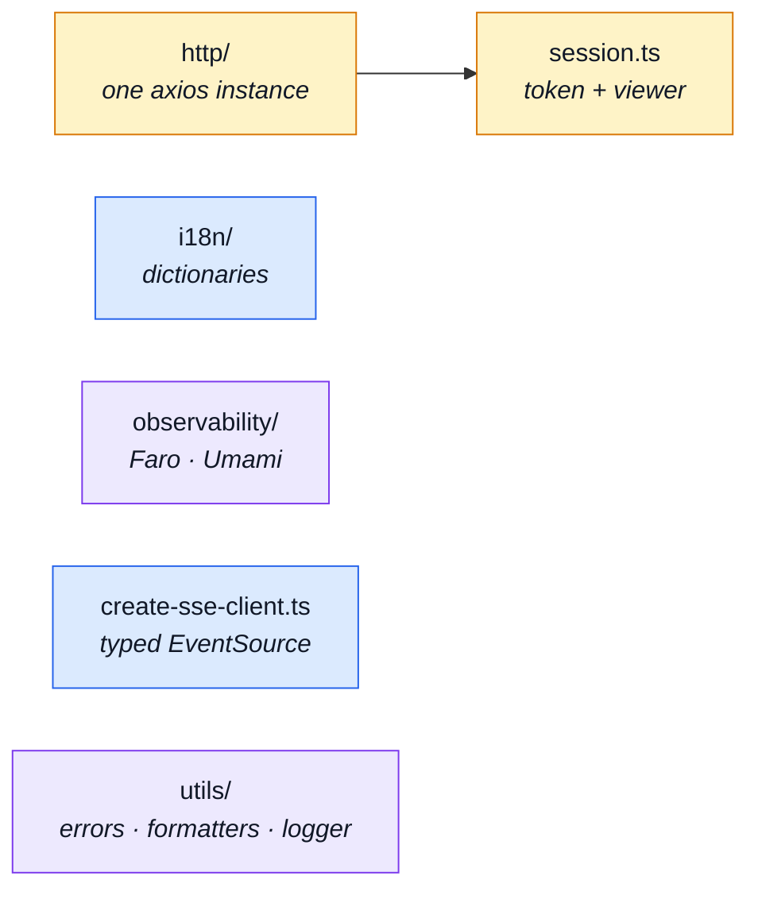

# Infrastructure

`src/infrastructure/` is the substrate: everything the application runs _on_, and nothing about
any domain. It is the bottom tier — it never knows modules exist, and `eslint.config.ts` stops it
finding out.

The mirror of the backend's tier of the same name, doing the browser-side half of the same jobs.

Each name below is a **concern**, never a kind: a folder once a concern needs more than one file,
a bare file while it needs one. There is no `stores/`, `helpers/` or `types/` bucket — a Pinia
store sits with the concern it serves, under the name of the job it does.

---

## The groups

## `http/` — the API transport

Every request the app makes goes through one axios instance. The generated clients call it; they
never build a request themselves.

| File                                             | What it is                                                                                                                                                                       | Read next                                                                    |
| ------------------------------------------------ | -------------------------------------------------------------------------------------------------------------------------------------------------------------------------------- | ---------------------------------------------------------------------------- |
| `src/infrastructure/http/index.ts`               | The transport's public surface: one axios instance, its interceptors, and the single unwrap point.                                                                               | [OpenAPI Workflow](../api/openapi-workflow.md)                               |
| `src/infrastructure/http/client.ts`              | The shared axios instance every generated client goes through — base URL, credentials, timeouts.                                                                                 | [Environment Variables](../tools/environment.md)                             |
| `src/infrastructure/http/interceptors.ts`        | Attaches the access token and reads it from outside a component scope, which is what lets a plain function make an authenticated call.                                           | [Security](../tools/security.md)                                             |
| `src/infrastructure/http/refresh.ts`             | The refresh-and-retry flow on a 401, and the endpoint list that must **never** trigger it — a 401 on the login or refresh route is a genuine answer, not a stale token.          | [Security](../tools/security.md)                                             |
| `src/infrastructure/http/envelope.ts`            | Readers for the `{ data }` envelope the API wraps most payloads in, so a caller works with the payload rather than the wrapper.                                                  | [Endpoints](../api/endpoints.md)                                             |
| `src/infrastructure/http/validate.ts`            | Whether a response is parsed through its contract schema before the app sees it — the switch that turns the API's promises into a checked claim rather than a trusted one.       | [OpenAPI Workflow](../api/openapi-workflow.md)                               |
| `src/infrastructure/http/response-schema-map.ts` | Maps every generated call site (method + URL) to the Zod schema validating its response. What makes the check above possible without a hand-written schema per call.             | [OpenAPI Workflow](../api/openapi-workflow.md) · [Contracts](./contracts.md) |
| `src/infrastructure/http/url.ts`                 | The one rule for turning a request URL into the pathname the layer matches on, so the route-schema table and the refresh exclusion list cannot recognise different sets of URLs. | [OpenAPI Workflow](../api/openapi-workflow.md)                               |
| `src/infrastructure/http/types.ts`               | The transport's own types — the request payload shape the generated clients hand over.                                                                                           | [App, Kernel & Types](./src-app.md)                                          |

## `i18n/`

| File                                          | What it is                                                                                                                                                                                | Read next                                        |
| --------------------------------------------- | ----------------------------------------------------------------------------------------------------------------------------------------------------------------------------------------- | ------------------------------------------------ |
| `src/infrastructure/i18n/index.ts`            | The vue-i18n instance and the app's translation entry point.                                                                                                                              | [App, Kernel & Types](./src-app.md)              |
| `src/infrastructure/i18n/locale-overrides.ts` | The runtime half of the dictionaries: which languages exist, and what an admin has edited. The bundled files are defaults; this is what lets copy change without a deploy.                | [Admin Dashboard](../tools/admin-dashboard.md)   |
| `src/infrastructure/i18n/router-link.ts`      | The locale-aware link helper. Imported from its own path rather than re-exported by the barrel, because a barrel re-export would pull the router into every consumer of the dictionaries. | [State & Routing](../tools/state-and-routing.md) |

## `observability/`

The two telemetry back ends behind one surface. Faro reports errors, traces and web vitals; Umami
reports product analytics. A caller emits and never learns which one answered.

| File                                         | What it is                                                                                                                                               | Read next                                                                                     |
| -------------------------------------------- | -------------------------------------------------------------------------------------------------------------------------------------------------------- | --------------------------------------------------------------------------------------------- |
| `src/infrastructure/observability/config.ts` | Environment-driven configuration for the two back ends — which are enabled, and with what keys. An unset variable is the opt-in switch: no URL, no Faro. | [Observability](../tools/observability.md) · [Environment Variables](../tools/environment.md) |
| `src/infrastructure/observability/store.ts`  | The Pinia store that lazily initialises both SDKs and exposes the one emit surface the app calls.                                                        | [Observability](../tools/observability.md) · [Umami](../tools/umami.md)                       |

## Single-file concerns

Neither has earned a folder: one file, one job, at the tier root.

| File                                      | What it is                                                                                                                                                                                                           | Read next                                                                           |
| ----------------------------------------- | -------------------------------------------------------------------------------------------------------------------------------------------------------------------------------------------------------------------- | ----------------------------------------------------------------------------------- |
| `src/infrastructure/session.ts`           | The visitor's session: a token, and the least the app must know about whoever holds it. A Pinia store, filed under what it holds rather than under what it is built with.                                            | [Security](../tools/security.md) · [State & Routing](../tools/state-and-routing.md) |
| `src/infrastructure/create-sse-client.ts` | The typed `EventSource` wrapper: subscribes to a stream, decodes each event against the generated realtime types, and reconnects. `EventSource` cannot set headers, which is why the stream authenticates by cookie. | [Realtime](../tools/realtime.md)                                                    |

## `utils/`

| File                                     | What it is                                                                                                                                          | Read next                                  |
| ---------------------------------------- | --------------------------------------------------------------------------------------------------------------------------------------------------- | ------------------------------------------ |
| `src/infrastructure/utils/logger.ts`     | The only module allowed to touch `console` — `no-console` is an error everywhere else, so this is the seam where that ban is paid for once.         | [Observability](../tools/observability.md) |
| `src/infrastructure/utils/errors.ts`     | Extracts a human-readable message from any thrown or rejected value, so a `catch` never renders `[object Object]`.                                  | [Endpoints](../api/endpoints.md)           |
| `src/infrastructure/utils/formatters.ts` | Display formatting — dates, money, and the shared fallback rendered when a value is empty or unavailable.                                           | [UI Kit](./src-ui.md)                      |
| `src/infrastructure/utils/images.ts`     | Given a record's `imageUrl` or `thumbnailUrl`, what `` gets: resolved to absolute, or the bundled placeholder when the API stored nothing. | [UI Kit](./src-ui.md)                      |
| `src/infrastructure/utils/uploads.ts`    | Client-side limits for the multipart image fields, mirroring what the API will accept so a rejection happens before the request.                    | [Security](../tools/security.md)           |
