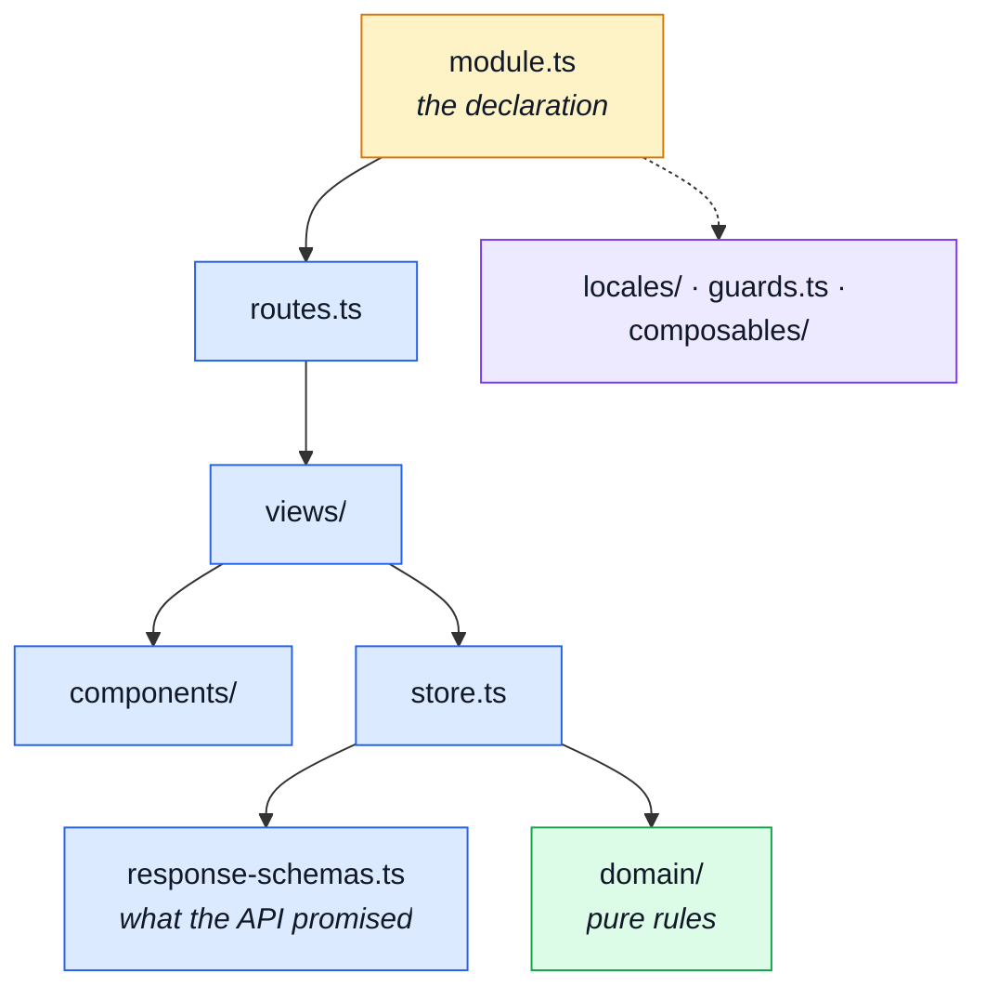

# Modules

`src/modules/` is most of the repository, and almost none of it is unique. Fourteen domains are
built from the same dozen file shapes, so this page explains each **shape** once and then says
which module carries which.

A module is a typed value declared in `module.ts`, not a folder convention — the same idea the
paired backend uses, so a domain is added or removed on both sides the same way. See
[Modules](../theory/modules.md) and
[Adding & Removing a Module](../theory/module-lifecycle.md).

---

## The shape of one module



## The core shape

| Pattern | What it is | Read next |
|---|---|---|
| `src/modules/*/module.ts` | The manifest, and the only file the application loads directly. Declares the module's name, its routes, its navigation entries and its locales. Everything else in the folder is reached through it. | [Modules](../theory/modules.md) |
| `src/modules/*/routes.ts` | The module's slice of the router: paths, the views they render, and the guard each requires. Reading it top to bottom is reading the module's URL surface. | [State & Routing](../tools/state-and-routing.md) · [Sitemap & Access Control](../theory/sitemap.md) |
| `src/modules/*/views/*.vue` | One component per route — the page. Reads the store, renders the UI kit, and owns no transport of its own. | [State & Routing](../tools/state-and-routing.md) |
| `src/modules/*/store.ts` | The Pinia store: this domain's state, the API calls that fill it, and the actions a view dispatches. The only tier that talks to the generated client. | [State & Routing](../tools/state-and-routing.md) |
| `src/modules/*/response-schemas.ts` | The Zod schemas each of this module's calls validates its response against — the module's half of the response-schema map, so the contract is checked rather than trusted. | [Infrastructure](./src-infrastructure.md) · [OpenAPI Workflow](../api/openapi-workflow.md) |
| `src/modules/*/locales/*.json` | This module's user-facing strings, one file per language. | [App, Kernel & Types](./src-app.md) |

## The optional shape

Present when the domain needs it. A module with none of these is not incomplete; it is small.

| Pattern | What it is | Read next |
|---|---|---|
| `src/modules/*/index.ts` | The public barrel: what siblings are allowed to import. Reaching past it into a module's internals is a lint error, so this file *is* the module's published surface. | [Strategic DDD](../theory/strategic-ddd.md) |
| `src/modules/*/components/*.vue` | Components that render **this domain's** data. Anything that renders a shape rather than a domain belongs in [the UI kit](./src-ui.md) instead. | [UI Kit](./src-ui.md) · [Component Testing](../tools/component-testing.md) |
| `src/modules/*/composables/*.ts` | Reusable reactive logic this domain needs and no other does. | [State & Routing](../tools/state-and-routing.md) |
| `src/modules/*/domain/*.ts` | Pure rules over plain data — no store, no HTTP, no component. A rule returns a verdict and the caller decides what to render. | [Domain Layer](../theory/domain-layer.md) |
| `src/modules/*/schemas.ts` | Form and request schemas — what this module validates before sending, as opposed to the responses it validates on arrival. | [OpenAPI Workflow](../api/openapi-workflow.md) |
| `src/modules/*/guards.ts` | Route guards specific to this domain, beyond the shared authentication ones. | [Sitemap & Access Control](../theory/sitemap.md) |
| `src/modules/*/types.ts` | View-model types this module needs that the contract does not supply. | [App, Kernel & Types](./src-app.md) |
| `src/modules/*/dictionaries.ts` | Lookup tables this domain renders from — status labels, enum captions. | [App, Kernel & Types](./src-app.md) |

## The one-offs

Shapes that exist in exactly one module. Each is a piece of a domain no other domain has.

| File | What it is | Read next |
|---|---|---|
| `src/modules/demo/provided.ts` | `demo` only. The typed `InjectionKey` and the provide/inject pair behind it, replacing a magic string that had been spelled in two files. The consumer throws rather than falling back to a placeholder, so a missing provider fails loudly. | [State & Routing](../tools/state-and-routing.md) |
| `src/modules/realtime/realtime-observability.ts` | `realtime` only. The SSE subscription this domain owns, on top of the shared typed client. | [Realtime](../tools/realtime.md) |
| `src/modules/realtime/use-realtime-observability.ts` | `realtime` only. The composable a view binds to that subscription with. | [Realtime](../tools/realtime.md) |

::: tip Where the tests are
Every module also carries `src/modules/*/tests/` — its own unit, component and e2e files. They are
catalogued on [Tests](./tests.md), with the rest of the suite.
:::

## The fourteen modules

**Extras** lists the optional shapes above that each module carries. Nothing asserts it, so it is
the row most likely to go quietly wrong — a module that gains a `guards.ts` and does not gain the
word here simply reads as not having one. Re-derive it rather than trusting it:

```bash
ls src/modules/<name>
```

| Module | What it owns | Extras |
|---|---|---|
| `src/modules/account/module.ts` | Sign-up, sign-in, the session's own screens and the profile the visitor edits. | components |
| `src/modules/admin/module.ts` | The admin shell: the dashboard, and the screens that are about operating the shop rather than shopping in it. Owns no store — each domain's own store backs its admin screens. | components · composables · types |
| `src/modules/cart/module.ts` | The cart: its contents, its totals, and the checkout entry point. | index · domain |
| `src/modules/delivery/module.ts` | Shipping methods and their prices, as the checkout presents them. Declares no routes — it contributes to another domain's screens. | index · components |
| `src/modules/demo/module.ts` | The playground: a route that demonstrates the boilerplate's own mechanisms rather than a shop feature. | components · guards |
| `src/modules/feedback/module.ts` | The contact form, open to visitors with no account. | — |
| `src/modules/inventory/module.ts` | Stock levels as the catalogue and the admin screens display them. | — |
| `src/modules/locales/module.ts` | Which languages this deployment offers, and the admin screens that edit the dictionaries at runtime. | components · dictionaries |
| `src/modules/orders/module.ts` | Placed orders: the visitor's own history, and the admin's view of everyone's. | schemas |
| `src/modules/payments/module.ts` | The payment step of a checkout. Declares no routes — it renders inside the cart's flow. | index · components · composables |
| `src/modules/products/module.ts` | The catalogue: listing, detail, search, and the admin's write screens. | index · schemas |
| `src/modules/realtime/module.ts` | The live observability feed, and the typed SSE subscription behind it. Owns no store — the stream is the state. | — |
| `src/modules/users/module.ts` | The admin's user management screens. | index · schemas |
| `src/modules/wishlist/module.ts` | The saved-items list and its entry points from the catalogue. | index |
