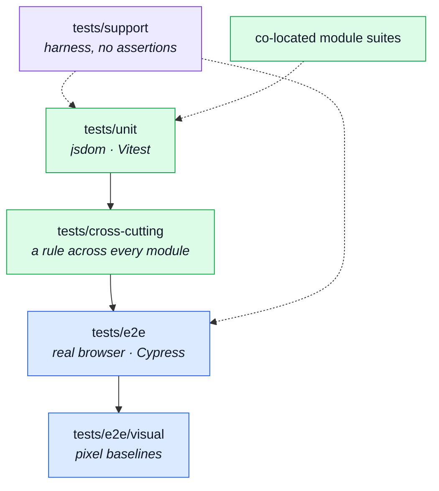

# Tests

Every file here is a distinct guarantee, which is why this page names them one at a time: knowing
_which_ test covers a rule is most of the value of having it.

Tests live in two places, and the split is by scope. A test about **one module** lives inside that
module. A test about **the system** — infrastructure, the kernel, the app shell, or a rule that
holds across all fourteen modules — lives in `tests/`.

---

## The four suites, and what runs them

**Vitest** owns everything that runs in jsdom: pure functions, stores, composables, and single
components mounted with `@vue/test-utils`. **Cypress** owns everything needing a real browser — and
in this repo that means a real backend too, since the mock layer was retired in favour of the
paired backend's demo profile.

## `tests/cross-cutting/` — rules that hold across every module

One file per architectural rule, asserted over all fourteen modules at once. A new module is
covered the day it is added.

Two files used to live here: `context-map.spec.ts` and `subdomain-discipline.spec.ts`, reconciling
a typed `dependsOn`/`subdomain` field against real imports and real folders. Both are gone along
with the fields — the coupling half moved to a generated ESLint rule (`MODULE_EDGES` in
`eslint.config.ts`), checked structurally on every `npm run lint`. See
[Strategic DDD](../theory/strategic-ddd.md) §2 and §4.

| File                                                    | What it guarantees                                                                                                                        | Read next                                                  |
| ------------------------------------------------------- | ----------------------------------------------------------------------------------------------------------------------------------------- | ---------------------------------------------------------- |
| `tests/cross-cutting/registry.spec.ts`                  | Every enabled module's manifest satisfies the invariants any module must — routes named, navigation pointing at a real route.             | [Modules](../theory/modules.md)                            |
| `tests/cross-cutting/published-language.spec.ts`        | A module's barrel publishes exactly what its siblings import — no more, no less.                                                          | [Modules](../theory/modules.md)                            |
| `tests/cross-cutting/form-idiom.spec.ts`                | Every form goes through `useAppForm`, keeps no second "show errors" flag of its own, and hands the composable an element to focus into.   | [UI Kit](./src-ui.md)                                      |
| `tests/cross-cutting/store-location.spec.ts`            | Every `defineStore` under `src/modules/` sits where the coverage floor's globs look — `store.ts`, or `stores/` for a module with several. | [State & Routing](../tools/state-and-routing.md)           |
| `tests/cross-cutting/schemas-i18n.spec.ts`              | Every validation message resolves to a real dictionary key, so a form never renders a raw key at a user.                                  | [App, Kernel & Types](./src-app.md)                        |
| `tests/cross-cutting/a11y-coverage.spec.ts`             | Every route reachable in the app is covered by the accessibility sweep — the check that stops a new page quietly escaping it.             | [Accessibility Testing](../tools/accessibility-testing.md) |
| `tests/cross-cutting/coverage-and-mutate-scope.spec.ts` | The coverage and Stryker `mutate` scopes still match the code that exists, so neither silently stops measuring a directory.               | [Mutation Testing](../tools/mutation-testing.md)           |
| `tests/cross-cutting/mutation-safe-imports.spec.ts`     | No import pattern that would break under Stryker's instrumentation.                                                                       | [Mutation Testing](../tools/mutation-testing.md)           |

## `tests/unit/`

| File                                                    | What it guarantees                                                                               | Read next                                        |
| ------------------------------------------------------- | ------------------------------------------------------------------------------------------------ | ------------------------------------------------ |
| `tests/unit/kernel/registry.spec.ts`                    | The registry's route- and navigation-collecting functions behave correctly on synthetic modules. | [Modules](../theory/modules.md)                  |
| `tests/unit/app/router/router.spec.ts`                  | The router is assembled from the registry, and a module's routes arrive under the locale prefix. | [State & Routing](../tools/state-and-routing.md) |
| `tests/unit/app/router/navigation.spec.ts`              | The navigation model: what the shell renders, and where an unauthenticated visitor is sent.      | [Sitemap & Access Control](../theory/sitemap.md) |
| `tests/unit/app/guards/authentications.spec.ts`         | A route's declared requirement is enforced, and a public route stays public.                     | [Sitemap & Access Control](../theory/sitemap.md) |
| `tests/unit/app/guards/authentications-restore.spec.ts` | A visitor sent to sign in is returned to where they were aiming.                                 | [Security](../tools/security.md)                 |
| `tests/unit/app/guards/locale-choice.spec.ts`           | The locale a route is entered under, and the dictionary assembled for it.                        | [Infrastructure](./src-infrastructure.md)        |
| `tests/unit/app/app-navigation.spec.ts`                 | The shell's navigation renders from the registry rather than a hand-written list.                | [App, Kernel & Types](./src-app.md)              |

### `tests/unit/infrastructure/`

| File                                                                | What it guarantees                                                                                                                         | Read next                                        |
| ------------------------------------------------------------------- | ------------------------------------------------------------------------------------------------------------------------------------------ | ------------------------------------------------ |
| `tests/unit/infrastructure/http/client.spec.ts`                     | The axios instance's base URL, credentials and timeouts.                                                                                   | [Infrastructure](./src-infrastructure.md)        |
| `tests/unit/infrastructure/http/http.spec.ts`                       | The transport's public surface — what a caller gets back, and in what shape.                                                               | [Endpoints](../api/endpoints.md)                 |
| `tests/unit/infrastructure/http/http-request.spec.ts`               | Request assembly, including the JSON-or-multipart duality the generated clients hand over.                                                 | [OpenAPI Workflow](../api/openapi-workflow.md)   |
| `tests/unit/infrastructure/http/http-refresh.spec.ts`               | The refresh-and-retry flow, and that the endpoints excluded from it stay excluded — a 401 on login is an answer, not a stale token.        | [Security](../tools/security.md)                 |
| `tests/unit/infrastructure/http/http-validate-responses.spec.ts`    | Responses are parsed through their contract schema when validation is on, and a mismatch is caught at the boundary.                        | [OpenAPI Workflow](../api/openapi-workflow.md)   |
| `tests/unit/infrastructure/http/url.spec.ts`                        | Query strings, absolute URLs and the leading slash — the normalisation both the schema table and the refresh exclusion list match against. | [Contracts](./contracts.md)                      |
| `tests/unit/infrastructure/http/response-schema-map.spec.ts`        | Every generated call site maps to a schema — the check that stops a new endpoint being silently unvalidated.                               | [Contracts](./contracts.md)                      |
| `tests/unit/infrastructure/i18n/i18n.spec.ts`                       | Dictionary resolution, including the array messages `tm()` and `rt()` render.                                                              | [App, Kernel & Types](./src-app.md)              |
| `tests/unit/infrastructure/i18n/locale-overrides.spec.ts`           | Admin-edited copy overlays the bundled defaults, and removing an override restores the default.                                            | [Admin Dashboard](../tools/admin-dashboard.md)   |
| `tests/unit/infrastructure/session.spec.ts`                         | The session store: what is held, what is cleared, and when.                                                                                | [Security](../tools/security.md)                 |
| `tests/unit/infrastructure/observability.spec.ts`                   | Faro and Umami are wired behind one surface, and a disabled back end is a no-op rather than a crash.                                       | [Observability](../tools/observability.md)       |
| `tests/unit/infrastructure/create-sse-client.spec.ts`               | The typed SSE wrapper: decoding, reconnection, and cleanup on unmount.                                                                     | [Realtime](../tools/realtime.md)                 |
| `tests/unit/infrastructure/composables/use-upload-progress.spec.ts` | Upload progress state, including the failure path.                                                                                         | [UI Kit](./src-ui.md)                            |
| `tests/unit/infrastructure/utils/errors.spec.ts`                    | A human-readable message out of any thrown value, so a `catch` never renders `[object Object]`.                                            | [Endpoints](../api/endpoints.md)                 |
| `tests/unit/infrastructure/utils/formatters.spec.ts`                | Date, money and fallback rendering.                                                                                                        | [UI Kit](./src-ui.md)                            |
| `tests/unit/infrastructure/utils/formatters.property.spec.ts`       | The same, as **properties** over generated inputs rather than examples.                                                                    | [Property Testing](../tools/property-testing.md) |
| `tests/unit/infrastructure/utils/logger.spec.ts`                    | The one module allowed to touch `console` behaves as the rest of the app assumes.                                                          | [Observability](../tools/observability.md)       |
| `tests/unit/infrastructure/utils/uploads.spec.ts`                   | The client-side limits, so a rejection happens before the request.                                                                         | [Security](../tools/security.md)                 |

### `tests/unit/ui/` and `tests/unit/scripts/`

| File                                             | What it guarantees                                                                                                                                          | Read next                                        |
| ------------------------------------------------ | ----------------------------------------------------------------------------------------------------------------------------------------------------------- | ------------------------------------------------ |
| `tests/unit/ui/form-counter-input.spec.ts`       | The counter's bounds and emitted value.                                                                                                                     | [UI Kit](./src-ui.md)                            |
| `tests/unit/ui/form-image-upload.spec.ts`        | File selection, preview and the limits it enforces.                                                                                                         | [UI Kit](./src-ui.md)                            |
| `tests/unit/ui/list-pagination.spec.ts`          | Page maths and the events a parent listens for.                                                                                                             | [UI Kit](./src-ui.md)                            |
| `tests/unit/scripts/cypress-spec-globs.spec.ts`  | The five spellings of the Cypress spec set resolve to the same files — `package.json`'s `--spec` arguments included, since they cannot import the constant. | [Package Scripts](../tools/package-scripts.md)   |
| `tests/unit/scripts/spec-identity.spec.ts`       | The cross-repo shared-file list, and that this checkout matches the sibling.                                                                                | [Contracts](./contracts.md)                      |
| `tests/unit/scripts/paired-backend-path.spec.ts` | Sibling-checkout resolution, including the empty-value case an `??` would get wrong.                                                                        | [Scripts & Hooks](./scripts.md)                  |
| `tests/unit/scripts/mutation-baseline.spec.ts`   | The ratchet reads a Stryker report into per-file scores correctly.                                                                                          | [Mutation Testing](../tools/mutation-testing.md) |

## `tests/e2e/` — a real browser against a real backend

| File                               | What it guarantees                                                           | Read next                                                  |
| ---------------------------------- | ---------------------------------------------------------------------------- | ---------------------------------------------------------- |
| `tests/e2e/specs/home.cy.ts`       | The landing page renders and its entry points work.                          | [Live E2E](../tools/live-e2e.md)                           |
| `tests/e2e/specs/storefront.cy.ts` | Browsing the catalogue: listing, search, detail.                             | [Live E2E](../tools/live-e2e.md)                           |
| `tests/e2e/specs/commerce.cy.ts`   | Cart and checkout against real API responses.                                | [Live E2E](../tools/live-e2e.md)                           |
| `tests/e2e/specs/journey.cy.ts`    | The full visitor journey end to end, the one spec that crosses every domain. | [Live E2E](../tools/live-e2e.md)                           |
| `tests/e2e/specs/locale.cy.ts`     | Switching language re-enters the route and the copy follows.                 | [Live E2E](../tools/live-e2e.md)                           |
| `tests/e2e/specs/uploads.cy.ts`    | The multipart image path, including a file the API must refuse.              | [Security](../tools/security.md)                           |
| `tests/e2e/specs/resilience.cy.ts` | What the app does when the API is slow, unreachable, or answers an error.    | [Observability](../tools/observability.md)                 |
| `tests/e2e/specs/a11y.cy.ts`       | The accessibility sweep over every reachable route.                          | [Accessibility Testing](../tools/accessibility-testing.md) |
| `tests/e2e/visual/visual.cy.ts`    | The visual-regression run: each baseline screenshot compared pixel-wise.     | [Visual Regression](../tools/visual-regression.md)         |

| Pattern                                | What it is                                                                                                                                                                                   | Read next                                          |
| -------------------------------------- | -------------------------------------------------------------------------------------------------------------------------------------------------------------------------------------------- | -------------------------------------------------- |
| `tests/e2e/visual/__snapshots__/*.png` | The committed visual baselines — what a page is _supposed_ to look like. A failure diff is never committed: recording a failure as expected output is how a regression becomes the baseline. | [Visual Regression](../tools/visual-regression.md) |
| `tests/e2e/fixtures/*`                 | Files the browser suites upload, including one that is deliberately not an image.                                                                                                            | [Security](../tools/security.md)                   |

## `tests/support/` — the harness

No assertions live here.

| File                                                | What it is                                                                                                                                                                                                                                                                                                                        | Read next                                                  |
| --------------------------------------------------- | --------------------------------------------------------------------------------------------------------------------------------------------------------------------------------------------------------------------------------------------------------------------------------------------------------------------------------- | ---------------------------------------------------------- |
| `tests/support/unit/setup.ts`                       | Vitest's per-run bootstrap: global plugins, and the state reset between cases.                                                                                                                                                                                                                                                    | [Unit Testing](../tools/unit-testing.md)                   |
| `tests/support/unit/wire-modules.ts`                | Builds a router and registry from a chosen set of modules, so a test can exercise one domain without booting all fourteen.                                                                                                                                                                                                        | [Modules](../theory/modules.md)                            |
| `tests/support/unit/jsdom-quiet-css.environment.ts` | Silences jsdom's unparseable-CSS noise, which Vuetify's stylesheets otherwise emit on every mount.                                                                                                                                                                                                                                | [Unit Testing](../tools/unit-testing.md)                   |
| `tests/support/stub.ts`                             | The one sanctioned cast for a hand-built stub, and the reason double casts can be banned everywhere else.                                                                                                                                                                                                                         | [Repository Root](./root.md)                               |
| `tests/support/e2e/e2e.ts`                          | Cypress's support entry point — what loads before every browser spec.                                                                                                                                                                                                                                                             | [Live E2E](../tools/live-e2e.md)                           |
| `tests/support/e2e/commands.ts`                     | The custom commands the specs are written in, including `cy.loginAs()`, `cy.resetState()` — the latter branching on which backend profile is running — and the chrome navigation trio `cy.navigateTo(path)`, `cy.navigateViaMenu(menu, path)`, `cy.logout()`, which address the bar and its menus by `href` rather than by label. | [Live E2E](../tools/live-e2e.md)                           |
| `tests/support/e2e/a11y-sweep.ts`                   | The reusable accessibility pass a spec applies to a page.                                                                                                                                                                                                                                                                         | [Accessibility Testing](../tools/accessibility-testing.md) |
| `tests/support/e2e/visual-sweep.ts`                 | The reusable screenshot-and-compare pass.                                                                                                                                                                                                                                                                                         | [Visual Regression](../tools/visual-regression.md)         |
| `tests/support/e2e/visual-task.ts`                  | The Node-side task behind it — image comparison cannot run in the browser.                                                                                                                                                                                                                                                        | [Visual Regression](../tools/visual-regression.md)         |

## Co-located module tests

| Pattern                                       | What it is                                                                                                                                                                                                                                                 | Read next                                          |
| --------------------------------------------- | ---------------------------------------------------------------------------------------------------------------------------------------------------------------------------------------------------------------------------------------------------------- | -------------------------------------------------- |
| `src/modules/*/tests/*.spec.ts`               | The module's own unit suites — one per subject, most commonly its store and its routes.                                                                                                                                                                    | [Unit Testing](../tools/unit-testing.md)           |
| `src/modules/*/tests/e2e/*.cy.ts`             | Browser specs that belong to one domain, including its slice of the accessibility sweep.                                                                                                                                                                   | [Live E2E](../tools/live-e2e.md)                   |
| `src/modules/*/tests/e2e/__snapshots__/*.png` | That domain's own visual baselines. Most of the repo's baselines live here rather than under `tests/e2e/visual/`, for the same reason its specs do: a screenshot of the orders table belongs to `orders`, and `rm -rf` on the module should take it along. | [Visual Regression](../tools/visual-regression.md) |
