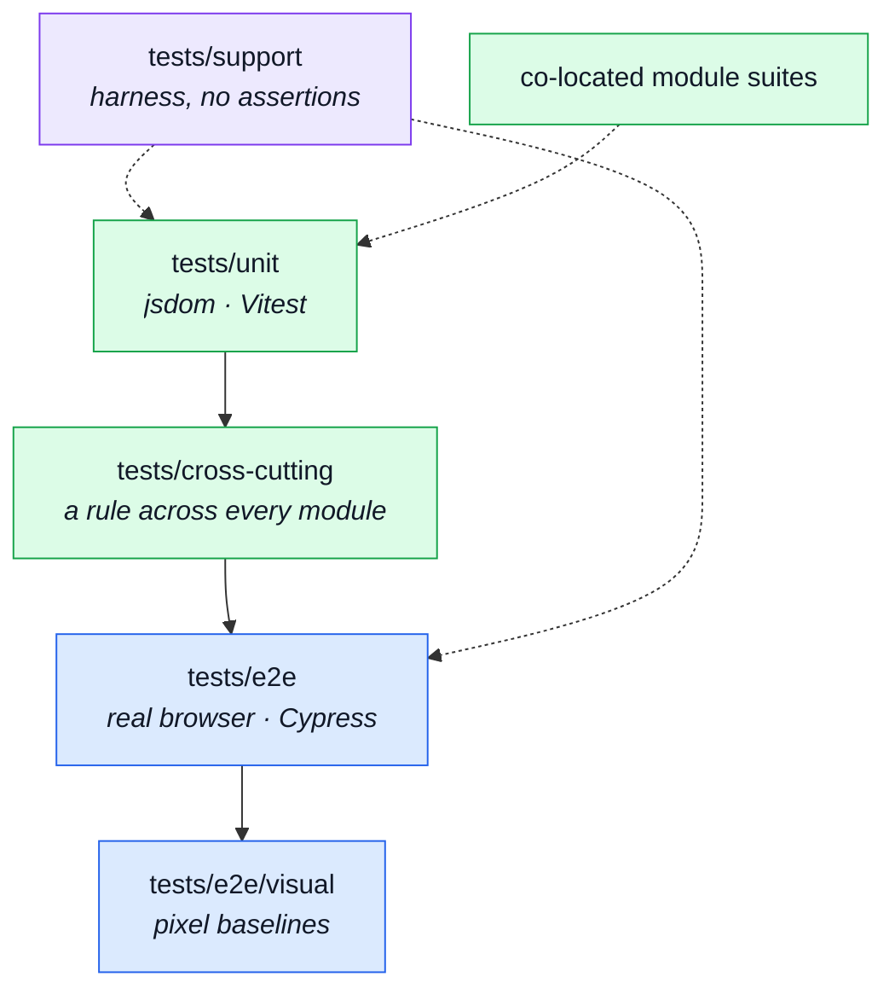
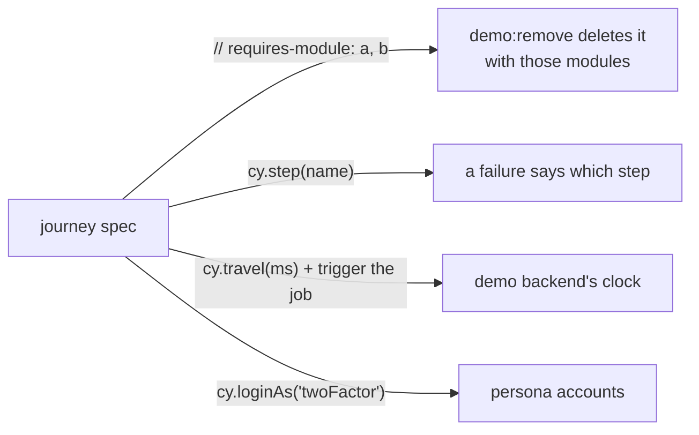
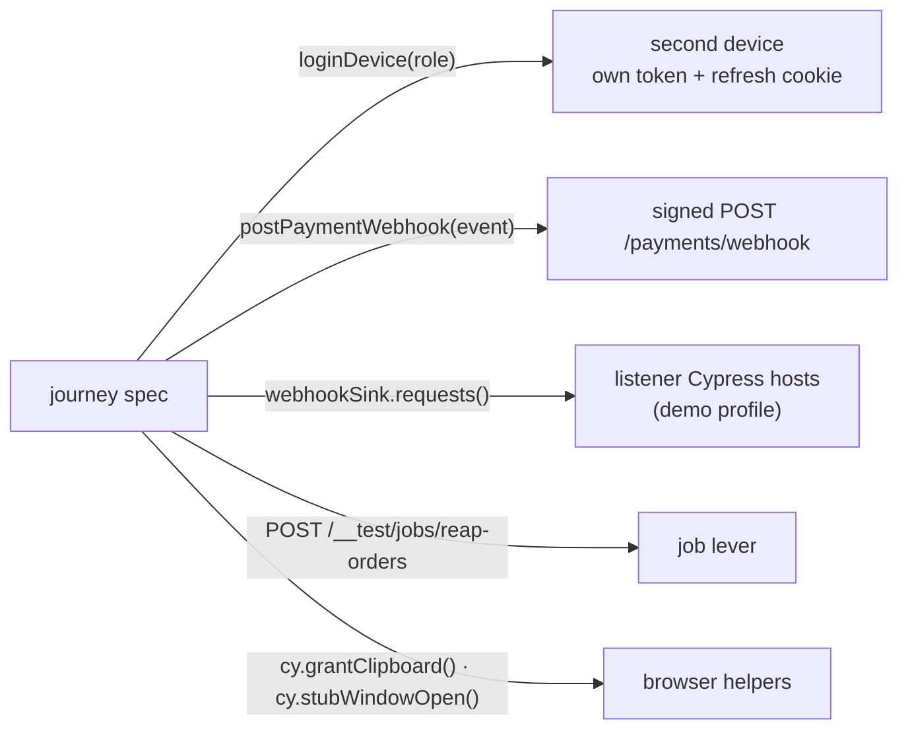

# Tests

Every file here is a distinct guarantee, which is why this page names them one at a time: knowing
_which_ test covers a rule is most of the value of having it.

Tests live in two places, and the split is by scope. A test about **one module** lives inside that
module. A test about **the system** — infrastructure, the kernel, the app shell, or a rule that
holds across every module — lives in `tests/`.

---

## The four suites, and what runs them

```mermaid
%%{init: {'flowchart': {'nodeSpacing': 35, 'rankSpacing': 45}}}%%
flowchart TD
    U["tests/unit<br/><i>jsdom · Vitest</i>"] --> X["tests/cross-cutting<br/><i>a rule across every module</i>"]
    X --> E["tests/e2e<br/><i>real browser · Cypress</i>"]
    E --> V["tests/e2e/visual<br/><i>pixel baselines</i>"]
    Sup["tests/support<br/><i>harness, no assertions</i>"] -.-> U
    Sup -.-> E
    Mod["co-located module suites"] -.-> U

    classDef fast fill:#dcfce7,stroke:#16a34a,color:#111827;
    classDef slow fill:#dbeafe,stroke:#2563eb,color:#111827;
    classDef help fill:#ede9fe,stroke:#7c3aed,color:#111827;
    class U,X,Mod fast;
    class E,V slow;
    class Sup help;
```

**Vitest** owns everything that runs in jsdom: pure functions, stores, composables, and single
components mounted with `@vue/test-utils`. **Cypress** owns everything needing a real browser — and
in this repo that means a real backend too, since the mock layer was retired in favour of the
paired backend's demo profile.

## `tests/cross-cutting/` — rules that hold across every module

One file per architectural rule, asserted over every module at once. A new module is
covered the day it is added.

Module coupling is not among them: which module may import which is a generated ESLint rule
(`MODULE_EDGES` in `eslint.config.ts`), enforced at the import on every `npm run lint` rather than
reconciled against a manifest field here. See
[Strategic DDD](../theory/strategic-ddd.md) §2 and §4.

| File                                                     | What it guarantees                                                                                                                                                    | Read next                                                  |
| -------------------------------------------------------- | --------------------------------------------------------------------------------------------------------------------------------------------------------------------- | ---------------------------------------------------------- |
| `tests/cross-cutting/registry.spec.ts`                   | Every enabled module's manifest satisfies the invariants any module must — routes named, navigation pointing at a real route.                                         | [Modules](../theory/modules.md)                            |
| `tests/cross-cutting/published-language.spec.ts`         | A module's barrel publishes exactly what its siblings import — no more, no less.                                                                                      | [Modules](../theory/modules.md)                            |
| `tests/cross-cutting/form-idiom.spec.ts`                 | Every form supplies the toolkit's three answers (`useStructureFormValidation`), keeps no second "show errors" flag of its own, and hands it an element to focus into. | [UI Kit](./src-ui.md)                                      |
| `tests/cross-cutting/store-location.spec.ts`             | Every `defineStore` under `src/modules/` sits where the coverage floor's globs look — `store.ts`, or `stores/` for a module with several.                             | [State & Routing](../tools/state-and-routing.md)           |
| `tests/cross-cutting/schemas-i18n.spec.ts`               | Every validation message resolves to a real dictionary key, so a form never renders a raw key at a user.                                                              | [App, Kernel & Types](./src-app.md)                        |
| `tests/cross-cutting/a11y-coverage.spec.ts`              | Every route reachable in the app is covered by the accessibility sweep — the check that stops a new page quietly escaping it.                                         | [Accessibility Testing](../tools/accessibility-testing.md) |
| `tests/cross-cutting/coverage-and-mutate-scope.spec.ts`  | The coverage and Stryker `mutate` scopes still match the code that exists, so neither silently stops measuring a directory.                                           | [Mutation Testing](../tools/mutation-testing.md)           |
| `tests/cross-cutting/mutation-safe-imports.spec.ts`      | No import pattern that would break under Stryker's instrumentation.                                                                                                   | [Mutation Testing](../tools/mutation-testing.md)           |
| `tests/cross-cutting/backend-pairing.spec.ts`            | Every enabled module names the backend module that answers it, or says why none does — the one place that names a domain on the other side.                           | [Contracts](./contracts.md)                                |
| `tests/cross-cutting/module-coupling.spec.ts`            | A module's `@api` calls stay inside its declared `MODULE_EDGES` coupling — the contract-level twin of the import boundary.                                            | [Strategic DDD](../theory/strategic-ddd.md)                |
| `tests/cross-cutting/module-file-shapes.spec.ts`         | Every file in a module folder matches a named shape; a stray helpers folder or utils file fails by name.                                                              | [Modules](../theory/modules.md)                            |
| `tests/cross-cutting/module-groups.spec.ts`              | Every enabled module sits on the `foundation` / `shop` axis.                                                                                                          | [Modules](../theory/modules.md)                            |
| `tests/cross-cutting/journey-headers.spec.ts`            | Every journey names the modules it needs on a `// requires-module:` line, and only real ones — so `demo:remove` can delete it.                                        | [Journeys](#journeys--stories-that-cross-modules)          |
| `tests/cross-cutting/route-name-coupling.spec.ts`        | A module naming a sibling's route is either a declared edge or guarded by `router.hasRoute`.                                                                          | [Modules](../theory/modules.md)                            |
| `tests/cross-cutting/sitemap-document.spec.ts`           | The route table on the sitemap page is exactly what the enabled modules contribute; also regenerates it.                                                              | [Sitemap & Access Control](../theory/sitemap.md)           |
| `tests/cross-cutting/badge-name.spec.ts`                 | Every count the app renders is announced as a count, not as "Badge".                                                                                                  | [Accessibility Testing](../tools/accessibility-testing.md) |
| `tests/cross-cutting/destructive-confirm-naming.spec.ts` | Every destructive confirmation names what it is destroying.                                                                                                           | [Accessibility Testing](../tools/accessibility-testing.md) |
| `tests/cross-cutting/entry-chunk-budget.spec.ts`         | The entry chunk stays under its byte budget — a real production build is inspected.                                                                                   | [Runtime](../tools/runtime.md)                             |
| `tests/cross-cutting/page-window-density.spec.ts`        | The toolkit's paged window is dense, so nothing that binds it filters it.                                                                                             | [State & Routing](../tools/state-and-routing.md)           |

## `tests/unit/`

| File                                                    | What it guarantees                                                                               | Read next                                        |
| ------------------------------------------------------- | ------------------------------------------------------------------------------------------------ | ------------------------------------------------ |
| `tests/unit/kernel/registry.spec.ts`                    | The registry's route- and navigation-collecting functions behave correctly on synthetic modules. | [Modules](../theory/modules.md)                  |
| `tests/unit/app/router/router.spec.ts`                  | The router is assembled from the registry, and a module's routes arrive under the locale prefix. | [State & Routing](../tools/state-and-routing.md) |
| `tests/unit/app/router/navigation.spec.ts`              | The navigation model: what the shell renders, and where an unauthenticated visitor is sent.      | [Sitemap & Access Control](../theory/sitemap.md) |
| `tests/unit/app/guards/authentications.spec.ts`         | A route's declared requirement is enforced, and a public route stays public.                     | [Sitemap & Access Control](../theory/sitemap.md) |
| `tests/unit/app/guards/authentications-restore.spec.ts` | A visitor sent to sign in is returned to where they were aiming.                                 | [Security](../tools/security.md)                 |
| `tests/unit/app/guards/locale-choice.spec.ts`           | The locale a route is entered under, and the dictionary assembled for it.                        | [Infrastructure](./src-infrastructure.md)        |
| `tests/unit/app/app-navigation.spec.ts`                 | The shell's navigation renders from the registry rather than a hand-written list.                | [App, Kernel & Types](./src-app.md)              |

### `tests/unit/infrastructure/`

| File                                                             | What it guarantees                                                                                                                         | Read next                                        |
| ---------------------------------------------------------------- | ------------------------------------------------------------------------------------------------------------------------------------------ | ------------------------------------------------ |
| `tests/unit/infrastructure/http/client.spec.ts`                  | The axios instance's base URL, credentials and timeouts.                                                                                   | [Infrastructure](./src-infrastructure.md)        |
| `tests/unit/infrastructure/http/http.spec.ts`                    | The transport's public surface — what a caller gets back, and in what shape.                                                               | [Endpoints](../api/endpoints.md)                 |
| `tests/unit/infrastructure/http/http-request.spec.ts`            | Request assembly, including the JSON-or-multipart duality the generated clients hand over.                                                 | [OpenAPI Workflow](../api/openapi-workflow.md)   |
| `tests/unit/infrastructure/http/http-refresh.spec.ts`            | The refresh-and-retry flow, and that the endpoints excluded from it stay excluded — a 401 on login is an answer, not a stale token.        | [Security](../tools/security.md)                 |
| `tests/unit/infrastructure/http/http-validate-responses.spec.ts` | Responses are parsed through their contract schema when validation is on, and a mismatch is caught at the boundary.                        | [OpenAPI Workflow](../api/openapi-workflow.md)   |
| `tests/unit/infrastructure/http/url.spec.ts`                     | Query strings, absolute URLs and the leading slash — the normalisation both the schema table and the refresh exclusion list match against. | [Contracts](./contracts.md)                      |
| `tests/unit/infrastructure/http/response-schema-map.spec.ts`     | Every generated call site maps to a schema — the check that stops a new endpoint being silently unvalidated.                               | [Contracts](./contracts.md)                      |
| `tests/unit/infrastructure/locale-overrides.spec.ts`             | Admin-edited copy overlays the bundled defaults, and removing an override restores the default.                                            | [Admin Dashboard](../tools/admin-dashboard.md)   |
| `tests/unit/infrastructure/session.spec.ts`                      | The session store: what is held, what is cleared, and when.                                                                                | [Security](../tools/security.md)                 |
| `tests/unit/infrastructure/observability.spec.ts`                | Faro and Umami are wired behind one surface, and a disabled back end is a no-op rather than a crash.                                       | [Observability](../tools/observability.md)       |
| `tests/unit/infrastructure/create-sse-client.spec.ts`            | The typed SSE wrapper: decoding, reconnection, and cleanup on unmount.                                                                     | [Realtime](../tools/realtime.md)                 |
| `tests/unit/infrastructure/utils/errors.spec.ts`                 | A human-readable message out of any thrown value, so a `catch` never renders `[object Object]`.                                            | [Endpoints](../api/endpoints.md)                 |
| `tests/unit/infrastructure/utils/formatters.spec.ts`             | Date, money and fallback rendering.                                                                                                        | [UI Kit](./src-ui.md)                            |
| `tests/unit/infrastructure/utils/formatters.property.spec.ts`    | The same, as **properties** over generated inputs rather than examples.                                                                    | [Property Testing](../tools/property-testing.md) |
| `tests/unit/infrastructure/utils/logger.spec.ts`                 | The one module allowed to touch `console` behaves as the rest of the app assumes.                                                          | [Observability](../tools/observability.md)       |
| `tests/unit/infrastructure/utils/uploads.spec.ts`                | The client-side limits, so a rejection happens before the request.                                                                         | [Security](../tools/security.md)                 |

### `tests/unit/i18n/` — the extractable runtime (FE-D5)

| File                                     | What it guarantees                                                            | Read next                           |
| ---------------------------------------- | ----------------------------------------------------------------------------- | ----------------------------------- |
| `tests/unit/i18n/i18n.spec.ts`           | Dictionary resolution, including the array messages `tm()` and `rt()` render. | [App, Kernel & Types](./src-app.md) |
| `tests/unit/i18n/language-label.spec.ts` | A language's display name, falling through translated → native → `Intl` name. | [App, Kernel & Types](./src-app.md) |

### `tests/unit/ui/` and `tests/unit/scripts/`

| File                                                     | What it guarantees                                                                                                                                          | Read next                                         |
| -------------------------------------------------------- | ----------------------------------------------------------------------------------------------------------------------------------------------------------- | ------------------------------------------------- |
| `tests/unit/ui/form-counter-input.spec.ts`               | The counter's bounds and emitted value.                                                                                                                     | [UI Kit](./src-ui.md)                             |
| `tests/unit/ui/form-image-upload.spec.ts`                | File selection, preview and the limits it enforces.                                                                                                         | [UI Kit](./src-ui.md)                             |
| `tests/unit/ui/list-pagination.spec.ts`                  | Page maths and the events a parent listens for.                                                                                                             | [UI Kit](./src-ui.md)                             |
| `tests/unit/scripts/e2e/cypress-spec-globs.spec.ts`      | The five spellings of the Cypress spec set resolve to the same files — `package.json`'s `--spec` arguments included, since they cannot import the constant. | [Package Scripts](../tools/package-scripts.md)    |
| `tests/unit/scripts/demo/demo-remove-tests.spec.ts`      | `demo:remove` deletes a spec by its `requires-module` header or an import of a removed module, keeps the rest, and the header check can fail.               | [Journeys](#journeys--stories-that-cross-modules) |
| `tests/unit/scripts/e2e/device-session.spec.ts`          | A second device keeps its own refresh cookie, rotates its token on a refresh, and answers a refused call as data.                                           | [Journeys](#journeys--stories-that-cross-modules) |
| `tests/unit/scripts/e2e/payment-webhook.spec.ts`         | A payment event is signed as `t=…,v1=<HMAC of "<t>.<body>">` over the exact bytes sent, with the demo secret unless the environment names one.              | [Journeys](#journeys--stories-that-cross-modules) |
| `tests/unit/scripts/e2e/webhook-sink.spec.ts`            | The sink records what arrives, checks the Standard Webhooks signature, and refuses a port that is taken.                                                    | [Journeys](#journeys--stories-that-cross-modules) |
| `tests/unit/scripts/e2e/antibot-backend.spec.ts`         | The antibot backend's environment is altcha with a secret and a low cost, and the live workflow boots its matrix entry with the same values.                | [Live E2E](../tools/live-e2e.md#the-antibot-run)  |
| `tests/unit/scripts/e2e/step-prefix.spec.ts`             | A failure message gets the `[step: …]` line once, and not before a step starts.                                                                             | [Journeys](#journeys--stories-that-cross-modules) |
| `tests/unit/scripts/e2e/cents.spec.ts`                   | A money text reads as an integer count of cents in any locale, so amounts compare without caring how each is spelled.                                       | [Journeys](#journeys--stories-that-cross-modules) |
| `tests/unit/scripts/e2e/mail-message.spec.ts`            | A Mailpit message reads back as the outbox's shape (code, link, attachments, text), and `mailMentions` finds a needle in either.                            | [Journeys](#journeys--stories-that-cross-modules) |
| `tests/unit/scripts/pairing/spec-identity.spec.ts`       | The cross-repo shared-file list, and that this checkout matches the sibling.                                                                                | [Contracts](./contracts.md)                       |
| `tests/unit/scripts/pairing/paired-backend-path.spec.ts` | Sibling-checkout resolution, including the empty-value case an `??` would get wrong.                                                                        | [Scripts & Hooks](./scripts.md)                   |
| `tests/unit/scripts/mutation/baseline.spec.ts`           | The ratchet reads a Stryker report into per-file scores correctly.                                                                                          | [Mutation Testing](../tools/mutation-testing.md)  |

## `tests/e2e/` — a real browser against a real backend

| File                                    | What it guarantees                                                                                                                                                                                                | Read next                                                  |
| --------------------------------------- | ----------------------------------------------------------------------------------------------------------------------------------------------------------------------------------------------------------------- | ---------------------------------------------------------- |
| `tests/e2e/specs/storefront.cy.ts`      | Browsing the catalogue: listing, search, detail.                                                                                                                                                                  | [Live E2E](../tools/live-e2e.md)                           |
| `tests/e2e/specs/commerce.cy.ts`        | Cart and checkout against real API responses.                                                                                                                                                                     | [Live E2E](../tools/live-e2e.md)                           |
| `tests/e2e/specs/journey.cy.ts`         | The full visitor journey end to end, the one spec that crosses every domain.                                                                                                                                      | [Live E2E](../tools/live-e2e.md)                           |
| `tests/e2e/specs/locale.cy.ts`          | Switching language re-enters the route and the copy follows.                                                                                                                                                      | [Live E2E](../tools/live-e2e.md)                           |
| `tests/e2e/specs/uploads.cy.ts`         | The multipart image path, including a file the API must refuse.                                                                                                                                                   | [Security](../tools/security.md)                           |
| `tests/e2e/specs/resilience.cy.ts`      | What the app does when the API is slow, unreachable, or answers an error.                                                                                                                                         | [Observability](../tools/observability.md)                 |
| `tests/e2e/specs/a11y.cy.ts`            | The accessibility sweep over every reachable route.                                                                                                                                                               | [Accessibility Testing](../tools/accessibility-testing.md) |
| `tests/e2e/specs/harness.cy.ts`         | The journey harness: the demo clock, the persona and staff accounts, a second device, a signed payment webhook, the webhook sink, the job lever and the browser helpers each do what a journey leans on them for. | [Journeys](#journeys--stories-that-cross-modules)          |
| `tests/e2e/specs/harness.antibot.cy.ts` | The antibot run's backend really has the altcha provider on and serves its challenge.                                                                                                                             | [Live E2E](../tools/live-e2e.md#the-antibot-run)           |
| `tests/e2e/visual/visual.cy.ts`         | The visual-regression run: each baseline screenshot compared pixel-wise.                                                                                                                                          | [Visual Regression](../tools/visual-regression.md)         |

| Pattern                                | What it is                                                                                                                                                                                   | Read next                                          |
| -------------------------------------- | -------------------------------------------------------------------------------------------------------------------------------------------------------------------------------------------- | -------------------------------------------------- |
| `tests/e2e/visual/__snapshots__/*.png` | The committed visual baselines — what a page is _supposed_ to look like. A failure diff is never committed: recording a failure as expected output is how a regression becomes the baseline. | [Visual Regression](../tools/visual-regression.md) |
| `tests/e2e/fixtures/*`                 | Files the browser suites upload, including one that is deliberately not an image.                                                                                                            | [Security](../tools/security.md)                   |

### Journeys — stories that cross modules

A story that walks **one** module lives in that module's `tests/e2e/`. A story that crosses
several lives in `tests/e2e/specs/journeys/<id>-<slug>.cy.ts` — the existing glob already matches.

```mermaid
flowchart LR
    S["journey spec"] -->|"// requires-module: a, b"| R["demo:remove deletes it<br/>with those modules"]
    S -->|"cy.step(name)"| F["a failure says which step"]
    S -->|"cy.travel(ms) + trigger the job"| C["demo backend's clock"]
    S -->|"cy.loginAs('twoFactor')"| P["persona accounts"]
```

- **The header is mandatory.** A first line `// requires-module: cart, orders` (or `none`) names
  the modules the spec needs. `npm run demo:remove` deletes a spec whose header names a removed
  module (`scripts/demo/demo-remove-tests.ts`), and `tests/cross-cutting/journey-headers.spec.ts`
  refuses a journey with none, or one naming something that is not a module.
- **One story per file:** one `describe('CU1 · …')`, one arc `it`. Setup the story does not care
  about goes through `cy.apiAs('admin', …)`; what the story is about goes through the UI.
- **`cy.step(name)`** starts a named phase. The name is prefixed onto a failure's message, since
  `cy.log` never reaches the terminal.
- **`cy.travel(ms)`** moves the demo backend's clock forward (`POST /__test/clock`); the browser's
  clock does not move. It runs no job: trigger the reaction through its own door (the reservation
  sweep is `POST /inventory/reservations/sweep`). Open a time journey with `cy.skipUnlessDemo()`.
  A jump beyond 7 days ends the session — log in again.
- **Personas** are `E2ERole`s beside the four seeded roles: `unverified`, `twoFactor` (with
  `backupCodes`), `pendingEmail`, `banned`. Their state is seeded, so a journey starts in it.
- **`cy.accountOf(role)`** yields a seeded login, read when it runs. A journey asks for it and
  imports nothing from `scenario.ts`: a spec file that imports that module gets its own copy of
  the backend's description, which `cy.restore()` never refreshes, so `order.*` ids — new after
  every live reset — go stale and `cy.subjectId` answers with the previous test's rows.
- **Staff** are `manager`, `warehouse`, `support` (one shop role each) and `operator` (a platform
  role only, with no shop membership). Their passwords are the backend's `NODE_SEED_<NAME>_PASSWORD`.

```mermaid
flowchart LR
    S["journey spec"] -->|"loginDevice(role)"| D["second device<br/>own token + refresh cookie"]
    S -->|"postPaymentWebhook(event)"| P["signed POST /payments/webhook"]
    S -->|"webhookSink.requests()"| W["listener Cypress hosts<br/>(demo profile)"]
    S -->|"POST /__test/jobs/reap-orders"| J["job lever"]
    S -->|"cy.grantClipboard() · cy.stubWindowOpen()"| B["browser helpers"]
```

- **`loginDevice(role)`** signs in as a second device, server-side, so the page's own session is
  untouched. Keep the returned device and hand it to `refreshDevice(device)` and
  `requestAsDevice(device, method, path)`. A refused refresh (401) is an answer, not a failure: it is
  what a journey asserts after a logout-everywhere or a password reset.
- **`postPaymentWebhook(event, timestamp?)`** signs a provider event with the backend's
  `NODE_PAYMENT_WEBHOOK_SECRET` (`E2E_PAYMENT_WEBHOOK_SECRET` on live) and posts it. An old
  `timestamp` proves a stale delivery is refused.
- **`webhookSink`** (demo only): `clear()` starts the listener and forgets, `requests()` reads what
  arrived, each with `signatureValid` against the seeded subscription's known secret. Clear first,
  then trigger the replay. On live the `webhook-tester` service plays this part.
- **`cy.emailTo(address, matches?)`** keeps looking until an email passes `matches` — a sign-up's
  verify mail, then the order's, go to one address. `mailMentions(email, needle)` asks one question
  of both profiles: an inbox gives a body and its links, the outbox gives `key: value` lines.
  No mail carries an invoice: the PDF is issued on payment and fetched from the order page.
- **`cy.grantClipboard()`** lets the page read the clipboard (over the DevTools protocol, so a
  Chromium-family browser); **`cy.stubWindowOpen()`** stubs `window.open` as `@windowOpen`. Call
  either after `cy.visit()`.
- **The antibot run.** A spec named `<name>.antibot.cy.ts` runs against a backend with the
  human-challenge provider on, in its own shard — see [Live E2E](../tools/live-e2e.md#the-antibot-run).

#### The journey catalogue

One row per journey. **A journey's lane adds its row in the same commit as its spec** — the row is
how a reader finds the story without opening the file.

| Column  | Means                                                                                                                                                                                                                                    |
| ------- | ---------------------------------------------------------------------------------------------------------------------------------------------------------------------------------------------------------------------------------------- |
| ID      | The plan's id (`CU1`, `OP4`, `AC3`, …), which is also the spec's file prefix                                                                                                                                                             |
| Story   | One line: who does what, ending in what is proven                                                                                                                                                                                        |
| Persona | Who signs in — an `E2ERole` (`user`, `admin`, `twoFactor`, …)                                                                                                                                                                            |
| Tier    | `@smoke`: the spec carries the tag, so its live run happens on every push. `nightly`: untagged, live only in the nightly matrix. Every journey runs on demo on every push either way. See [Live E2E — Tiers](../tools/live-e2e.md#tiers) |
| Spec    | The file name inside the journeys folder                                                                                                                                                                                                 |

| ID   | Story                                                                                                                                                                                                                                                             | Persona                               | Tier     | Spec                                                   |
| ---- | ----------------------------------------------------------------------------------------------------------------------------------------------------------------------------------------------------------------------------------------------------------------- | ------------------------------------- | -------- | ------------------------------------------------------ |
| CU1  | A visitor with no account signs up, verifies by mail, puts two products in the cart, adds an address in the checkout dialog and pays by card; cart, order lines and VAT rows agree in cents, the invoice downloads as a PDF and the order mail links to the order | new account                           | `@smoke` | `cu1-first-purchase.cy.ts`                             |
| CU3  | The customer checks out by bank transfer and copies the IBAN and reference; the admin finds the order by that reference and records the money; the customer reloads and it is paid                                                                                | `user`, then `admin`                  | `@smoke` | `cu3-bank-transfer.cy.ts`                              |
| N1   | The customer withdraws from a paid, undispatched order: two steps, then the order is cancelled, refunded whole (delivery included), the stock is back and the acknowledgement is mailed                                                                           | `user`                                | `@smoke` | `n1-withdraw-before-dispatch.cy.ts`                    |
| OP1  | The admin takes a paid express order through start, ship (code required) and deliver, each button only in its own state; the customer sees the parcel and is mailed the code                                                                                      | `admin`, then `user`                  | `@smoke` | `op1-fulfil-paid-order.cy.ts`                          |
| OP13 | A guest, an editor, a moderator and a customer each get exactly their own menus, buttons and pages, and are turned back from the rest                                                                                                                             | guest, `editor`, `moderator`, `user`  | `@smoke` | `op13-each-role-sees-what-it-may.cy.ts`                |
| AC3  | After the fresh-login window lapses, checkout and the data export open the re-auth dialog: a wrong password is refused, cancel abandons, the right one carries on (demo only, it moves the clock)                                                                 | `user`                                | `@smoke` | `ac3-prove-it-is-still-you.cy.ts`                      |
| N2   | The customer withdraws from a delivered order inside the window: a return opens already approved; the warehouse receives it keeping a handling deduction; the refund is paid minus the deduction, the ledger shows the restock and a credit note is issued        | `user`, then `warehouse`              | nightly  | `n2-withdraw-after-delivery.cy.ts`                     |
| CU11 | The customer cancels a paid order after a second confirmation: the card is refunded whole, the units return to the shelf and a credit note is listed on the order (no cancel mail exists)                                                                         | `user`                                | nightly  | `cu11-cancel-paid-order.cy.ts`                         |
| OP4  | A moderator refunds a delivered order (refund only): the cancel buttons stay shut, the order stays delivered, the payment reads refunded, and the customer sees the refund and its credit note                                                                    | `moderator`, then `user`              | nightly  | `op4-refund-delivered-order.cy.ts`                     |
| OP5  | An admin cancels one paid order only (the money stays captured, refund only works later) and cancels-and-refunds another in one press; credit notes are issued and the stock is back                                                                              | `admin`                               | nightly  | `op5-cancel-only-or-refund.cy.ts`                      |
| OP23 | A moderator cancels a cash-paid order: the page says the refund is owed, refund only records it by hand, the invoice still downloads and a credit note joins it                                                                                                   | `moderator`                           | nightly  | `op23-cash-goes-back-by-hand.cy.ts`                    |
| OP22 | Support approves one defective-goods request and declines another with a reason, the warehouse receives the approved one keeping a deduction, the ledger shows the restock, and the customer reads both; the returns filters narrow the queue                     | `support`, `warehouse`, then `user`   | nightly  | `op22-defective-item-comes-back.cy.ts`                 |
| CU19 | The customer checks out by bank transfer, then pays the same order by card: the transfer panel goes, the order says card (JB8), and the admin searching the RF reference finds a paid order with no offline form                                                  | `user`, then `admin`                  | nightly  | `cu19-transfer-order-paid-by-card.cy.ts`               |
| CU4  | A slow-settling card leaves the order honestly waiting (no invoice, no card form, one Finish button) until Finish reads the provider; and money that lands after the customer cancelled is refunded, never kept                                                   | `user`                                | nightly  | `cu4-card-slow-to-settle.cy.ts`                        |
| CU5  | A customer puts a product in the cart and the editor reprices it: the reloaded cart shows the new price and total, the order keeps the price it was placed at through a second repricing                                                                          | `user`, with `editor` through the API | nightly  | `cu5-price-moves-while-in-cart.cy.ts`                  |
| CU6  | A saved product sells out between wishlist and checkout: moving it to the cart still works, checkout refuses naming the line and the units left, and removing the line lets the rest of the basket through                                                        | `user`, with `admin` through the API  | nightly  | `cu6-out-of-stock-between-wishlist-and-checkout.cy.ts` |
| CU7  | Two shoppers hold the last unit in their carts: the first checkout holds it, the second is refused with the shortfall, and after the first cancels the second goes through                                                                                        | `user`, then `editor`                 | nightly  | `cu7-two-shoppers-one-last-unit.cy.ts`                 |
| CU8  | The editor pulls a product under a customer: a soft delete empties the cart and wishlist line and a restore does not bring it back; a deactivation keeps a pending order but refuses its payment, naming the line                                                 | `user`, with `editor` through the API | nightly  | `cu8-product-pulled-while-buying.cy.ts`                |
| CU10 | A digital course alone asks for no shipping and charges none; bought with the made-to-order bowl, only the bowl is shipped and priced, and only its line says it cannot be withdrawn from                                                                         | `user`                                | nightly  | `cu10-digital-product-alone-and-mixed.cy.ts`           |
| CU20 | The third open bank transfer is refused with a sentence about transfers and the cart stays; the same basket goes through by card, and cancelling one transfer frees a slot                                                                                        | `user`                                | nightly  | `cu20-too-many-unpaid-transfers.cy.ts`                 |
| FR1  | A double-click on checkout over a slow connection: the button is disabled while waiting, every request carries one idempotency key, and exactly one order is placed                                                                                               | `user`                                | nightly  | `fr1-double-click-place-order.cy.ts`                   |

## `tests/support/` — the harness

No assertions live here.

| File                                                | What it is                                                                                                                                                                                                                                                                                                                     | Read next                                                  |
| --------------------------------------------------- | ------------------------------------------------------------------------------------------------------------------------------------------------------------------------------------------------------------------------------------------------------------------------------------------------------------------------------ | ---------------------------------------------------------- |
| `tests/support/unit/setup.ts`                       | Vitest's per-run bootstrap: global plugins, and the state reset between cases.                                                                                                                                                                                                                                                 | [Unit Testing](../tools/unit-testing.md)                   |
| `tests/support/unit/wire-modules.ts`                | Builds a router and registry from a chosen set of modules, so a test can exercise one domain without booting every module.                                                                                                                                                                                                     | [Modules](../theory/modules.md)                            |
| `tests/support/unit/jsdom-quiet-css.environment.ts` | Silences jsdom's unparseable-CSS noise, which Vuetify's stylesheets otherwise emit on every mount.                                                                                                                                                                                                                             | [Unit Testing](../tools/unit-testing.md)                   |
| `tests/support/stub.ts`                             | The one sanctioned cast for a hand-built stub, and the reason double casts can be banned everywhere else.                                                                                                                                                                                                                      | [Repository Root](./root.md)                               |
| `tests/support/e2e/e2e.ts`                          | Cypress's support entry point — what loads before every browser spec.                                                                                                                                                                                                                                                          | [Live E2E](../tools/live-e2e.md)                           |
| `tests/support/e2e/commands.ts`                     | The custom commands the specs are written in, including `cy.loginAs()`, `cy.restore()` — the latter branching on which backend profile is running — and the chrome navigation trio `cy.navigateTo(path)`, `cy.navigateViaMenu(menu, path)`, `cy.logout()`, which address the bar and its menus by `href` rather than by label. | [Live E2E](../tools/live-e2e.md)                           |
| `tests/support/e2e/journey.ts`                      | `cy.step()`, `cy.travel()`, `cy.grantClipboard()` and `cy.stubWindowOpen()` — see [Journeys](#journeys--stories-that-cross-modules).                                                                                                                                                                                           | [Live E2E](../tools/live-e2e.md)                           |
| `tests/support/e2e/harness.ts`                      | Typed doors onto the Node-side tasks: `loginDevice`, `refreshDevice`, `requestAsDevice`, `postPaymentWebhook` and `webhookSink` — see [Journeys](#journeys--stories-that-cross-modules).                                                                                                                                       | [Live E2E](../tools/live-e2e.md)                           |
| `tests/support/e2e/steps.ts`                        | Steps two journeys walk identically: a product into the cart through the storefront, the address dialog, signup and sign-in with an account the seed does not know, money read as cents, and `eventually` for a consequence the backend reaches through an event.                                                              |
| `tests/support/e2e/a11y-sweep.ts`                   | The reusable accessibility pass a spec applies to a page.                                                                                                                                                                                                                                                                      | [Accessibility Testing](../tools/accessibility-testing.md) |
| `tests/support/e2e/visual-sweep.ts`                 | The reusable screenshot-and-compare pass.                                                                                                                                                                                                                                                                                      | [Visual Regression](../tools/visual-regression.md)         |
| `tests/support/e2e/visual-task.ts`                  | The Node-side task behind it — image comparison cannot run in the browser.                                                                                                                                                                                                                                                     | [Visual Regression](../tools/visual-regression.md)         |

## `tests/audit/` — the prompts Vitest never runs

The one directory here no runner touches. These are markdown prompts driven by hand against an LLM,
covering the question no deterministic tool can reach: does the code do what the **docs** promise?
They write reports to `reports/audit/` — gitignored, disposable — and never touch source.

| File                                  | What it is                                                                                          | Read next                              |
| ------------------------------------- | --------------------------------------------------------------------------------------------------- | -------------------------------------- |
| `tests/audit/spec-drift.md`           | The two-pass audit: freeze spec-derived expectations, then hunt tests that assert the code instead. | [AI Auditing](../tools/ai-auditing.md) |
| `tests/audit/spec-gaps.md`            | Business rules and security boundaries with zero coverage.                                          | [AI Auditing](../tools/ai-auditing.md) |
| `tests/audit/suite-bloat.md`          | Near-duplicate tests that cost CI time and discriminate nothing.                                    | [AI Auditing](../tools/ai-auditing.md) |
| `tests/audit/accessibility-manual.md` | Accessibility defects in the residual tier axe/eslint/keyboard.cy.ts structurally cannot reach.     | [AI Auditing](../tools/ai-auditing.md) |

The first three files live in `boilerplate-node-backend` too and are kept identical by hand.
`accessibility-manual.md` is frontend-only — there's no backend equivalent to keep it in sync with.

## Co-located module tests

| Pattern                                       | What it is                                                                                                                                                                                                                                                 | Read next                                          |
| --------------------------------------------- | ---------------------------------------------------------------------------------------------------------------------------------------------------------------------------------------------------------------------------------------------------------- | -------------------------------------------------- |
| `src/modules/*/tests/*.spec.ts`               | The module's own unit suites — one per subject, most commonly its store and its routes.                                                                                                                                                                    | [Unit Testing](../tools/unit-testing.md)           |
| `src/modules/*/tests/e2e/*.cy.ts`             | Browser specs that belong to one domain, including its slice of the accessibility sweep.                                                                                                                                                                   | [Live E2E](../tools/live-e2e.md)                   |
| `src/modules/*/tests/e2e/__snapshots__/*.png` | That domain's own visual baselines. Most of the repo's baselines live here rather than under `tests/e2e/visual/`, for the same reason its specs do: a screenshot of the orders table belongs to `orders`, and `rm -rf` on the module should take it along. | [Visual Regression](../tools/visual-regression.md) |
