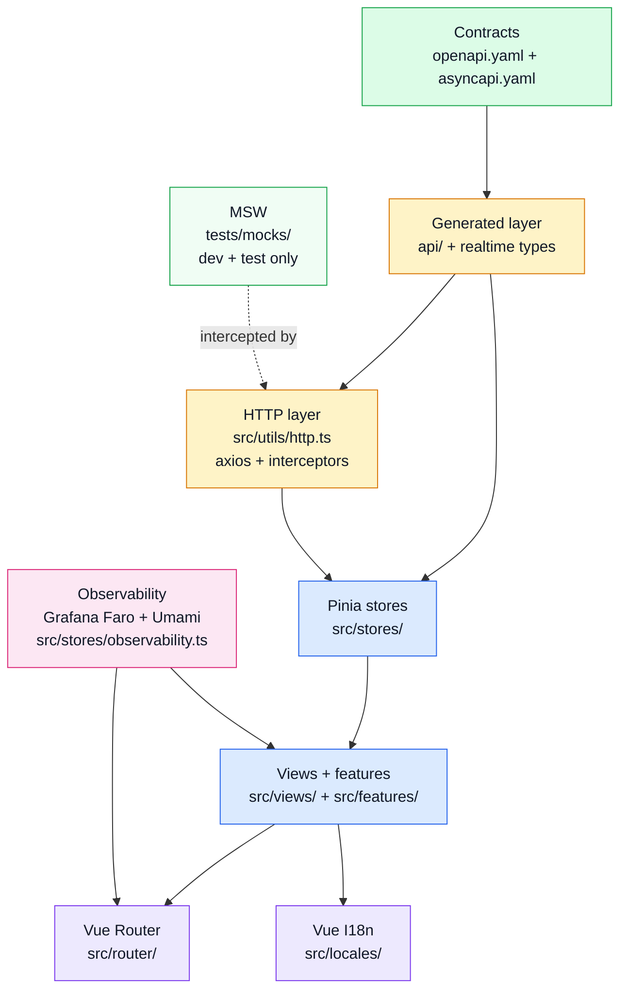

# Architecture

Use this page for the **big blocks and their boundaries**.
If you want the exact folder order, jump to [Layers](./layers.md).

## Architecture frame

## What each block owns

| Block | Owns | Avoids |
| ----- | ---- | ------ |
| Contract layer | public request/event shapes — see [OpenAPI Workflow](../api/openapi-workflow.md) | hidden drift from implementation |
| Generated layer | typed axios functions, Zod schemas, MSW stubs — all derived from `openapi.yaml` | hand-written duplicates |
| HTTP layer | axios instance, request/response interceptors, error shaping into `IResponseReject` | business decisions |
| Pinia stores | data fetching, caching, reactive state, API calls | direct DOM manipulation |
| Views + features | template rendering, UI composition, user events | data fetching logic |
| Router + I18N | navigation, locale injection, route guards | deep business decisions |
| Observability | error capture + tracing (Grafana Faro) and analytics (Umami) via a single store | scattered vendor calls |

## Why this page exists next to Layers

- **Architecture** answers: "which major blocks talk to each other?"
- **Layers** answers: "which folder/file path do I open next?"

Keeping those separate reduces repetition and makes scanning faster.

## Why this matters in a boilerplate

A boilerplate should be easy to copy, swap piece by piece, test in isolation, and extend without turning one file into a giant blob.
That is why the repo favors **clear ownership lines** instead of component-heavy data fetching.
The [Layers](./layers.md) page maps each block to an exact folder.

## Design rules used here

- **SOLID**: each layer should have one main reason to change.
- **DRY**: shared logic belongs in stores, composables, or utilities.
- **KISS**: keep flows boring and predictable.
- **OpenAPI first**: never hand-write what can be generated from the spec.

## Related pages

- See [Layers](./layers.md) for the exact folder stack.
- See [Request Flow](./request-flow.md) for the live path of one user action.
- See [Runtime](../tools/runtime.md) and [State & Routing](../tools/state-and-routing.md) for the libraries enabling this shape.
- See [OpenAPI Workflow](../api/openapi-workflow.md) for how the contract drives the generated layer.
