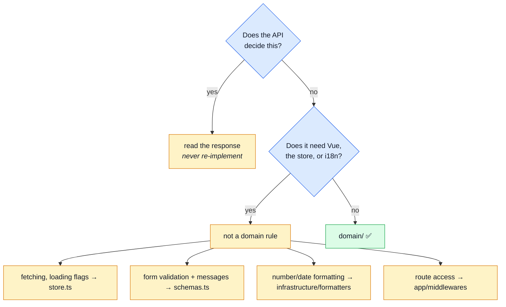
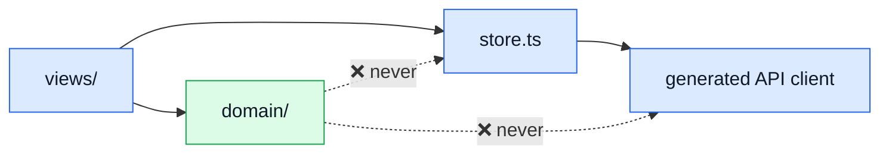
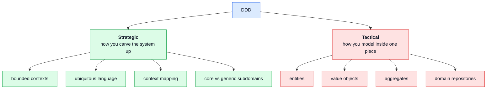
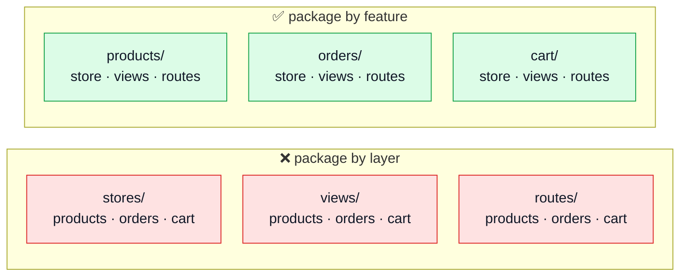
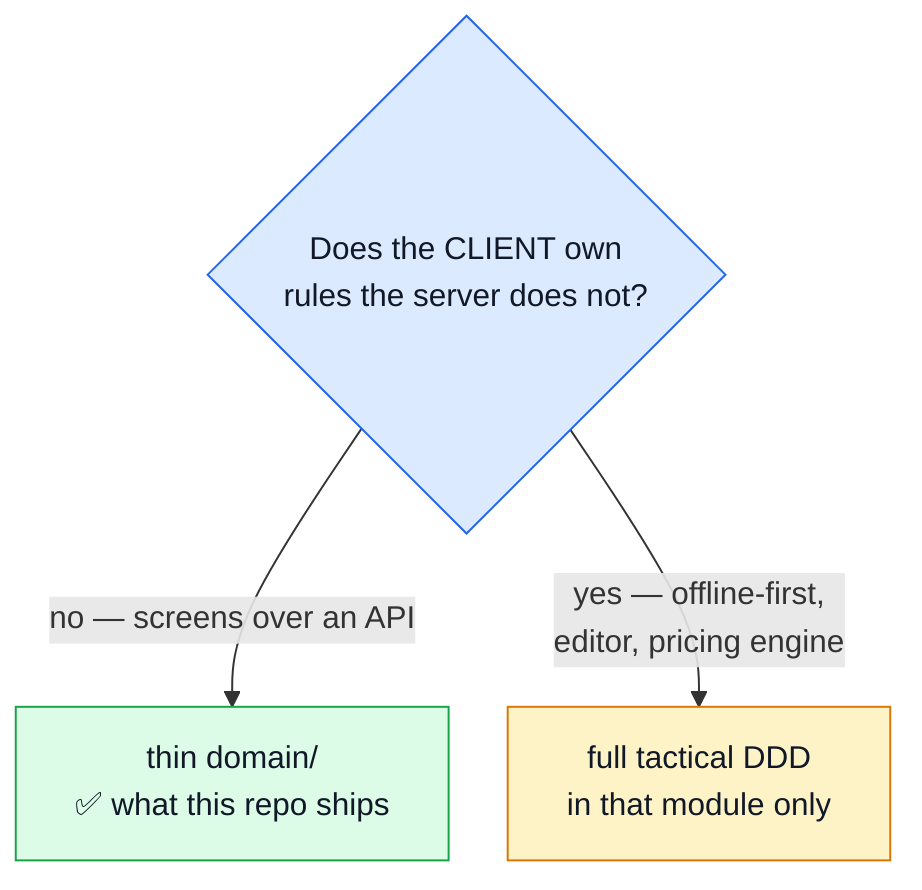

# Domain layer & DDD

Two things, in order:

1. **`domain/`** — the folder, the rule, and where a piece of logic goes.
2. **DDD** — what it actually is, and why it is *not* the same as this architecture.

Sections 2–5 mirror the API repo's page of the same name. Section 1 is where the two differ, because
a frontend has far less to put in this folder.

---

## 1. The folder

> **A rule the UI needs _before_ it calls the API goes in `src/modules/<name>/domain/`**, as a
> function that takes data and returns a value.

### Why it is thin here — and why that is correct

Prices, totals, checkout eligibility and permissions are decided by the API. Restating them on the
client gives you two implementations of one rule, drifting apart — the exact failure
`scripts/specIdentity.ts` exists to catch across these two repos.

**A thin domain layer on the client means the boundary is right, not that something is missing.**

### Where does this go?



### The worked example

```ts
// modules/cart/domain/quantity.ts
export const canDecrement = (quantity: number) => quantity > MIN_LINE_QUANTITY;
export const steppedQuantity = (quantity: number, step: number) =>
    Math.max(MIN_LINE_QUANTITY, quantity + step);
```

A line cannot reach zero by stepping — zero is not a quantity, it is a removal, which is a different
call with a different confirmation. That is a rule, not a template detail, and it is now testable
without mounting a component.

### The rule, enforced by lint



**The arrow points inward only.** `domain/` may not import:

| Forbidden | Why |
| --------- | --- |
| `vue` | a rule may not know it is rendered |
| `pinia` | a rule may not hold state |
| `axios` | a rule decides; the store fetches |
| `vue-router`, `vue-i18n` | routes and copy are delivery concerns |
| `@/infrastructure/**`, `@/kernel/**`, `@/app/**`, `@/ui/**` | those are tiers; domain sits below them |
| `@/modules/**` | a sibling's rules are its own |
| `../*` — its own module's outer files | domain may not read `../store` or `../views` |

### The folder is optional

Only `cart` has one. On a frontend most modules never will.

Worth noting: `canAccess()` in `app/middlewares/authentications.ts` is already exactly this pattern
— a pure function, requirement in, boolean out. It stays in `app/` because it is a rule about *this
application's route tree*, not about one domain.

---

## 2. What DDD is

**Domain-Driven Design** (Eric Evans, 2003) is a way of *modelling a business in code*. It has two
halves, and almost everyone means the second when they say "DDD".



**Green = this repo has it. Red = it does not.**

---

## 3. DDD vs feature/domain architecture

These are not the same thing, and conflating them is the usual reason "we do DDD" means "we have
folders named after features".

**Feature architecture is a _packaging_ decision.** Where do files live?



Deleting a feature becomes one folder instead of three edits. **This repo does this, and it is
done.**

**DDD is a _modelling_ decision.** What do the files contain?

| | Feature architecture | DDD (tactical) |
| --- | --- | --- |
| Answers | *where does this file live?* | *how is this rule expressed?* |
| Unit | a folder | an aggregate |
| Deliverable | a directory tree | a model of the business |
| Alone? | yes — and this repo largely is | yes, in any tree shape |

**You can have immaculate feature folders and zero DDD.** That is roughly this repo's position, and
it is a good one — the usual failure is the reverse: elaborate tactical patterns inside a ball of mud.

A **bounded context** and a **feature folder** often end up being the same directory, which is why
people conflate them. But a bounded context is defined by *where one model and one language stop
being valid*, not by where you put files.

---

## 4. Where this repo stands

**Strategic DDD — largely adopted:**

| Concept | Where |
| --- | --- |
| Bounded context | one folder per module; `rm -rf` deletes the domain |
| Published language | the module barrel, `index.ts` |
| Context map | the registry in `src/modules.ts` + `module.ts` manifests |
| Domain service | `cart/domain/quantity.ts` |

**Tactical DDD — absent, and mostly correctly so:**

| Concept | Today |
| --- | --- |
| Entity | none — stores hold API-shaped data |
| Value object | none |
| Aggregate root | none |
| Repository | none — the generated API client is called directly |

On a client backed by an API, that list being empty is the expected answer, not a shortfall.

---

## 5. Should you go further?



For an API-backed storefront or admin — which is what this boilerplate produces — the answer is the
left branch. Going right means maintaining a client model *and* keeping it reconciled with the
server's.

`DDD_EXPLORATION.md` (repo root) works the right branch out in full, for both repos.

## Related pages

- [Layers](./layers.md) — the folder map
- [Modules](./modules.md) — the tier rules and their naming
