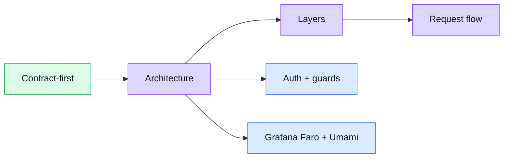

# Theory

This section explains **how the boilerplate thinks**.
It is about patterns and structure, not product details.

## Theory in one screen

## Main strategies already present in the code

- **Contract first**: the [API section](../api/) starts from [`openapi.yaml`](../api/openapi-workflow.md). Types, the axios client, Zod schemas, and MSW stubs are all generated from it — never hand-written.
- **Stores own data**: views call composables or stores; stores call the generated API. Views stay thin.
- **Single observability store**: [Grafana Faro and Umami](../tools/observability.md) are wired together in `src/stores/observability.ts`; no vendor calls leak into components.
- **Opt-in mocking**: [MSW](../tools/mocking.md) intercepts HTTP at the network layer when `VITE_API_MOCK_ENABLED=true`; the rest of the app is unchanged.
- **Promise-oriented style**: prefer promise chaining over large `async`/`await` + `try/catch` blocks.
- **Boilerplate over product detail**: examples are intentionally generic so the same shape can be reused in other variants.

## Where each topic lives

| Need | Go to |
| ---- | ----- |
| Understand the big blocks and boundaries | [Architecture](./architecture.md) |
| Read the folder-by-folder explanation | [Layers](./layers.md) |
| Follow one request end-to-end | [Request Flow](./request-flow.md) |
| See all routes and access levels at a glance | [Sitemap & Access Control](./sitemap.md) |
| Understand dependency choices | [Tools](../tools/) |
| Change contract, types, or mocks | [API](../api/) |
