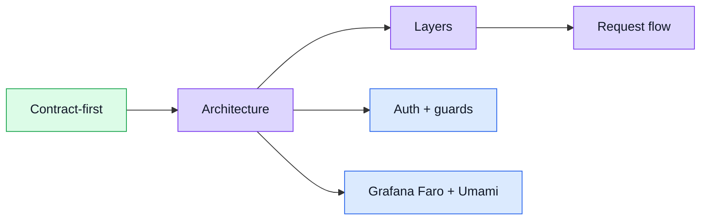
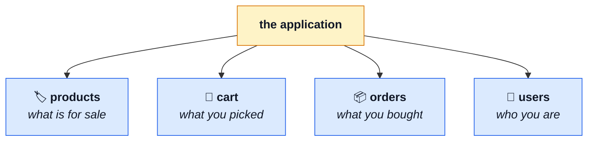
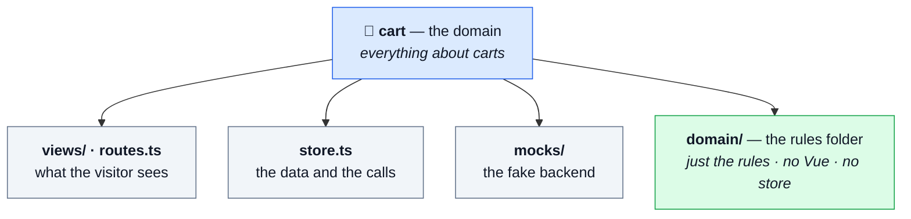
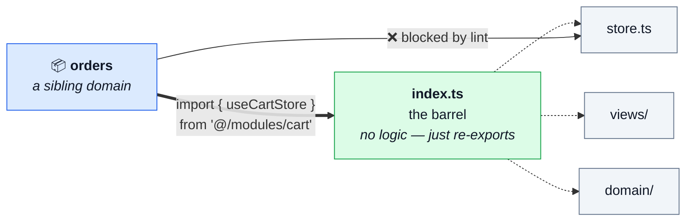

# Theory

This section explains **how the boilerplate thinks**.
It is about patterns and structure, not product details.

## Theory in one screen

```mermaid
%%{init: {'flowchart': {'nodeSpacing': 50, 'rankSpacing': 65}}}%%
flowchart LR
    Contract[Contract-first] --> Architecture[Architecture]
    Architecture --> Layers[Layers]
    Layers --> Flow[Request flow]
    Architecture --> Safety[Auth + guards]
    Architecture --> Signals[Grafana Faro + Umami]

    classDef contract fill:#dcfce7,stroke:#16a34a,color:#111827;
    classDef structure fill:#ddd6fe,stroke:#7c3aed,color:#111827;
    classDef ops fill:#dbeafe,stroke:#2563eb,color:#111827;
    class Contract contract;
    class Architecture,Layers,Flow structure;
    class Safety,Signals ops;
```

## The words these pages use

Two words appear on almost every page below, so they are worth ten lines here.

### A **domain** is one area of the business

Not a technical thing. Describe the shop out loud — "customers put **products** in a **cart**, then
place an **order**" — and the nouns you used are the domains.

```mermaid
%%{init: {'flowchart': {'nodeSpacing': 40, 'rankSpacing': 45}}}%%
flowchart TD
    APP["<b>the application</b>"]
    APP --> P["🏷️ <b>products</b><br/><i>what is for sale</i>"]
    APP --> C["🛒 <b>cart</b><br/><i>what you picked</i>"]
    APP --> O["📦 <b>orders</b><br/><i>what you bought</i>"]
    APP --> U["👤 <b>users</b><br/><i>who you are</i>"]

    classDef app fill:#fef3c7,stroke:#d97706,color:#111827;
    classDef dom fill:#dbeafe,stroke:#2563eb,color:#111827;
    class APP app;
    class P,C,O,U dom;
```

**One domain = one folder** under `src/modules/`. That is the whole rule, and it is what makes
"adding a domain is a folder plus a line, removing one is `rm -rf`" true.

### The confusing part: a domain contains a folder called `domain/`

Same word, two sizes. The **domain** is the whole business area; the **`domain/` folder** inside it
holds only the pure rules — the part you can test without mounting a component.

```mermaid
%%{init: {'flowchart': {'nodeSpacing': 35, 'rankSpacing': 40}}}%%
flowchart TD
    D["🛒 <b>cart</b> — the domain<br/><i>everything about carts</i>"]
    D --> V["<b>views/ · routes.ts</b><br/>what the visitor sees"]
    D --> S["<b>store.ts</b><br/>the data and the calls"]
    D --> MK["<b>mocks/</b><br/>the fake backend"]
    D --> DM["<b>domain/</b> — the rules folder<br/><i>just the rules · no Vue · no store</i>"]

    classDef dom fill:#dbeafe,stroke:#2563eb,color:#111827;
    classDef pure fill:#dcfce7,stroke:#16a34a,color:#111827;
    classDef normal fill:#f1f5f9,stroke:#64748b,color:#111827;
    class D dom;
    class DM pure;
    class V,S,MK normal;
```

On a frontend that folder is **thin by design** — prices, totals and eligibility are decided by the
API. What belongs there is what the UI needs to know _before_ it calls. Most modules have none.

The word shows up in four senses across this documentation. They are related, but not the same:

| When you read…                | It means                                                    | Example                           |
| ----------------------------- | ----------------------------------------------------------- | --------------------------------- |
| "a domain", "modular domains" | one business area = one folder in `src/modules/`            | `cart`, `orders`                  |
| "the `domain/` folder"        | the pure-rules layer _inside_ one of those                  | `cart/domain/quantity.ts`         |
| "a domain store"              | the Pinia store owning that area's data                     | `cart/store.ts`                   |
| "the domain" (in DDD)         | the business itself, as a thing to be modelled              | [Domain layer](./domain-layer.md) |

It never means a DNS name on these pages.

### A **barrel** is a file that only re-exports

`index.ts` holds no logic. It collects what the outside is allowed to reach, so a sibling imports
one name instead of learning your folder layout — which is why lint can enforce the boundary.

```mermaid
%%{init: {'flowchart': {'nodeSpacing': 35, 'rankSpacing': 45}}}%%
flowchart LR
    SIB["📦 <b>orders</b><br/><i>a sibling domain</i>"]
    B["<b>index.ts</b><br/>the barrel<br/><i>no logic — just re-exports</i>"]
    S["store.ts"]
    V["views/"]
    D["domain/"]

    SIB ==>|"import { useCartStore }<br/>from '@/modules/cart'"| B
    B -.-> S
    B -.-> V
    B -.-> D
    SIB -->|"❌ blocked by lint"| S

    classDef dom fill:#dbeafe,stroke:#2563eb,color:#111827;
    classDef barrel fill:#dcfce7,stroke:#16a34a,color:#111827;
    classDef inner fill:#f1f5f9,stroke:#64748b,color:#111827;
    class SIB dom;
    class B barrel;
    class S,V,D inner;
```

A module nothing imports has no barrel at all — `account` is that case, and the absence is the
point.

## Main strategies already present in the code

- **Contract first**: the [API section](../api/) starts from [`openapi.yaml`](../api/openapi-workflow.md). Types, the axios client, Zod schemas, and MSW stubs are all generated from it — never hand-written.
- **Stores own data**: views call composables or stores; stores call the generated API. Views stay thin.
- **Single observability store**: [Grafana Faro and Umami](../tools/observability.md) are wired together in `src/infrastructure/stores/observability.ts`; no vendor calls leak into components.
- **The demo backend**: [the paired repo's demo profile](../tools/mocking.md) serves dev and e2e — the real API against an in-memory, seeded database.
- **Promise-oriented style**: prefer promise chaining over large `async`/`await` + `try/catch` blocks.
- **Boilerplate over product detail**: examples are intentionally generic so the same shape can be reused in other variants.

## Where each topic lives

| Need | Go to |
| ---- | ----- |
| **Open the code for the first time** | **[Reading Path](./reading-path.md)** |
| Understand the big blocks and boundaries | [Architecture](./architecture.md) |
| Read the folder-by-folder explanation | [Layers](./layers.md) |
| Understand how domains stay separable | [Modules](./modules.md) |
| Actually add or remove a domain | [Adding & Removing a Module](./module-lifecycle.md) |
| Understand the domain-modelling stance | [Strategic DDD](./strategic-ddd.md) |
| Follow one request end-to-end | [Request Flow](./request-flow.md) |
| See all routes and access levels at a glance | [Sitemap & Access Control](./sitemap.md) |
| Understand dependency choices | [Tools](../tools/) |
| Change contract, types, or mocks | [API](../api/) |
