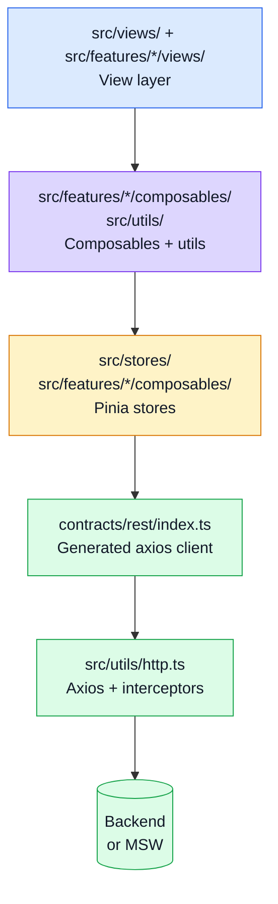
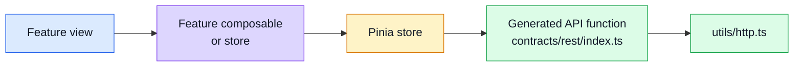

# Layers

This page is the **folder map**.
Use it when you want the exact implementation path without reading every source file.

## Layer stack

## Quick map

| Layer | Folder(s) | Main job |
| ----- | --------- | -------- |
| Views | `src/views/`, `src/features/*/views/` | template rendering, user events, layout |
| Feature composables | `src/features/*/composables/` | feature-scoped logic, form handling |
| Shared composables + utils | `src/utils/`, `src/composables/` | cross-feature helpers (http, i18n, forms, sockets) |
| Stores | `src/stores/`, `src/features/*/composables/` | global reactive state, API orchestration |
| Generated client | `contracts/rest/index.ts`, `contracts/rest/schemas.zod.ts` | typed axios functions + Zod schemas (DO NOT edit) |
| HTTP layer | `src/utils/http.ts`, `src/utils/api.ts` | axios instance, interceptors, error shaping |
| Layouts | `src/layouts/` | page shell components |
| Router | `src/router/`, `src/middlewares/`, `src/features/*/routes.ts` | navigation, locale prefix, guards |
| Locales | `src/locales/` | vue-i18n message files |
| Styles | `src/styles/` | global SCSS (theme, main) |
| Types | `src/types/` | shared TS types, re-exports from `@api` |
| MSW mocks | `tests/mocks/` | dev + test HTTP interception |

## How to read a feature

### Example from this repo

For a product flow you typically move through:

- `src/features/products/views/ProductsList.vue`
- `src/features/products/composables/useProductsList.ts` (if it exists)
- `src/stores/products.ts` (or feature-level composable)
- `contracts/rest/index.ts` → `getProducts()`
- `src/utils/http.ts`

The same shape repeats for every entity. The entity names are examples.

## What each layer should not do

- Views should not call `contracts/rest/` directly — go through a store or composable.
- Stores should not contain template logic or DOM refs.
- Composables should not scatter side effects across unrelated stores.
- `contracts/rest/index.ts` is generated — never edit it by hand.
- `http.ts` should not know about specific business entities.

## Why this is useful

- easier tests (stores can be tested without mounting views)
- easier refactors (swap the generated client without touching views)
- easier onboarding when ADHD brain wants clear buckets

## Observability in one paragraph

Two signals, wired through a single Pinia store:

- **Errors + performance** ([Sentry](../tools/observability.md)) — captures crashes, slow navigations, and session replays.
- **Product analytics** ([PostHog](../tools/posthog.md)) — tracks user actions and feature flags.

Both are initialized in `src/main.ts` and accessed via `useObservabilityStore()`. Page views are tracked automatically in `router.afterEach`.

## Related pages

- [Architecture](./architecture.md)
- [Request Flow](./request-flow.md)
- [Sitemap & Access Control](./sitemap.md)
- [Runtime](../tools/runtime.md)
- [API overview](../api/)
