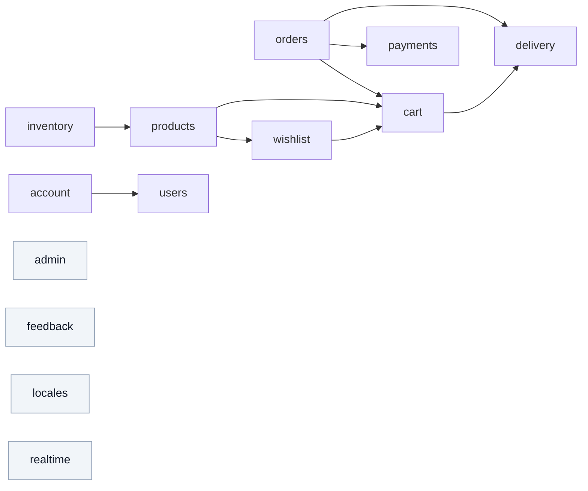
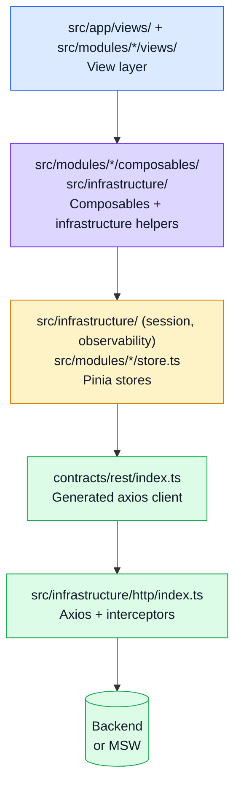
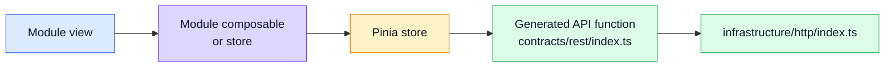

# Layers

This page is the **folder map**.
Use it when you want the exact implementation path without reading every source file.

There are two axes, and confusing them is the usual source of "where does this go?":

- **tiers** decide what a file is allowed to know — `kernel` knows this kind of app but no
  domain, a module knows exactly one domain;
- **layers** decide what a file does within its domain — route, view, store, schema. A module
  contains all of them.

## Tiers

| Tier     | Folder           | Knows                          | Contents                                                          |
| -------- | ---------------- | ------------------------------ | ----------------------------------------------------------------- |
| App      | `src/app`         | this application                | router, layouts, guards, app views, the navigation                                    |
| Registry | `src/modules.ts`  | which domains are in this build | the one file that names every enabled domain                                          |
| Modules  | `src/modules/*`   | one domain each, top to bottom  | `index.ts` is a module's only public surface                                          |
| Kernel   | `src/kernel`    | that modules exist — never which  | the module registry mechanism, and nothing else                                       |
| UI       | `src/ui`          | the design system, no domain    | Vuetify theme tokens + icon set, and the components built on them                     |
| Infrastructure | `src/infrastructure`  | nothing about this app          | `http/`, `i18n/`, `observability/` config, `stores/` (session, observability), `composables/`, `utils/` |

Dependencies point one way — `infrastructure → ui → kernel → modules → app` — and `eslint.config.ts`
enforces it with one `no-restricted-imports` block per tier.

`kernel` used to be allowed to read `@/modules` — the registry list — and that exemption is gone.
The registry names every enabled domain, so anything reading it knows THIS application rather than
this kind of application, which is exactly what `src/app` is for. `src/app/router/index.ts` still
names no individual domain: it walks the registry.

A module may import another module's **public barrel** — `@/modules/<name>` — and never its
internals. That rule is generated per module from the contents of `src/modules/`, so adding a domain
does not edit the lint config either.

Two modules that each need the other are not a dependency pair: either they are one module, or one
of them is holding state that belongs to the other. `dependsOn` is validated as a DAG while the
router is assembled, and a cycle throws with the path named.

The fourteen modules in this build are `account`, `admin`, `cart`, `delivery`, `demo`, `feedback`,
`inventory`, `locales`, `orders`, `payments`, `products`, `realtime`, `users` and `wishlist`. Six
declare an edge; the other eight are leaves.

`demo` is the odd one: it serves no business at all. It holds the Playground page, the counter
store and the teaching route guard — everything that exists to demonstrate the boilerplate rather
than to run a shop. A module rather than part of the app shell precisely because that makes it
deletable in one `rm -rf` plus one line, which is the first thing anyone starting a real project
from this repo should do.


```mermaid
%%{init: {'flowchart': {'nodeSpacing': 40, 'rankSpacing': 50}}}%%
flowchart LR
    orders --> cart
    orders --> delivery
    orders --> payments
    cart --> delivery
    products --> cart
    products --> wishlist
    wishlist --> cart
    inventory --> products
    account --> users

    admin:::leaf
    feedback:::leaf
    locales:::leaf
    realtime:::leaf

    classDef leaf fill:#f1f5f9,stroke:#94a3b8,color:#111827;
```

Read an arrow as "imports from, through the target's barrel". `orders → payments` because
checkout settles a payment; `products → wishlist` because the product page writes a wishlist line.
Nothing points back, which is what keeps the graph a DAG.

::: tip This list goes stale
It is a snapshot of `src/modules.ts`, and that file is the only authority. `npm run test:unit`
covers the registry's validation, not this paragraph — if the two disagree, the code is right.
:::

### Adding a domain

One folder under `src/modules/` with a `module.ts`, plus one line in `src/modules.ts`. Add an
`index.ts` when another domain needs something from it — `account` has none, because nothing has
ever needed anything back from it, and an empty barrel is a promise nobody asked for.

### Removing a domain

`rm -rf src/modules/<name>` and delete its line from `src/modules.ts`. Whatever then fails to
compile is a real dependency another module declared on it.

## Layer stack


```mermaid
%%{init: {'flowchart': {'nodeSpacing': 45, 'rankSpacing': 65}}}%%
flowchart TD
    A["src/app/views/ + src/modules/*/views/\nView layer"] --> B["src/modules/*/composables/\nsrc/infrastructure/\nComposables + infrastructure helpers"]
    B --> C["src/infrastructure/ (session, observability)\nsrc/modules/*/store.ts\nPinia stores"]
    C --> D["contracts/rest/index.ts\nGenerated axios client"]
    D --> E["src/infrastructure/http/index.ts\nAxios + interceptors"]
    E --> F[("Backend\nor MSW")]

    classDef view fill:#dbeafe,stroke:#2563eb,color:#111827;
    classDef comp fill:#ddd6fe,stroke:#7c3aed,color:#111827;
    classDef store fill:#fef3c7,stroke:#d97706,color:#111827;
    classDef http fill:#dcfce7,stroke:#16a34a,color:#111827;
    class A view;
    class B comp;
    class C store;
    class D,E,F http;
```

## Quick map

| Layer | Folder(s) | Main job |
| ----- | --------- | -------- |
| Views | `src/app/views/`, `src/modules/*/views/` | template rendering, user events, layout |
| Module composables | `src/modules/*/composables/` | domain-scoped logic, form handling |
| Infrastructure helpers | `src/infrastructure/utils/`, `src/infrastructure/composables/` | cross-domain helpers (formatters, errors, uploads, logger, `useAsyncAction`, `useUploadProgress`) |
| i18n runtime | `src/infrastructure/i18n/` | the vue-i18n instance and locale loading (`index.ts`), the locale-prefixed router locations (`routerLink.ts`), the language manifest and the API-stored overrides (`localeOverrides.ts`) |
| Stores | `src/infrastructure/stores/session.ts`, `src/infrastructure/stores/observability.ts`, `src/modules/*/store.ts` | global reactive state, API orchestration |
| Generated client | `contracts/rest/index.ts`, `contracts/rest/schemas.zod.ts` | typed axios functions + Zod schemas (DO NOT edit) |
| HTTP layer | `src/infrastructure/http/` | axios instance (`client.ts`), interceptors and error shaping (`interceptors.ts`), the 401 replay (`refresh.ts`), contract validation (`validate.ts`), envelope readers (`envelope.ts`), the orval mutator and the barrel (`index.ts`), response-schema map |
| Design system | `src/ui/vuetify/` | theme tokens, component defaults, lucide icon set |
| Shared components | `src/ui/molecules/`, `src/ui/organisms/` | domain-agnostic components, placed here by consumer count |
| Layouts | `src/app/layouts/` | page shell components |
| App shell components | `src/app/components/` | navigation and the language switcher — they know this app's domains and locales, not a design system |
| Router | `src/app/router/`, `src/app/guards/`, `src/modules/*/routes.ts`, `src/modules.ts` | navigation, locale prefix, guards |
| Locales | `src/locales/` (shared), `src/modules/*/locales/` (per domain) | vue-i18n message files, deep-merged per locale at boot |
| Styles | `src/styles/` | global CSS (layer order, fonts) |
| Types | `src/types/` | shared TS types, re-exports from `@api` |
| MSW mocks | `src/modules/*/mocks/` (per domain), `tests/support/mocks/` (shared helpers) | dev + test HTTP interception |

## Where a component's logic goes

Two questions decide where a component lives and what it may hold, and they are **independent**.
Reading them as one is the usual source of confusion.

| | Question | Answered by |
| --- | --- | --- |
| **Tier** | what may this file *know*? | its folder — enforced by the boundary rules in `eslint.config.ts` |
| **Purity** | how much may it *do*? | one rule, below — enforced for the API by `@typescript-eslint/no-restricted-imports` on `**/*.vue` |

> **A component wires, it does not compute.** Its own logic is what it renders and what it hands to
> a click. The call behind that click lives one step away.

"One step away" has exactly three addresses, and the tier picks which:

| Component | Its logic belongs in |
| --- | --- |
| `src/modules/<n>/**` | that module's `store.ts` or `composables/` |
| `src/app/**` (shell, layouts, views) | `src/infrastructure/` — no domain owns it |
| `src/ui/**` | nowhere: it takes a prop and emits a model. It may not *have* behaviour |

The payoff is not tidiness. A call sitting one step out is testable without mounting anything,
reusable by a second component, and mockable in one place — `persistLocalePreference` on the
session store is the reference case, five unit tests and no component in sight.

### The corollary that trips people up

**A shell component can be every bit as logic-free as a `src/ui` atom.** It just imports
app-specific things, so it lives in `src/app`. Location is about knowledge, not about purity — so
"this should be an atom" is rarely the right fix. Pushing its logic down is.

Which means: reach for `src/ui` only when a **second consumer actually exists**. Until then, a shell
component with its logic pushed down is already as clean as the split would make it, at one file
instead of two.

### And when a container legitimately grows

`AppNavigation.vue` is 228 lines and that is fine — all of it is shell assembly (collecting the
registry, filtering by `canAccess`, the `hasRoute` guards, the theme toggle, drawer state). A
container is *allowed* to know many things. When one gets genuinely unwieldy the release valve is a
composable beside it — the shape `useAdminObservability` already has — never props and emits.

`defineEmits`, in this codebase, is for something else entirely: a **domain component crossing a
module boundary**. `PaymentPanel` and `ShipmentPanel` are the only two files that use it, and there
the emit *is* the published language — the panel says "a payment happened" and the order page
decides what that means, neither side learning the other's store. Every component in `src/ui` uses
`defineProps`/`defineModel` instead.

## How to read a domain


```mermaid
%%{init: {'flowchart': {'nodeSpacing': 50, 'rankSpacing': 60}}}%%
flowchart LR
    View[Module view] --> Composable[Module composable\nor store]
    Composable --> Store[Pinia store]
    Store --> Client[Generated API function\ncontracts/rest/index.ts]
    Client --> HTTP[infrastructure/http/index.ts]

    classDef view fill:#dbeafe,stroke:#2563eb,color:#111827;
    classDef comp fill:#ddd6fe,stroke:#7c3aed,color:#111827;
    classDef store fill:#fef3c7,stroke:#d97706,color:#111827;
    classDef http fill:#dcfce7,stroke:#16a34a,color:#111827;
    class View view;
    class Composable comp;
    class Store store;
    class Client,HTTP http;
```

### Example from this repo

For a product flow you typically move through:

- `src/modules/products/views/ProductsList.vue`
- `src/modules/<name>/composables/<useThing>.ts` (optional — products has none today;
  `src/modules/admin/composables/useAdminObservability.ts` is a real one)
- `src/modules/products/store.ts`
- `contracts/rest/index.ts` → `getProducts()`
- `src/infrastructure/http/index.ts`

The same shape repeats for every entity. The entity names are examples.

## What each layer should not do

- Views should not call `contracts/rest/` directly — go through a store or composable.
- Stores should not contain template logic or DOM refs.
- Composables should not scatter side effects across unrelated stores.
- `contracts/rest/index.ts` is generated — never edit it by hand.
- `http.ts` should not know about specific business entities.

## Why this is useful

- easier tests (stores can be tested without mounting views)
- easier refactors (swap the generated client without touching views)
- easier onboarding when ADHD brain wants clear buckets

## Observability in one paragraph

Two signals, wired through a single Pinia store:

- **Errors + tracing + web-vitals** ([Grafana Faro](../tools/observability.md)) — captures crashes, Core Web Vitals, and traces that link the browser to the backend.
- **Product analytics** ([Umami](../tools/umami.md)) — tracks pageviews and user actions.

Both are initialized in `src/main.ts` and accessed via `useObservabilityStore()`. Page views are tracked automatically by the Umami tracker.

## Two decisions the source files no longer argue

### The session store is not the account module

`infrastructure/http` reads the access token on every request and the router guards read `isAuth` /
`isAdmin` before any domain code runs — both are the bottom of the stack. The *user record* — the
editable `User`, its email, its avatar, the endpoints that change it — is domain knowledge and
lives in `src/modules/account`.

One store for both would give `infrastructure` a `User` entity and make the app shell reach into a
domain to render a name. So the session holds a deliberately minimal projection instead:

```ts
viewer = { id, email, admin }
```

The shell knows *someone is signed in, here is their display name, they are staff*. It does not
know what a `User` is, and deleting the account module does not break it.

Which `/account` calls belong to the session: the ones it needs to restore, remember or end
**itself** — `GET /account` (who am I), `/account/refresh`, `/account/logout`, `/account/logout-all`,
and the language preference write. Everything else under `/account` — signup, the password resets,
the deletion flow, editing your own record — is an operation *on* an account rather than *on* the
session, and belongs to the module.

### Each repository owns its own dictionary

The two repos synchronize the *choice* of language — that is what `Accept-Language` does — and
nothing else. Neither depends on the other for its own strings, which is what lets either
boilerplate be recombined with a different counterpart.

The API's own copy never reaches this app. It resolves its own keys and puts finished text on the
wire, so a response arrives already translated and the client prints what it was sent. There used
to be a reserved `api.*` namespace holding the API's dictionary for the one case that needed this
app's own words — no response at all, a 401 with an empty body, a bare 502 — and it is gone: those
messages are `api-errors.*` in this app's dictionary, and they are now translatable for every
language, including the ones this build does not bundle.

### Files are defaults, the database overrides them

Both repos work the same way, and the shape is worth stating once:

| | defaults | overrides |
| --- | --- | --- |
| this app's strings | `src/locales/*.json`, in the bundle | `app`-scoped rows, fetched from `GET /locales/{locale}/messages` |
| the API's strings | its own `src/locales/*.json` | `api`-scoped rows, layered onto them inside the API |

One collection, one row per `(language, scope, key)`, edited by people who never open a code
editor. `scope` is what keeps the two apart, and it has to be part of the row's identity rather
than a label on it: both dictionaries declare a top-level `generic`, so `generic.error-internal`
names one string in each.

Overrides are merged **per key and deep**. An edit names one leaf, and the twenty untouched keys of
its group must survive — a shallow assign there deletes them silently, and the damage shows up on
an unrelated screen.

Nothing in this is load-bearing. Every function in `src/infrastructure/i18n/localeOverrides.ts`
**resolves rather than rejects**, and the app is fully usable when all of them return nothing: the
bundled files are the floor, and a locale switch must never be blocked by an API that is slow, old,
or absent. What that costs when the API is unreachable is the edits, and only the edits.

### Which languages exist

Three sources, one job each, and no fourth:

1. **`src/locales/*.json`** — what this build renders with no network. A build-time glob; the
   offline floor.
2. **`GET /locales`** — what the deployment offers right now, with `nativeName`, `direction` and
   per-language `scopes`. `mergeRemoteLocales` unions it into `supportedLanguages` at boot, which
   is how a language added by a translator appears in the switcher with no frontend deploy.
3. **`GET /locales/{locale}/messages`** — what has been edited for one of them.

There is deliberately no env list. Naming a language in `.env` claimed support without supplying
anything able to render it.

The two sides are NOT reconciled, and that is a decision rather than an oversight. This app can
bundle `it.json` while the API has no Italian at all: the interface is Italian and the API's
messages arrive in its fallback. Someone wanted the interface translated and did not care about the
backend's half, and only a person can judge whether that is wrong.

## Related pages

- [Modules](./modules.md) — what a module may know, and what adding or deleting one costs
- [Domain Layer](./domain-layer.md) — where a client-side business rule goes, and why the layer is thin
- [Architecture](./architecture.md)
- [Request Flow](./request-flow.md)
- [Sitemap & Access Control](./sitemap.md)
- [Runtime](../tools/runtime.md)
- [API overview](../api/)
