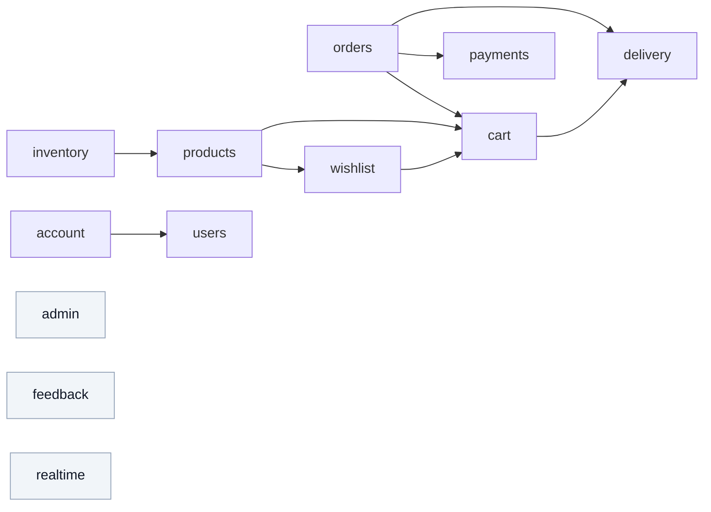
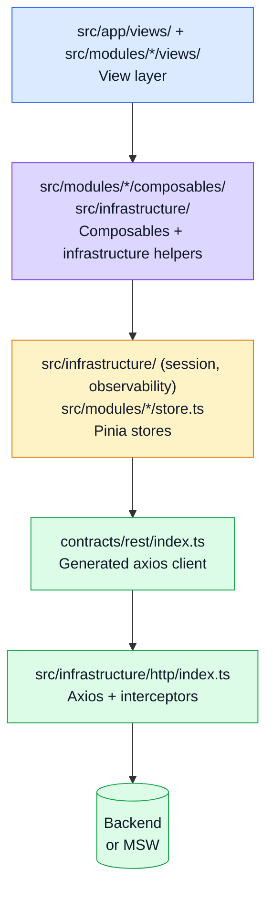
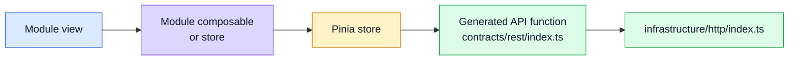

# Layers

This page is the **folder map**.
Use it when you want the exact implementation path without reading every source file.

There are two axes, and confusing them is the usual source of "where does this go?":

- **tiers** decide what a file is allowed to know — `kernel` knows this kind of app but no
  domain, a module knows exactly one domain;
- **layers** decide what a file does within its domain — route, view, store, schema. A module
  contains all of them.

## Tiers

| Tier     | Folder           | Knows                          | Contents                                                          |
| -------- | ---------------- | ------------------------------ | ----------------------------------------------------------------- |
| App      | `src/app`         | this application                | router, layouts, guards, app views, the navigation                                    |
| Registry | `src/modules.ts`  | which domains are in this build | the one file that names every enabled domain                                          |
| Modules  | `src/modules/*`   | one domain each, top to bottom  | `index.ts` is a module's only public surface                                          |
| Kernel   | `src/kernel`    | that modules exist — never which  | the module registry mechanism, and nothing else                                       |
| UI       | `src/ui`          | the design system, no domain    | Vuetify theme tokens + icon set, and the components built on them                     |
| Infrastructure | `src/infrastructure`  | nothing about this app          | http client, i18n runtime, errors, formatters, uploads, logger, session, observability |

Dependencies point one way — `infrastructure → ui → kernel → modules → app` — and `eslint.config.ts`
enforces it with one `no-restricted-imports` block per tier.

`kernel` used to be allowed to read `@/modules` — the registry list — and that exemption is gone.
The registry names every enabled domain, so anything reading it knows THIS application rather than
this kind of application, which is exactly what `src/app` is for. `src/app/router/index.ts` still
names no individual domain: it walks the registry.

A module may import another module's **public barrel** — `@/modules/<name>` — and never its
internals. That rule is generated per module from the contents of `src/modules/`, so adding a domain
does not edit the lint config either.

Two modules that each need the other are not a dependency pair: either they are one module, or one
of them is holding state that belongs to the other. `dependsOn` is validated as a DAG while the
router is assembled, and a cycle throws with the path named.

The twelve domains in this build are `account`, `admin`, `cart`, `delivery`, `feedback`,
`inventory`, `orders`, `payments`, `products`, `realtime`, `users` and `wishlist`. Six declare an
edge; the other six are leaves.

```mermaid
%%{init: {'flowchart': {'nodeSpacing': 40, 'rankSpacing': 50}}}%%
flowchart LR
    orders --> cart
    orders --> delivery
    orders --> payments
    cart --> delivery
    products --> cart
    products --> wishlist
    wishlist --> cart
    inventory --> products
    account --> users

    admin:::leaf
    feedback:::leaf
    realtime:::leaf

    classDef leaf fill:#f1f5f9,stroke:#94a3b8,color:#111827;
```

Read an arrow as "imports from, through the target's barrel". `orders → payments` because
checkout settles a payment; `products → wishlist` because the product page writes a wishlist line.
Nothing points back, which is what keeps the graph a DAG.

::: tip This list goes stale
It is a snapshot of `src/modules.ts`, and that file is the only authority. `npm run test:unit`
covers the registry's validation, not this paragraph — if the two disagree, the code is right.
:::

### Adding a domain

One folder under `src/modules/` with a `module.ts`, plus one line in `src/modules.ts`. Add an
`index.ts` when another domain needs something from it — `account` has none, because nothing has
ever needed anything back from it, and an empty barrel is a promise nobody asked for.

### Removing a domain

`rm -rf src/modules/<name>` and delete its line from `src/modules.ts`. Whatever then fails to
compile is a real dependency another module declared on it.

## Layer stack

```mermaid
%%{init: {'flowchart': {'nodeSpacing': 45, 'rankSpacing': 65}}}%%
flowchart TD
    A["src/app/views/ + src/modules/*/views/\nView layer"] --> B["src/modules/*/composables/\nsrc/infrastructure/\nComposables + infrastructure helpers"]
    B --> C["src/infrastructure/ (session, observability)\nsrc/modules/*/store.ts\nPinia stores"]
    C --> D["contracts/rest/index.ts\nGenerated axios client"]
    D --> E["src/infrastructure/http/index.ts\nAxios + interceptors"]
    E --> F[("Backend\nor MSW")]

    classDef view fill:#dbeafe,stroke:#2563eb,color:#111827;
    classDef comp fill:#ddd6fe,stroke:#7c3aed,color:#111827;
    classDef store fill:#fef3c7,stroke:#d97706,color:#111827;
    classDef http fill:#dcfce7,stroke:#16a34a,color:#111827;
    class A view;
    class B comp;
    class C store;
    class D,E,F http;
```

## Quick map

| Layer | Folder(s) | Main job |
| ----- | --------- | -------- |
| Views | `src/app/views/`, `src/modules/*/views/` | template rendering, user events, layout |
| Module composables | `src/modules/*/composables/` | domain-scoped logic, form handling |
| Infrastructure helpers | `src/infrastructure/` | cross-domain helpers (i18n, formatters, errors, uploads, logger, `useAsyncAction`, the session) |
| Stores | `src/infrastructure/session.ts`, `src/infrastructure/observability.ts`, `src/modules/*/store.ts` | global reactive state, API orchestration |
| Generated client | `contracts/rest/index.ts`, `contracts/rest/schemas.zod.ts` | typed axios functions + Zod schemas (DO NOT edit) |
| HTTP layer | `src/infrastructure/http/` | axios instance, interceptors, error shaping, orval mutator, response-schema map |
| Design system | `src/ui/vuetify/` | theme tokens, component defaults, lucide icon set |
| Shared components | `src/ui/molecules/`, `src/ui/organisms/` | domain-agnostic components, placed here by consumer count |
| Layouts | `src/app/layouts/` | page shell components |
| App shell components | `src/app/components/` | navigation and the language switcher — they know this app's domains and locales, not a design system |
| Router | `src/app/router/`, `src/app/middlewares/`, `src/modules/*/routes.ts`, `src/modules.ts` | navigation, locale prefix, guards |
| Locales | `src/locales/` (shared), `src/modules/*/locales/` (per domain) | vue-i18n message files, deep-merged per locale at boot |
| Styles | `src/styles/` | global CSS (layer order, fonts) |
| Types | `src/types/` | shared TS types, re-exports from `@api` |
| MSW mocks | `src/modules/*/mocks/` (per domain), `tests/support/mocks/` (shared helpers) | dev + test HTTP interception |

## How to read a domain

```mermaid
%%{init: {'flowchart': {'nodeSpacing': 50, 'rankSpacing': 60}}}%%
flowchart LR
    View[Module view] --> Composable[Module composable\nor store]
    Composable --> Store[Pinia store]
    Store --> Client[Generated API function\ncontracts/rest/index.ts]
    Client --> HTTP[infrastructure/http/index.ts]

    classDef view fill:#dbeafe,stroke:#2563eb,color:#111827;
    classDef comp fill:#ddd6fe,stroke:#7c3aed,color:#111827;
    classDef store fill:#fef3c7,stroke:#d97706,color:#111827;
    classDef http fill:#dcfce7,stroke:#16a34a,color:#111827;
    class View view;
    class Composable comp;
    class Store store;
    class Client,HTTP http;
```

### Example from this repo

For a product flow you typically move through:

- `src/modules/products/views/ProductsList.vue`
- `src/modules/products/composables/useProductsList.ts` (if it exists)
- `src/modules/products/store.ts`
- `contracts/rest/index.ts` → `getProducts()`
- `src/infrastructure/http/index.ts`

The same shape repeats for every entity. The entity names are examples.

## What each layer should not do

- Views should not call `contracts/rest/` directly — go through a store or composable.
- Stores should not contain template logic or DOM refs.
- Composables should not scatter side effects across unrelated stores.
- `contracts/rest/index.ts` is generated — never edit it by hand.
- `http.ts` should not know about specific business entities.

## Why this is useful

- easier tests (stores can be tested without mounting views)
- easier refactors (swap the generated client without touching views)
- easier onboarding when ADHD brain wants clear buckets

## Observability in one paragraph

Two signals, wired through a single Pinia store:

- **Errors + tracing + web-vitals** ([Grafana Faro](../tools/observability.md)) — captures crashes, Core Web Vitals, and traces that link the browser to the backend.
- **Product analytics** ([Umami](../tools/umami.md)) — tracks pageviews and user actions.

Both are initialized in `src/main.ts` and accessed via `useObservabilityStore()`. Page views are tracked automatically by the Umami tracker.

## Related pages

- [Modules](./modules.md) — what a module may know, and what adding or deleting one costs
- [Domain Layer](./domain-layer.md) — where a client-side business rule goes, and why the layer is thin
- [Architecture](./architecture.md)
- [Request Flow](./request-flow.md)
- [Sitemap & Access Control](./sitemap.md)
- [Runtime](../tools/runtime.md)
- [API overview](../api/)
