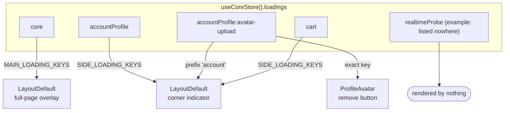

# Loading State

One dictionary answers every "is this loading?" in the app. `useCoreStore` (vue-toolkit) holds it:

```ts
loadings: Record<string, boolean>;
```

Each entry is one **loading key**. Nothing in the UI ORs the whole dictionary — every reader names
the keys it cares about, which is what separates a full-page overlay from a corner indicator from
a single button's spinner.

## Key naming

A key is `<store>` plus an optional `:<action>` postfix, and the store half is the Pinia store id:

| Key                             | Set by                                                    |
| ------------------------------- | --------------------------------------------------------- |
| `accountProfile`                | any `useProfileStore` call without its own postfix        |
| `accountProfile:avatar-upload`  | `updateProfile` when the payload carries an `imageUpload` |
| `accountTwoFactor:confirm`      | `confirmMethod`                                           |
| `cart`, `orders`, `products`, … | the domain store of the same Pinia id                     |

The store half is declared once, where the toolkit composable is created:

```ts
useStructureRestApi<User, string>({ loadingKey: 'accountProfile', getLoading, setLoading });
```

The action half is per call, and the toolkit appends it:

```ts
fetchAny(() => apiSetupTwoFactorMethod(method), { loadingKey: ':setup' });
```

Counting is ref-counted inside the composable, so two overlapping calls on one key cannot clear
each other — the store only ever sees the 0 → 1 and 1 → 0 edges.

## Who reads what



Three levels, one dictionary:

- **Full-page overlay** — `isLoading(MAIN_LOADING_KEYS)`, today just `core`: app bootstrap, the
  only thing allowed to block the screen.
- **Corner indicator** — `isLoading(SIDE_LOADING_KEYS)`, one prefix per domain store. A prefix
  matches every action key under it, so a store's own postfixed calls come along for free.
- **One control** — `getLoading('accountProfile:avatar-upload')`, exposed as a named computed by
  the store that owns the key (`uploadingAvatar`, `sendingCode`, `mutatingWithCode`, …). Components
  bind to those rather than declaring local `ref(false)` flags, so two buttons on one store never
  spin together.

Both lists live in `LayoutDefault.vue`. **A key in neither list renders nothing** — that is the
point of listing them: a background call can exist without announcing itself, which a blanket OR
over the dictionary could never express.

## Adding a store

1. Pass `loadingKey: '<pinia id>'` where the toolkit composable is created.
2. Add the prefix to `SIDE_LOADING_KEYS` if its work should show in the corner indicator.
3. For an action that needs its own spinner, give the call a `:postfix` and expose a computed
   from the store — never a local flag in the component.
