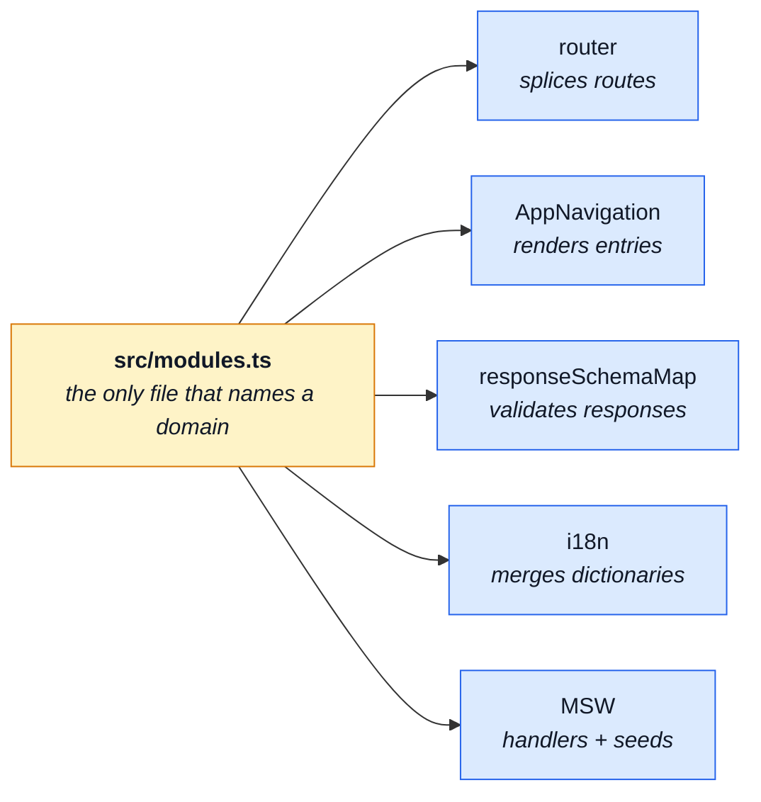
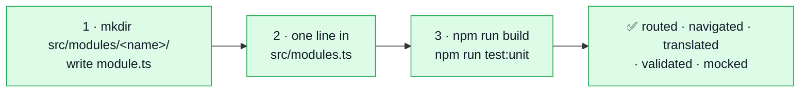
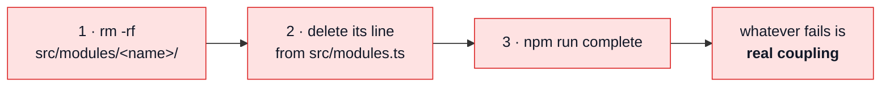
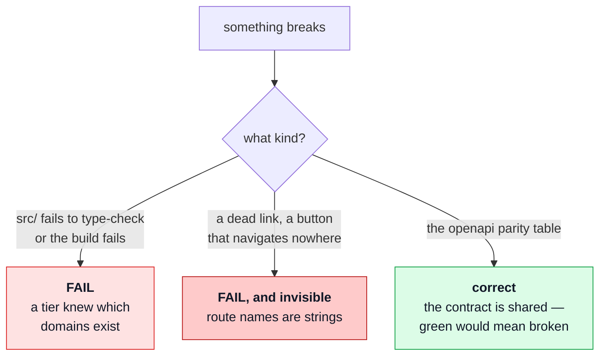

# Adding & removing a module

The procedure, in order, with the commands. [Modules](./modules.md) is the reasoning behind the
shape; this page is what you actually type.

Both halves are the same claim read in two directions:

> A domain is one folder plus one registry line. Adding it costs a folder and a line; removing it
> costs `rm -rf` and a line. Anything else that breaks is **real coupling**, and seeing it is the
> point.

That claim is measured, not asserted — a scaffold module was added under it and four domains were
deleted under it. What each one actually cost is recorded below, including the parts that are not
one line.

## One registry, and only one



Every one of those five reads the registry and never names an entry, so none of them appears in
either checklist. **`src/modules.ts` is the whole registry story on this side** — unlike the backend,
which also owns the contract fragments and their section lists. Here the contract is *consumed*:
`openapi.yaml` arrives from the paired backend, and `contracts/rest/schemas.zod.ts` and `api/` are
generated from it.

That asymmetry is the single most important thing to know before deleting anything — see
[the contract is not ours alone](#the-contract-is-not-ours-alone).

---

## Adding a module



### 1 · The folder

At minimum a `module.ts` and a `routes.ts`. Everything else is the domain's own business — add a
file when the domain needs it, not because the table has a row for it.

```
src/modules/<name>/
    module.ts                  the manifest — the only file src/modules.ts imports
    routes.ts                  the domain's route records
    views/*.vue                the pages those routes render
    store.ts                   Pinia state, if it has any
    index.ts                   ONLY if a sibling imports this module
    domain/                    pure business rules — lint-guaranteed framework-free
    responseSchemas.ts         the envelope schemas for the endpoints it calls
    locales/{en,it}.json       its dictionaries
    mocks/handlers.ts          MSW handlers
    mocks/seeds.ts             the data those handlers answer with
    tests/*.spec.ts            co-located, deleted with the module
```

`cart` is the reference — it has one of everything, including the `domain/` folder that nothing may
import a framework into.

### 2 · The manifest

A module is a **value, not a convention**. Everything the application does for a domain is declared
in one typed object:

```ts
// src/modules/<name>/module.ts
import type { IAppModule } from '@/kernel/registry';
import routes from './routes';
import { widgetsResponseSchemas } from './responseSchemas';

export default {
    name: 'widgets',
    routes,
    dependsOn: ['products'],
    navigation: [
        { name: 'WidgetsList', label: 'navigation.label-widgets', plural: 2, order: 40 }
    ],
    responseSchemas: widgetsResponseSchemas,
    locales: {
        en: () => import('./locales/en.json').then(({ default: dictionary }) => dictionary),
        it: () => import('./locales/it.json').then(({ default: dictionary }) => dictionary)
    }
} satisfies IAppModule;
```

Three fields need care:

| Field            | Rule                                                                                     |
| ---------------- | ---------------------------------------------------------------------------------------- |
| `name`           | must match the folder name under `src/modules/`                                          |
| `dependsOn`      | names **siblings** whose code this module imports; validated as a DAG when the router assembles |
| `navigation[].name` | must be a route **this module declares** — swept by `registry.spec.ts`                |

::: danger Do not refactor the mock ternaries into a helper
`mockHandlers` and `mockSeeds` are written inline behind
`import.meta.env.VITE_API_MOCK_ENABLED === 'true' ? … : undefined`. Vite replaces that read with a
literal, so a production build drops the branch and everything reachable through it — `dist/`
contains no MSW, no faker and no handler code. Passing the loader to a helper makes the chunk
reachable again and the entire mock layer ships to production.
:::

`mockSeeds.after` is a **separate graph** from `dependsOn`: the first is about fixtures (an order
embeds a product snapshot), the second about code (`Cart.vue` calls `useOrdersStore`). A module can
need another's data without importing a line of its code. Folding them would make both fields lie.

### 3 · The line

```ts
// src/modules.ts
import widgets from '@/modules/widgets/module';

export const enabledModules: IAppModule[] = [account, admin, cart /* … */, widgets];
```

Keep the array alphabetical. Order only decides the sequence route records are spliced in, which
vue-router's own ranking makes irrelevant for distinct paths.

### 4 · Check

```bash
npm run build          # vue-tsc + vite build
npm run test:unit
```

Add an `index.ts` barrel **only** when another domain needs something from it. `account` has none:
it is a consumer, not a provider, and an empty barrel is a promise nobody asked for.

::: warning A spec that touches http or i18n must wire the modules itself
`infrastructure` may not import `@/modules`, so `main.ts` hands the response schemas and the locale
contributors *down* at module scope. A test that exercises either subsystem without doing the same
wiring silently measures an app with no domain vocabulary and no contract validation.
`tests/support/unit/wireModules.ts` exists for exactly that.
:::

### What it actually cost

A scaffold `events` module, measured:

|                                                  |                                                               |
| ------------------------------------------------ | ------------------------------------------------------------- |
| files added                                      | 5 (`module.ts`, `routes.ts`, one view, `locales/{en,it}.json`) |
| lines changed elsewhere                          | 2, both in `src/modules.ts` (the import and the array entry)  |
| existing files needing an edit to accommodate it | **0**                                                         |
| result                                           | type-check, lint and the unit suite green; the view built into its own lazy chunk |

---

## Removing a module



```bash
rm -rf src/modules/<name>
# delete the import and the array entry in src/modules.ts
npm run complete
```

Deleting a module named in another module's `dependsOn` throws while the router assembles, with the
offending name in the sentence — not a blank page on whichever navigation first crosses the gap.

### Read the failures — they are not all equal



### A route name is a string — the one gate nothing else catches

This is the failure class worth remembering, because **neither the compiler, `vue-tsc`, nor lint can
see it.** Three places in the app shell address a module's route by name:

| File                            | Names                        |
| ------------------------------- | ---------------------------- |
| `src/app/views/Home.vue`        | `ProductsList`               |
| `src/app/components/AppNavigation.vue` | `Signup`, the sign-in route |
| `src/app/router/navigation.ts`  | the sign-in route            |

Each rendered a control that navigated nowhere once its module was deleted — and a 401 with no
sign-in route aborted the navigation and stranded the visitor on a blank screen. All of them now ask
`router.hasRoute()` first.

**If you add a reference to a route by name from outside the module that declares it, guard it with
`hasRoute()`.** That is the rule; there is no type that enforces it.

### The contract is not ours alone

`openapi.yaml` is shared **byte-identically** with the paired backend. Deleting a domain here does
not delete it from the contract, so `responseSchemaMap.spec.ts` reports the orphaned operations:

```
expected [ 'GET /products', …(25) ] to deeply equal []
```

**That is the parity gate working, and a green suite would mean it had stopped checking.** Trimming
the contract is a two-repo change driven from the backend, which owns the fragments the document is
assembled from — not a frontend chore.

### What it actually cost

Deleting `products`, `cart`, `orders` **and `account`** together — four folders, five lines, and
`account` is the hard one because the app shell shows who is signed in:

|                     |                                                             |
| ------------------- | ----------------------------------------------------------- |
| `src/` type-checks  | **yes**                                                     |
| lint                | **clean**                                                   |
| production build    | **succeeds**                                                |
| app-shell breakage  | **none** — no menu entry, no sign-in button, no dead link   |
| unit specs failing  | 34, all in **one** file — the openapi parity table          |

Everything fixable inside this repo has been fixed. The one remaining failure is the shared
contract, and it is correct.

---

## Re-running the deletability check

Worth running deliberately after any significant change — not because it is expected to fail, but
because every finding it has ever produced was invisible to lint, to `vue-tsc` and to a fully green
suite.

Run it on a throwaway copy so nothing in the repo is touched:

```bash
SB=$(mktemp -d)                                   # outside the repo
rsync -a --exclude node_modules --exclude .git ./ "$SB"/
cp -al node_modules "$SB"/node_modules            # same filesystem, or copy it
cd "$SB"

rm -rf src/modules/{products,cart,orders,account}
# drop the imports + array entries from src/modules.ts

npm run build                                     # THE assertion: type-check and build both pass
npm run lint
npm run test:unit                                 # expect the parity table red, nothing else
npm run test:e2e                                  # the app shell — what the build cannot see
```

Include `account` and at least one depended-upon domain. Deleting a leaf proves very little; the set
above is interesting because `cart → orders`, `cart → products` are declared edges and `account` is
the one the shell reads on every page.

### Why this is a procedure and not a test

Nothing in the suite runs the deletion, and that is deliberate — the interesting failures are the
ones a sweep cannot express:

- **A route addressed by name from outside its module.** A string, in a `.vue` file, that resolves
  at runtime. `hasRoute()` is the discipline; the e2e suite is the net. This is the one that
  actually bit, and no gate but a real deletion has ever found it.
- **A count calibrated to the current build.** `expect(x.length).toBeGreaterThanOrEqual(7)` is a
  copy of `src/modules.ts` written as an integer, in a file that names no domain and therefore reads
  as domain-free. Assert the sweep is consistent with the disk instead, with a floor of `≥ 1`.
- **A mechanism test using a domain as sample data.** Every such import goes through a legitimate
  public surface, so no import rule can tell it from a correct one. What makes it fragile is the
  _reason_ for the import. The rule that fixed this class is a review rule, not a test:

  > A spec outside a module may **iterate** the registry. It may never **name** a domain.

  So the mechanism tests use invented domains (`public-domain`, `staff-domain`, `/widgets`) and
  invented schemas, and the per-domain facts live in `src/modules/<name>/tests/`.

What the suite does cover is the neighbouring ground: `registry.spec.ts` sweeps every enabled module
for the invariants — every navigation entry points at a route that module declares, the registry is
a DAG with no unknown or duplicate name, every module ships the same set of locales — without ever
naming a domain. That is not a substitute for actually deleting a folder.

## Related pages

- [Modules](./modules.md) — why the shape is what it is
- [Layers](./layers.md) — the folder map
- [Unit testing](../tools/unit-testing.md) — where a spec lives, and why
- [Mocking](../tools/mocking.md) — why the handlers live under `src/`
