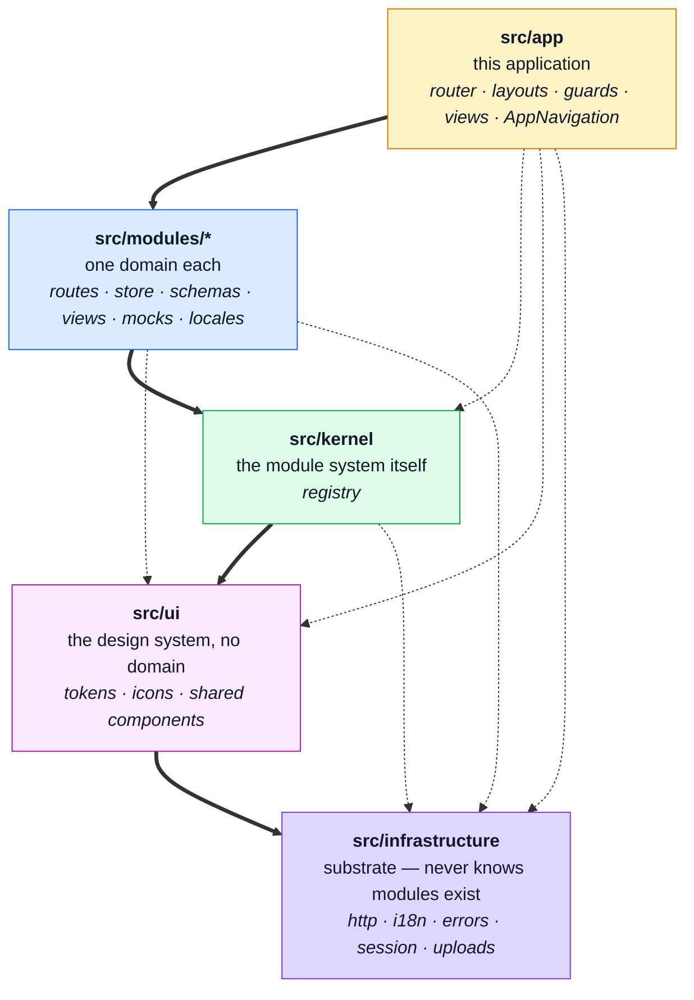

# Modules

This page is the **contract**: what a module is, what it may know, and what it costs to add or
delete one. [Layers](./layers.md) is the folder map; this is the reasoning behind it.

## The goal, stated as a test

> Deleting a domain is `rm -rf` of one folder plus removing one line from a registry, and
> `complete:check` stays green.

The driving scenario is a boilerplate that gets carved up: today an ecommerce demo; tomorrow an
event portal that keeps users, replaces products with events and drops the cart; later a marketing
site that keeps almost none of it. **"Which slices are in this build" has to be a configuration
question, not a surgery question.**

## The five tiers



**Every arrow points down and none points back.** `eslint.config.ts` enforces each edge in both
directions, one `no-restricted-imports` block per tier.

| Tier | Folder | Knows about | May import |
| ---- | ------ | ----------- | ---------- |
| **App** | `src/app` | this application: which domains exist and how they are assembled | modules, kernel, ui, infra |
| **Modules** | `src/modules/<name>` | its own domain, plus siblings' **barrels** | kernel, ui, infra |
| **Kernel** | `src/kernel` | this *kind* of app — never which domains exist | ui, infra |
| **UI** | `src/ui` | nothing but design | infra |
| **Infrastructure** | `src/infrastructure` | nothing above it | — |

### Why `app` exists, and what it fixed

The module-system tier — then called `platform`, now `kernel` — used to hold the router, the
layouts, the route guards, the app views and `AppNavigation`, and the tier rule carried an explicit
exemption letting it import `@/modules`, the registry. That exemption was the whole problem: **the
registry names every enabled domain**, so anything reading it knows this application rather than
this kind of application.

Making the tier explicit moved five things and deleted the exemption:

| Was | Is now | Why |
| --- | ------ | --- |
| `platform/router/` | `app/router/` | splices every enabled module's routes |
| `platform/components/AppNavigation.vue` | `app/components/` | renders every enabled module's nav entries |
| `platform/middlewares/` | `app/middlewares/` | route guards for this app's route tree |
| `platform/layouts/` | `app/layouts/` | the app shell, which composes the navigation |
| `platform/views/` | `app/views/` | Home, Error, Playground — pages of this app |

**This mirrors the backend**, which made the same split at the same time — the four tiers there are
`app → modules → kernel → infrastructure`, with `ui` being the one tier a backend has no use for.

### The `infrastructure` / `kernel` line

Both repos use one question, and it is the only test that matters:

> **If this project had no modules at all — if it were one undivided app — would this file still
> make sense?**

- **Yes, it still works** → `infrastructure` (or `ui`, if it is a component).
- **No, it becomes meaningless** → `kernel`.

`infrastructure` is not "framework-free" — it is the opposite. It imports axios, vue-i18n and Pinia,
and that is correct: `infrastructure/http/index.ts` is axios-coupled substrate and belongs exactly
where it is. The one thing it may never contain is the knowledge that a module system exists.

Being domain-free is **not enough** to earn a place in `kernel` — most of `infrastructure` and all
of `ui` are domain-free too. A `kernel` file's *purpose* has to dissolve if modules do. By that test
`kernel` holds exactly one thing:

| File          | Why it cannot be infrastructure                                            |
| ------------- | -------------------------------------------------------------------------- |
| `registry.ts` | it *is* the module system — `IAppModule`, the nav entries, the route splice |

That is literally the whole tier: **one file**. Three others used to sit beside it —
`FormCounterInput.vue`, `AppLanguageSwitcher.vue` and `counter.ts` — and each failed the test, since
all three survive perfectly well in an app with no modules and none is imported by the registry.
They moved out with the rename: `FormCounterInput.vue` to `ui/molecules/` since it imports nothing
at all, `AppLanguageSwitcher.vue` to `app/components/` since it reads this app's locale list and
drives its locale-prefixed routes, and `counter.ts` to `app/`, because it is Pinia demo scaffolding
for the Playground rather than shared state.

One file is the honest size of a module system in a frontend, and it is deliberate: the tier earns
its place by being unambiguous, not by being large. Everything domain-free that is *not* the module
system has two better homes already — `ui` for anything with a template, `infrastructure` for the
rest.

#### A note on the names

These two tiers were called `core` and `platform` until the rename, and both moved for reasons
worth keeping.

`core` is not an unusual name — it is an **overloaded** one, which is worse. Nest and Angular use
`@nestjs/core` and `@angular/core` for the DI container and call their substrate `common`; Spring
and Backstage use "core" for the substrate, as this repo did. The paragraph above used to open by
insisting that `core` did not mean what a reader arriving from Vue tooling would assume — and a name
that needs a standing disclaimer is doing negative work. A novel name makes someone look it up; an
overloaded one makes them think they already know, and that failure is silent.

`platform` was borrowed from VS Code, where `vs/base` is utility code, `vs/platform` is the service
layer and `vs/workbench` is the application. Two things outweighed the precedent: `vs/platform` is a
*service and DI layer*, a third meaning again, and in current industry usage "the platform" is the
base layer everything runs on — which is this repo's `infrastructure`. Read cold, the two old names
pointed at each other's contents. `kernel` names what the folder is: a microkernel that loads and
connects plugins it has never heard of.

The backend repo carries the full comparison table, in its own `docs/theory/modules.md`.

### The one arrow that cannot point down

`infrastructure` owns the http client and the i18n runtime. The response-schema rows and the translation
dictionaries are domain knowledge. `infrastructure` may not import `@/modules`, so the composition root hands
the data **down** instead of letting the bottom tier reach up:

```ts
// src/main.ts, at module scope
registerResponseSchemas(collectModuleResponseSchemas(enabledModules));
registerLocaleContributors(collectModuleLocales(enabledModules));
```

This is the single most surprising thing in the codebase, and the thing most likely to bite: a test
that exercises either subsystem without doing the same wiring silently measures an app with no
domain vocabulary and no contract validation. `tests/support/unit/wireModules.ts` exists for that.

## The manifest

A module is a value, not a convention. Everything the application does *for* a domain is declared
in one typed object:

```ts
export interface IAppModule {
    name: string;
    routes: RouteRecordRaw[];
    navigation?: IAppNavigationEntry[];
    responseSchemas?: IResponseSchemaRoute[];
    locales?: Record<string, () => Promise<ITranslationDictionaries>>;
    mockHandlers?: () => Promise<HttpHandler[]>;
    dependsOn?: string[];
}
```

Each optional field replaced a shared file that used to enumerate domains — the navigation list,
the response-schema table, the mock-handler registry, the locale bundle. That is the whole point:
**no shared file names a domain except `src/modules.ts`.**

`dependsOn` is validated as a DAG while the router is assembled. A duplicate name, a dependency on
a module that is not enabled, or a cycle throws with the offending path named, rather than
surfacing as a blank page on whichever navigation first crosses the gap.

### Why three fields are lazy

- `locales` — one chunk per locale per domain; a visitor downloads one language for the domains
  this build enables.
- `mockHandlers` — a thunk, **and** written in each `module.ts` behind
  `import.meta.env.VITE_API_MOCK_ENABLED === 'true' ? … : undefined`. Vite replaces that read with
  a literal, so a production build drops the branch and everything reachable through it. `dist/`
  contains no MSW, no faker and no handler code. **Do not refactor that ternary into a helper** —
  passing the loader as an argument makes the chunk reachable again and the mock layer ships.
- `responseSchemas` is eager: the http client needs the table before the first request.

## Adding a domain

One folder and one line. Measured, not asserted — a scaffold `events` module was added and removed
to check:

| | |
| --- | --- |
| files added | 5 (`module.ts`, `routes.ts`, one view, `locales/{en,it}.json`) |
| lines changed elsewhere | 2, both in `src/modules.ts` (the import and the array entry) |
| files needing an edit to accommodate it | **0** |
| result | type-check, lint and 727 unit tests green; the view built into its own lazy chunk |

Add an `index.ts` barrel only when another domain needs something from it. `account` has none: it
is a consumer, not a provider, and an empty barrel is a promise nobody asked for.

## Deleting a domain

`rm -rf src/modules/<name>` and delete its line. **Whatever then fails is real coupling** — that is
what the exercise is for, and it is worth running again after any significant change.

Deleting `products`, `cart`, `orders` **and `account`** together — four folders, five lines, and
`account` is the hard one because the app shell shows who is signed in — gives:

| | |
| --- | --- |
| `src/` type-checks | **yes** |
| lint | **clean** |
| production build | **succeeds** |
| app-shell breakage | **none** — no menu entry, no sign-in button, no dead link |
| unit specs failing | 34, all in **one** file — the openapi parity table |

### What that tells you

**Everything that can be fixed inside this repo has been.** The one remaining failure is
`responseSchemaMap.spec.ts` reporting `expected [ 'GET /products', …(25) ] to deeply equal []` —
26 operations that `openapi.yaml` documents and no enabled module covers.

That is the parity gate working exactly as intended. Deleting a domain from the frontend does not
delete it from a contract shared byte-identically with the backend, so trimming it is a two-repo
change (Phase 6), not a frontend chore. **A green suite here would mean the gate had stopped
checking.**

Getting there took fixing three genuinely different things, and the first is the one worth
remembering:

1. **A route name is a string.** Three places in the app shell addressed a module's route by name,
   and neither the compiler, the type-checker nor lint could see any of them: `Home.vue`'s
   call-to-action pointed at `ProductsList`, and `loginContinueTo` plus the sign-in/sign-up buttons
   pointed at `Login` / `Signup`. Each rendered a control that navigated nowhere, and a 401 with no
   sign-in route aborted the navigation and stranded the visitor with nothing on screen. All now
   ask `router.hasRoute()` first. **This class of bug is invisible to every gate except actually
   deleting the module**, which is the whole argument for running this exercise rather than
   trusting the architecture.

2. **Specs that named a domain.** A platform spec asserting `navigation.label-products-list`, or a
   central parity file importing two modules' handlers, is the same coupling the manifest removed
   from `src/` — just moved into `tests/`. The rule that fixed it:

   > A spec outside a module may **iterate** the registry. It may never **name** a domain.

   So the mechanism tests use invented domains (`public-domain`, `staff-domain`, `/widgets`) and
   invented schemas; the per-domain facts moved into `src/modules/<name>/tests/`; and
   `tests/cross-cutting/registry.spec.ts` sweeps every enabled module for invariants — every
   navigation entry points at a route that module declares, every route is named, every module
   ships the same set of locales — without naming one.

3. **The contract, which is not ours alone.** See above.

4. **A store that was two stores.** `infrastructure/profile.ts` held the access token *and* the `User`
   record, so `infrastructure` owned a domain entity and the app shell reached into a domain to render a
   name. Split into `infrastructure/session.ts` — token, plus a `{ id, email, admin }` projection and the
   three `/account` calls a session needs to restore or end itself — and
   `modules/account/store.ts`, which owns the editable record and every operation on it. The shell
   now knows *someone is signed in, here is their name, they are staff*, and nothing more.

### The honest scorecard

The goal test passes for `src/` and for the suite. It fails only where the answer is not this
repo's to give: the shared contract still documents the deleted endpoints.

That is worth stating precisely, because "green" would have been the wrong outcome. Run the
exercise again after any significant change — every finding above was invisible to lint, to
`vue-tsc` and to a full green suite.

## Related pages

- [Layers](./layers.md) — the folder map
- [Architecture](./architecture.md)
- [Unit testing](../tools/unit-testing.md) — where a spec lives, and why
- [Mocking](../tools/mocking.md) — why the handlers live under `src/`
