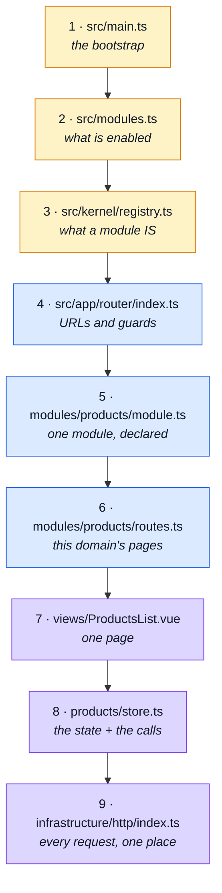

# Reading Path

**The first hour in the codebase.** Every other page here explains a concept; this one names the
files, in order, and says what to skip.

The repository is ~11,500 lines of source across 12 modules. You do not need to read them. Nine
files carry the shape of the whole thing, and every module is a variation on one of them.

::: tip Before the code
If you want the tool inventory first — what Pinia, Vuetify, MSW, Orval, Faro and the rest are doing
here and why each earns its place — read **[Tools Explained](../tools/tools-explained.md)**. It has
the whole stack on one diagram. This page is about the code.
:::

::: warning Run it in mock mode while you read
`VITE_API_MOCK_ENABLED=true` and `npm run dev` gives you the whole storefront with no backend. Every
file below is easier to read with the app open beside it.
:::

---

## The path

---

### 1 · `src/main.ts` — how the app starts

~45 lines. Read `bootstrapApplication` at the bottom: MSW mocks (if enabled) → merge the API's
locale dictionaries → create the app → mount → start observability.

**Take away:** two registry calls happen **before** the app is created —
`registerResponseSchemas(collectModuleResponseSchemas(...))` and
`registerLocaleContributors(collectModuleLocales(...))`. Modules contribute to global systems here,
not by importing into them.

### 2 · `src/modules.ts` — what this build ships

Twelve domains, one array. Identical in spirit to the backend's file of the same name.

**Take away:** deleting a domain is `rm -rf` plus removing one line.

### 3 · `src/kernel/registry.ts` — what a module *is*

The thesis of the repository. A module is a **typed object** declaring: `routes`, `navigation`,
`dependsOn`, `responseSchemas`, `locales`, and (dev only) `mockHandlers` + `mockSeeds`. The
`collect*` functions are how each of those reaches the system that consumes it.

**Take away:** read the `collect*` exports before the validation logic. They are the map of
everything a module can plug into.

### 4 · `src/app/router/index.ts` — URLs and guards

Module routes are children of a `/:locale` parent, which is why every URL carries a language
segment. Then three guards run in order: `localeChoice`, `tryRestoreAuth`, `enforceRouteAccess`.
(A route may add its own, as the `demo` module's Playground does.)

**Take away:** access control is `meta: { access: 'admin' }` on a route, enforced centrally by
`enforceRouteAccess` — never inside a component. See [Sitemap & Access Control](./sitemap.md).

### 5 · `src/modules/products/module.ts` — one module, declared

~30 lines. **`products` is the reference module** — when you add a domain, copy this one.

**Take away:** `mockHandlers` and `mockSeeds` are behind an
`import.meta.env.VITE_API_MOCK_ENABLED === 'true'` check and dynamically imported, so mock code is
absent from a production build.

### 6 · `src/modules/products/routes.ts` — this domain's pages

Four routes, all lazily imported, paths relative to the locale parent.

**Take away:** `meta: { access: 'admin' }` on create/edit is the whole authorization declaration for
those pages.

### 7 · `src/modules/products/views/ProductsList.vue` — one page

The most important single file on this list. Every list view has this shape: pull state and actions
from the store with `storeToRefs`, render, delegate everything else.

**Take away:** views hold **no** API calls and **no** business rules. If you see `axios` or a
generated client function inside a `.vue` file, that is a bug, not a pattern.

### 8 · `src/modules/products/store.ts` — the state and the calls

A Pinia store built on `@guebbit/vue-toolkit`'s `useStructureCrudApi`, calling the **generated**
client functions imported from `@api`.

**Take away:** `@api` and `@types` are generated from `openapi.yaml` by Orval. Never edit them.
Changing an endpoint starts in the contract — see [OpenAPI Workflow](../api/openapi-workflow.md).

### 9 · `src/infrastructure/http/index.ts` — every request, one place

The axios instance and its interceptors: bearer token attachment, cookie forwarding, error
normalisation, and 401 → refresh → replay.

**Take away:** `orvalMutator` at the bottom is what the generated client calls, which is how
generated code inherits all of the above without knowing it exists.

---

## Then: pick your next question

| You want to… | Go to |
| --- | --- |
| Follow a request from click to render | [Request Flow](./request-flow.md) |
| Understand what may import what | [Layers](./layers.md) |
| Add or delete a domain | [Adding & Removing a Module](./module-lifecycle.md) |
| Work without a backend | [Mocking (MSW)](../tools/mocking.md) |
| Change an endpoint's contract | [OpenAPI Workflow](../api/openapi-workflow.md) |
| Know which tool does what, and why it is here | [Tools Explained](../tools/tools-explained.md) |
| Know what is planned but unbuilt | [Roadmap](./roadmap.md) |

---

## What to skip on a first pass

| Skip | Until |
| --- | --- |
| `src/ui/**` (molecules, organisms, vuetify) | You are building a screen. Presentational only, no domain knowledge. |
| `src/infrastructure/i18n/index.ts` | You are adding a language. It is the densest file in the repo and explains nothing about the architecture. |
| `src/infrastructure/stores/observability.ts`, `analytics-events.ts` | You are adding tracking. See [Observability](../tools/observability.md). |
| `src/modules/*/mocks/**` | You are changing mock behaviour. See [Mocking (MSW)](../tools/mocking.md). |
| `src/modules/account/**` | It is the biggest and least typical module (auth, sessions, addresses, password flows). Read `products` first. |
| `src/modules/realtime/**`, `src/modules/admin/**` | They are demonstrations of a capability, not part of the core shape. |
| `src/modules/demo/**` | It demonstrates the framework and nothing else. Delete it when you start a real project. |
| `eslint.config.ts`, `stryker.config.json`, `cypress.config.ts` | You are changing the gate itself. |

---

## The five rules the code assumes you know

1. **A module is a value.** One typed object per domain, listed in `src/modules.ts`.
2. **Four tiers, pointing downward.** `ui` knows nothing; `infrastructure` and `kernel` know no
   domain; `modules/*` know each other only through declared `dependsOn`; `app` assembles.
3. **The contract is an output.** `@api` and `@types` are generated from `openapi.yaml`. Never edit
   generated files, and never hand-write a request type.
4. **Views render, stores call, interceptors cross-cut.** No layer does two of those.
5. **Every URL carries a locale.** Routes live under `/:locale`; link with named routes, never with
   hand-built strings.

---

## The backend is the other half

This repo is paired with
[`boilerplate-node-api-mongodb-mongoose`](https://github.com/Guebbit/boilerplate-node-backend),
which has a **Reading Path page of the same shape**. The two share `openapi.yaml`, the response
envelope, the module-registry idea and the analytics event names — so an hour spent here is most of
an hour saved there.
