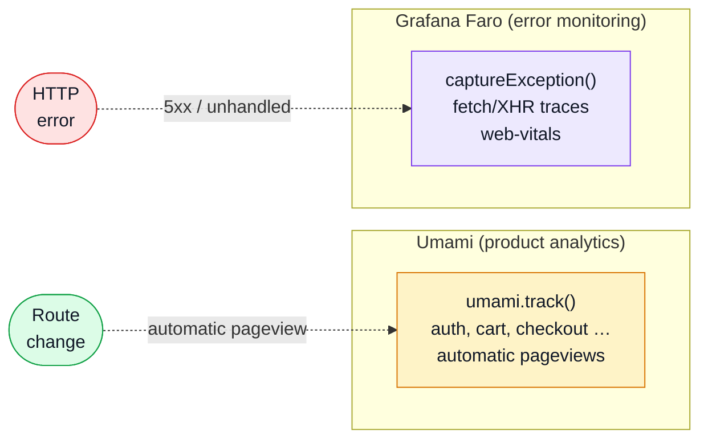

# Request Flow

## End-to-end path

```mermaid
%%{init: {'flowchart': {'nodeSpacing': 60, 'rankSpacing': 90}}}%%
flowchart LR
    User(["User\naction"])

    subgraph View ["View / Component"]
        direction TB
        Template["Template\nevent handler"]
        Comp["Composable\nform / list logic"]
        Template --> Comp
    end

    subgraph State ["Pinia store"]
        direction TB
        Store["Store action\norchestration"]
    end

    subgraph Client ["Generated client"]
        direction TB
        Fn["contracts/rest/index.ts\ntyped axios function"]
        HTTP["utils/http.ts\ninterceptors"]
        Fn --> HTTP
    end

    Backend[("Backend\nor MSW")]
    Resp(["Reactive\nstate update"])

    User --> Template
    Comp --> Store
    Store --> Fn
    HTTP -->|HTTP/JSON| Backend
    Backend --> HTTP

    alt 2xx
        HTTP -->|typed data| Store
        Store --> Resp
    else 401
        HTTP -->|redirect| Login["Login\n?continue=…"]
    else 5xx
        HTTP -->|navigate| Error["/error/500"]
        HTTP -->|captureException| Faro["Grafana Faro"]
    end

    classDef user fill:#f0fdf4,stroke:#16a34a,color:#111827;
    classDef view fill:#dbeafe,stroke:#2563eb,color:#111827;
    classDef store fill:#ddd6fe,stroke:#7c3aed,color:#111827;
    classDef http fill:#fef3c7,stroke:#d97706,color:#111827;
    classDef err fill:#fee2e2,stroke:#dc2626,color:#111827;

    class User,Resp user;
    class Template,Comp view;
    class Store store;
    class Fn,HTTP,Backend http;
    class Login,Error,Faro err;
```

## Observability signals

Every navigation and every HTTP error produces signals in parallel with the flow above.



## What each layer does

| Layer | Responsibility |
| ----- | -------------- |
| View / template | Renders data, captures user events, delegates to composables |
| Composable | Encapsulates form state, validation, and list logic for a specific feature |
| Pinia store | Orchestrates API calls, holds reactive data, exposes actions |
| Generated client (`contracts/rest/index.ts`) | Typed axios function per operation — regenerated from `openapi.yaml` |
| `utils/http.ts` | Single axios instance; request/response interceptors; shapes errors into `IResponseReject` |
| MSW (dev/test) | Intercepts HTTP before it leaves the browser; returns deterministic in-memory responses |
| Router guards | `isAuth`, `isAdmin`, `isGuest` — run before the view is entered; redirect on failure |

## Cross-cutting strategies

### Auth-first routing

Route guards run on every navigation. A `401` during a guarded navigation redirects to Login with `?continue=` preserved so the user lands back after login.

### Interceptors own error shape

All HTTP errors flow through `utils/http.ts` interceptors. Every failed request produces an `IResponseReject` envelope. Views and stores never parse raw axios errors.

### Opt-in mocking

When `VITE_API_MOCK_ENABLED=true`, MSW intercepts all HTTP before it reaches the network. The same store and view code runs unchanged — only the transport differs.

### Analytics always async

`track()` calls are fire-and-forget. Never `await` them. They are no-ops if Umami is not configured.

## Why the flow matters

When you change behavior, ask:

- Is this an **API contract** change? Go to [API](../api/).
- Is this a **dependency or build** concern? Go to [Tools](../tools/).
- Is this a **layer ownership** issue? Go back to [Layers](./layers.md).
- Is this about **routing or access control**? Go to [Sitemap & Access Control](./sitemap.md).
