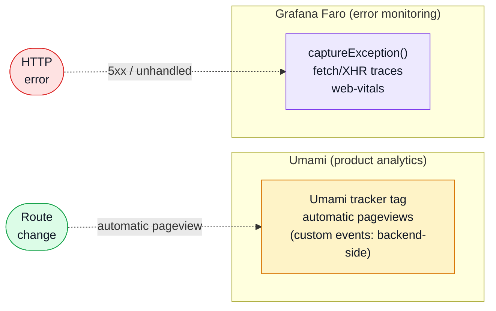

# Request Flow

## End-to-end path

```mermaid
%%{init: {'flowchart': {'nodeSpacing': 60, 'rankSpacing': 90}}}%%
flowchart LR
    User(["User\naction"])

    subgraph View ["View / Component"]
        direction TB
        Template["Template\nevent handler"]
        Comp["Composable\nform / list logic"]
        Template --> Comp
    end

    subgraph State ["Pinia store"]
        direction TB
        Store["Store action\norchestration"]
    end

    subgraph Client ["Generated client"]
        direction TB
        Fn["contracts/rest/index.ts\ntyped axios function"]
        HTTP["src/infrastructure/http/index.ts\ninterceptors"]
        Fn --> HTTP
    end

    Backend[("Backend\n(demo or full stack)")]
    Resp(["Reactive\nstate update"])

    User --> Template
    Comp --> Store
    Store --> Fn
    HTTP -->|HTTP/JSON| Backend
    Backend --> HTTP

    alt 2xx
        HTTP -->|typed data| Store
        Store --> Resp
    else 401
        HTTP -->|redirect| Login["Login\n?continue=…"]
    else 5xx
        HTTP -->|navigate| Error["/error/500"]
        HTTP -->|captureException| Faro["Grafana Faro"]
    end

    classDef user fill:#f0fdf4,stroke:#16a34a,color:#111827;
    classDef view fill:#dbeafe,stroke:#2563eb,color:#111827;
    classDef store fill:#ddd6fe,stroke:#7c3aed,color:#111827;
    classDef http fill:#fef3c7,stroke:#d97706,color:#111827;
    classDef err fill:#fee2e2,stroke:#dc2626,color:#111827;

    class User,Resp user;
    class Template,Comp view;
    class Store store;
    class Fn,HTTP,Backend http;
    class Login,Error,Faro err;
```

## Observability signals

Every navigation and every HTTP error produces signals in parallel with the flow above.

```mermaid
%%{init: {'flowchart': {'nodeSpacing': 55, 'rankSpacing': 80}}}%%
flowchart LR
    Nav(["Route\nchange"])
    Err(["HTTP\nerror"])

    subgraph Analytics["Umami (product analytics)"]
        PH["Umami tracker tag\nautomatic pageviews\n(custom events: backend-side)"]
    end

    subgraph ErrorMon["Grafana Faro (error monitoring)"]
        SE["captureException()\nfetch/XHR traces\nweb-vitals"]
    end

    Nav -.->|"automatic pageview"| PH
    Err -.->|"5xx / unhandled"| SE

    classDef nav fill:#dcfce7,stroke:#16a34a,color:#111827;
    classDef err fill:#fee2e2,stroke:#dc2626,color:#111827;
    classDef ph fill:#fef3c7,stroke:#d97706,color:#111827;
    classDef se fill:#ede9fe,stroke:#7c3aed,color:#111827;

    class Nav nav;
    class Err err;
    class PH ph;
    class SE se;
```

## What each layer does

| Layer                                        | Responsibility                                                                                                                                    |
| -------------------------------------------- | ------------------------------------------------------------------------------------------------------------------------------------------------- |
| View / template                              | Renders data, captures user events, delegates to composables                                                                                      |
| Composable                                   | Encapsulates form state, validation, and list logic for one domain                                                                                |
| Pinia store                                  | Orchestrates API calls, holds reactive data, exposes actions                                                                                      |
| Generated client (`contracts/rest/index.ts`) | Typed axios function per operation — regenerated from `openapi.yaml`                                                                              |
| `src/infrastructure/http/index.ts`           | Single axios instance; request/response interceptors; shapes errors into `IResponseReject`                                                        |
| Router guards                                | `tryRestoreAuth` then `enforceRouteAccess` (`beforeEach`), `localeChoice` (`beforeResolve`) — run before the view is entered; redirect on failure |

## Cross-cutting strategies

### Auth-first routing

Route guards run on every navigation. A `401` during a guarded navigation redirects to Login with `?continue=` preserved so the user lands back after login.

### Interceptors own error shape

All HTTP errors flow through `src/infrastructure/http/index.ts` interceptors. Every failed request produces an `IResponseReject` envelope. Views and stores never parse raw axios errors.

### Analytics always async

`track()` calls are fire-and-forget. Never `await` them. They are no-ops if Umami is not configured.

### Blocked vs ambient failures

A caught error reaches the visitor one of two ways, chosen by what failed, not by the status code:

```mermaid
%%{init: {'flowchart': {'nodeSpacing': 50, 'rankSpacing': 70}}}%%
flowchart TB
    Catch(["error caught\nin a .catch()"])
    Q{"Did this stop a workflow\nthe visitor is doing\nright now? (save, delete,\nrefund, lookup)"}
    Blocking["useBlockingError()\n-> InlineErrorAlert,\nnext to what it blocked"]
    Ambient["notifyErrorMessages()\n-> toast"]
    Faro[("Grafana Faro\ncaptureException")]

    Catch --> Q
    Q -->|yes| Blocking
    Q -->|no — a list's own\nsearch/refresh, a\nbackground poll,\na badge or count fetch| Ambient
    Blocking -->|report\(\), a real failure| Faro
    Ambient --> Faro

    classDef q fill:#fef3c7,stroke:#d97706,color:#111827;
    classDef out fill:#fee2e2,stroke:#dc2626,color:#111827;
    classDef faro fill:#ede9fe,stroke:#7c3aed,color:#111827;
    class Q q;
    class Blocking,Ambient out;
    class Faro faro;
```

Both pairings report a real failure to Faro alike — `useBlockingError().report()`
(`src/infrastructure/utils/use-blocking-error.ts`) mirrors `notifyErrorMessages`'s observability
half exactly. The question is never "is this worth reporting", it is "where does the visitor need
to see it":

- **Blocking, one control** — a form submit, a save, a payment, a refund, or a lookup with one
  dedicated button/field (`payments`' `OrderReferenceSearch.vue` is the worked example). The error
  renders through `InlineErrorAlert` (`src/ui/molecules/InlineErrorAlert.vue`) right next to that
  control, because a toast can fade before the visitor looks back at what they were doing.
  `useBlockingError` holds the message; call `report(error)` for a real failure (reaches Faro) or
  `warn(text)` for an expected absence like a lookup that matched nothing (does not — there is
  nothing there for an error monitor to see).
- **Blocking, one shared control** — a list's row actions (delete, hard-delete, resend) behind a
  confirm dialog (`products`' `ProductsList.vue` is the worked example). Each row's own button has
  nowhere to host an alert, and the dialog that confirmed the action has already closed by the
  time the request answers, so every write action on that page shares ONE `useBlockingError()`,
  rendered as one `InlineErrorAlert` above the table — the same slot `AdminAuditTab.vue` already
  used for its own load error, repurposed here for a write.
- **Blocking, hosted in a child** — the failure and the `useBlockingError()` instance still belong
  to the parent (it owns the store call), but the control the visitor is looking at is a dialog
  component the parent doesn't render the markup of. `locales`' three form dialogs
  (`EntryFormDialog.vue`, `EntriesImportDialog.vue`, `LanguageFormDialog.vue`) are the worked
  example: each exposes a named `error` slot right above its own button row, and the parent fills
  it with its own `InlineErrorAlert` — the same instantiation any other shape uses, just placed
  inside a `<template #error>` rather than directly in the parent's template. The dialog never
  imports `InlineErrorAlert` or learns that an error exists; it only leaves the slot, the same way
  `FormCard.vue` leaves its default slot for whatever the parent's fields are. This is what a
  dialog reused by more than one parent (`LanguageFormDialog.vue`, shared by `LocalesList.vue` and
  `LocalesDictionary.vue`) needs — each caller fills the slot with its own state, and the dialog
  stays ignorant of both.
- **Ambient** — a list's own search/refresh, a background poll, and a badge or count fetch. None
  of these stopped something the visitor just asked for in this view; the view keeps working
  either way, so `notifyErrorMessages`'s toast is where the failure belongs.

The status code decides nothing here: a 404 lookup miss and a 500 on the same save both block the
same workflow, so both are inline (just `warn` vs `report`); a 500 on a background poll still only
toasts.

## Why the flow matters

When you change behavior, ask:

- Is this an **API contract** change? Go to [API](../api/).
- Is this a **dependency or build** concern? Go to [Tools](../tools/).
- Is this a **layer ownership** issue? Go back to [Layers](./layers.md).
- Is this about **routing or access control**? Go to [Sitemap & Access Control](./sitemap.md).
